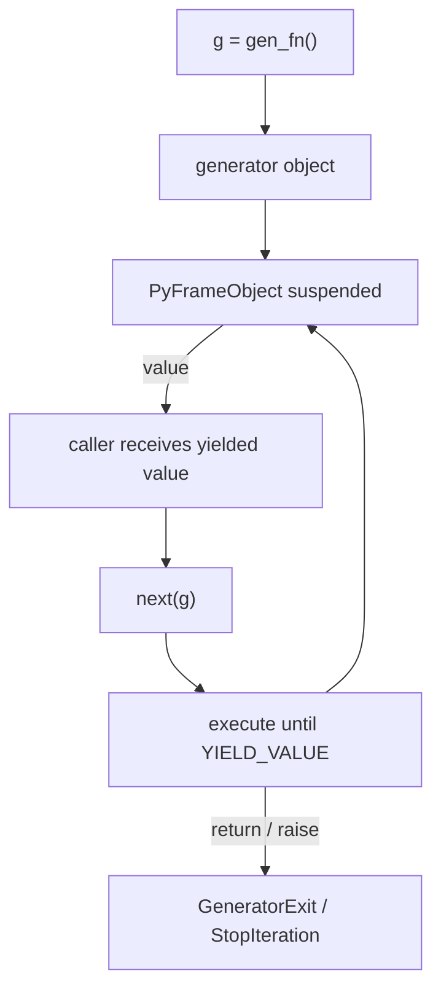
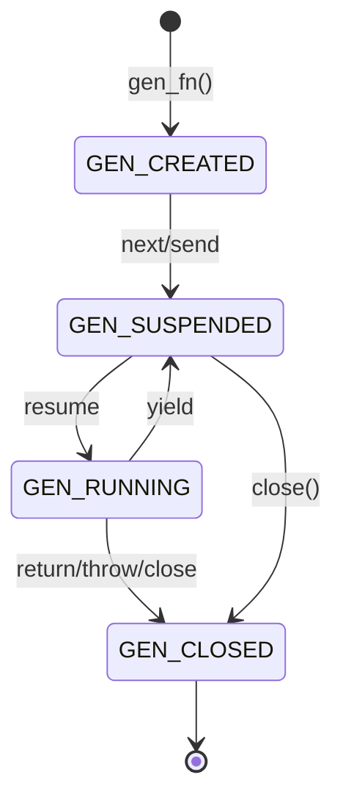
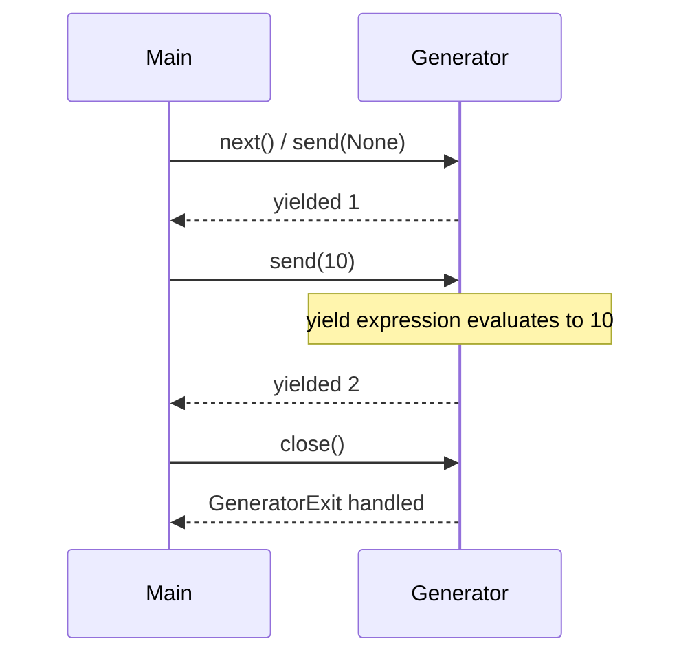

# Generators and Generator Internals

## Overview

A **generator function** contains `yield` (or `yield from`) and returns a **generator object**—an iterator that suspends and resumes execution, preserving local variables and instruction pointer between `next()`, `send()`, `throw()`, and `close()` calls. Generators are CPython's primary user-facing **coroutine-like** construct before `async def`; they compile to specialized frame objects with `YIELD_VALUE` bytecode rather than a separate iterator class.

This note explains generator semantics, the CPython `gen` object layout at a conceptual level, and production patterns for lazy I/O, pipelines, and backpressure-friendly streaming.

## Learning Objectives

- Explain how a generator call creates a suspended frame without running the body
- Use `send`, `throw`, and `close` correctly and predict cleanup order
- Read generator-related bytecode (`YIELD_VALUE`, `GEN_START`)
- Compare generators to class-based iterators and async generators
- Diagnose leaks from abandoned generators holding references to large objects

## Prerequisites

- [[03-Python/04-Iteration-Exceptions-and-Context/Iterator Protocol|Iterator Protocol]]
- [[03-Python/02-Execution-Namespaces-and-Functions/Functions as Objects|Functions as Objects]]
- [[01-Computer-Science/03-Memory-and-Addressing/Stack and Heap|Stack and Heap]]

## Difficulty

`advanced`

## Estimated Time

- Reading: 2 hours
- Exercises: 3 hours
- Mini project: 4–5 hours

## History

PEP 255 (2001) introduced generators. PEP 342 added `send` and `throw`. PEP 380 introduced `yield from`. PEP 525 added **async generators** (`async def` + `yield`). PEP 479 (Python 3.5+) forbids raising bare `StopIteration` inside generators to prevent silent bugs.

## Problem It Solves

Hand-written iterator classes require explicit state variables and `StopIteration` bookkeeping. Generators encode **control flow as code**—loops and conditionals map directly to suspension points. That reduces bugs in state machines for parsers, protocol decoders, and incremental aggregators.

## Internal Implementation

### Call vs execution

Calling `g = gen_fn()` **does not** execute the body. CPython allocates a generator object referencing the function's code object and an empty/suspended frame. The first `next(g)` runs until the first `yield` or `return`.

```python
import dis

def demo(n: int):
    print("start", n)
    yield n
    print("after yield")

co = demo.__code__
print(co.co_flags & 0x0020)  # CO_GENERATOR flag set
dis.dis(demo)
```

### Frame and stack linkage

Generator frames live on the heap, not the C stack, after suspension—similar in spirit to [[01-Computer-Science/03-Memory-and-Addressing/Stack and Heap|Stack and Heap]] activation records promoted for continuations. See [[03-Python/05-CPython-Runtime-and-Memory/Code Objects Frame Objects and Call Stack|Code Objects Frame Objects and Call Stack]] for frame fields (`f_locals`, `f_lasti`, `f_back`).



### `send`, `throw`, `close`

| Method | Effect |
| --- | --- |
| `next(g)` | `g.send(None)` |
| `g.send(x)` | Resumes; `x` becomes value of `yield` expression |
| `g.throw(exc)` | Injects exception at suspended `yield` |
| `g.close()` | Raises `GeneratorExit` at yield; runs `finally` |

**Re-entrancy**: calling `next` while the generator is executing raises `ValueError: generator already executing`.

### Memory and GC

A suspended generator keeps its frame alive → locals and closure cells stay referenced. Abandoning mid-stream without `close()` can retain large buffers (classic leak in partial consumption).

## Mermaid Diagrams

### Structure: generator lifecycle states



### Sequence: send into coroutine-style generator



## Examples

### Minimal Example

```python
def running_total():
    total = 0
    while True:
        value = yield total
        if value is None:
            break
        total += value


rt = running_total()
next(rt)          # prime: advance to first yield
rt.send(10)       # total = 10
rt.send(5)        # total = 15
rt.close()
```

### Production-Shaped Example

Bounded-memory log line processor with error isolation:

```python
from __future__ import annotations

import json
import logging
from pathlib import Path
from typing import Iterator

log = logging.getLogger(__name__)


def parse_json_lines(path: Path) -> Iterator[dict]:
    """Yield parsed objects; skip malformed lines with metrics."""
    bad = 0
    try:
        with path.open("r", encoding="utf-8") as fh:
            for lineno, line in enumerate(fh, 1):
                line = line.strip()
                if not line:
                    continue
                try:
                    yield json.loads(line)
                except json.JSONDecodeError:
                    bad += 1
                    log.warning("skip bad json", extra={"lineno": lineno, "path": str(path)})
    finally:
        log.info("parse complete", extra={"path": str(path), "bad_lines": bad})


def aggregate_events(paths: list[Path]) -> Iterator[dict]:
    for path in paths:
        yield from parse_json_lines(path)


# Consumer controls memory: process one event at a time
for event in aggregate_events([Path("a.ndjson"), Path("b.ndjson")]):
    handle(event)
```

Implement the educational state machine in [[03-Python/code/README|Python code labs]] (`iterators`).

## Trade-offs

| Dimension | Upside | Downside | When it matters |
| --- | --- | --- | --- |
| Expressiveness | Linear code for state machines | Harder to introspect than classes | Parsers, pipelines |
| Memory | O(1) extra for lazy streams | Holds frame + locals until done | Long-lived partial reads |
| Composability | `yield from` delegation | Single-pass | Nested protocols |
| Debugging | Stack traces point to source | Suspension confuses beginners | Incident triage |

### When to Use

- Lazy transformation pipelines over large or unbounded inputs
- Incremental parsers where state is naturally local variables
- `send`-based coroutines in legacy code predating `async def`

### When Not to Use

- When you need random access or repeated full passes without re-invoking
- CPU-bound parallel work (use processes; generators don't parallelize)
- Replace `async def` for I/O concurrency in modern codebases

## Exercises

1. Write a generator `windowed(seq, n)` yielding overlapping tuples; verify with `itertools` equivalence where applicable.
2. Demonstrate `throw` entering a `try/finally` inside a generator and log cleanup order.
3. Use `dis.dis` on a generator function and identify `YIELD_VALUE` and exception table entries.
4. Build a generator that leaks memory when half-consumed; fix with explicit `close()` in consumer.
5. Port the `iterators` lab generator FSM to support `send`.

## Mini Project

**Incremental JSON tokenizer.** A generator that reads a file byte-by-byte and yields complete JSON values from a concatenated stream (NDJSON or JSON array slice). Handle split UTF-8 sequences and malformed tail without loading the whole file.

## Portfolio Project

Add a **generator frame inspector** to [[03-Python/projects/Python Runtime Toolkit/README|Python Runtime Toolkit]] listing suspended locals and last yield line per live generator.

## Interview Questions

1. What is the difference between `return` and `yield` in a generator function?
2. Why must you call `next()` once before `send(non-None)` on a fresh generator?
3. What does `generator.close()` do at the bytecode level?
4. Can a generator be pickled? Under what conditions (3.14+)?
5. How does PEP 479 change error handling inside generators?

### Stretch / Staff-Level

1. Compare CPython generator frames to `async def` coroutine frames in 3.14.
2. Explain why `yield from` is preferred over manual `for` loops when delegating (PEP 380 benefits).

## Common Mistakes

- Forgetting to prime coroutine-style generators before `send`
- Raising `StopIteration` with a value manually in Python 3 generator internals
- Assuming `finally` always runs if the generator is garbage-collected without `close`
- Using generators for concurrent network I/O instead of asyncio

## Best Practices

- Document single-pass semantics; provide `to_list()` only when bounded
- Use `contextlib.closing` or explicit `try/finally` with `gen.close()` for resource-holding generators
- Prefer `yield from` for sub-generator delegation ([[03-Python/04-Iteration-Exceptions-and-Context/yield from and Generator Delegation|yield from and Generator Delegation]])
- Profile retention: abandoned generators are a common subtle leak

## Summary

Generators compile functions into heap-persisted frames that suspend at `yield`. They implement the iterator protocol with less boilerplate and encode state machines as readable control flow. Production risk concentrates in partial consumption, cleanup, and retained references—always consider who calls `close()` and whether consumers understand single-pass semantics.

## Further Reading

- [[00-References/Python/README|Python References]] — Generator types
- PEP 255, 342, 380, 479, 525
- [[03-Python/05-CPython-Runtime-and-Memory/Code Objects Frame Objects and Call Stack|Code Objects Frame Objects and Call Stack]]

## Related Notes

- [[03-Python/04-Iteration-Exceptions-and-Context/Iterator Protocol|Iterator Protocol]]
- [[03-Python/04-Iteration-Exceptions-and-Context/yield from and Generator Delegation|yield from and Generator Delegation]]
- [[03-Python/04-Iteration-Exceptions-and-Context/Resource Cleanup and Cancellation Semantics|Resource Cleanup and Cancellation Semantics]]
- [[01-Computer-Science/03-Memory-and-Addressing/Garbage Collection Models|Garbage Collection Models]]
- [[03-Python/code/README|Python code labs]]

## Progress Checklist

- [ ] Explained from first principles
- [ ] Drew at least one Mermaid diagram
- [ ] Implemented a minimal version
- [ ] Documented trade-offs and non-goals
- [ ] Completed exercises
- [ ] Practiced interview questions aloud
- [ ] Linked prerequisites and dependents
