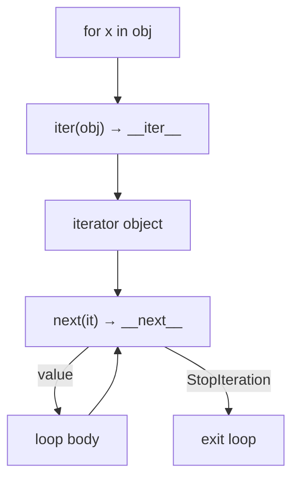
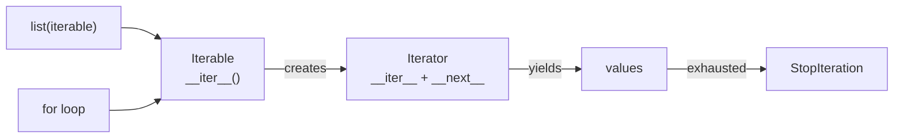
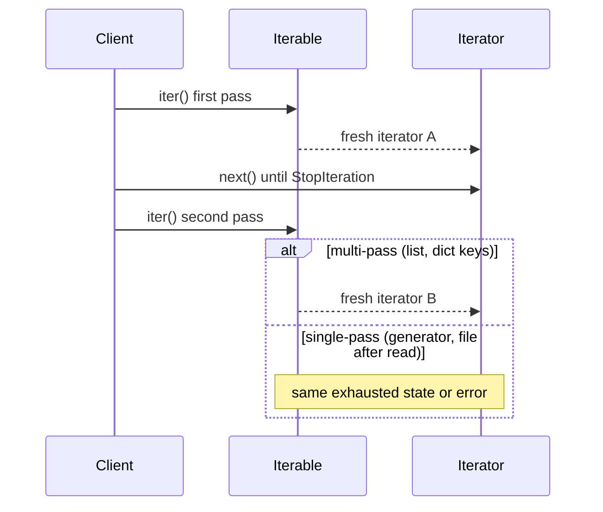

# Iterator Protocol

## Overview

Python iteration is **protocol-based**, not class-hierarchy-based. An **iterable** implements `__iter__()` returning an **iterator**; an iterator implements `__iter__()` (returning `self`) and `__next__()` returning the next value or raising `StopIteration`. Built-ins like `for`, `list()`, unpacking, and comprehensions all lower to these two methods plus iterator cleanup via `close()` on generators and context-managed iteration.

Understanding the protocol lets you predict lazy vs eager behavior, resource lifetimes, and why some objects are single-pass while others create fresh iterators. This note connects the language data model to CPython's `PyIter_Next` C-API path and the educational model in [[03-Python/code/README|Python code labs]] (`iterators` module).

## Learning Objectives

- Distinguish iterable from iterator and explain single-use vs multi-use iteration
- Trace how `for`, `iter()`, `next()`, and unpacking invoke the protocol
- Implement compliant custom iterators with correct `StopIteration` semantics
- Predict interaction with generators, file objects, and `collections.abc`
- Diagnose production bugs from exhausted iterators, infinite iterables, and side effects in `__iter__`

## Prerequisites

- [[03-Python/01-Values-Types-and-Data-Model/Sequences Mappings and Sets as Protocols|Sequences Mappings and Sets as Protocols]]
- [[03-Python/01-Values-Types-and-Data-Model/Special Methods and Data Model Hooks|Special Methods and Data Model Hooks]]
- [[04-Data-Structures/00-Orientation-and-Contracts/Abstract Data Types vs Concrete Structures|Abstract Data Types vs Concrete Structures]]

## Difficulty

`intermediate`

## Estimated Time

- Reading: 90 minutes
- Exercises: 2–3 hours
- Mini project: 3–4 hours

## History

Iteration existed informally before Python 2.2's unified type/class model. PEP 234 (2001) formalized iterators; PEP 255 added generators as syntactic sugar for iterator state machines. Python 3 removed `__getitem__`-based iteration fallback, making the protocol explicit. `collections.abc.Iterator` and `typing.Iterator` now document the contract for static checkers.

## Problem It Solves

Without a uniform iteration protocol:

- Every collection type would need bespoke indexing APIs
- Lazy pipelines (log tailers, DB cursors, network streams) could not compose with `for` and comprehensions
- Resource cleanup during early loop exit would be ad hoc

The protocol decouples **traversal algorithm** from **storage representation**—the same idea as [[04-Data-Structures/00-Orientation-and-Contracts/Abstract Data Types vs Concrete Structures|Abstract Data Types vs Concrete Structures]] separating interface from implementation.

## Internal Implementation

### Protocol contract

| Role | Required methods | Notes |
| --- | --- | --- |
| Iterable | `__iter__()` | Must return a fresh iterator (or `self` if iterator is single-use) |
| Iterator | `__iter__()`, `__next__()` | `__iter__` returns `self`; `__next__` raises `StopIteration` at end |

CPython's `FOR_ITER` bytecode (see [[03-Python/05-CPython-Runtime-and-Memory/Bytecode and dis|Bytecode and dis]]) calls `PyIter_Next` in a loop until `StopIteration` is raised and suppressed.

### `for` loop desugaring

```python
# for item in iterable: body
# ≈
_it = iter(iterable)
while True:
    try:
        item = next(_it)
    except StopIteration:
        break
    body
```

Python 3.7+ generators and some iterators support `close()` on abrupt exit when the loop uses `break` inside a `try/finally` wrapper (generators get PEP 380 cleanup via `GEN_CLOSE`).

### `iter(callable, sentinel)`

Two-argument `iter()` builds a **callable iterator**—useful for reading fixed-size chunks until EOF:

```python
with open("data.bin", "rb") as f:
    for chunk in iter(lambda: f.read(65536), b""):
        process(chunk)
```



## Mermaid Diagrams

### Structure: iterable vs iterator



### Sequence: multi-pass vs single-pass



## Examples

### Minimal Example

```python
class Countdown:
    def __init__(self, start: int) -> None:
        self._start = start

    def __iter__(self):
        return _CountdownIter(self._start)


class _CountdownIter:
    def __init__(self, n: int) -> None:
        self._n = n

    def __iter__(self):
        return self

    def __next__(self) -> int:
        if self._n <= 0:
            raise StopIteration
        self._n -= 1
        return self._n + 1


assert list(Countdown(3)) == [3, 2, 1]
```

### Production-Shaped Example

Paginated API client that is **lazy** and **re-iterable** (each `for` pass starts a new HTTP sequence):

```python
from __future__ import annotations

from dataclasses import dataclass
from typing import Iterator, Any
import httpx


@dataclass(frozen=True)
class Page:
    items: list[dict[str, Any]]
    next_cursor: str | None


class PaginatedUsers:
    """Iterable over all users; each full iteration refetches from page 1."""

    def __init__(self, client: httpx.Client, base_url: str) -> None:
        self._client = client
        self._base_url = base_url.rstrip("/")

    def __iter__(self) -> Iterator[dict[str, Any]]:
        cursor: str | None = None
        while True:
            params = {"cursor": cursor} if cursor else {}
            resp = self._client.get(f"{self._base_url}/users", params=params, timeout=30.0)
            resp.raise_for_status()
            page = Page(**resp.json())
            yield from page.items
            if page.next_cursor is None:
                return
            cursor = page.next_cursor


# Usage: memory bounded; do not list() unless you intend to materialize
with httpx.Client() as client:
    for user in PaginatedUsers(client, "https://api.example.com"):
        if user.get("disabled"):
            continue
        index_user(user)
```

See [[03-Python/code/README|Python code labs]] — `iterators` module for a from-scratch iterator state machine.

## Trade-offs

| Dimension | Upside | Downside | When it matters |
| --- | --- | --- | --- |
| Lazy iteration | Bounded memory, pipeline composition | Harder to len(), slice, or random-access | Log/stream processing |
| Eager materialization (`list()`) | Repeatable, indexable | Memory spike, stalls on infinite sources | Small in-memory transforms |
| Custom iterator class | Explicit state, testable | Boilerplate vs generator | Stateful parsers |
| Generator (see next note) | Concise, fast to write | Single-pass, harder to pickle | Most lazy pipelines |

### When to Use

- **Lazy pipelines** over files, sockets, ORM cursors, Kafka consumers
- **Protocol compliance** for library types consumed by `itertools`, `async for` adapters
- **`collections.abc.Iterable`** registration for `isinstance` checks in APIs

### When Not to Use

- Do not implement `__getitem__` iteration (removed in Python 3)
- Do not raise bare `StopIteration` from generator `__next__` callers outside protocol (3.7+ converts in generators)
- Do not iterate a **shared iterator** across concurrent tasks without locking

## Exercises

1. Implement `RingBuffer` as an iterable that yields the last N inserted items on each full iteration.
2. Write a failing test that proves `list(gen); list(gen)` differs from `list([1,2]); list([1,2])`.
3. Implement `iter_exhausted(it)` returning whether an iterator has no remaining items without consuming the final value incorrectly.
4. Trace bytecode with `dis.dis` for a `for` loop over a list vs a generator (link to [[03-Python/05-CPython-Runtime-and-Memory/Bytecode and dis|Bytecode and dis]]).
5. Extend [[03-Python/code/README|code labs]] `iterators` with a `BatchIterator` that groups N items.

## Mini Project

**CSV row iterator with schema validation.** Build an iterable over a large CSV that yields `dict` rows, validates types per column spec, skips bad rows to a dead-letter counter, and supports re-iteration by reopening the file. Include property tests for idempotent schema errors.

## Portfolio Project

Integrate a **lazy record stream** into [[03-Python/projects/Python Runtime Toolkit/README|Python Runtime Toolkit]] that traces iterator creation/exhaustion events for debugging retention leaks.

## Interview Questions

1. What is the difference between an iterable and an iterator in Python?
2. Why does `StopIteration` exist instead of returning a sentinel like `None`?
3. What happens if you call `next()` on an exhausted iterator?
4. How does `iter(callable, sentinel)` differ from one-argument `iter()`?
5. Can you iterate a dict? What does each iteration yield in Python 3?

### Stretch / Staff-Level

1. Explain how CPython suppresses `StopIteration` inside generators (PEP 479) and why.
2. Design an iterable API for a connection pool cursor that remains safe under concurrent consumers.

## Common Mistakes

- Storing and reusing a **single iterator instance** when callers expect multi-pass behavior
- Calling `list()` on infinite iterables (hangs or OOM)
- Side effects in `__iter__` that mutate global state unexpectedly
- Assuming `len()` works on arbitrary iterables

## Best Practices

- Document whether your type is **single-pass** or **multi-pass**
- Prefer generators for simple lazy sequences; use classes when you need `send()`/`throw()`
- Use `collections.abc.Iterator` for isinstance guards in public APIs
- Close resources in `try/finally` or context managers when breaking out of loops early
- Cross-link iteration with [[03-Python/04-Iteration-Exceptions-and-Context/Generators and Generator Internals|Generators and Generator Internals]]

## Summary

Python iteration is a two-method protocol: iterables produce iterators; iterators produce values until `StopIteration`. Every high-level looping construct desugars to this model. Production correctness depends on knowing pass semantics, laziness, and cleanup—especially when iterators wrap I/O, pagination, or shared mutable state. Master the protocol before generators, `yield from`, and async iteration.

## Further Reading

- [[00-References/Python/README|Python References]] — Language Reference: Iterator Types
- PEP 234 — Iterators
- [[03-Python/_exercises/README|Python Exercises]]

## Related Notes

- [[03-Python/04-Iteration-Exceptions-and-Context/Generators and Generator Internals|Generators and Generator Internals]]
- [[03-Python/01-Values-Types-and-Data-Model/Sequences Mappings and Sets as Protocols|Sequences Mappings and Sets as Protocols]]
- [[03-Python/05-CPython-Runtime-and-Memory/Bytecode and dis|Bytecode and dis]]
- [[04-Data-Structures/00-Orientation-and-Contracts/Abstract Data Types vs Concrete Structures|Abstract Data Types vs Concrete Structures]]
- [[03-Python/code/README|Python code labs]]
- [[03-Python/README|Python Track]]

## Progress Checklist

- [ ] Explained from first principles
- [ ] Drew at least one Mermaid diagram
- [ ] Implemented a minimal version
- [ ] Documented trade-offs and non-goals
- [ ] Completed exercises
- [ ] Practiced interview questions aloud
- [ ] Linked prerequisites and dependents
