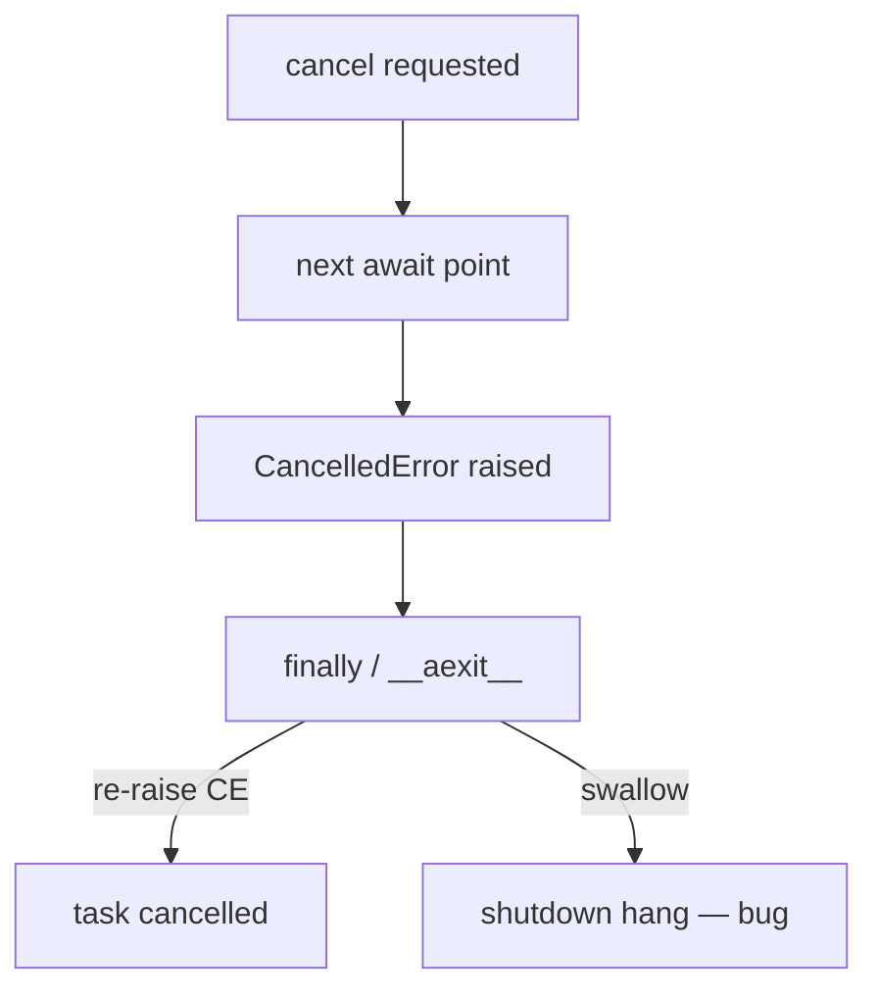
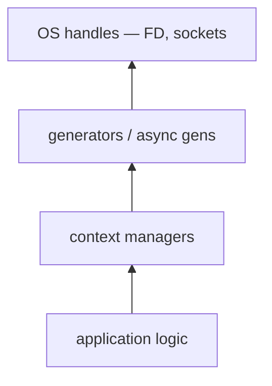
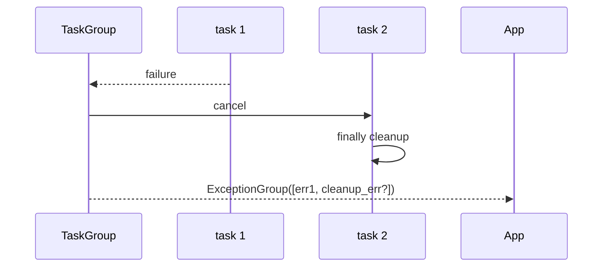

# Resource Cleanup and Cancellation Semantics

## Overview

**Resource cleanup** in Python is deterministic when tied to **`with` blocks**, generator `finally`, and explicit `close()`—not when relying on `__del__` or the cycle collector. **Cancellation** (asyncio task cancel, timeout scopes, keyboard interrupt) injects exceptions (`CancelledError`, `GeneratorExit`, `TimeoutError`) that must run teardown without losing the original failure or leaking handles.

This note unifies sync generator close semantics, context manager `__exit__`, asyncio cancellation (3.11+ `TaskGroup`), and structured failure via [[03-Python/04-Iteration-Exceptions-and-Context/Exception Hierarchy ExceptionGroup and except star|ExceptionGroup]]—the production surface for "stop work safely."

## Learning Objectives

- Rank reliability of cleanup mechanisms: `with`, `try/finally`, `weakref.finalize`, `__del__`
- Implement generator and async generator cleanup on abrupt exit
- Handle asyncio cancellation without swallowing `CancelledError`
- Design APIs that aggregate partial cleanup failures
- Reason about cancellation vs timeout vs keyboard interrupt in 3.14+

## Prerequisites

- [[03-Python/04-Iteration-Exceptions-and-Context/Context Managers and contextlib|Context Managers and contextlib]]
- [[03-Python/04-Iteration-Exceptions-and-Context/Generators and Generator Internals|Generators and Generator Internals]]
- [[03-Python/04-Iteration-Exceptions-and-Context/Exception Hierarchy ExceptionGroup and except star|Exception Hierarchy ExceptionGroup and except star]]

## Difficulty

`advanced`

## Estimated Time

- Reading: 2 hours
- Exercises: 3–4 hours
- Mini project: 5 hours

## History

Generator `close()` and `GeneratorExit` (PEP 342) predated asyncio. asyncio grew cancellation semantics across 3.7–3.11; `CancelledError` became a `BaseException` subclass in 3.8. TaskGroup (3.11) standardized structured teardown. Timeouts (`asyncio.timeout`, 3.11) integrate with cancellation scopes.

## Problem It Solves

Production incidents from:

- Partially consumed generators holding file descriptors
- `except Exception` catching `CancelledError` and hanging shutdown
- Cleanup exceptions masking root cause without `raise ... from`
- Parallel close of N resources losing secondary errors

Connect to [[01-Computer-Science/05-Concurrency-Fundamentals/Failure Modes in Concurrent Systems|Failure Modes in Concurrent Systems]] and [[01-Computer-Science/03-Memory-and-Addressing/Garbage Collection Models|Garbage Collection Models]]—GC is not a cleanup strategy for sockets and locks.

## Internal Implementation

### Cleanup reliability spectrum

| Mechanism | Deterministic? | Notes |
| --- | --- | --- |
| `with` / `try/finally` | Yes | Preferred |
| `generator.close()` | Yes if called | Often forgotten |
| `contextlib.closing` | Yes | Iterator wrapper |
| `weakref.finalize` | Mostly | Runs at GC for object; ordering not guaranteed with cycles |
| `__del__` | No | May never run; resurrect risk |

### GeneratorExit path

Breaking out of `for x in gen()` triggers `gen.close()` which raises `GeneratorExit` at the suspended `yield`. The generator should re-raise after cleanup unless consuming PEP 342 semantics.

### asyncio cancellation flow

1. `task.cancel()` sets cancel flag
2. At next `await`, raise `CancelledError` into coroutine
3. `finally` blocks run; re-raise unless explicitly suppressed (anti-pattern in most app code)

Python 3.11+ `except*` helps when closing multiple tasks yields multiple errors.



## Mermaid Diagrams

### Structure: layered teardown



### Sequence: TaskGroup cancel all



## Examples

### Minimal Example

```python
def read_lines(path):
    f = open(path, encoding="utf-8")
    try:
        for line in f:
            yield line
    finally:
        f.close()


gen = read_lines("big.log")
try:
    for line in gen:
        if bad(line):
            break  # triggers generator close via FOR_ITER cleanup in for-loop
finally:
    gen.close()
```

Better: use `@contextmanager` or `with open` inside consumer.

### Production-Shaped Example

Async worker with timeout, cancellation-safe cleanup, and grouped errors:

```python
from __future__ import annotations

import asyncio
from contextlib import asynccontextmanager


class ServiceError(Exception):
    pass


@asynccontextmanager
async def leased_connection(pool):
    conn = await pool.acquire()
    try:
        yield conn
    finally:
        await pool.release(conn)


async def worker(pool, item: str) -> None:
    async with leased_connection(pool) as conn:
        async with asyncio.timeout(5):
            await conn.execute(item)


async def run_batch(pool, items: list[str]) -> None:
    errors: list[Exception] = []
    async with asyncio.TaskGroup() as tg:
        for item in items:
            tg.create_task(_guard(worker(pool, item), errors))
    if errors:
        raise ExceptionGroup("batch failed", errors)


async def _guard(coro, errors: list[Exception]) -> None:
    try:
        await coro
    except* ServiceError as eg:
        errors.extend(eg.exceptions)
    except asyncio.CancelledError:
        raise  # never swallow cancellation
    except Exception as exc:
        errors.append(exc)
```

## Trade-offs

| Dimension | Upside | Downside | When it matters |
| --- | --- | --- | --- |
| Explicit close | Predictable FD release | Caller burden | Library design |
| with/async with | Hard to forget | Nested depth | Transactions |
| CancelledError as BaseException | Distinguishes cancel | Easy to catch wrongly | asyncio services |
| ExceptionGroup on teardown | All errors visible | Complex handlers | Shard shutdown |

### When to Use

- Always scope external resources with context managers
- Re-raise `CancelledError` and `KeyboardInterrupt` unless truly handling shutdown
- Aggregate parallel cleanup failures with `ExceptionGroup`

### When Not to Use

- Do not depend on `__del__` for sockets, locks, or temp files
- Do not catch bare `Exception` around `await` in long-running tasks without re-raise rules
- Do not infinite-loop in `__exit__` during cancel

## Exercises

1. Demonstrate FD leak when generator is abandoned without `close()`; fix with `contextlib.closing`.
2. Write asyncio task that catches `Exception` and observe cancel hang; fix.
3. Simulate two cleanup failures; raise `ExceptionGroup` with both.
4. Compare `asyncio.timeout` vs manual `wait_for` cancel semantics (3.14).
5. Wire cleanup tests into code lab `context` and `asyncio_lite`.

## Mini Project

**Graceful shutdown coordinator.** SIGTERM handler stops accepting work, `TaskGroup` cancels in-flight tasks with timeout, collects cleanup errors into a report, exit code non-zero if any critical resource failed to close.

## Portfolio Project

[[03-Python/projects/Resource Pool and ExitStack/README|Resource Pool and ExitStack]] — detect leaked leases on shutdown; emit ExceptionGroup of unreleased resources.

## Interview Questions

1. Why is `__del__` unsuitable for closing database connections?
2. What is `GeneratorExit` and who raises it?
3. Should you catch `asyncio.CancelledError` in generic `except Exception`?
4. How does `async with asyncio.timeout(n)` interact with cancellation?
5. What happens if `__exit__` raises while another exception is active?

### Stretch / Staff-Level

1. Design idempotent shutdown for a process pool under SIGTERM + partial disk full on temp cleanup.
2. Compare Python teardown semantics to Rust Drop and Go defer.

## Common Mistakes

- Swallowing `CancelledError` in broad handlers
- Masking primary exception in `__exit__` without `raise from`
- Assuming GC closes files when references drop in CPython (refcount often closes promptly—but not guaranteed with cycles)
- Ignoring secondary errors during multi-resource shutdown

## Best Practices

- Prefer `try/finally` inside managers for local cleanup; chain exceptions with `raise ... from`
- Use `ExitStack`/`AsyncExitStack` for dynamic resources
- Treat cancellation as control flow, not a bug—log at debug, not error
- Test teardown with injected failures in `__exit__`
- Document cancellation guarantees on public async APIs

## Summary

Reliable cleanup uses lexical scope (`with`), explicit generator close, and asyncio-aware exception handling—never finalizers alone. Cancellation injects `CancelledError` and must propagate through `finally` without being swallowed. Parallel teardown belongs with ExceptionGroup so secondary failures are visible. Production services fail operably when these semantics are intentional, tested, and documented.

## Further Reading

- [[03-Python/07-Async-Concurrency-and-Free-Threading/Cancellation Timeouts and TaskGroup|Cancellation Timeouts and TaskGroup]]
- [[01-Computer-Science/03-Memory-and-Addressing/Garbage Collection Models|Garbage Collection Models]]
- [[03-Python/09-Production-Python/Error Design Exception Safety and Failure Modes|Error Design Exception Safety and Failure Modes]]

## Related Notes

- [[03-Python/04-Iteration-Exceptions-and-Context/Context Managers and contextlib|Context Managers and contextlib]]
- [[03-Python/04-Iteration-Exceptions-and-Context/Generators and Generator Internals|Generators and Generator Internals]]
- [[03-Python/04-Iteration-Exceptions-and-Context/Exception Hierarchy ExceptionGroup and except star|Exception Hierarchy ExceptionGroup and except star]]
- [[03-Python/05-CPython-Runtime-and-Memory/Reference Counting and Immortal Objects|Reference Counting and Immortal Objects]]
- [[03-Python/code/README|Python code labs]]

## Progress Checklist

- [ ] Explained from first principles
- [ ] Drew at least one Mermaid diagram
- [ ] Implemented a minimal version
- [ ] Documented trade-offs and non-goals
- [ ] Completed exercises
- [ ] Practiced interview questions aloud
- [ ] Linked prerequisites and dependents
