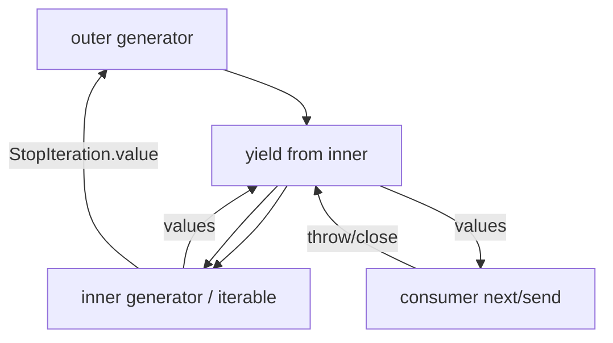
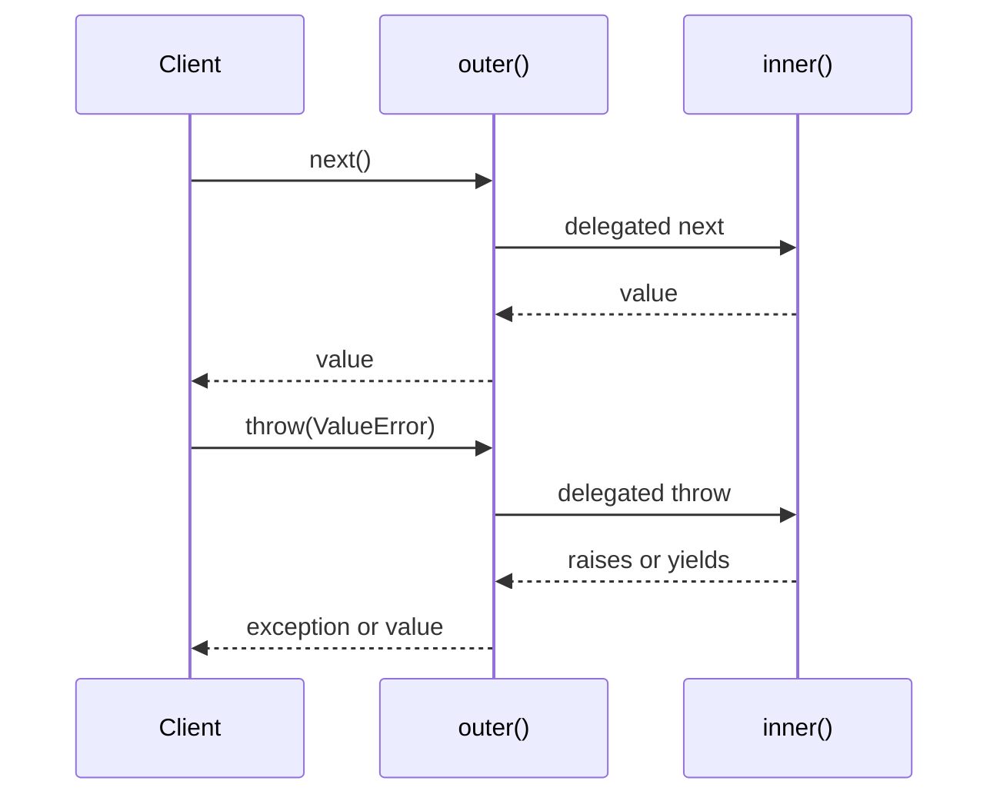

# yield from and Generator Delegation

## Overview

`yield from expr` **delegates** iteration (or generator interaction) to a sub-iterator or sub-generator, transparently forwarding values, injected `send`/`throw`, and return values. PEP 380 replaced verbose manual loops and preserved exception propagation and generator cleanup semantics that ad hoc `for` loops mishandled.

In CPython 3.14+, `yield from` compiles to `GET_YIELD_FROM_ITER` plus delegation opcodes that call the subiterator's `__next__`/`send`/`throw`/`close` methods. Understanding delegation is prerequisite for asyncio's task cancellation plumbing, nested parsers, and protocol stacks.

## Learning Objectives

- Explain semantic equivalence between `yield from` and expanded delegation loops
- Forward `send`, `throw`, and `return` values through nested generators
- Use `yield from` with non-generator iterables and async counterparts
- Implement transparent wrapper generators (logging, metrics, validation) without breaking protocol
- Predict how `return` values surface to callers (often ignored except in `yield from`)

## Prerequisites

- [[03-Python/04-Iteration-Exceptions-and-Context/Generators and Generator Internals|Generators and Generator Internals]]
- [[03-Python/04-Iteration-Exceptions-and-Context/Iterator Protocol|Iterator Protocol]]

## Difficulty

`advanced`

## Estimated Time

- Reading: 75 minutes
- Exercises: 2–3 hours
- Mini project: 3 hours

## History

Before Python 3.3, developers wrote:

```python
for value in subgen():
    yield value
```

That failed to forward `send`, mishandled `GeneratorExit`, and dropped sub-generator `return` values. PEP 380 unified delegation; Python 3.5+ async functions gained analogous patterns via `await` chains rather than `yield from`.

## Problem It Solves

Nested generator pipelines (middleware-style) need **transparent forwarding** of the full iterator/generator protocol. Manual loops break:

- Two-way `send` into delegated generator
- Exception injection at correct stack depth
- Propagation of `return` values to delegating generator
- Proper `close()` on early exit

## Internal Implementation

### Desugaring (conceptual)

`yield from sub` approximately:

1. Obtain iterator from `sub` (`GET_ITER` if needed)
2. Loop: fetch next value; if `StopIteration`, capture `.value` as delegation result
3. Forward `send`/`throw`/`close` to underlying generator when applicable

CPython stores delegation state on the generator object (`gi_yieldfrom` pointer in source terms) until sub-iterator completes.



### Return value capture

Only the **direct** `yield from` caller receives `StopIteration.value` as the expression result:

```python
def inner():
    return 42
    yield  # unreachable in practice; use return in generator via StopIteration.value in Py3.3+

def outer():
    result = yield from inner()
    print("inner returned", result)

g = outer()
next(g)  # or list(g) if inner actually yielded
```

Modern style: use bare `return value` in generator; value available via `StopIteration.value` on completion.

## Mermaid Diagrams

### Structure: stacked delegation


### Sequence: throw propagation



## Examples

### Minimal Example

```python
def gen_a():
    yield 1
    yield 2
    return "done-a"


def gen_b():
    result = yield from gen_a()
    yield f"got {result}"


assert list(gen_b()) == [1, 2, "got done-a"]
```

### Production-Shaped Example

Observability wrapper that preserves delegation semantics:

```python
from __future__ import annotations

import logging
import time
from collections.abc import Generator, Iterable
from typing import Any, TypeVar

T = TypeVar("T")
log = logging.getLogger(__name__)


def instrumented(gen: Iterable[T], *, name: str) -> Generator[T, Any, Any]:
    """Yield from sub-generator while logging throughput and failures."""
    start = time.perf_counter()
    count = 0
    try:
        value = yield from gen
    except Exception:
        log.exception("delegation failed", extra={"stream": name, "count": count})
        raise
    else:
        elapsed = time.perf_counter() - start
        log.info(
            "delegation complete",
            extra={"stream": name, "count": count, "elapsed_s": elapsed, "result": value},
        )
        return value
    finally:
        pass


def events(path: str):
    with open(path, encoding="utf-8") as fh:
        for line in fh:
            yield line.rstrip("\n")


def pipeline(path: str):
    yield from instrumented(events(path), name=path)


for line in pipeline("access.log"):
    process(line)
```

Test delegation forwarding in [[03-Python/code/README|Python code labs]] (`iterators`).

## Trade-offs

| Dimension | Upside | Downside | When it matters |
| --- | --- | --- | --- |
| Correctness | Full protocol forwarding | Less obvious than `for` | Middleware generators |
| Performance | Single C-level delegation loop | Deep stacks harder to debug | High-throughput parsers |
| Readability | Flat linear pipelines | `return` via StopIteration surprises | Teaching/onboarding |
| vs async | Sync delegation model | Not for blocking I/O concurrency | Legacy sync code |

### When to Use

- Middleware layers over generator pipelines (metrics, validation, retry)
- Flattening nested recursive tree walks with `yield from walk(child)`
- Implementing protocol stacks before converting to async

### When Not to Use

- Simple map/filter where a comprehension or `itertools` suffices
- New concurrent I/O code—use `async def` and `await` instead
- When you intentionally want to swallow sub-generator return values

## Exercises

1. Implement manual delegation loop and prove `send` breaks without `yield from`.
2. Write three-level nested generators; `throw` in the middle and trace handler execution order.
3. Use `dis.dis` to compare `yield from` vs explicit loop bytecode size and opcodes.
4. Build `yield from` over a non-generator iterable; verify `return` value is `None`.
5. Extend code lab iterators with a delegating proxy generator.

## Mini Project

**Composable log pipeline.** Functions `parse`, `filter_level`, `enrich` each return generators; compose with `yield from` and a driver that supports injected `throw` for circuit-breaking on repeated errors.

## Portfolio Project

Wire instrumented delegation into [[03-Python/projects/Resource Pool and ExitStack/README|Resource Pool and ExitStack]] for pooled connection read loops.

## Interview Questions

1. What problems did PEP 380 solve compared to `for x in sub: yield x`?
2. How does a generator `return` value reach the delegating generator?
3. Does `yield from` work with plain lists? What is the return value?
4. What happens when you `close()` an outer generator delegating to an inner one?
5. Relationship between `yield from` and asyncio task cancellation?

### Stretch / Staff-Level

1. Walk through CPython's `gen_send_ex` delegation path at a high level.
2. Design a sync-to-async adapter: can `yield from` help, or is a thread bridge required?

## Common Mistakes

- Using `for` loops in wrapper generators that must forward `send`
- Expecting `return` values from delegated **iterables** (only generators participate fully)
- Swallowing exceptions in middleware without re-raising
- Mixing `yield` and `yield from` incorrectly in the same function without clear phases

## Best Practices

- Prefer `yield from` for transparent passthrough wrappers
- Log at delegation boundaries, not inside every inner yield
- Document whether middleware consumes or forwards return values
- Pair with [[03-Python/04-Iteration-Exceptions-and-Context/Resource Cleanup and Cancellation Semantics|Resource Cleanup and Cancellation Semantics]] for abrupt exit

## Summary

`yield from` is full generator delegation—not syntactic sugar for a loop. It forwards values, exceptions, and return payloads across nested generators, enabling middleware-style pipelines with correct protocol behavior. Production wrappers around I/O and parsing should use delegation rather than manual iteration unless semantics intentionally differ.

## Further Reading

- PEP 380 — Syntax for Delegating to a Subgenerator
- [[03-Python/04-Iteration-Exceptions-and-Context/Generators and Generator Internals|Generators and Generator Internals]]

## Related Notes

- [[03-Python/04-Iteration-Exceptions-and-Context/Generators and Generator Internals|Generators and Generator Internals]]
- [[03-Python/04-Iteration-Exceptions-and-Context/Iterator Protocol|Iterator Protocol]]
- [[03-Python/05-CPython-Runtime-and-Memory/Bytecode and dis|Bytecode and dis]]
- [[03-Python/code/README|Python code labs]]
- [[03-Python/README|Python Track]]

## Progress Checklist

- [ ] Explained from first principles
- [ ] Drew at least one Mermaid diagram
- [ ] Implemented a minimal version
- [ ] Documented trade-offs and non-goals
- [ ] Completed exercises
- [ ] Practiced interview questions aloud
- [ ] Linked prerequisites and dependents
