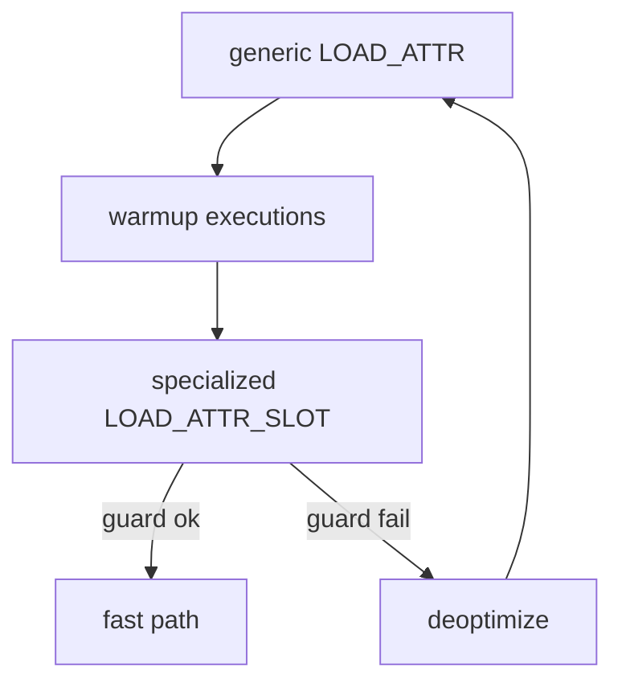
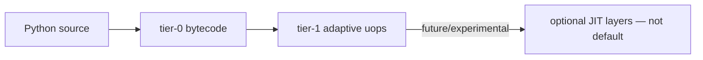

# Adaptive Specializing Interpreter

## Overview

Since Python 3.11 (PEP 659), CPython's eval loop includes an **adaptive specializing interpreter**: hot bytecode instructions collect **runtime type feedback** in inline caches and may **rewrite themselves** into faster specialized forms (e.g., monomorphic `LOAD_ATTR` for a known class layout). When assumptions break (**deoptimization**), execution falls back to generic opcodes.

CPython 3.14+ continues expanding specialized forms and tuning thresholds. This is not a JIT compiling to machine code (no Graal-style tier-2 yet in default builds)—it is **in-place bytecode specialization** guarded by runtime checks—similar in spirit to inline caching in [[01-Computer-Science/08-Languages-and-Computation/Virtual Machines and Bytecode|Virtual Machines and Bytecode]] and JS engine ICs.

## Learning Objectives

- Explain specialization vs traditional JIT and vs old CPython eval loop
- Identify opcodes with inline caches using `dis.show_caches`
- Predict deoptimization triggers (type changes, dict key insertion order effects)
- Interpret `--enable-pystats` / `sys._stats` (when available) for specialization hits/misses
- Design microbenchmarks that avoid misleading specialization artifacts

## Prerequisites

- [[03-Python/05-CPython-Runtime-and-Memory/Bytecode and dis|Bytecode and dis]]
- [[03-Python/05-CPython-Runtime-and-Memory/Code Objects Frame Objects and Call Stack|Code Objects Frame Objects and Call Stack]]

## Difficulty

`expert`

## Estimated Time

- Reading: 2 hours
- Exercises: 3 hours
- Mini project: 4 hours

## History

Pre-3.11 CPython used a straightforward switch-dispatch loop with occasional peephole optimizations at compile time. PEP 659 introduced adaptive specialization; 3.12–3.14 added more specialized uops and instrumentation APIs. Free-threaded builds (3.13+) add locking considerations around mutable object specialization.

## Problem It Solves

Pure bytecode interpretation is slow for attribute access, method calls, and global loads repeated in hot loops. Specialization recovers much of the overhead **without** requiring a separate compilation tier—important for deployment simplicity and embedding.

## Internal Implementation

### Adaptive cycle

1. **Generic opcode** executes, records observed types/versions in cache
2. Counter hits threshold → attempt **specialize**
3. Specialized fast path runs while guards hold
4. Guard failure → **deopt** to generic opcode, possibly re-specialize later



### Common specialization sites

| Site | Typical guard |
| --- | --- |
| `LOAD_ATTR` | Fixed class version, slot offset |
| `CALL` | Callable type, arity |
| `BINARY_OP` | Both operands same small-int layout |
| `LOAD_GLOBAL` | Module dict unchanged |

**Megamorphic** sites (many types) stop specializing—performance cliff.

### Free-threading interaction (3.13+)

Mutable object layouts guarded by locks or version tags; specialization remains valid but invalidation may differ—benchmark on target build.

## Mermaid Diagrams

### Structure: tier model (CPython 3.14 default)



### Sequence: guard failure

```mermaid
sequenceDiagram
    participant Loop as hot loop
    participant Spec as specialized opcode
    participant Gen as generic opcode

    Loop->>Spec: execute with expected type
    Loop->>Spec: new type appears
    Spec->>Gen: deoptimize
    Gen-->>Loop: continue correctly
```

## Examples

### Minimal Example

```python
import dis

class Point:
    __slots__ = ("x", "y")
    def __init__(self, x, y):
        self.x = x
        self.y = y


def sum_x(points):
    total = 0
    for p in points:
        total += p.x
    return total


dis.dis(sum_x, show_caches=True)  # 3.13+

pts = [Point(i, i) for i in range(10_000)]
for _ in range(3):
    sum_x(pts)  # warmup specialization
```

### Production-Shaped Example

Detect performance cliff when polymorphic types hit hot path:

```python
from __future__ import annotations

import random
import time
from typing import Protocol


class HasValue(Protocol):
    value: int


class A:
    __slots__ = ("value",)
    def __init__(self, v: int) -> None:
        self.value = v


class B:
    __slots__ = ("value",)
    def __init__(self, v: int) -> None:
        self.value = v


def aggregate(items: list[HasValue]) -> int:
    s = 0
    for it in items:
        s += it.value
    return s


def bench(items, rounds: int = 200) -> float:
    t0 = time.perf_counter()
    for _ in range(rounds):
        aggregate(items)
    return time.perf_counter() - t0


mono = [A(i) for i in range(5000)]
poly = [random.choice([A(i), B(i)]) for i in range(5000)]

# Expect poly slower after warmup due to megamorphism / deopts
print("mono", bench(mono))
print("poly", bench(poly))
```

Document limits in [[03-Python/code/README|Python code labs]] `vm` (no specialization parity).

## Trade-offs

| Dimension | Upside | Downside | When it matters |
| --- | --- | --- | --- |
| Adaptive tier | Speed without deploy JIT | Complex, version-specific | Hot loops |
| Monomorphic code | Best speed | Brittle to type changes | Inner loops |
| __slots__ / stable classes | Better LOAD_ATTR spec | Less flexibility | Datamodel design |
| Microbenchmarks | Reveals cliffs | Misleading cold starts | Perf CI |

### When to Use

- Understanding why small refactors change benchmark results
- Designing stable hot paths (fixed types, local binding)
- Interpreting 3.14 perf release notes

### When Not to Use

- Do not rely on specialization for algorithmic correctness
- Do not micro-optimize without profiler evidence
- Avoid assuming cross-version identical specialization behavior in tools patching bytecode

## Exercises

1. Warm up monomorphic loop; capture `dis` caches before/after.
2. Introduce third class into loop; measure deopt cliff.
3. Compare `__slots__` vs `__dict__` class on identical benchmark.
4. Read `_stats` or pystats output if build supports; map hits/misses.
5. Document unsupported specialization in `vm` lab README.

## Mini Project

**Specialization microbench suite.** Scripts reporting mono vs poly runtime ratios across 3.11/3.12/3.14 with pinned hardware notes for CI trend tracking (informational, not gating).

## Portfolio Project

Add specialization-aware notes to [[03-Python/projects/Python Runtime Toolkit/README|Python Runtime Toolkit]] perf panel.

## Interview Questions

1. What problem does PEP 659 solve in CPython?
2. Difference between specialization and a compiling JIT?
3. What is megomorphism and why does it matter?
4. How can you inspect inline caches in recent Python?
5. Why might inserting a dict key invalidate some specialized global loads?

### Stretch / Staff-Level

1. Explain guard invalidation for `LOAD_ATTR` when a class's `__dict__` gains new attributes.
2. Compare CPython specialization to V8 inline caches at a design level.

## Common Mistakes

- Benchmarking cold single-iteration loops
- Changing object shapes in hot paths (monkeypatching classes)
- Assuming PyPy or free-threaded numbers match default GIL build
- Optimizing globals in loops without measuring

## Best Practices

- Profile with `py-spy`, `perf`, or `cProfile` before opcode tuning
- Keep hot loop types stable; hoist attribute lookups to locals
- Version-label performance claims ("3.14, GIL build, linux x86_64")
- Pair with [[03-Python/09-Production-Python/Measuring and Optimizing Performance|Measuring and Optimizing Performance]]

## Summary

CPython 3.11+ accelerates interpretation by specializing hot bytecode with guarded fast paths. Performance is workload-dependent: monomorphic steady-state loops win; polymorphic or shape-changing code deoptimizes. Production engineers should treat specialization as observable but internal—measure end-to-end, understand cliffs, and avoid coding to undocumented opcode forms.

## Further Reading

- PEP 659 — Specializing Adaptive Interpreter
- CPython 3.14 what's new — performance section
- [[02-JavaScript/04-Engines-and-Memory/Deoptimization and Performance Cliffs|Deoptimization and Performance Cliffs]] (analogous concepts)

## Related Notes

- [[03-Python/05-CPython-Runtime-and-Memory/Bytecode and dis|Bytecode and dis]]
- [[03-Python/05-CPython-Runtime-and-Memory/Code Objects Frame Objects and Call Stack|Code Objects Frame Objects and Call Stack]]
- [[03-Python/09-Production-Python/Measuring and Optimizing Performance|Measuring and Optimizing Performance]]
- [[01-Computer-Science/08-Languages-and-Computation/Virtual Machines and Bytecode|Virtual Machines and Bytecode]]
- [[03-Python/code/README|Python code labs]]

## Progress Checklist

- [ ] Explained from first principles
- [ ] Drew at least one Mermaid diagram
- [ ] Implemented a minimal version
- [ ] Documented trade-offs and non-goals
- [ ] Completed exercises
- [ ] Practiced interview questions aloud
- [ ] Linked prerequisites and dependents
