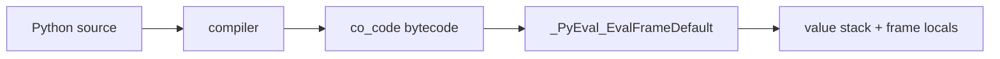
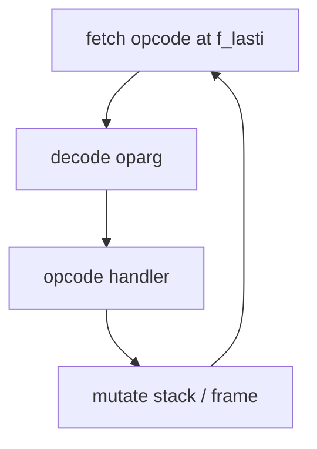
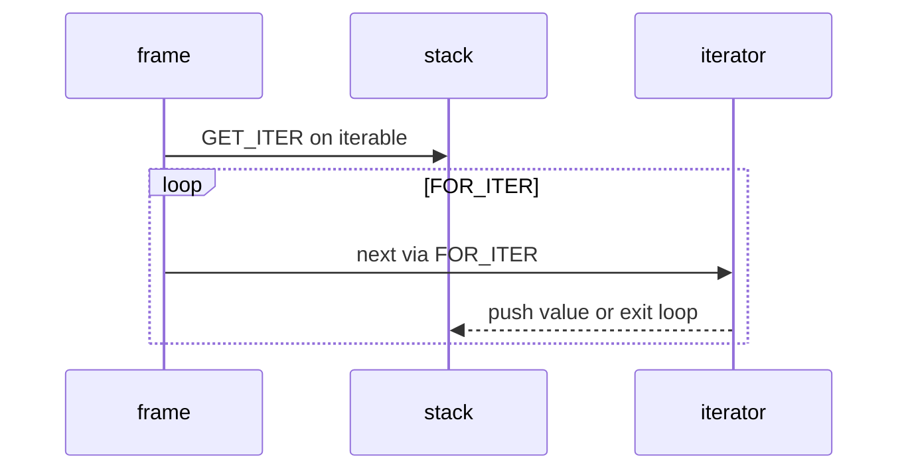

# Bytecode and dis

## Overview

CPython executes **bytecode**—a stack-based instruction sequence stored in `code.co_code` as 16-bit units (opcode + arg, or extended arg). The **`dis`** module disassembles code objects into human-readable instructions, revealing how Python desugars syntax into loads, stores, jumps, and calls. Since 3.11+, many opcodes are **inline cache** slots for the [[03-Python/05-CPython-Runtime-and-Memory/Adaptive Specializing Interpreter|Adaptive Specializing Interpreter]].

Reading bytecode bridges source intuition and runtime behavior: why `local += 1` may differ from `local = local + 1`, how `try/finally` maps to exception table entries, and what specialization guards observe.

## Learning Objectives

- Disassemble functions and interpret stack effects of common opcodes
- Map Python constructs (loops, comprehensions, `with`, `async`) to opcode patterns
- Use `dis.get_instructions`, `bytecode` helpers, and `show_caches` (3.13+)
- Explain inline cache slots and their relationship to specialization
- Debug performance cliffs by correlating hot opcodes with source lines

## Prerequisites

- [[03-Python/05-CPython-Runtime-and-Memory/Code Objects Frame Objects and Call Stack|Code Objects Frame Objects and Call Stack]]
- [[03-Python/05-CPython-Runtime-and-Memory/Parsing AST and Compilation Pipeline|Parsing AST and Compilation Pipeline]]

## Difficulty

`advanced`

## Estimated Time

- Reading: 2–3 hours
- Exercises: 4 hours
- Mini project: 5 hours

## History

Python bytecode evolved from early stack machines through major reshuffles (3.11 wordcode, 3.12/3.13 new opcodes, 3.14 continued refinement). `dis` grew `show_caches`, exception table display, and adaptive interpreter annotations. Tools like `bytecode`, `xdis`, and `pycdc` assist cross-version analysis.

## Problem It Solves

Source-level reasoning fails when:

- Closures and comprehensions create unexpected temporaries
- Exception handling has zero-cost paths only in bytecode layout
- Micro-optimizations (local binding `len = len`) show measurable opcode reduction
- Security audits need to verify `LOAD_GLOBAL` targets

Bytecode is the contract between compiler and interpreter—see [[01-Computer-Science/08-Languages-and-Computation/Virtual Machines and Bytecode|Virtual Machines and Bytecode]].

## Internal Implementation

### Instruction format (3.11+)

Each instruction is typically 2 bytes: `opcode`, `oparg`. Some opcodes use **extended arg** prefix for large constants/name indices. Exception handling uses **`co_exceptiontable`**, not legacy block stacks.

### Common opcode families

| Family | Examples | Role |
| --- | --- | --- |
| Load/store | `LOAD_FAST`, `STORE_ATTR`, `LOAD_GLOBAL` | Data movement |
| Stack ops | `BINARY_OP`, `COMPARE_OP`, `Unary` variants | Operations |
| Control flow | `POP_JUMP_IF_FALSE`, `JUMP_BACKWARD` | Branches/loops |
| Calls | `CALL`, `CALL_KW`, `CALL_FUNCTION_EX` | Invocation |
| Iteration | `GET_ITER`, `FOR_ITER` | `for` loops |
| Context | `BEFORE_WITH`, `WITH_EXCEPT_START` | `with` statement |



### Inline caches

Opcodes like `LOAD_ATTR` reserve cache entries recording observed types for quick paths—displayed by `dis.dis(..., show_caches=True)` on 3.13+.

## Mermaid Diagrams

### Structure: eval loop



### Sequence: FOR_ITER loop



## Examples

### Minimal Example

```python
import dis

def accumulate(items):
    total = 0
    for x in items:
        total += x
    return total

dis.dis(accumulate)
```

Compare binding:

```python
import dis

def with_attr(obj):
    return obj.value + 1

def with_local(obj):
    get = obj.value
    return get + 1

print("with_attr:")
dis.dis(with_attr)
print("with_local:")
dis.dis(with_local)
```

### Production-Shaped Example

Opcode profiler hook for diagnosing slow functions in staging:

```python
from __future__ import annotations

import dis
import time
from collections import Counter
from types import CodeType


def opcode_histogram(code: CodeType, *, samples: int = 1) -> Counter[str]:
    counts: Counter[str] = Counter()
    for _ in range(samples):
        for instr in dis.get_instructions(code):
            counts[instr.opname] += 1
    return counts


def compare_versions(fn, /, *, label_a: str, label_b: str, mutate_b):
    base = opcode_histogram(fn.__code__)
    mutate_b(fn)
    changed = opcode_histogram(fn.__code__)
    print(label_a, base.most_common(8))
    print(label_b, changed.most_common(8))


# Use in CI: fail if hot path introduces LOAD_GLOBAL in inner loop after refactor
```

Pair with toy VM: [[03-Python/code/README|Python code labs]] — `vm` module.

## Trade-offs

| Dimension | Upside | Downside | When it matters |
| --- | --- | --- | --- |
| dis introspection | Exact semantics | Verbose, version-specific | Perf tuning |
| Peephole/optimize | Smaller bytecode | Harder reading | optimize=2 |
| Specialization | Faster steady state | Deopt cliffs | Hot loops |
| Bytecode patching | None official | Fragile hacks | Avoid |

### When to Use

- Performance work after profiling implicates Python-level overhead
- Teaching compiler pipelines
- Building educational VMs and security scanners

### When Not to Use

- Premature optimization before algorithmic fixes
- Assuming bytecode stable across Python minor versions for patching

## Exercises

1. Disassemble list comprehension vs explicit loop; count `FOR_ITER` and `CALL` differences.
2. Locate exception table entries for `try/finally` with `dis.dis` output (3.11+).
3. Run `dis.show_caches` on hot `LOAD_ATTR` after warm-up calls.
4. Implement `dis`-like printer for subset opcodes in `vm` lab.
5. Explain `BINARY_OP` unified opcode vs legacy `INPLACE_ADD` (version note).

## Mini Project

**Bytecode diff tool.** Given two Python versions or two source variants, compile both and emit human-readable diff of opcode sequences with line mapping.

## Portfolio Project

Integrate bytecode trail into [[03-Python/projects/Python Runtime Toolkit/README|Python Runtime Toolkit]] stepping debugger.

## Interview Questions

1. What is the difference between `LOAD_FAST` and `LOAD_DEREF`?
2. How does `FOR_ITER` implement `for` loops?
3. What changed about bytecode word size in Python 3.11?
4. What are inline caches in dis output?
5. Why might local variable binding speed attribute access?

### Stretch / Staff-Level

1. Walk one `_PyEval_EvalFrameDefault` opcode dispatch path at C level (conceptually).
2. Design bytecode allowlist sandbox rejecting `IMPORT_NAME` and `STORE_GLOBAL`.

## Common Mistakes

- Comparing bytecode across Python versions without normalization
- Ignoring exception table when reading try/except structure
- Assuming `dis` output order matches source line order in all optimizations
- Patching `co_code` at runtime (breaks hashes, specialization, signing)

## Best Practices

- Always label Python version when publishing bytecode snippets
- Correlate with `inspect.getsource` line numbers via `instr.starts_line`
- Profile before micro-optimizing globals in loops
- Link to [[03-Python/05-CPython-Runtime-and-Memory/Adaptive Specializing Interpreter|Adaptive Specializing Interpreter]] when interpreting caches

## Summary

Bytecode is CPython's executable IR; `dis` makes it legible. Modern opcodes embed specialization caches and exception tables that source-level reading misses. Production performance debugging often requires correlating hot opcodes with adaptive tier state—not guessing from syntax alone.

## Further Reading

- Python `dis` documentation (3.14)
- [[01-Computer-Science/08-Languages-and-Computation/Virtual Machines and Bytecode|Virtual Machines and Bytecode]]
- [[03-Python/code/README|Python code labs]] — `vm`

## Related Notes

- [[03-Python/05-CPython-Runtime-and-Memory/Code Objects Frame Objects and Call Stack|Code Objects Frame Objects and Call Stack]]
- [[03-Python/05-CPython-Runtime-and-Memory/Adaptive Specializing Interpreter|Adaptive Specializing Interpreter]]
- [[03-Python/05-CPython-Runtime-and-Memory/Parsing AST and Compilation Pipeline|Parsing AST and Compilation Pipeline]]
- [[03-Python/04-Iteration-Exceptions-and-Context/Iterator Protocol|Iterator Protocol]]
- [[03-Python/README|Python Track]]

## Progress Checklist

- [ ] Explained from first principles
- [ ] Drew at least one Mermaid diagram
- [ ] Implemented a minimal version
- [ ] Documented trade-offs and non-goals
- [ ] Completed exercises
- [ ] Practiced interview questions aloud
- [ ] Linked prerequisites and dependents
