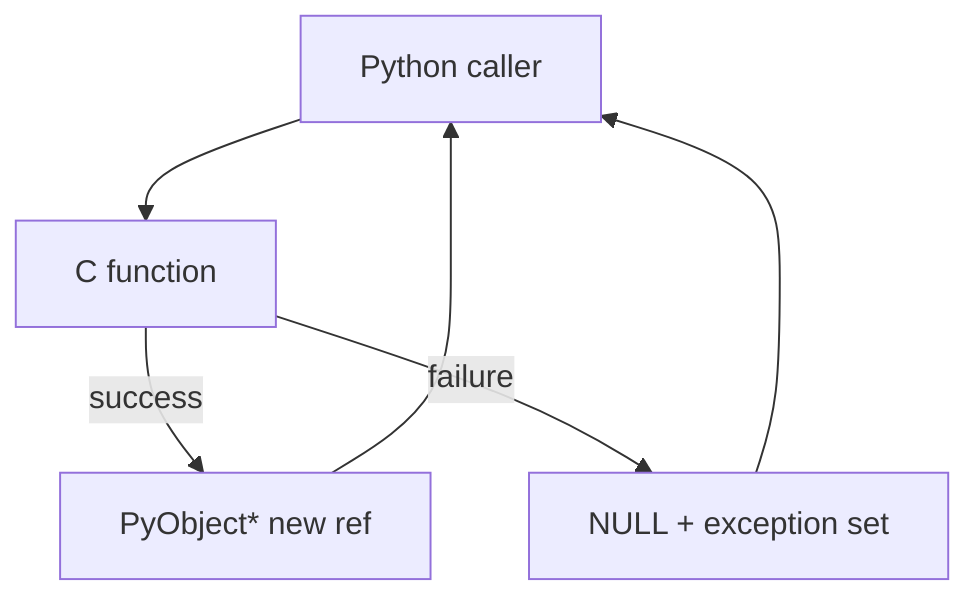
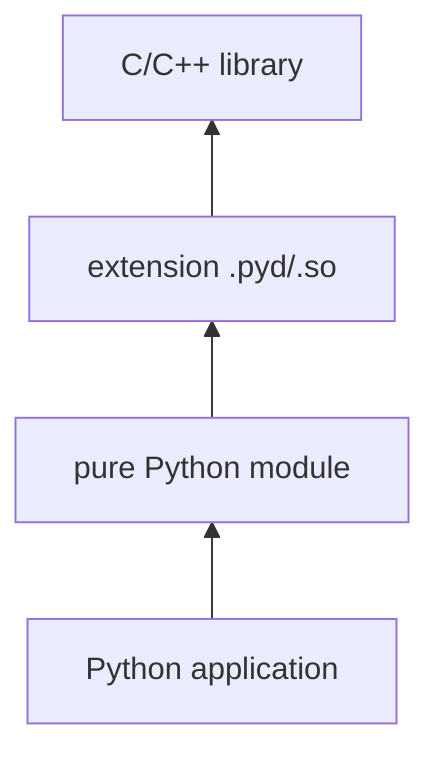
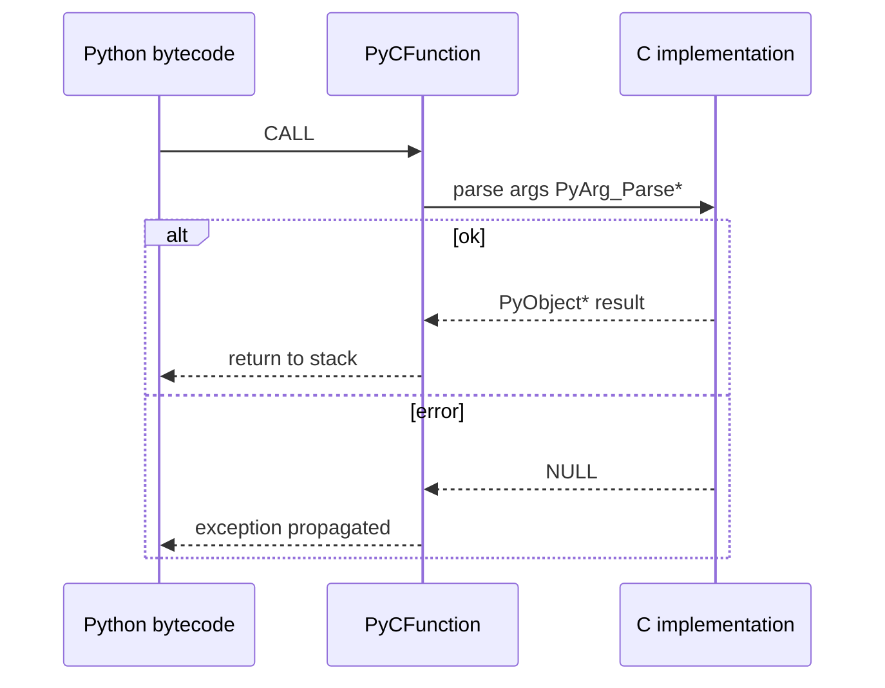

# C API Extension Boundary and Stable ABI

## Overview

CPython exposes a **C-API** for embedding and extending Python: `PyObject*`, type slots, reference counting, exception propagation, and the **stable ABI** (`limited API` / `Py_LIMITED_API`) allowing compiled extension wheels to target a **abi3** tag across minor Python versions. The boundary is where Python's object model meets manual memory management—errors become crashes, refcount bugs become leaks, and GIL/free-threading assumptions become production incidents.

This note covers extension module structure, header/version gates, Stable ABI trade-offs, and packaging wheels for 3.14+ including **free-threaded** build caveats (separate ABI tags emerging). Connects to [[01-Computer-Science/08-Languages-and-Computation/Foreign Function Interfaces|Foreign Function Interfaces]] and packaging topics later in the track.

## Learning Objectives

- Describe `PyObject`, `PyTypeObject`, and module init entry points
- Apply correct `Py_INCREF`/`Py_DECREF` and error-check conventions
- Choose full C-API vs `Py_LIMITED_API` stable ABI for a project
- Explain wheel tags (`cp314`, `abi3`, `t` free-threaded) at high level
- Identify when to use ctypes/cffi/pybind11 vs hand-written extensions

## Prerequisites

- [[03-Python/05-CPython-Runtime-and-Memory/Reference Counting and Immortal Objects|Reference Counting and Immortal Objects]]
- [[03-Python/01-Values-Types-and-Data-Model/Python Object Model and PyObject|Python Object Model and PyObject]]
- [[01-Computer-Science/08-Languages-and-Computation/Foreign Function Interfaces|Foreign Function Interfaces]]

## Difficulty

`expert`

## Estimated Time

- Reading: 2–3 hours
- Exercises: 4 hours (requires C toolchain)
- Mini project: 6+ hours

## History

Extension modules predate Python packaging standards. Distutils/setuptools/scikit-build-core modernized builds. PEP 384 defined Stable ABI; ongoing PEPs expand limited API coverage and clarify free-threaded extension requirements. Many scientific stacks still ship version-specific wheels (`cp312`) for performance.

## Problem It Solves

Python alone cannot:

- Call OS/hardware APIs with zero overhead
- Implement hot paths competitive with C/Rust libraries
- Integrate existing C/C++ codebases

The C-API is the contract—but **leaky**: internal struct layouts change unless constrained by limited API.

## Internal Implementation

### Extension module skeleton

```c
#define PY_SSIZE_T_CLEAN
#include <Python.h>

static PyObject *
add(PyObject *self, PyObject *args) {
    long a, b;
    if (!PyArg_ParseTuple(args, "ll", &a, &b))
        return NULL;
    return PyLong_FromLong(a + b);
}

static PyMethodDef methods[] = {
    {"add", add, METH_VARARGS, "Add two integers"},
    {NULL, NULL, 0, NULL}
};

static struct PyModuleDef moduledef = {
    PyModuleDef_HEAD_INIT,
    "fastadd",
    NULL,
    -1,
    methods
};

PyMODINIT_FUNC
PyInit_fastadd(void) {
    return PyModule_Create(&moduledef);
}
```

Build produces `fastadd.cp314-win_amd64.pyd` (platform-specific).

### Reference ownership rules

| Pattern | Rule |
| --- | --- |
| Returns new object | caller receives ownership (already new ref) |
| Returns borrowed ref | do not DECREF |
| Stores in struct | INCREF |
| Error return | return `NULL`, set exception |

Violations → leaks or use-after-free.



### Stable ABI (`abi3`)

Compile with `-DPy_LIMITED_API=0x030C0000` (example) to restrict to portable functions; wheel tag `abi3` runs on multiple 3.x versions **without recompile**—not all C-API available; performance/feature trade-off.

### Free-threading (3.13+)

Free-threaded CPython may require extensions to declare GIL/no-GIL compatibility; wheels may use distinct tags. Treat as **build-dependent** per [[03-Python/README|Python Track]] compatibility convention.

## Mermaid Diagrams

### Structure: Python ↔ extension stack



### Sequence: call into extension



## Examples

### Minimal Example (Python side)

```python
# After building and installing fastadd extension:
import fastadd

assert fastadd.add(2, 3) == 5
```

### Production-Shaped Example

Binding choice documentation for a library maintainer:

```python
"""
Extension strategy for `fastjson` (hypothetical)

| Approach        | Pros                          | Cons                          |
| --------------- | ----------------------------- | ----------------------------- |
| pybind11        | Ergonomics, modern C++        | C++ ABI, larger wheels        |
| cffi            | No compile on user machine    | Call overhead, lib visibility |
| C API + abi3    | One wheel many 3.x minors     | Limited API surface           |
| C API full      | Max control/perf              | Rebuild per minor             |

CPython 3.14+ target:
- Ship `abi3` wheel for broad compat on GIL builds
- Ship `cp314t` (example tag) for free-threaded after audit
- Fallback pure-Python for uncommon platforms

See [[03-Python/08-Modules-Packaging-and-Environments/pyproject Build Backends and Wheels|pyproject Build Backends and Wheels]].
"""
```

Use `ctypes` for quick prototypes without ABI commitment:

```python
import ctypes
import sys

if sys.platform == "win32":
    libc = ctypes.CDLL("msvcrt")
else:
    libc = ctypes.CDLL(None)

c_sqrt = libc.sqrt
c_sqrt.argtypes = [ctypes.c_double]
c_sqrt.restype = ctypes.c_double

assert abs(c_sqrt(2.0) - 2**0.5) < 1e-9
```

## Trade-offs

| Dimension | Upside | Downside | When it matters |
| --- | --- | --- | --- |
| Full C-API | All internals, max perf | Breaks across versions | NumPy-style libs |
| Stable ABI | One wheel many minors | Limited API | Small extensions |
| pybind11/cffi | Faster development | Extra deps/ABI rules | Most new native code |
| Pure Python | Portable | Slow hot paths | Prototypes |

### When to Use

- CPU-bound numeric/transform kernels proven by profiling
- Wrapping mature C/C++ SDKs with stable ABI
- Embedding Python in C/C++ applications

### When Not to Use

- Default first choice before profiling pure Python
- When Rust extension (PyO3) team standard prefers memory safety
- Calling C from Python for one function—try `ctypes`/cffi first

## Exercises

1. Build minimal `PyInit_` module returning a constant string attribute.
2. Introduce intentional refcount leak; locate with valgrind or Python debug malloc.
3. Compare wheel tags for abi3 vs cp314 build of same source (conceptually document).
4. Wrap one C function with `ctypes` and with pybind11 stub—compare LOC.
5. Read PEP 384 summary; list three APIs **not** in limited API.

## Mini Project

**Safe string uppercasing extension.** C API module implementing in-place ASCII upper on `bytes` buffer with bounds checks; tests for refcounts, error paths, and GIL assumptions documented.

## Portfolio Project

Native accelerator slot in [[03-Python/projects/Python Runtime Toolkit/README|Python Runtime Toolkit]] with abi3 build matrix in CI.

## Interview Questions

1. Who owns a `PyObject*` returned from C API functions?
2. What is the stable ABI (`abi3`) and why use it?
3. Difference between embedding and extending Python?
4. How do exceptions cross the C boundary?
5. What changes for extensions in free-threaded CPython?

### Stretch / Staff-Level

1. Design ABI policy for a library shipping wheels for 3.11–3.14 and free-threaded.
2. Explain why touching `PyObject` struct fields directly breaks across versions.

## Common Mistakes

- Incorrect refcount on error paths (`goto fail` without DECREF)
- Returning borrowed reference without INCREF when storing
- Assuming GIL held in threads without `PyGILState_Ensure`
- Shipping cp312 wheels claiming 3.14 compatibility without abi3

## Best Practices

- Use limited API unless profiling proves need for full headers
- Centralize error handling macros; never leak on `NULL` returns
- Test extensions against `-Werror`, sanitizer builds in CI
- Document Python version and threading model on wheel index page
- Prefer pybind11/cffi for team velocity; drop to C API for control

## Summary

The C-API boundary is CPython's performance and integration surface—manual refcounting, exceptions as return NULL, and version-sensitive struct layouts. Stable ABI trades access for wheel portability across minor releases. On 3.14+, extension strategy must include free-threaded tags and GIL assumptions—profile first, choose binding technology deliberately, and treat refcount correctness as security-adjacent.

## Further Reading

- PEP 384 — Defining a Stable ABI
- Python C-API documentation (3.14)
- [[03-Python/08-Modules-Packaging-and-Environments/pyproject Build Backends and Wheels|pyproject Build Backends and Wheels]]
- [[03-Python/07-Async-Concurrency-and-Free-Threading/Free-Threaded CPython Trade-offs|Free-Threaded CPython Trade-offs]]

## Related Notes

- [[03-Python/05-CPython-Runtime-and-Memory/Reference Counting and Immortal Objects|Reference Counting and Immortal Objects]]
- [[03-Python/05-CPython-Runtime-and-Memory/Memory Allocators Arenas and Tracing|Memory Allocators Arenas and Tracing]]
- [[03-Python/01-Values-Types-and-Data-Model/Python Object Model and PyObject|Python Object Model and PyObject]]
- [[01-Computer-Science/08-Languages-and-Computation/Foreign Function Interfaces|Foreign Function Interfaces]]
- [[03-Python/code/README|Python code labs]]
- [[03-Python/README|Python Track]]

## Progress Checklist

- [ ] Explained from first principles
- [ ] Drew at least one Mermaid diagram
- [ ] Implemented a minimal version
- [ ] Documented trade-offs and non-goals
- [ ] Completed exercises
- [ ] Practiced interview questions aloud
- [ ] Linked prerequisites and dependents
