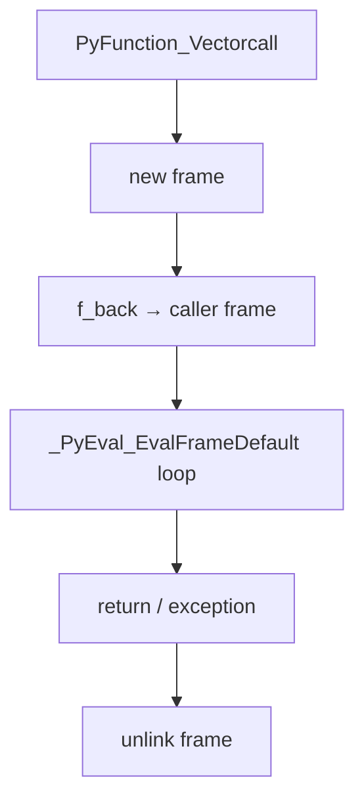
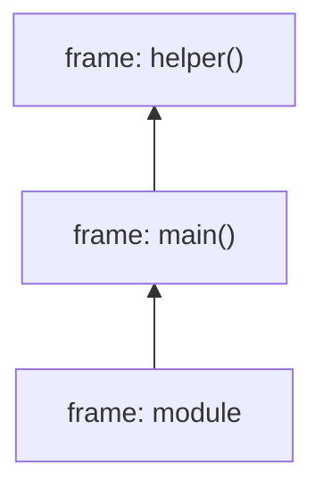
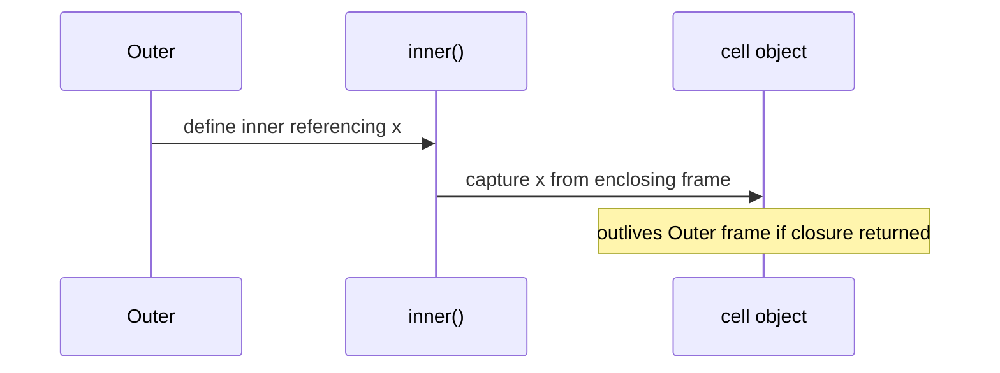

# Code Objects Frame Objects and Call Stack

## Overview

A **`code` object** (`types.CodeType`) is immutable compiled bytecode plus metadata: `co_consts`, `co_names`, `co_varnames`, stack depth, flags, exception table (3.11+). A **frame object** is a **runtime activation record**: instruction pointer (`f_lasti`), locals/fast locals, globals/builtins references, stack value stack, and link `f_back` to caller frames. Together they implement Python's call stack—heap-allocated frames for generators/coroutines persist beyond C stack unwinding.

This note connects LEGB scopes to frame fields, explains introspection via `inspect`/`sys._getframe`, and prepares reading [[03-Python/05-CPython-Runtime-and-Memory/Bytecode and dis|Bytecode and dis]] and [[03-Python/04-Iteration-Exceptions-and-Context/Generators and Generator Internals|Generators]].

## Learning Objectives

- List salient `code` object attributes and what bytecode references them
- Describe frame creation on function call and teardown on return/exception
- Relate closures to `co_freevars` and cell objects
- Use `inspect.currentframe` and stack walking responsibly in production
- Predict recursion limits and frame depth costs (`sys.getrecursionlimit`)

## Prerequisites

- [[03-Python/05-CPython-Runtime-and-Memory/Parsing AST and Compilation Pipeline|Parsing AST and Compilation Pipeline]]
- [[03-Python/02-Execution-Namespaces-and-Functions/Names Scopes LEGB and Closures|Names Scopes LEGB and Closures]]
- [[01-Computer-Science/03-Memory-and-Addressing/Stack and Heap|Stack and Heap]]

## Difficulty

`advanced`

## Estimated Time

- Reading: 2 hours
- Exercises: 3 hours
- Mini project: 4 hours

## History

Frames were Python objects early for tracebacks and debuggers. Optimizations (fast locals, frame stack caching in 3.11+) reduced allocation overhead. Exception table in code objects replaced former block stack arrangement for zero-cost try/finally paths in many cases.

## Problem It Solves

Debugging and performance require knowing **where names live** and **how calls nest**:

- Misunderstanding closures → stale variable bugs
- Deep recursion → `RecursionError` despite "small" data
- Profilers and tracers hook frame events (`sys.settrace`, `sys.setprofile`)

Frames bridge language semantics to [[01-Computer-Science/03-Memory-and-Addressing/Stack and Heap|Stack and Heap]] concepts.

## Internal Implementation

### Code object essentials

```python
def sample(x, y=10):
    z = x + y
    return z

co = sample.__code__
print(co.co_argcount, co.co_varnames, co.co_names, co.co_consts)
print(co.co_stacksize, co.co_flags)
```

Key fields:

| Field | Purpose |
| --- | --- |
| `co_code` | Raw bytecode bytes |
| `co_varnames` | Local names (fast locals) |
| `co_names` | Attribute/global names |
| `co_consts` | Literals and nested code objects |
| `co_freevars` / `co_cellvars` | Closure layout |
| `co_exceptiontable` | try/except/finally ranges (3.11+) |

### Frame lifecycle

1. **Call**: allocate frame, bind args to fast locals, push onto thread state linked list
2. **Execute**: `f_lasti` advances through `co_code`
3. **Return/raise**: pop frame, unwind stack, attach traceback on exception

Generators/coroutines **retain** frames while suspended.



## Mermaid Diagrams

### Structure: call stack chain



### Sequence: closure cell creation



## Examples

### Minimal Example

```python
import inspect

def outer(a):
    b = a * 2
    def inner(c):
        return a + b + c
    return inner

fn = outer(3)
print(fn.__code__.co_freevars)  # ('a', 'b')
print(inspect.getclosurevars(fn).nonlocals)
assert fn(10) == 19
```

### Production-Shaped Example

Safe stack sampler for latency investigations (not for hot paths):

```python
from __future__ import annotations

import sys
import traceback
from dataclasses import dataclass


@dataclass(frozen=True)
class FrameInfo:
    filename: str
    lineno: int
    name: str


def capture_stack(limit: int = 12, skip: int = 1) -> list[FrameInfo]:
    """Return trimmed stack for logging; skip current helper frames."""
    stack = traceback.extract_stack(limit=limit + skip)[skip:]
    return [FrameInfo(s.filename, s.lineno, s.name) for s in stack]


def log_slow_path(threshold_ms: float, work):
    import time

    start = time.perf_counter()
    result = work()
    elapsed_ms = (time.perf_counter() - start) * 1000
    if elapsed_ms > threshold_ms:
        frames = capture_stack()
        logger.warning(
            "slow path",
            extra={"elapsed_ms": elapsed_ms, "stack": [f.__dict__ for f in frames]},
        )
    return result
```

Avoid `sys._getframe` in library hot paths—use `tracing`/`perf` tools. Educational frame model: [[03-Python/code/README|Python code labs]] `vm`.

## Trade-offs

| Dimension | Upside | Downside | When it matters |
| --- | --- | --- | --- |
| Frame objects | Rich introspection | Allocation cost | Debuggers |
| Fast locals | Speed | Complex semantics vs locals dict | Inner loops |
| Heap frames for gen | Suspend/resume | Memory retention | Async/generators |
| sys.settrace | Full visibility | Huge overhead | Test frameworks |

### When to Use

- Debuggers, coverage tools, profilers understanding frame hooks
- Closure/debugging exercises in runtime toolkit
- Diagnosing `RecursionError` and stack overflow

### When Not to Use

- Do not walk frames in tight loops for logging
- Do not rely on `f_locals` mutation to affect running code reliably in all contexts

## Exercises

1. Print `dis.code_info` and map each name index to `co_names`.
2. Write recursive function until `RecursionError`; record depth vs limit.
3. Show closure cell keeps outer variable alive after outer returns.
4. Use `inspect.signature` + `__code__` to correlate parameters with `co_varnames`.
5. Implement frame push/pop in `vm` lab matching Python semantics subset.

## Mini Project

**Lightweight traceback enricher.** Monkeypatch logging formatter to append last N frames on ERROR, with filtering for site-packages noise.

## Portfolio Project

[[03-Python/projects/Python Runtime Toolkit/README|Python Runtime Toolkit]] frame viewer listing live generator/coroutine frames.

## Interview Questions

1. Difference between `code` object and function object?
2. Where do local variables live in CPython 3.14 frames?
3. What is `f_back` and when is it None?
4. How do cell variables implement closures?
5. Why do generators increase memory usage even when idle?

### Stretch / Staff-Level

1. Explain frame stack caching (3.11+) benefits at high level.
2. Compare Python frames to JVM stack frames and JS execution contexts.

## Common Mistakes

- Mutating `f_locals` expecting consistent effects while executing
- Confusing function attributes with per-call frame state
- Ignoring recursion limit in tree/graph algorithms
- Holding references to frames (reference cycles with tracebacks—see gc note)

## Best Practices

- Prefer `traceback.format_stack` over manual frame walking
- Use `inspect` public API; avoid `_getframe` in libraries
- Bound recursion; convert to iteration where depth unbounded
- Link frames study with [[03-Python/02-Execution-Namespaces-and-Functions/Recursion Stack Limits and Frame Depth|Recursion Stack Limits and Frame Depth]]

## Summary

Code objects are compile-time artifacts; frames are per-call runtime state linking bytecode to namespaces and stacks. Closures, generators, and tracebacks all manifest through frame and cell machinery. Production debugging and performance work benefit from knowing what frames cost and when they linger beyond their calling C stack frame.

## Further Reading

- [[03-Python/05-CPython-Runtime-and-Memory/Bytecode and dis|Bytecode and dis]]
- Python data model — code objects
- [[01-Computer-Science/03-Memory-and-Addressing/Stack and Heap|Stack and Heap]]

## Related Notes

- [[03-Python/05-CPython-Runtime-and-Memory/Parsing AST and Compilation Pipeline|Parsing AST and Compilation Pipeline]]
- [[03-Python/05-CPython-Runtime-and-Memory/Bytecode and dis|Bytecode and dis]]
- [[03-Python/04-Iteration-Exceptions-and-Context/Generators and Generator Internals|Generators and Generator Internals]]
- [[03-Python/02-Execution-Namespaces-and-Functions/Recursion Stack Limits and Frame Depth|Recursion Stack Limits and Frame Depth]]
- [[03-Python/code/README|Python code labs]]

## Progress Checklist

- [ ] Explained from first principles
- [ ] Drew at least one Mermaid diagram
- [ ] Implemented a minimal version
- [ ] Documented trade-offs and non-goals
- [ ] Completed exercises
- [ ] Practiced interview questions aloud
- [ ] Linked prerequisites and dependents
