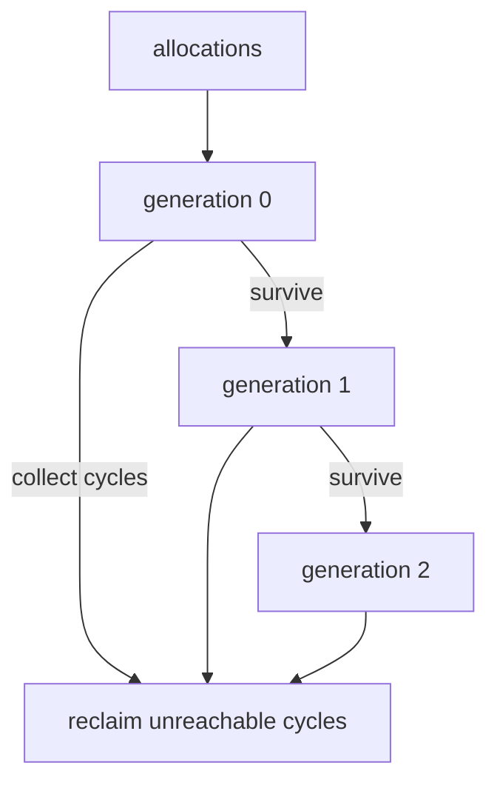
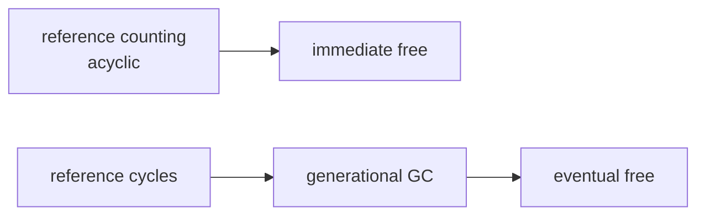
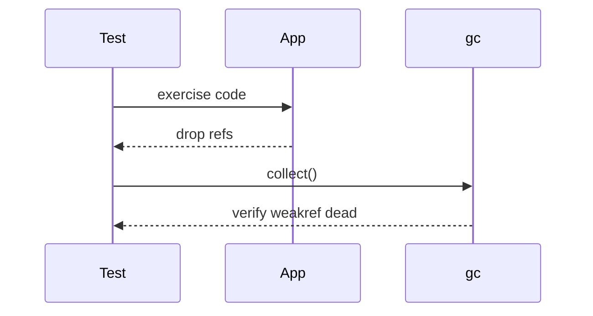

# Generational Cycle GC and gc Module

## Overview

CPython supplements reference counting with a **generational, cycle-detecting garbage collector** for container objects that can form reference cycles. The **`gc` module** exposes thresholds, manual collection, debugging flags, and callbacks. Generations (0, 1, 2) trade **collection frequency** against **full-heap cost**—young objects die young; survivors promote to older generations.

Cycles prevent refcount from reaching zero: classic observer graphs, parent/child mutual refs, and closure cycles. This note ties theory from [[01-Computer-Science/03-Memory-and-Addressing/Garbage Collection Models|Garbage Collection Models]] to CPython's `gc` hooks used in production debugging and test isolation.

## Learning Objectives

- Explain why refcount alone leaks cycles and how cyclic GC breaks them
- Configure `gc.set_threshold` and interpret generation counts
- Use `gc.get_objects`, `get_referrers`, and debug flags responsibly
- Identify objects with `__del__` in cycles (legacy cleanup pitfalls)
- Integrate `gc` policy in long-running services and test suites

## Prerequisites

- [[03-Python/05-CPython-Runtime-and-Memory/Reference Counting and Immortal Objects|Reference Counting and Immortal Objects]]
- [[01-Computer-Science/03-Memory-and-Addressing/Garbage Collection Models|Garbage Collection Models]]

## Difficulty

`advanced`

## Estimated Time

- Reading: 2 hours
- Exercises: 3 hours
- Mini project: 4 hours

## History

Cycle GC added in Python 1.5 era; generational scheme matured over 2.x/3.x. `gc` module exposes internals for embedders and debuggers. PEP 442 simplified safe finalization with `__del__` in many cases; still prefer explicit cleanup. 3.14 continues tuning collection thresholds and interaction with immortal objects.

## Problem It Solves

Reference cycles like:

```python
class Node:
    pass

a, b = Node(), Node()
a.peer = b
b.peer = a
del a, b  # both remain until cyclic GC
```

Without cyclic GC, long-running processes leak unbounded memory despite disciplined `del`.

## Internal Implementation

### Algorithm (high level)

1. Identify **container** objects tracked by GC (not all types)
2. From suspected cycles, compute **reachable** set from outside roots
3. Unreachable cycles have refcount adjusted; collect and call finalizers (`__del__`) in safe order
4. **Generations**: frequent cheap scans of gen0; periodic promotion and full gen2 collections

Default thresholds `(700, 10, 10)` mean: after 700 net allocations without gen0 collect, run gen0; gen0 collections trigger gen1/2 per counters.



### `gc` module essentials

| API | Purpose |
| --- | --- |
| `gc.collect()` | Force collection; returns unreachable count |
| `gc.disable()` / `enable()` | Toggle automatic GC |
| `gc.set_threshold` | Tune generation triggers |
| `gc.get_stats()` | Collection counts (3.14+ enriched stats) |
| `gc.get_referrers(obj)` | Debug incoming refs (careful: includes temp refs) |

## Mermaid Diagrams

### Structure: refcount + cyclic GC



### Sequence: manual collect in tests



## Examples

### Minimal Example

```python
import gc

class Cycle:
    def __init__(self):
        self.ref = self

c = Cycle()
id_before = id(c)
del c
assert gc.collect() > 0 or True  # cycle reclaimed
```

### Production-Shaped Example

Leak detector for staging using weak references and forced collection:

```python
from __future__ import annotations

import gc
import weakref
from dataclasses import dataclass


@dataclass
class LeakReport:
    typename: str
    count: int


def find_survivors(factory, *, rounds: int = 3) -> list[LeakReport]:
    gc.collect()
    gc.collect()
    survivors: dict[str, int] = {}
    refs = [weakref.ref(factory()) for _ in range(100)]
    for _ in range(rounds):
        gc.collect()
    for r in refs:
        obj = r()
        if obj is not None:
            survivors[type(obj).__name__] = survivors.get(type(obj).__name__, 0) + 1
    return [LeakReport(k, v) for k, v in sorted(survivors.items())]
```

Educational simulator: [[03-Python/code/README|Python code labs]] — `gc_sim`.

## Trade-offs

| Dimension | Upside | Downside | When it matters |
| --- | --- | --- | --- |
| Generational GC | Amortized low cost | Pause times on gen2 | Latency-sensitive services |
| Manual collect | Test determinism | Masks real retention bugs | Unit tests only |
| get_objects scan | Deep debugging | Expensive, noisy | Incidents |
| disable GC | Microbench stability | Cycle leaks | Benchmarks only |

### When to Use

- Debugging memory leaks suspected cyclic
- Test teardown verifying objects die (`weakref` + `gc.collect()`)
- Tuning thresholds in allocation-heavy batch workers (expert-only)

### When Not to Use

- Do not disable GC in production without extreme justification
- Do not iterate `gc.get_objects()` in hot paths
- Do not rely on `__del__` ordering in cycles

## Exercises

1. Build explicit two-node cycle; confirm objects alive before `gc.collect()`.
2. Measure pause time of `gc.collect(2)` on large heap (staging only).
3. Use `gc.set_debug(gc.DEBUG_LEAK)` in toy program; interpret output.
4. Implement tri-color marking simulation in `gc_sim` lab.
5. Find real-world cycle via `objgraph` or referrer walk in sample app.

## Mini Project

**GC observatory CLI.** Wrap workload, log `gc.get_stats()` before/after, chart gen0/gen1/gen2 collections and collected objects over time.

## Portfolio Project

Integrate leak checks into [[03-Python/projects/Python Runtime Toolkit/README|Python Runtime Toolkit]] shutdown sequence.

## Interview Questions

1. Why does CPython need GC if it has reference counting?
2. What are the three generations?
3. What does `gc.collect()` return?
4. Can all objects participate in cyclic GC?
5. Why is `gc.get_referrers` tricky to use?

### Stretch / Staff-Level

1. Explain PEP 442 finalization improvements for cyclic `__del__`.
2. Design a cache that avoids cycles using `WeakValueDictionary`.

## Common Mistakes

- Calling `gc.collect()` in production request paths
- Assuming immediate free after `del` for cyclic graphs
- Creating uncollectable cycles with `__del__` and legacy extension objects
- Interpreting `get_referrers` output without understanding transient refs

## Best Practices

- Break cycles at design time (weak refs, explicit `close()`)
- Use `tracemalloc` first; use `gc` debug as scalpel
- In tests: `gc.collect()` + weakref assertions, not sleep
- Document if libraries hold global registries preventing collection

## Summary

CPython's generational GC reclaims reference cycles that refcount cannot. The `gc` module exposes tuning and debugging for embedders and incident response. Production services should prevent cycles structurally; manual GC belongs in tests and diagnostics—not routine request handling.

## Further Reading

- Python `gc` module documentation (3.14)
- [[01-Computer-Science/03-Memory-and-Addressing/Garbage Collection Models|Garbage Collection Models]]
- [[03-Python/code/README|Python code labs]] — `gc_sim`

## Related Notes

- [[03-Python/05-CPython-Runtime-and-Memory/Reference Counting and Immortal Objects|Reference Counting and Immortal Objects]]
- [[03-Python/05-CPython-Runtime-and-Memory/Memory Allocators Arenas and Tracing|Memory Allocators Arenas and Tracing]]
- [[03-Python/09-Production-Python/Measuring and Optimizing Performance|Measuring and Optimizing Performance]]
- [[03-Python/03-Classes-Descriptors-and-Metaprogramming/Slots Weakrefs and Object Layout|Slots Weakrefs and Object Layout]]
- [[03-Python/README|Python Track]]

## Progress Checklist

- [ ] Explained from first principles
- [ ] Drew at least one Mermaid diagram
- [ ] Implemented a minimal version
- [ ] Documented trade-offs and non-goals
- [ ] Completed exercises
- [ ] Practiced interview questions aloud
- [ ] Linked prerequisites and dependents
