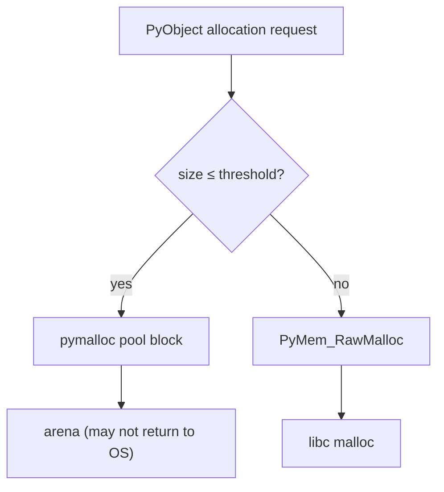
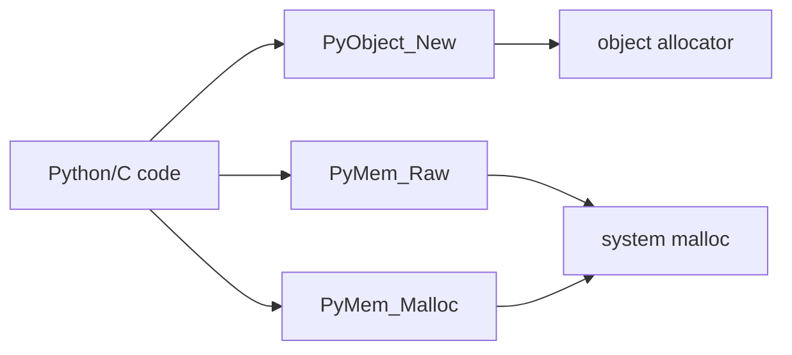
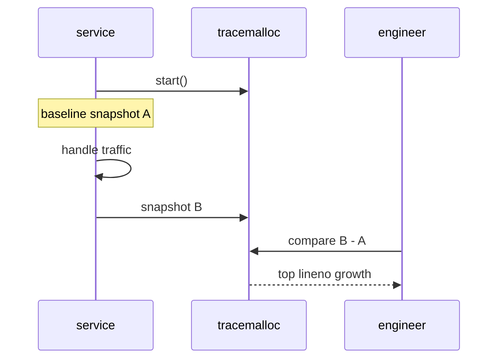

# Memory Allocators Arenas and Tracing

## Overview

CPython layers allocators: **object-specific allocators** (notably **pymalloc** for small objects ≤512 bytes on 64-bit), **Raw** allocator wrapping `malloc`/`free`, and **Mem** domain for internal C buffers. **Arenas** are large pools subdivided into **pools** and **blocks** to reduce system allocator churn and improve locality. Python code observes this indirectly via RSS growth, fragmentation, and tools like **`tracemalloc`**, **`malloc_stats`** (debug builds), and **`pymalloc` tuning** env vars where supported.

Understanding allocators explains why processes retain memory after objects are freed (arena not returned to OS), why small-object churn matters, and how to attribute allocations to source lines in 3.14 production services.

## Learning Objectives

- Describe pymalloc arena/pool/block hierarchy at high level
- Differentiate Python object memory from process RSS and glibc arenas
- Use `tracemalloc` to attribute allocations to filename:lineno
- Interpret `PYTHONMALLOC` / debug allocator behavior (version-specific)
- Connect allocator behavior to GC and refcount deallocation paths

## Prerequisites

- [[03-Python/05-CPython-Runtime-and-Memory/Reference Counting and Immortal Objects|Reference Counting and Immortal Objects]]
- [[03-Python/05-CPython-Runtime-and-Memory/Generational Cycle GC and gc Module|Generational Cycle GC and gc Module]]
- [[01-Computer-Science/03-Memory-and-Addressing/Virtual Memory and Paging|Virtual Memory and Paging]]

## Difficulty

`expert`

## Estimated Time

- Reading: 2 hours
- Exercises: 3 hours
- Mini project: 5 hours

## History

pymalloc (Neil Schemenauer) became default small-object allocator early in 2.x lifecycle. Ongoing work improves stats, debug hooks, and interaction with **mimalloc** experiments/opt-ins across versions. `tracemalloc` (3.4+) provides lightweight allocation tracing without valgrind overhead for many cases.

## Problem It Solves

Without allocator awareness:

- Teams misread "memory not returned after gc.collect()" as leaks
- Microservices OOM despite "objects deleted" due to arena retention + fragmentation
- Performance work ignores small-object allocation rates in hot loops
- Incidents lack allocation attribution without tracing

Links to [[01-Computer-Science/03-Memory-and-Addressing/Virtual Memory and Paging|Virtual Memory and Paging]]—freed blocks may remain in process address space.

## Internal Implementation

### pymalloc hierarchy (conceptual)

| Level | Size / role |
| --- | --- |
| Arena | ~256 KiB–1 MiB chunks from system alloc |
| Pool | 4 KiB subdivisions within arena |
| Block | Fixed small sizes (8, 16, … bytes) |

Large objects bypass pymalloc → direct malloc.



### Deallocation path

`tp_dealloc` → `PyObject_Free` → block returned to pool; **empty pools/arenas may be cached** rather than unmapped—RSS can stay high while Python thinks memory is "free."

### tracemalloc

Hooks allocation APIs recording stack traces (configurable depth). Compare snapshots to find growth:

```python
import tracemalloc

tracemalloc.start(25)
# ... workload ...
snap = tracemalloc.take_snapshot()
for stat in snap.statistics("lineno")[:10]:
    print(stat)
```

## Mermaid Diagrams

### Structure: allocator domains



### Sequence: tracemalloc snapshot diff



## Examples

### Minimal Example

```python
import tracemalloc

tracemalloc.start()
lines = ["x" * 1000 for _ in range(10_000)]
snap = tracemalloc.take_snapshot()
top = snap.statistics("lineno")[0]
print(top)  # points at list comp line
del lines
tracemalloc.stop()
```

### Production-Shaped Example

Periodic allocation diff in staging with structured logging:

```python
from __future__ import annotations

import tracemalloc
from dataclasses import dataclass


@dataclass
class AllocDelta:
    traceback: str
    size_kb: float
    count: int


def top_alloc_deltas(prev, curr, *, limit: int = 15) -> list[AllocDelta]:
    stats = curr.compare_to(prev, "lineno")
    out: list[AllocDelta] = []
    for s in stats[:limit]:
        if s.size_diff <= 0:
            continue
        out.append(
            AllocDelta(
                traceback=str(s.traceback),
                size_kb=s.size_diff / 1024,
                count=s.count_diff,
            )
        )
    return out


class AllocMonitor:
    def __init__(self) -> None:
        tracemalloc.start(20)
        self._last = tracemalloc.take_snapshot()

    def checkpoint(self, label: str) -> None:
        curr = tracemalloc.take_snapshot()
        deltas = top_alloc_deltas(self._last, curr)
        logger.info("alloc checkpoint", extra={"label": label, "deltas": [d.__dict__ for d in deltas]})
        self._last = curr
```

Cross-check with [[03-Python/code/README|Python code labs]] `gc_sim` for logical object graphs vs RSS.

## Trade-offs

| Dimension | Upside | Downside | When it matters |
| --- | --- | --- | --- |
| pymalloc | Fast small alloc | RSS retention | Long-running workers |
| tracemalloc | Line attribution | Overhead when enabled | Staging/debug |
| debug malloc | Buffer overrun detect | Huge slowdown | CI sanitizer jobs |
| glibc malloc | Large alloc efficient | Fragmentation | Mixed workloads |

### When to Use

- Investigating memory growth after GC proves no logical leaks
- Optimizing hot loops creating many short-lived objects
- Staging monitors with periodic tracemalloc checkpoints

### When Not to Use

- Leaving tracemalloc always on in prod at high frame depth
- Assuming every RSS byte maps 1:1 to live Python objects
- Replacing algorithmic fixes with allocator tuning alone

## Exercises

1. Run workload allocating 1M small ints; observe RSS before/after `del` + `gc.collect()`.
2. Compare tracemalloc top lines for list comprehension vs generator pipeline.
3. Build minimal object pool to reduce allocator churn; benchmark.
4. Read `PYTHONMALLOC=debug` crash report (local dev only) for buffer overrun demo.
5. Map pymalloc terms arena/pool/block in a diagram from docs.

## Mini Project

**Memory growth watchdog.** Sidecar thread in staging taking tracemalloc snapshots every N minutes; alert if top lineno delta exceeds threshold over 1 hour.

## Portfolio Project

[[03-Python/projects/Python Runtime Toolkit/README|Python Runtime Toolkit]] memory panel: RSS, tracemalloc top, gc stats combined view.

## Interview Questions

1. Why might process RSS stay high after Python objects are freed?
2. What is pymalloc and which allocations use it?
3. How does `tracemalloc` differ from `gc.get_objects()`?
4. What is an arena in pymalloc?
5. When would you use `PYTHONMALLOC=malloc`?

### Stretch / Staff-Level

1. Explain cross-interaction of glibc per-thread arenas and multi-threaded Python RSS.
2. Design allocation budgets for worker processes handling untrusted user code.

## Common Mistakes

- Calling logical leak from arena retention without referrer proof
- Enabling tracemalloc in prod without sampling/discipline
- Ignoring hidden allocations (encode/decode, regex compile, ORM row materialization)
- Confusing MiB RSS with Python `sys.getsizeof` (shallow size only)

## Best Practices

- Use `tracemalloc` snapshots in staging before/after load tests
- Combine referrer walks + tracemalloc + business metrics
- Restart workers periodically if arena retention unacceptable (operational mitigation)
- Document shallow vs deep size (`sys.getsizeof` vs `pympler.asizeof` cautiously)

## Summary

CPython's pymalloc serves small objects through arenas and pools—fast but may retain address space after free. tracemalloc attributes growth to source lines for engineering action. Production memory work pairs logical object graphs (refcount/GC) with allocator-level RSS behavior from virtual memory fundamentals—not assuming `del` shrinks OS reports immediately.

## Further Reading

- CPython dev docs — Memory Management
- [[01-Computer-Science/03-Memory-and-Addressing/Virtual Memory and Paging|Virtual Memory and Paging]]
- [[03-Python/09-Production-Python/Measuring and Optimizing Performance|Measuring and Optimizing Performance]]

## Related Notes

- [[03-Python/05-CPython-Runtime-and-Memory/Reference Counting and Immortal Objects|Reference Counting and Immortal Objects]]
- [[03-Python/05-CPython-Runtime-and-Memory/Generational Cycle GC and gc Module|Generational Cycle GC and gc Module]]
- [[03-Python/05-CPython-Runtime-and-Memory/C API Extension Boundary and Stable ABI|C API Extension Boundary and Stable ABI]]
- [[03-Python/code/README|Python code labs]]
- [[03-Python/README|Python Track]]

## Progress Checklist

- [ ] Explained from first principles
- [ ] Drew at least one Mermaid diagram
- [ ] Implemented a minimal version
- [ ] Documented trade-offs and non-goals
- [ ] Completed exercises
- [ ] Practiced interview questions aloud
- [ ] Linked prerequisites and dependents
