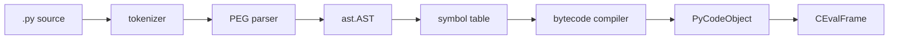
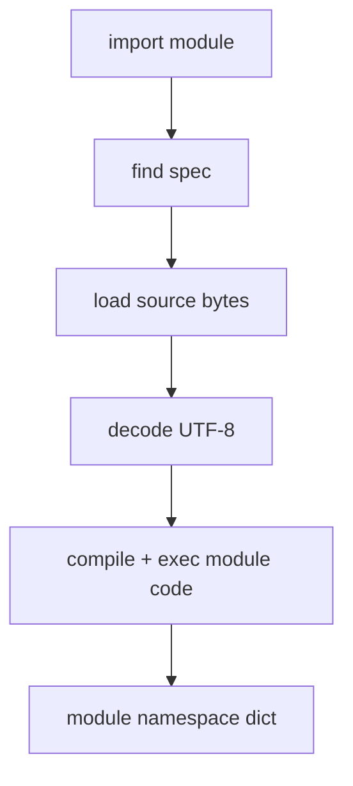
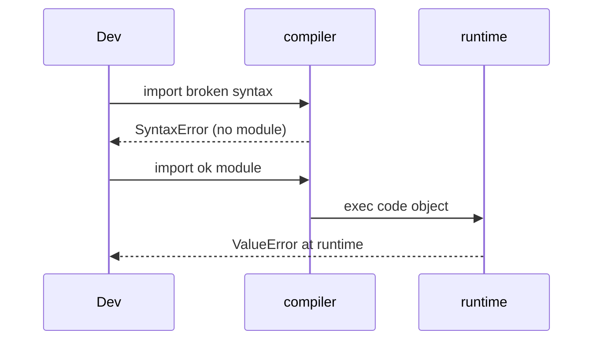

# Parsing AST and Compilation Pipeline

## Overview

CPython does not interpret source text directly at runtime. Source passes through **tokenization**, **parsing** into an **AST** (`ast` module), **semantic validation**, **symtable** construction, **bytecode compilation**, and creation of immutable **`code` objects** cached on functions/classes/modules. Understanding this pipeline explains syntax errors vs runtime errors, annotation behavior, `compile()` flags, and why some constructs exist only at compile time.

Python 3.14+ uses the **PEG parser** (PEP 617, default since 3.9) with improved error locations and f-string parsing integration. This note maps pipeline stages to introspection APIs and links to the toy VM in [[03-Python/code/README|Python code labs]] (`vm` module).

## Learning Objectives

- Trace source → tokens → AST → code object → execution
- Use `ast.parse`, `ast.dump`, and `compile()` with mode flags
- Explain symtable scopes (module/class/function/comprehension) and their effect on bytecode
- Identify compile-time vs runtime errors and deferred annotation evaluation
- Read CPython compiler phases at a high level for debugging import/compile failures

## Prerequisites

- [[03-Python/02-Execution-Namespaces-and-Functions/Lexical Structure and Compilation Units|Lexical Structure and Compilation Units]]
- [[01-Computer-Science/08-Languages-and-Computation/Compilers Interpreters and Virtual Machines|Compilers Interpreters and Virtual Machines]]
- [[01-Computer-Science/08-Languages-and-Computation/Lexing and Parsing|Lexing and Parsing]]

## Difficulty

`advanced`

## Estimated Time

- Reading: 2 hours
- Exercises: 3 hours
- Mini project: 5 hours

## History

Classic LL(1) parser limited grammar expressiveness; migration to PEG (3.9+) enabled clearer grammar and better errors. PEP 563 (postponed) and PEP 649 (3.14 annotation semantics evolution) show compile-time vs runtime binding tensions. `ast` constant folding and optimization passes evolve per release.

## Problem It Solves

Without a clear pipeline mental model:

- Developers confuse `SyntaxError` at import with logic bugs at runtime
- Macro-like metaprogramming breaks on AST/version changes
- Security tools miss compile-time-only constructs
- Performance work ignores specialization hints embedded at compile time

Maps directly to [[01-Computer-Science/08-Languages-and-Computation/Compilers Interpreters and Virtual Machines|Compilers Interpreters and Virtual Machines]] front-end phases.

## Internal Implementation

### Pipeline stages

| Stage | Output | Python API |
| --- | --- | --- |
| Tokenize | `TokenInfo` stream | `tokenize.generate_tokens` |
| Parse | `ast.AST` | `ast.parse` |
| Symtable | scopes, cells, globals | internal; visible via `compile` side effects |
| Compile | `code` object | `compile()` |
| Execute | frame evaluation | `exec`, function call |



### `compile()` modes

| Mode | Input shape |
| --- | --- |
| `exec` | Module/statements |
| `eval` | Single expression |
| `single` | REPL single input |
| `func_type` | Function annotations signature (typing) |

Flags like `optimize=2` strip assertions; `dont_inherit` controls future statements.

### Annotations (3.14+ awareness)

Annotation evaluation rules changed across 3.10–3.14 (PEP 563 deferred, PEP 649 lazy scopes in 3.14). Treat annotation semantics as **version-labeled** when libraries support wide ranges.

## Mermaid Diagrams

### Structure: module import compile



### Sequence: SyntaxError vs Exception



## Examples

### Minimal Example

```python
import ast

source = "def add(a, b):\n    return a + b\n"
tree = ast.parse(source, filename="<demo>", mode="exec")
print(ast.dump(tree, indent=2))

code = compile(tree, filename="<demo>", mode="exec")
ns: dict = {}
exec(code, ns)
assert ns["add"](2, 3) == 5
```

### Production-Shaped Example

Static lint for dangerous calls before deployment (compile + AST walk):

```python
from __future__ import annotations

import ast
import sys
from dataclasses import dataclass
from pathlib import Path


FORBIDDEN = {"eval", "exec", "__import__"}


@dataclass(frozen=True)
class Violation:
    name: str
    lineno: int
    col: int
    file: str


class ForbiddenCallVisitor(ast.NodeVisitor):
    def __init__(self, file: str) -> None:
        self.file = file
        self.violations: list[Violation] = []

    def visit_Call(self, node: ast.Call) -> None:
        if isinstance(node.func, ast.Name) and node.func.id in FORBIDDEN:
            self.violations.append(
                Violation(node.func.id, node.lineno, node.col_offset, self.file)
            )
        self.generic_visit(node)


def scan_path(path: Path) -> list[Violation]:
    source = path.read_text(encoding="utf-8")
    tree = ast.parse(source, filename=str(path))
    visitor = ForbiddenCallVisitor(str(path))
    visitor.visit(tree)
    return visitor.violations


if __name__ == "__main__":
    root = Path(sys.argv[1])
    all_v = [v for p in root.rglob("*.py") if scan_path(p) for v in scan_path(p)]
    if all_v:
        for v in all_v:
            print(f"{v.file}:{v.lineno}:{v.col}: forbidden {v.name}")
        sys.exit(1)
```

Feed compiled code objects into [[03-Python/05-CPython-Runtime-and-Memory/Bytecode and dis|Bytecode and dis]] analysis.

## Trade-offs

| Dimension | Upside | Downside | When it matters |
| --- | --- | --- | --- |
| AST transforms | Powerful lint/codegen | Breaks across Python versions | CI policy gates |
| `exec`/`compile` | Dynamic DSLs | Security risk | Sandboxing required |
| PEG parser | Better errors | Different from old tools | Educators |
| Bytecode cache | Faster import | Stale if pyc logic wrong | Deployments |

### When to Use

- Static analysis, formatters, type checkers, codemods (libcst/redbaron/ast)
- Teaching compiler courses with Python front-end
- Embedding DSLs compiled to Python code objects

### When Not to Use

- Simple config—use data formats (JSON/TOML), not `eval`
- Performance-critical hot paths—compile once, reuse code object

## Exercises

1. Tokenize a file with `tokenize.open`; locate `INDENT`/`DEDENT` for a nested function.
2. Parse the same source with `ast.parse` and locate `FunctionDef` nodes and their `lineno`.
3. Compile with `optimize=0` vs `2`; disassemble and find missing `assert` opcodes.
4. Build AST visitor counting async functions vs sync in a package.
5. Connect output code object to `vm` lab execution.

## Mini Project

**Import-time policy checker.** AST scan enforcing: no `eval`, max cyclomatic complexity per function, require docstring on public APIs; integrate as pytest plugin failing CI.

## Portfolio Project

Stage 1 of [[03-Python/projects/Python Runtime Toolkit/README|Python Runtime Toolkit]]: parse → dis → execute trail for arbitrary snippet.

## Interview Questions

1. At what stage does `SyntaxError` occur vs `NameError`?
2. What is the difference between `ast.parse` and `compile`?
3. What does the symtable track for closures and `nonlocal`?
4. Why did CPython switch to a PEG parser?
5. How are annotations treated differently in 3.11 vs 3.14?

### Stretch / Staff-Level

1. Outline CPython `_PyAST_Compile` inputs/outputs without reading every line of ceval.
2. Design a sandboxed `compile`+`exec` with restricted builtins and opcode allowlist.

## Common Mistakes

- Using `eval` on untrusted strings
- Assuming AST round-trips preserve formatting (use CST tools)
- Ignoring `filename` in `compile` (tracebacks show `<string>`)
- Mixing `exec` globals/locals incorrectly (shadowing bugs)

## Best Practices

- Always pass real filenames to `ast.parse`/`compile` for tracebacks
- Pin AST visitor to supported Python versions in tools
- Compile once; call code object many times
- Cross-link to [[03-Python/05-CPython-Runtime-and-Memory/Code Objects Frame Objects and Call Stack|Code Objects Frame Objects and Call Stack]]

## Summary

CPython compilation is a multi-phase pipeline from text to `code` objects. Syntax and scope are resolved before execution; understanding AST and symtable explains closures, annotations, and import failures. Production tooling (linters, security scanners) should operate on AST or tokens, not regex—aligned with compiler front-end theory from computer science.

## Further Reading

- PEP 617 — New PEG parser
- [[01-Computer-Science/08-Languages-and-Computation/Lexing and Parsing|Lexing and Parsing]]
- [[03-Python/code/README|Python code labs]] — `vm`

## Related Notes

- [[03-Python/05-CPython-Runtime-and-Memory/Code Objects Frame Objects and Call Stack|Code Objects Frame Objects and Call Stack]]
- [[03-Python/05-CPython-Runtime-and-Memory/Bytecode and dis|Bytecode and dis]]
- [[03-Python/02-Execution-Namespaces-and-Functions/Lexical Structure and Compilation Units|Lexical Structure and Compilation Units]]
- [[01-Computer-Science/08-Languages-and-Computation/Compilers Interpreters and Virtual Machines|Compilers Interpreters and Virtual Machines]]
- [[03-Python/README|Python Track]]

## Progress Checklist

- [ ] Explained from first principles
- [ ] Drew at least one Mermaid diagram
- [ ] Implemented a minimal version
- [ ] Documented trade-offs and non-goals
- [ ] Completed exercises
- [ ] Practiced interview questions aloud
- [ ] Linked prerequisites and dependents
