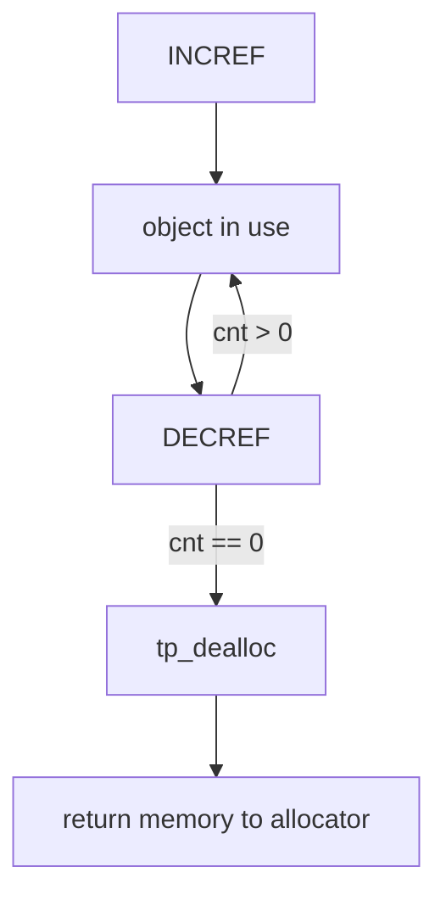
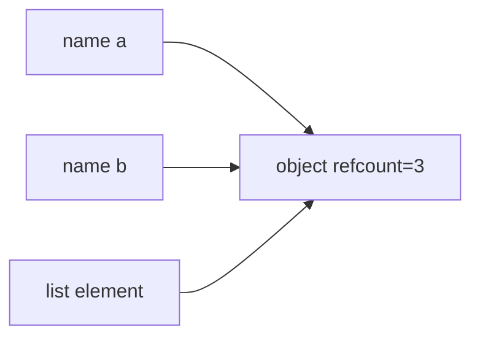
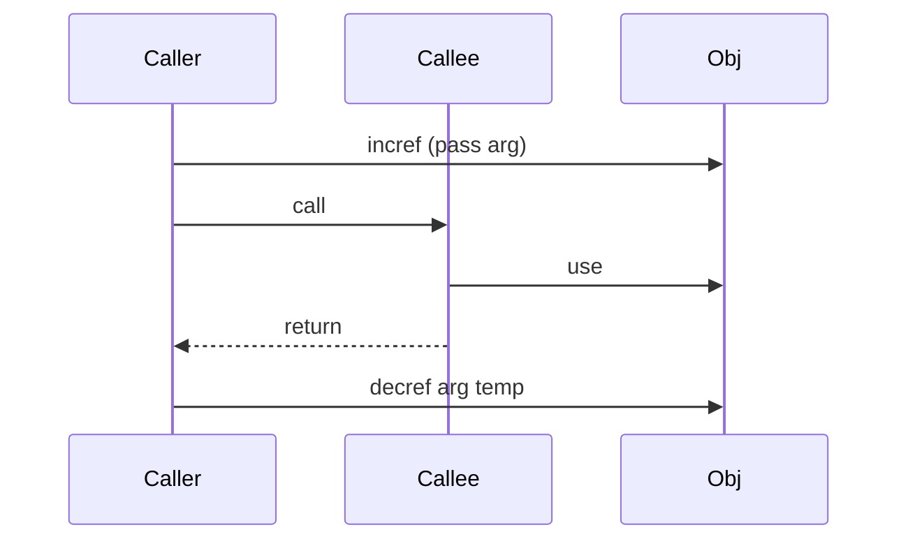

# Reference Counting and Immortal Objects

## Overview

CPython manages most object lifetimes with **reference counting**: each `PyObject` carries a refcount; `INCREF`/`DECREF` on assignment, parameter passing, container insertion, and temporary references. When refcount hits zero, the object's **deallocator** runs immediately—often closing OS resources for types like `socket` or releasing memory to [[03-Python/05-CPython-Runtime-and-Memory/Memory Allocators Arenas and Tracing|arenas]].

**Immortal objects** (PEP 683, refined through 3.12–3.14) are a static subset (small ints, some strings, singletons) whose refcounts never reach zero—reducing atomic contention and cache traffic in multi-threaded and free-threaded builds. Reference counting alone **does not** collect cycles; that requires the generational GC in the next note.

## Learning Objectives

- Explain refcount semantics for assignment, parameters, containers, and temporaries
- Predict when `del` does and does not free memory
- Describe immortal object policy and why it exists in 3.12+
- Use `sys.getrefcount` correctly (includes temporary reference)
- Connect refcount to extension module `Py_INCREF`/`Py_DECREF` rules

## Prerequisites

- [[03-Python/01-Values-Types-and-Data-Model/Python Object Model and PyObject|Python Object Model and PyObject]]
- [[01-Computer-Science/03-Memory-and-Addressing/Garbage Collection Models|Garbage Collection Models]]

## Difficulty

`advanced`

## Estimated Time

- Reading: 2 hours
- Exercises: 2–3 hours
- Mini project: 4 hours

## History

Reference counting from Python's origin; cycle GC added later (see [[03-Python/05-CPython-Runtime-and-Memory/Generational Cycle GC and gc Module|Generational Cycle GC and gc Module]]). PEP 683 introduced immortal static objects; free-threaded work (3.13+) extended refcount atomics and deferred freeing strategies.

## Problem It Solves

Deterministic reclamation for acyclic object graphs without full GC pauses on every deletion—critical for RAII-like behavior and C extensions. Immortal objects solve hot-path refcount overhead on singletons referenced across threads.

## Internal Implementation

### Refcount rules (conceptual)

| Operation | Effect |
| --- | --- |
| `b = a` | incref `a` |
| Function call arg | incref actuals; decref on return |
| Container store | incref item |
| Temporaries | incref/decref around expression evaluation |

When `ob_refcnt == 0`, type's `tp_dealloc` runs (may cascade decrefs).



### `sys.getrefcount`

Includes the reference created for the `getrefcount` call itself:

```python
import sys

x = object()
print(sys.getrefcount(x))  # typically 2, not 1
```

### Immortal objects (3.12+)

Selected compile-time singletons marked **immortal**—refcount operations may be no-ops. Benefits:

- Less atomic refcount traffic on hot literals
- Safer sharing in free-threaded builds

User code cannot mark arbitrary objects immortal. Behavior is implementation-specific—do not depend for correctness.

### `del` vs scope end

`del name` removes a binding; decrements refcount once. Other references keep object alive. Locals clearing on frame pop decrefs all fast locals.

## Mermaid Diagrams

### Structure: shared references



### Sequence: function call refcount churn



## Examples

### Minimal Example

```python
import sys

class Node:
    def __init__(self, name):
        self.name = name
    def __del__(self):
        print("dealloc", self.name)

a = Node("a")
b = a
print(sys.getrefcount(a))  # includes getrefcount temp
del a
print("b still holds", b.name)
del b
```

### Production-Shaped Example

Large buffer lifecycle in a request handler—avoid accidental retention:

```python
from __future__ import annotations

import weakref
from dataclasses import dataclass


@dataclass
class Payload:
    data: bytearray


_cache: weakref.WeakValueDictionary[str, Payload] = {}


def load_payload(key: str, factory) -> Payload:
    hit = _cache.get(key)
    if hit is not None:
        return hit
    p = Payload(data=factory())
    _cache[key] = p
    return p


def handle_request(key: str) -> int:
    p = load_payload(key, lambda: bytearray(10_000_000))
    try:
        return process(p.data)
    finally:
        # Explicitly drop local ref; weak cache may still hold until collected
        del p
```

Simulate refcount + cycles in [[03-Python/code/README|Python code labs]] — `gc_sim`.

## Trade-offs

| Dimension | Upside | Downside | When it matters |
| --- | --- | --- | --- |
| Refcount | Immediate free, predictable | Not thread-free without atomics | Extensions, FDs |
| vs tracing GC | Low pause for acyclic | Cycles leak without gc | Object graphs |
| Immortal objs | Faster hot literals | Memory never reclaimed | Interpreter internals |
| __del__ | Convenient cleanup | Resurrection, ordering issues | Avoid for critical resources |

### When to Use

- Reason about file/socket lifetime (use `with`, not `__del__`)
- Extension authoring with correct INCREF/DECREF
- Debugging memory retention (who holds last ref?)

### When Not to Use

- Do not implement cycle breaking manually in app code—use weakref or redesign
- Do not call `gc.collect()` to "fix" refcounted leaks that are plain strong refs

## Exercises

1. Demonstrate cycle `a.b = b; b.a = a` survives after `del a; del b` until `gc.collect()`.
2. Show small integer `is` identity and discuss interning vs immortal (version note).
3. Use `tracemalloc` + dropping refs to observe memory drop for large bytearray.
4. Implement refcount simulator in `gc_sim` lab (acyclic only).
5. Explain why `__del__` is unreliable for closing DB pools.

## Mini Project

**Refcount visualizer.** Wrapper objects logging INCREF/DECREF equivalents in pure Python simulation; detect leaks in sample app code paths.

## Portfolio Project

Stage in [[03-Python/projects/Python Runtime Toolkit/README|Python Runtime Toolkit]]: object retention report using `gc.get_referrers` for debugging.

## Interview Questions

1. Does Python use garbage collection, reference counting, or both?
2. What happens when refcount reaches zero?
3. Why doesn't `del` always free memory immediately?
4. What are immortal objects in recent CPython?
5. Why is `__del__` a poor place to close files?

### Stretch / Staff-Level

1. Explain deferred cross-thread freeing in free-threaded CPython at high level.
2. Compare CPython refcount to PyPy's GC and Rust's ownership.

## Common Mistakes

- Assuming `del` frees objects globally
- Creating reference cycles with lambdas/closures capturing self
- Using `__del__` for resource management instead of context managers
- Misreading `getrefcount` absolute numbers

## Best Practices

- Use context managers for external resources
- Break cycles with `weakref.ref` or weak containers where appropriate
- Profile retention with `objgraph`/`tracemalloc`/referrer walks
- In C extensions: match every INCREF with DECREF on all paths including errors

## Summary

CPython primarily frees acyclic objects immediately via reference counting; cycles need the generational collector. Immortal objects optimize interpreter hot paths in 3.12+. Production reliability comes from explicit scopes and understanding strong references—not from forcing collection or relying on finalizers.

## Further Reading

- PEP 683 — Immortal Objects
- [[01-Computer-Science/03-Memory-and-Addressing/Garbage Collection Models|Garbage Collection Models]]
- [[03-Python/code/README|Python code labs]] — `gc_sim`

## Related Notes

- [[03-Python/05-CPython-Runtime-and-Memory/Generational Cycle GC and gc Module|Generational Cycle GC and gc Module]]
- [[03-Python/05-CPython-Runtime-and-Memory/Memory Allocators Arenas and Tracing|Memory Allocators Arenas and Tracing]]
- [[03-Python/04-Iteration-Exceptions-and-Context/Resource Cleanup and Cancellation Semantics|Resource Cleanup and Cancellation Semantics]]
- [[03-Python/01-Values-Types-and-Data-Model/Mutability Sharing and Copying|Mutability Sharing and Copying]]
- [[03-Python/README|Python Track]]

## Progress Checklist

- [ ] Explained from first principles
- [ ] Drew at least one Mermaid diagram
- [ ] Implemented a minimal version
- [ ] Documented trade-offs and non-goals
- [ ] Completed exercises
- [ ] Practiced interview questions aloud
- [ ] Linked prerequisites and dependents
