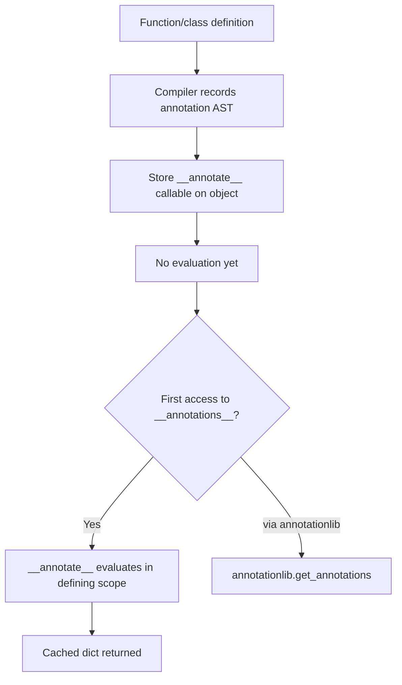
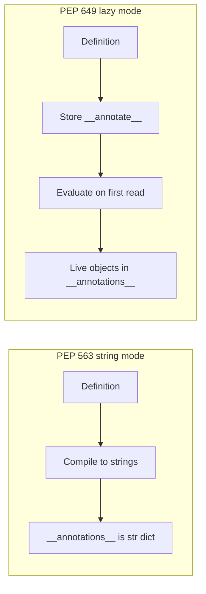
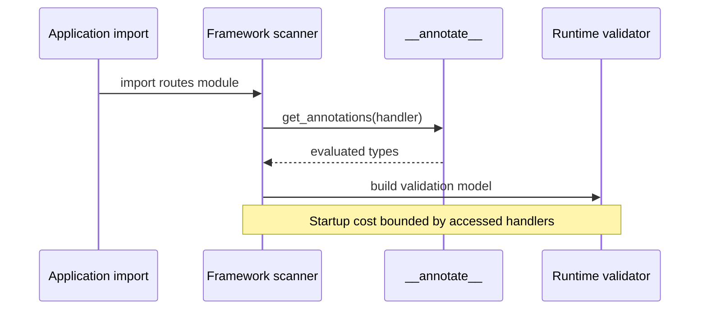

# Annotations Deferred Evaluation and annotationlib

## Overview

Function and variable **annotations** in Python are expressions attached to parameters, return values, and assignments. Before CPython 3.14, evaluating those expressions at definition time caused forward-reference pain (`"MyClass"`), import cycles, and runtime cost. Two PEPs addressed this differently:

- **PEP 563** (`from __future__ import annotations`): store annotations as strings at definition time (postponed evaluation)
- **PEP 649** (3.14 default semantics): **defer** evaluation until accessed via `__annotate__` / `annotationlib`, preserving lazy evaluation without stringifying everything

Understanding deferred evaluation is essential for frameworks (Pydantic, FastAPI, dataclass-like tools) that introspect annotations at import or startup, and for library authors targeting 3.10 through 3.14+ compatibility.

## Learning Objectives

- Explain why annotation expressions are evaluated and when that happens across Python versions
- Use `annotationlib` and `__annotate__` on CPython 3.14+
- Migrate code from string annotations (PEP 563) to PEP 649 semantics
- Avoid forward-reference and import-cycle bugs in typed APIs
- Predict how third-party libraries cache or lazily load annotations

## Prerequisites

- [[03-Python/06-Typing/Gradual Typing Philosophy and Trade-offs|Gradual Typing Philosophy and Trade-offs]]
- [[03-Python/02-Execution-Namespaces-and-Functions/Names Scopes LEGB and Closures|Names Scopes LEGB and Closures]]
- [[03-Python/05-CPython-Runtime-and-Memory/Parsing AST and Compilation Pipeline|Parsing AST and Compilation Pipeline]]

## Difficulty

`intermediate`

## Estimated Time

- Reading: 2 hours
- Exercises: 2–3 hours
- Mini project: 4 hours

## History

PEP 3107 (3.0) added annotation syntax without semantics. PEP 484 attached meaning for static checkers. Forward references required quoted strings manually. PEP 563 (3.7, future import) postponed all annotation evaluation by storing string forms—breaking runtime introspection that expected live objects. PEP 649 (accepted for 3.14) replaces stringification with **lazy evaluation hooks**, coordinated with PEP 695 type parameter syntax.

## Problem It Solves

Eager annotation evaluation fails when:

```python
class Node:
    def children(self) -> list[Node]:  # NameError: Node not defined yet (pre-3.14 without quotes)
        ...
```

Import cycles worsen when module A's annotations import module B while B imports A. Frameworks parsing annotations at import time pay **O(modules × annotation complexity)** startup cost. Deferred evaluation breaks cycles and delays work until something actually reads annotations.

## Internal Implementation

### Evaluation timeline (CPython 3.14+)



PEP 649 introduces a per-object `__annotate__` function generated by the compiler. Accessing `fn.__annotations__` triggers evaluation in the **defining scope's namespace**, not the caller's.

### annotationlib (3.14+)

The stdlib `annotationlib` module standardizes retrieval with format options:

```python
import annotationlib
import inspect

def demo(x: int, y: str) -> bool:
    return True

# Lazy, respects PEP 649 semantics
ann = annotationlib.get_annotations(demo, format=annotationlib.Format.FORWARDREF)
```

Formats include evaluating forward refs, preserving strings for checkers, and controlling `from __future__ import annotations` interactions.

### Compatibility matrix

| Version | Default behavior | Recommended import |
| --- | --- | --- |
| 3.9–3.12 | Eager evaluation | `from __future__ import annotations` |
| 3.13 | PEP 563 future deprecated; PEP 649 preview | Plan for 649 |
| 3.14+ | PEP 649 lazy evaluation | Prefer native 649; drop string hacks where safe |
| Type checkers | Analyze source statically | Independent of runtime evaluation timing |

## Mermaid Diagrams

### PEP 563 vs PEP 649



### Framework introspection sequence



## Examples

### Minimal Example

Forward reference without quotes on 3.14+:

```python
from __future__ import annotations  # still fine; merges with 649 semantics

class Tree:
    def add_child(self, child: Tree) -> None:
        self.children.append(child)

    children: list[Tree] = []
```

Inspect lazily:

```python
import annotationlib

print(Tree.add_child.__annotations__)  # triggers evaluation
print(annotationlib.get_annotations(Tree))
```

### Production-Shaped Example

Plugin registry that reads annotations only for registered callables:

```python
from __future__ import annotations

import annotationlib
from collections.abc import Callable
from typing import Any, get_origin, get_args


class PluginRegistry:
    def __init__(self) -> None:
        self._handlers: dict[str, Callable[..., Any]] = {}

    def register(self, name: str, fn: Callable[..., Any]) -> None:
        self._handlers[name] = fn

    def schema_for(self, name: str) -> dict[str, str]:
        fn = self._handlers[name]
        ann = annotationlib.get_annotations(fn, eval_str=True)
        return {param: _type_name(t) for param, t in ann.items() if param != "return"}


def _type_name(t: object) -> str:
    origin = get_origin(t) or t
    args = get_args(t)
    if args:
        inner = ", ".join(_type_name(a) for a in args)
        return f"{getattr(origin, '__name__', origin)}[{inner}]"
    return getattr(t, "__name__", repr(t))
```

**Scope boundary**: OpenAPI schema generation and HTTP validation wiring are [[07-Backend/01-HTTP-APIs-and-Contracts/OpenAPI as Executable Contract|OpenAPI as Executable Contract]] and [[07-Backend/03-Validation-Errors-and-Versioning/Schema Validation at the Edge|Schema Validation at the Edge]] concerns—this note covers **when and how** annotations materialize in CPython.

See [[03-Python/code/README|Python code labs]] for PEP 649 introspection drills.

## Trade-offs

| Dimension | Upside | Downside | When it matters |
| --- | --- | --- | --- |
| Lazy evaluation | Faster imports; fewer cycles | First access pays evaluation cost | Large FastAPI apps |
| Live objects in `__annotations__` | Runtime tools see real types | Breaks code assuming strings (PEP 563) | Framework migrations |
| `eval_str=True` in tools | Restores forward ref resolution | `eval` security concerns in untrusted code | CLI codegen |
| Dual 3.12/3.14 support | Broader audience | Conditional imports, test matrix | Libraries on PyPI |

### When to Use

- Library code targeting 3.14+ should assume PEP 649 and use `annotationlib`
- Keep `from __future__ import annotations` during transition for consistent forward refs
- Lazy-load annotations in plugin systems and schema builders

### When Not to Use

- Do not `eval()` annotation strings from untrusted modules
- Avoid depending on string form of annotations in persisted metadata—store explicit schemas instead

## Exercises

1. Demonstrate a circular import fixed by lazy annotations; break it again with eager evaluation on 3.12.
2. Write a script comparing import time for a module with 200 annotated functions—PEP 563 strings vs 3.14 lazy access patterns.
3. Implement `get_annotations` fallback for 3.12 using `typing.get_type_hints`.
4. Trace `__annotate__` with `dis` / `inspect.getsource`—what bytecode is generated?
5. Document migration steps for a Pydantic v1-style model reader to annotationlib.

## Mini Project

**Annotation Inspector CLI**

Build `python -m anninspect module:symbol` that prints annotations in three formats (string, evaluated, forwardref) using `annotationlib` on 3.14 with graceful degradation on 3.12.

## Portfolio Project

Add an annotations panel to [[03-Python/projects/Python Runtime Toolkit/README|Python Runtime Toolkit]] showing lazy vs eager evaluation timing per symbol.

## Interview Questions

1. Why did PEP 563 stringify annotations, and why was that problematic?
2. What does PEP 649 change in CPython 3.14?
3. How does `typing.get_type_hints()` differ from `annotationlib.get_annotations()`?
4. When can annotation evaluation still trigger import cycles?
5. Should libraries remove `from __future__ import annotations` on 3.14+?

### Stretch / Staff-Level

1. Design a caching strategy for annotation parsing in a web framework with 10k routes.
2. Explain security implications of evaluating annotation expressions containing `eval` or custom descriptors.

## Common Mistakes

- Assuming `__annotations__` values are always strings (PEP 563 habit)
- Calling `get_type_hints` at import time on every function—reintroduces eager cost
- Using annotation side effects (e.g., `Annotated[..., Meta()]`) that mutate global state
- Breaking runtime introspection when removing quotes without upgrading consumers

## Best Practices

- Target `annotationlib` for new introspection code on 3.14+
- Test libraries on both 3.12 (transition) and 3.14 (649 default)
- Cache annotation parsing results per function object identity
- Separate **schema storage** (JSON Schema, protobuf) from **source annotations** for long-lived APIs

## Summary

Annotations are compile-time metadata whose **evaluation timing** changed across Python versions. CPython 3.14's PEP 649 evaluates annotations lazily via `__annotate__` and `annotationlib`, fixing forward-reference and import-cycle pain without permanently stringifying types. Framework authors must update introspection code accordingly; library maintainers should test cross-version behavior and avoid eager `get_type_hints` at import unless necessary.

## Further Reading

- PEP 649 — Deferred Evaluation of Annotations Using Descriptors
- PEP 563 — Postponed Evaluation of Annotations (historical)
- [[03-Python/06-Typing/Generics TypeVars ParamSpecs and TypeVarTuples|Generics TypeVars ParamSpecs and TypeVarTuples]]
- [[03-Python/05-CPython-Runtime-and-Memory/Code Objects Frame Objects and Call Stack|Code Objects Frame Objects and Call Stack]]

## Related Notes

- [[03-Python/06-Typing/Gradual Typing Philosophy and Trade-offs|Gradual Typing Philosophy and Trade-offs]]
- [[03-Python/03-Classes-Descriptors-and-Metaprogramming/Dataclasses and Data-Oriented Classes|Dataclasses and Data-Oriented Classes]]
- [[03-Python/README|Python Track]]

## Progress Checklist

- [ ] Explained from first principles
- [ ] Drew at least one Mermaid diagram
- [ ] Implemented a minimal version
- [ ] Documented trade-offs and non-goals
- [ ] Completed exercises
- [ ] Practiced interview questions aloud
- [ ] Linked prerequisites and dependents
