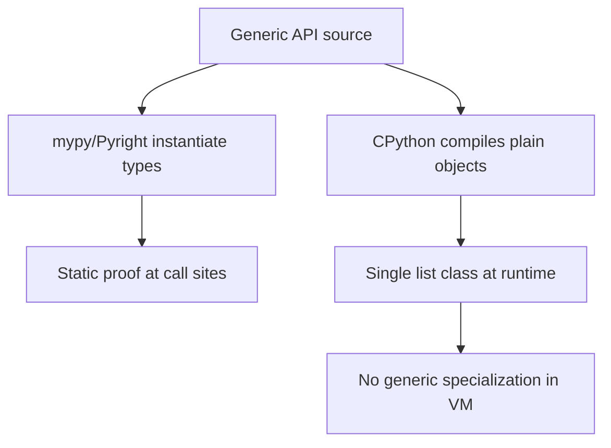
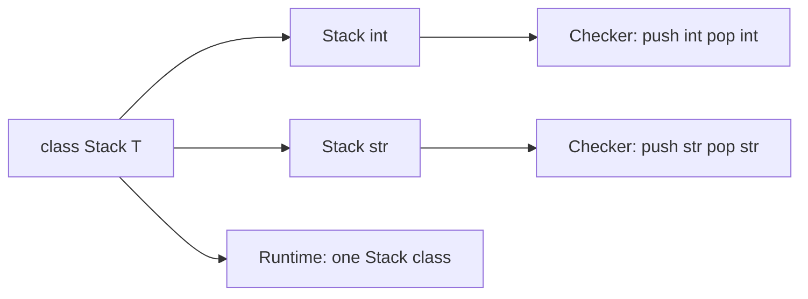
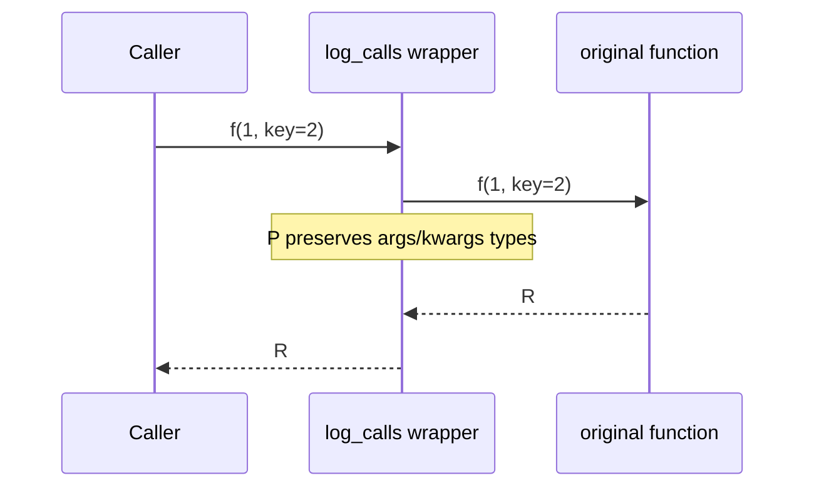

# Generics TypeVars ParamSpecs and TypeVarTuples

## Overview

**Generics** parameterize types and callables over type variables so static checkers can prove relationships like "the return type matches the element type of the input list." Python expresses generics via `TypeVar`, `ParamSpec`, `TypeVarTuple`, and since 3.12 **PEP 695** inline `class Stack[T]` / `def first[T](items: list[T]) -> T` syntax.

Generics are **static-only** constructs erased at runtime—`list[int]` and `list[str]` share the same `list` class in CPython. Correct generic APIs preserve type information for checkers while staying idiomatic at runtime.

This note covers first-principles generic typing for containers, decorators, callbacks, and variadic tuples on CPython 3.14+.

## Learning Objectives

- Declare and bound `TypeVar` instances; understand variance limitations in Python
- Model decorator and callback signatures with `ParamSpec` and `Concatenate`
- Express tuple-length generics with `TypeVarTuple` and `Unpack`
- Choose between legacy `Generic[T]` and PEP 695 `class Foo[T]` syntax
- Avoid common generic patterns that confuse mypy/Pyright

## Prerequisites

- [[03-Python/06-Typing/Gradual Typing Philosophy and Trade-offs|Gradual Typing Philosophy and Trade-offs]]
- [[03-Python/03-Classes-Descriptors-and-Metaprogramming/Classes Instances and Attribute Lookup|Classes Instances and Attribute Lookup]]
- [[03-Python/04-Iteration-Exceptions-and-Context/Iterator Protocol|Iterator Protocol]]

## Difficulty

`advanced`

## Estimated Time

- Reading: 3 hours
- Exercises: 4 hours
- Mini project: 6 hours

## History

PEP 484 introduced `TypeVar` and `Generic`. PEP 612 (ParamSpec) solved decorator typing. PEP 646 (TypeVarTuple) enabled numpy-like shape typing. PEP 695 (3.12) added native generic syntax reducing `TypeVar` boilerplate. Checkers evolved faster than runtime—generics remain a static layer.

## Problem It Solves

Without generics:

```python
def first(items: list) -> object:  # information destroyed
    return items[0]
```

Checkers cannot prove `first([1,2])` is `int`. Libraries like `cachetools`, ORM query builders, and RPC clients need **type-preserving** wrappers. ParamSpec fixes `def deco(f: Callable[..., T]) -> Callable[..., T]` hacks that broke with keyword-only parameters.

## Internal Implementation

### Runtime erasure



`list[int]` creates no distinct class—subscripting `list` returns `_GenericAlias` for introspection only.

### PEP 695 scoping rules

Type parameters declared on a class/function are **lexically scoped** to that definition—cleaner than module-level `T = TypeVar("T")` pollution.

```python
class Box[T]:
    def __init__(self, value: T) -> None:
        self.value = value

    def map[U](self, fn: Callable[[T], U]) -> Box[U]:
        return Box(fn(self.value))
```

### ParamSpec models call signatures

```python
from collections.abc import Callable
from typing import ParamSpec, TypeVar

P = ParamSpec("P")
R = TypeVar("R")

def log_calls(fn: Callable[P, R]) -> Callable[P, R]:
    def wrapper(*args: P.args, **kwargs: P.kwargs) -> R:
        print(f"calling {fn.__name__}")
        return fn(*args, **kwargs)
    return wrapper
```

### TypeVarTuple for variadic shapes

```python
from typing import TypeVarTuple, Unpack

Ts = TypeVarTuple("Ts")

def pair[*Ts](a: tuple[*Ts], b: tuple[*Ts]) -> tuple[*Ts]:
    return tuple(x + y for x, y in zip(a, b))  # example shape
```

Checkers validate length correspondence; runtime sees ordinary tuples.

## Mermaid Diagrams

### Generic instantiation flow



### ParamSpec decorator chain



## Examples

### Minimal Example

```python
def first[T](items: list[T]) -> T:
    if not items:
        raise IndexError("empty")
    return items[0]

reveal_type(first([1, 2, 3]))  # Pyright: int
```

### Production-Shaped Example

Typed LRU cache preserving function signature:

```python
from __future__ import annotations

from collections.abc import Callable
from functools import wraps
from typing import ParamSpec, TypeVar

P = ParamSpec("P")
R = TypeVar("R")


def memoize(maxsize: int = 128) -> Callable[[Callable[P, R]], Callable[P, R]]:
    def decorator(fn: Callable[P, R]) -> Callable[P, R]:
        cache: dict[tuple[object, ...], R] = {}

        @wraps(fn)
        def wrapper(*args: P.args, **kwargs: P.kwargs) -> R:
            key = (args, tuple(sorted(kwargs.items())))
            if key not in cache:
                if len(cache) >= maxsize:
                    cache.pop(next(iter(cache)))
                cache[key] = fn(*args, **kwargs)
            return cache[key]

        return wrapper

    return decorator


@memoize(maxsize=256)
def fetch_user(user_id: int, *, include_meta: bool = False) -> dict[str, object]:
    ...
```

**Handoff**: distributed cache invalidation and Redis TTL policies belong in [[07-Backend/README|Backend]]—generics here preserve **local call-site types**.

See [[03-Python/code/README|Python code labs]] for generic container implementations.

## Trade-offs

| Dimension | Upside | Downside | When it matters |
| --- | --- | --- | --- |
| PEP 695 syntax | Less boilerplate | Requires 3.12+ for syntax | Greenfield libraries |
| ParamSpec | Accurate decorator types | Harder to read for juniors | Middleware stacks |
| TypeVarTuple | Express n-dimensional tuples | Limited runtime tooling | Numeric/ML wrappers |
| Variance | Covariance on immutable containers | Python lacks full declaration syntax | API design debates |
| Erasure | Zero runtime cost | Cannot branch on `T` at runtime | Serialization |

### When to Use

- Container and repository APIs where input/output types correlate
- Decorators, middleware, and instrumentation wrappers
- Plugin registries returning typed instances per key

### When Not to Use

- Simple functions with concrete types only—generics add noise
- Runtime dispatch based on type parameters—use singledispatch or explicit classes

## Exercises

1. Implement `class Queue[T]` with `push(T) -> None` and `pop() -> T`; write checker tests proving misuse errors.
2. Type a `@retry` decorator with ParamSpec preserving kwargs-only functions.
3. Use TypeVarTuple to type a function merging two tuples of equal length.
4. Compare PEP 695 vs legacy `Generic[T]` on a public API—draft migration notes.
5. Explain why `list[SubClass]` is not assignable to `list[BaseClass]` in strict mode (invariance).

## Mini Project

**Typed Event Bus**

Build a pub/sub registry `subscribe(event: type[E], handler: Callable[[E], None])` and `publish(event: E)` with generic event types; prove checker catches wrong handler types.

## Portfolio Project

Integrate generic typing into [[03-Python/projects/Typed Plugin Registry/README|Typed Plugin Registry]] with ParamSpec-based middleware.

## Interview Questions

1. Are Python generics reified at runtime in CPython?
2. What problem does ParamSpec solve that `TypeVar` alone cannot?
3. Difference between `TypeVar` with bound vs constraint?
4. When would you use `TypeVarTuple` instead of `tuple[Any, ...]`?
5. How does PEP 695 change generic class syntax?

### Stretch / Staff-Level

1. Design a type-safe ORM `Query[Model]` without lying to the checker about SQL fragments.
2. Explain why Python lacks declared variance and how `Sequence` vs `list` typing reflects that.

## Common Mistakes

- Using `TypeVar` once per function instead of scoping with PEP 695
- `@decorator` losing types without ParamSpec
- Assuming `isinstance(x, list[int])` works—it does not
- Over-genericizing APIs that only ever use one concrete type

## Best Practices

- Prefer PEP 695 syntax for new code on 3.12+
- Export type aliases like `JsonDict = dict[str, JsonValue]` for readability
- Document generic parameters in docstrings with constraints
- Test types with `pyright --verifytypes` or mypy stub tests

## Summary

Generics let Python static checkers track relationships between types across functions and classes while runtime remains unchanged. TypeVar parameterizes values, ParamSpec parameterizes call signatures, TypeVarTuple parameterizes tuple shapes, and PEP 695 simplifies declaration syntax. Use generics at abstraction boundaries where type relationships matter; avoid runtime generic dispatch fantasies—CPython erases them.

## Further Reading

- PEP 695 — Type Parameter Syntax
- PEP 612 — Parameter Specification Variables
- PEP 646 — Variadic Generics
- [[03-Python/06-Typing/Protocols TypedDict Literal and Narrowing|Protocols TypedDict Literal and Narrowing]]

## Related Notes

- [[03-Python/06-Typing/Typed Library API Design|Typed Library API Design]]
- [[03-Python/03-Classes-Descriptors-and-Metaprogramming/Dataclasses and Data-Oriented Classes|Dataclasses and Data-Oriented Classes]]
- [[03-Python/README|Python Track]]

## Progress Checklist

- [ ] Explained from first principles
- [ ] Drew at least one Mermaid diagram
- [ ] Implemented a minimal version
- [ ] Documented trade-offs and non-goals
- [ ] Completed exercises
- [ ] Practiced interview questions aloud
- [ ] Linked prerequisites and dependents
