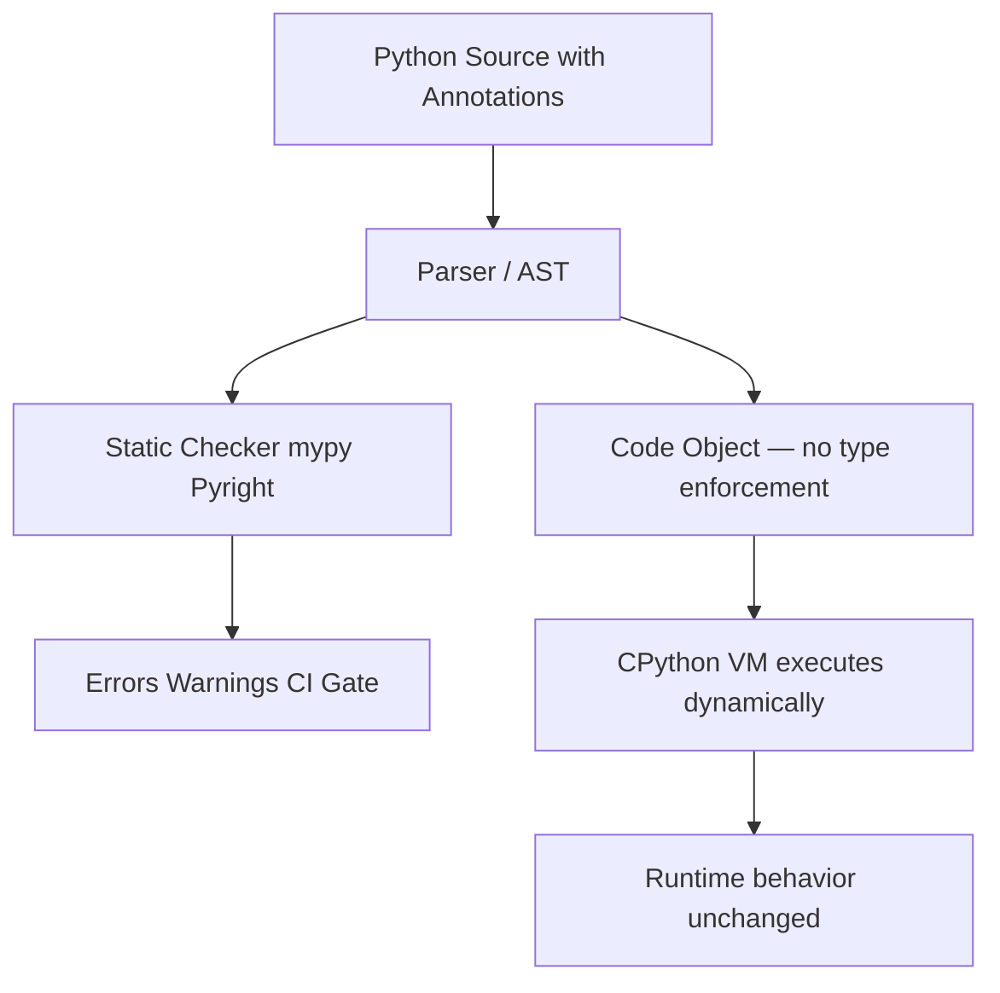
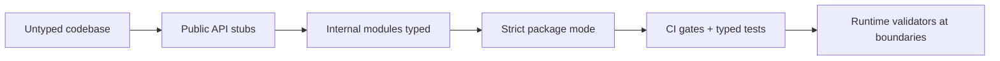
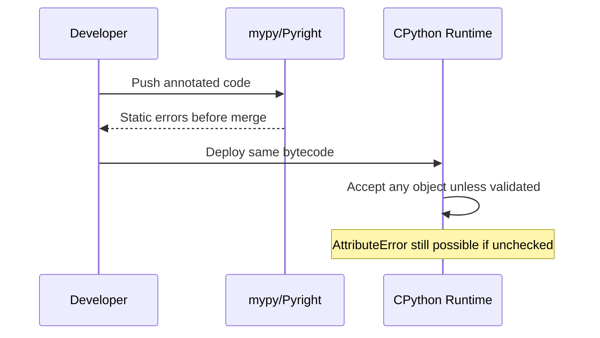

# Gradual Typing Philosophy and Trade-offs

## Overview

**Gradual typing** is a type-system design where annotations are optional and the runtime remains dynamically typed while static checkers (mypy, Pyright, pyrefly) prove properties before execution. Python adopted this model via PEP 484 (2014) and evolved it through PEP 563 (postponed evaluation), PEP 695 (type parameter syntax), and PEP 649 (deferred annotation evaluation in 3.14).

Unlike Java or Rust, Python annotations do **not** change runtime dispatch by default. A function annotated `def f(x: int) -> str` still accepts any object at call time unless you add explicit runtime validators or use a tool like `beartype`. The contract lives in a **parallel static layer** that CI enforces.

This note explains why gradual typing exists for Python, what guarantees it can and cannot provide on CPython 3.14+, and how to reason about trade-offs when shipping libraries versus application code.

## Learning Objectives

- Define gradual typing and contrast it with mandatory static typing and optional runtime typing
- Explain why Python kept runtime dynamism while adding static analysis
- Predict what mypy/Pyright can prove versus what remains a runtime concern
- Choose annotation strictness appropriate to library boundaries vs internal modules
- Articulate the cost/benefit of typing in brownfield codebases

## Prerequisites

- [[03-Python/01-Values-Types-and-Data-Model/Python Object Model and PyObject|Python Object Model and PyObject]]
- [[03-Python/02-Execution-Namespaces-and-Functions/Functions as Objects|Functions as Objects]]
- [[01-Computer-Science/08-Languages-and-Computation/Type Systems and Soundness|Type Systems and Soundness]] (conceptual)

## Difficulty

`intermediate`

## Estimated Time

- Reading: 2–3 hours
- Exercises: 3 hours
- Mini project: 4–6 hours

## History

Python 3.0 (2008) added function annotations syntactically but defined no semantics (PEP 3107). Frameworks like Django and SQLAlchemy used annotations informally. PEP 484 introduced `typing` and external checkers because:

1. Large codebases needed refactor safety without a rewrite
2. CPython could not afford Java-style erasure/recompilation at import time
3. The scientific and scripting communities required gradual adoption

PEP 484 explicitly chose **unsound** static checking with `Any` escape hatches. Subsequent PEPs refined generics, protocols, and deferred evaluation—never changing the core bargain: **opt-in static proofs, always-dynamic runtime**.

## Problem It Solves

Untyped Python fails silently at scale:

- Refactors rename attributes; tests miss branches; production raises `AttributeError`
- Public APIs accept ambiguous shapes (`dict` vs `TypedDict` vs dataclass)
- IDE autocomplete degrades in monoliths
- Cross-team contracts rely on docstrings that drift

Gradual typing adds a **machine-checked specification layer** without forcing a big-bang migration or abandoning duck typing where it helps.

## Internal Implementation

### Two layers: runtime vs static



At import, CPython stores annotations in `__annotations__` (or via `annotationlib` under PEP 649). The specializing interpreter (3.11+) does not specialize on annotations today. Types are **metadata for tools**, not VM opcodes.

### Soundness vs practicality

| System | Sound at runtime? | Migration model |
| --- | --- | --- |
| Rust / Haskell | Yes (with unsafe holes) | All-or-nothing modules |
| TypeScript | No (`any`, structural gaps) | Gradual file-by-file |
| Python + mypy | No (`Any`, casts, `# type: ignore`) | Gradual module-by-module |
| Python + `beartype` | Partial (sampled checks) | Opt-in decorators |

Python checkers aim for **local soundness under explicit assumptions**, not whole-program guarantees.

### Gradual adoption mechanics

```python
# strict boundary module — pyproject: strict = true for package
from __future__ import annotations

def parse_port(raw: str) -> int:
    value = int(raw)
    if not 1 <= value <= 65535:
        raise ValueError(f"invalid port: {value}")
    return value


# legacy module — still valid Python, checker may warn
def legacy_handler(data):  # type: ignore[no-untyped-def]
    return data["items"]
```

Teams typically tighten `pyproject.toml` / `mypy.ini` per package, not repo-wide day one.

## Mermaid Diagrams

### Adoption funnel



### Checker vs runtime responsibility



## Examples

### Minimal Example

```python
from __future__ import annotations

def greet(name: str) -> str:
    return f"Hello, {name}"

# Runtime accepts anything — no TypeError from annotations alone
print(greet(42))  # runs: "Hello, 42"
```

Run mypy:

```bash
mypy --strict example.py
# error: Argument 1 to "greet" has incompatible type "int"; expected "str"
```

### Production-Shaped Example

Library public API with boundary validation (typing + runtime at the edge):

```python
from __future__ import annotations

from dataclasses import dataclass
from typing import Protocol


class MetricsSink(Protocol):
    def increment(self, name: str, value: int = 1) -> None: ...


@dataclass(frozen=True, slots=True)
class RetryPolicy:
    max_attempts: int
    base_delay_ms: int

    def __post_init__(self) -> None:
        if self.max_attempts < 1:
            raise ValueError("max_attempts must be >= 1")
        if self.base_delay_ms < 0:
            raise ValueError("base_delay_ms must be >= 0")


def configure_client(
    *,
    policy: RetryPolicy,
    sink: MetricsSink | None = None,
) -> "HttpClient":
    """Typed contract for static checkers; validate invariants at construction."""
    ...
```

**Handoff boundary**: HTTP connection pooling, TLS, and service mesh retries belong in [[07-Backend/README|Backend]] architecture notes—this module owns the **Python type contract** and constructor invariants.

See [[03-Python/code/README|Python code labs]] for gradual typing migration exercises.

## Trade-offs

| Dimension | Upside | Downside | When it matters |
| --- | --- | --- | --- |
| Refactor safety | Catch renames, arity changes pre-deploy | False positives with dynamic patterns | Large monorepos |
| IDE experience | Jump-to-def, autocomplete on TypedDict | Slower analysis on huge graphs | Daily dev velocity |
| Learning curve | Teaches domain model explicitly | Syntax noise (`TypeVar`, overloads) | Junior onboarding |
| Runtime cost | Zero by default | Runtime validators add overhead | Hot paths |
| Library publishing | Consumers get `.pyi` contracts | Breaking type changes semver-gray | PyPI packages |

### When to Use

- Public library APIs and shared internal packages
- Code with frequent refactors and long maintenance horizons
- Teams already running CI with test + lint gates

### When Not to Use

- One-off scripts and notebooks where iteration speed dominates
- Heavily reflective/metaclass code without stabilization plan
- Prototypes you will discard within days—typing debt may not pay back

## Exercises

1. Write the same function with and without annotations; run mypy strict and document three errors the checker catches that pytest might miss.
2. Introduce `Any` at one call site; trace how error propagation stops in the checker graph.
3. Compare `# type: ignore` vs `cast()` vs refactoring—when is each appropriate?
4. Measure IDE latency with Pyright on a 50-module tree; note configuration knobs (`exclude`, `stubPath`).
5. Draft a team policy: which modules require strict mode in year one vs year two?

## Mini Project

**Gradual Typing Migration Plan**

Pick a 10-module internal package. Inventory public functions, add `py.typed` marker, generate baseline mypy report, and land a PR that types only the public surface while keeping internals `# type: ignore` with tickets filed. Document semver rules for annotation-only changes.

## Portfolio Project

Extend [[03-Python/projects/Python Runtime Toolkit/README|Python Runtime Toolkit]] with a `typing coverage` dashboard: percent of public symbols typed, strict-module count, mypy error burn-down chart.

## Interview Questions

1. What is gradual typing, and how does Python's model differ from Java's?
2. Do Python type annotations affect runtime performance or dispatch in CPython 3.14?
3. Why is mypy considered unsound? Name three escape hatches.
4. When would you add runtime type checking on top of static typing?
5. How do you version breaking changes that only affect type checkers?

### Stretch / Staff-Level

1. Argue for or against making Python "strict by default" in 3.x—what ecosystem breakage would occur?
2. Design a migration strategy for a 500k LOC Django monolith without stopping feature work.

## Common Mistakes

- Assuming annotations enforce types at runtime
- Typing everything with `Any` to silence the checker (defeats the purpose)
- Applying strict mode repo-wide on day one and stalling the team
- Treating TypedDict like a runtime validator—it is static shape documentation
- Ignoring `py.typed` and shipping untyped stubs for libraries

## Best Practices

- Use `from __future__ import annotations` (default mental model for 3.14+ code)
- Type **boundaries first**: public APIs, serializers, plugin registries
- Pin checker versions in CI; treat type errors as merge blockers for typed packages
- Pair static types with runtime validation at IO edges (HTTP, env vars, subprocess JSON)
- Document type semver policy in CHANGELOG for library consumers

## Summary

Gradual typing lets Python keep its dynamic runtime while gaining static refactor safety through optional annotations and external checkers. CPython 3.14+ stores annotations for introspection but does not enforce them in the VM—proof obligations live in CI. The engineering trade-off is upfront annotation cost versus long-term maintainability and clearer API contracts. Use typing heavily at library boundaries; stay pragmatic in scripts; add runtime checks where static proofs end and production failures begin.

## Further Reading

- PEP 484 — Type Hints
- PEP 483 — The Theory of Type Hints
- [[03-Python/06-Typing/Runtime Checking vs Static Checking|Runtime Checking vs Static Checking]]
- [[03-Python/06-Typing/Python Typing Tools and CI Gates|Python Typing Tools and CI Gates]]
- [[00-References/Python/README|Python References]]

## Related Notes

- [[03-Python/06-Typing/Annotations Deferred Evaluation and annotationlib|Annotations Deferred Evaluation and annotationlib]]
- [[03-Python/06-Typing/Typed Library API Design|Typed Library API Design]]
- [[03-Python/03-Classes-Descriptors-and-Metaprogramming/ABCs Protocols and Runtime Structural Subtyping|ABCs Protocols and Runtime Structural Subtyping]]
- [[03-Python/README|Python Track]]

## Progress Checklist

- [ ] Explained from first principles
- [ ] Drew at least one Mermaid diagram
- [ ] Implemented a minimal version
- [ ] Documented trade-offs and non-goals
- [ ] Completed exercises
- [ ] Practiced interview questions aloud
- [ ] Linked prerequisites and dependents
