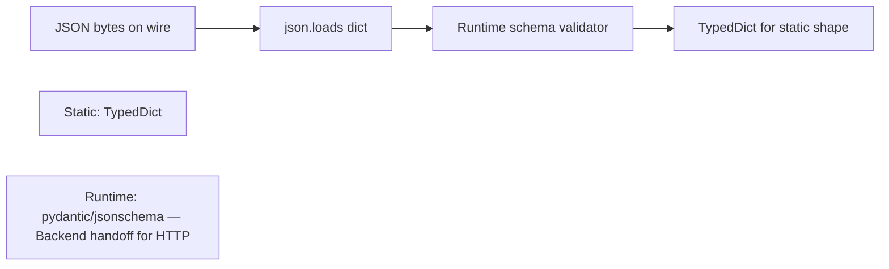

# Protocols TypedDict Literal and Narrowing

## Overview

Python typing supports **structural subtyping** via `Protocol`, **partial dict schemas** via `TypedDict`, **value-level types** via `Literal`, and **control-flow refinement** via type narrowing. Together they model duck-typed Python code without forcing inheritance hierarchies—critical for file-like objects, iterable pipelines, JSON payloads, and enum-like strings.

On CPython 3.14+, these constructs remain static; `@runtime_checkable` Protocols offer limited runtime `isinstance` checks but cannot replace full validation at IO boundaries.

## Learning Objectives

- Define `Protocol` classes and understand `@runtime_checkable` limits
- Model JSON/API payloads with `TypedDict`, `Required`, `NotRequired`, and `ReadOnly` (3.13+)
- Use `Literal` and `LiteralString` for constrained strings
- Apply narrowing with `isinstance`, `assert`, pattern matching, and TypeGuard
- Choose Protocol vs ABC vs concrete class for extension points

## Prerequisites

- [[03-Python/06-Typing/Generics TypeVars ParamSpecs and TypeVarTuples|Generics TypeVars ParamSpecs and TypeVarTuples]]
- [[03-Python/03-Classes-Descriptors-and-Metaprogramming/ABCs Protocols and Runtime Structural Subtyping|ABCs Protocols and Runtime Structural Subtyping]]
- [[03-Python/01-Values-Types-and-Data-Model/Sequences Mappings and Sets as Protocols|Sequences Mappings and Sets as Protocols]]

## Difficulty

`advanced`

## Estimated Time

- Reading: 3 hours
- Exercises: 4 hours
- Mini project: 6 hours

## History

PEP 544 (Protocols, 2017) formalized structural typing for checkers. PEP 589 (TypedDict) addressed JSON-shaped dicts without dataclass overhead. PEP 586 (Literal) captured enum-like constants. PEP 742 (TypeIs, 3.13+) refined narrowing beyond PEP 647 TypeGuard.

## Problem It Solves

Nominal inheritance mis-models Python:

```python
class MyFile:
    def read(self, n: int = -1) -> bytes: ...

# Should be compatible with BinaryIO without inheriting IOBase
```

Untyped dicts for API responses lose field names and optional keys. Stringly-typed modes (`"r"` vs `"rb"`) need `Literal` so checkers catch typos.

## Internal Implementation

### Protocol checking model

```mermaid
flowchart TD
    Obj[Object with methods]
    Proto[Protocol definition]
    Checker[Static checker]
    Obj --> Checker
    Proto --> Checker
    Checker --> Match{All required members present?}
    Match -->|Yes| OK[Structurally compatible]
    Match -->|No| Err[Type error]
    RT[@runtime_checkable isinstance]
    RT --> Shallow[Shallow attribute presence only]
```

Runtime `@runtime_checkable` checks attribute existence, not signatures or behavior.

### TypedDict vs dataclass

| Feature | TypedDict | dataclass |
| --- | --- | --- |
| Runtime type | `dict` | custom class |
| Extra keys | allowed unless `closed` (3.13+) | unexpected fields error |
| Mutation typing | per-key ReadOnly/NotRequired | frozen option |
| JSON round-trip | natural | needs asdict hooks |

### Narrowing control flow

Checkers track **type states** across branches:

```python
def process(value: str | int) -> str:
    if isinstance(value, int):
        return str(value * 2)  # value narrowed to int
    return value.upper()       # value narrowed to str
```

`TypeIs[T]` (3.13+) promises narrowing for callers; `TypeGuard[T]` guarantees for true branch only.

## Mermaid Diagrams

### TypedDict validation layers



### Narrowing branch graph

```mermaid
flowchart TD
    Start[str | None]
    Start --> Check{is None?}
    Check -->|yes| NoneBranch[None]
    Check -->|no| StrBranch[str]
    StrBranch --> Use[checker knows str]
```

## Examples

### Minimal Example

```python
from typing import Protocol, runtime_checkable


@runtime_checkable
class SupportsClose(Protocol):
    def close(self) -> None: ...


def cleanup(resource: SupportsClose) -> None:
    resource.close()


class TempHandle:
    def close(self) -> None:
        print("closed")

cleanup(TempHandle())  # OK structurally
```

### Production-Shaped Example

API event envelope with TypedDict + narrowing:

```python
from __future__ import annotations

from typing import Literal, NotRequired, TypedDict, TypeIs


class BaseEvent(TypedDict):
    event_id: str
    type: str


class UserCreated(TypedDict):
    event_id: str
    type: Literal["user.created"]
    user_id: int
    email: str


class UserDeleted(TypedDict):
    event_id: str
    type: Literal["user.deleted"]
    user_id: int


Event = UserCreated | UserDeleted


def is_user_created(event: BaseEvent) -> TypeIs[UserCreated]:
    return event.get("type") == "user.created"


def handle(event: Event) -> None:
    if is_user_created(event):
        send_welcome(event["email"])  # narrowed
    else:
        purge_caches(event["user_id"])


def send_welcome(email: str) -> None: ...
def purge_caches(user_id: int) -> None: ...
```

**Scope**: Webhook delivery, auth, and idempotency are [[07-Backend/README|Backend]] topics—this note owns **static event shapes and narrowing**.

See [[03-Python/code/README|Python code labs]] for Protocol and TypedDict drills.

## Trade-offs

| Dimension | Upside | Downside | When it matters |
| --- | --- | --- | --- |
| Protocol | Matches duck typing | No runtime enforcement by default | File-like APIs |
| TypedDict | Lightweight JSON typing | Easy to confuse with dict invariants | REST clients |
| Literal | Catches typos statically | Combinatorial explosion if overused | Mode flags |
| TypeIs/TypeGuard | Precise narrowing | Easy to lie—unsound if wrong | Parsing helpers |
| closed TypedDict | Rejects extra keys (3.13+) | Breaks forward-compatible JSON | Strict APIs |

### When to Use

- Extension points consumed by third-party code (Protocols)
- External JSON with known schema (TypedDict + runtime validator)
- Functions accepting finite string/ int unions (Literal)
- Parsing pipelines with sequential refinement (narrowing)

### When Not to Use

- Do not rely on `@runtime_checkable` for security decisions
- Prefer dataclasses or pydantic models when rich validation/order matters
- Avoid giant TypedDict unions when a discriminated class hierarchy is clearer

## Exercises

1. Define `Readable` Protocol with `read(n: int) -> bytes`; implement adapter for `bytes` and a file object.
2. Model a GitHub webhook payload with nested TypedDicts; add `closed=True` variant on 3.13+.
3. Write a `TypeIs` helper distinguishing valid UUID strings from arbitrary str.
4. Demonstrate unsound `@runtime_checkable` Protocol where wrong object passes `isinstance`.
5. Refactor `dict[str, Any]` API client to TypedDict + Literal method names.

## Mini Project

**Structural Adapter Layer**

Build adapters that wrap `requests.Response`, `httpx.Response`, and a fake test double behind a `HttpResponse` Protocol; prove interchangeability with mypy strict.

## Portfolio Project

Add TypedDict schema definitions to [[03-Python/projects/Python Runtime Toolkit/README|Python Runtime Toolkit]] config loader with narrowing-based dispatch.

## Interview Questions

1. Protocol vs ABC—when prefer each in Python?
2. Does TypedDict create a new runtime type?
3. What guarantees does `@runtime_checkable` provide?
4. Difference between TypeGuard and TypeIs?
5. How do you model optional JSON keys before `NotRequired`?

### Stretch / Staff-Level

1. Design a plugin Protocol for sync and async implementations without duplicating types (ParamSpec + overload patterns).
2. Explain why TypedDict is incompatible with covariance in function parameters.

## Common Mistakes

- Using TypedDict instances without runtime validation on network input
- Treating Literal types as runtime enums—they are not
- Over-broad Protocols that accept objects with wrong method semantics
- Forgetting `total=False` / `NotRequired` for optional keys

## Best Practices

- Pair TypedDict with explicit runtime validation at boundaries
- Keep Protocols focused—split read/write interfaces
- Use discriminated unions (`Literal` tag + TypedDict variants)
- Prefer `TypeIs` for public narrowing helpers when you can guarantee correctness

## Summary

Protocols, TypedDict, Literal, and narrowing let Python type checkers express duck typing, JSON shapes, constant sets, and control-flow refinements without changing CPython runtime semantics. They are static tools—production safety still requires runtime validation at trust boundaries. Use structural types for extension points; use narrowing to teach checkers what your runtime tests prove.

## Further Reading

- PEP 544 — Protocols
- PEP 589 — TypedDict
- PEP 742 — TypeIs
- [[03-Python/06-Typing/Runtime Checking vs Static Checking|Runtime Checking vs Static Checking]]

## Related Notes

- [[03-Python/06-Typing/Typed Library API Design|Typed Library API Design]]
- [[03-Python/04-Iteration-Exceptions-and-Context/Exception Hierarchy ExceptionGroup and except star|Exception Hierarchy ExceptionGroup and except star]]
- [[03-Python/README|Python Track]]

## Progress Checklist

- [ ] Explained from first principles
- [ ] Drew at least one Mermaid diagram
- [ ] Implemented a minimal version
- [ ] Documented trade-offs and non-goals
- [ ] Completed exercises
- [ ] Practiced interview questions aloud
- [ ] Linked prerequisites and dependents
