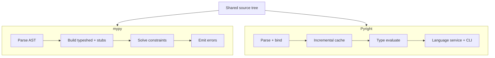
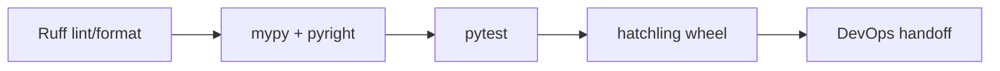
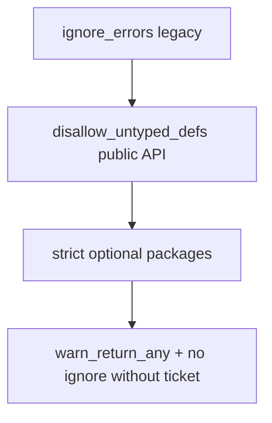
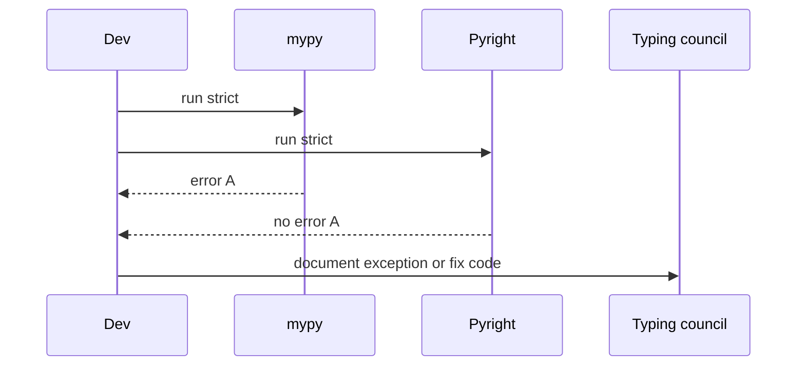

# Python Typing Tools and CI Gates

## Overview

Python typing is enforced by **external tools**, not the interpreter. Production teams standardize on **mypy**, **Pyright** (or **basedpyright**), emerging **pyrefly**, and supporting linters (**Ruff**'s flake8-type-checking rules) integrated into CI. A **typing gate** blocks merges on type errors, pins tool versions, publishes stub packages (`types-*`), and tracks strictness per package via `pyproject.toml`.

This note covers tool internals at a practical level, monorepo configuration patterns, and how typing CI differs from platform DevOps pipelines in [[16-DevOps/README|DevOps]]—here we own **checker configuration and developer workflow**, not Kubernetes deployment.

## Learning Objectives

- Configure mypy and Pyright in `pyproject.toml` for packages and monorepos
- Choose strictness flags and incremental migration paths
- Integrate typing into pre-commit and GitHub Actions / GitLab CI
- Manage third-party stubs and `py.typed` markers
- Interpret disagreements between checkers and resolve pragmatically

## Prerequisites

- [[03-Python/06-Typing/Gradual Typing Philosophy and Trade-offs|Gradual Typing Philosophy and Trade-offs]]
- [[03-Python/06-Typing/Runtime Checking vs Static Checking|Runtime Checking vs Static Checking]]
- [[03-Python/08-Modules-Packaging-and-Environments/pyproject Build Backends and Wheels|pyproject Build Backends and Wheels]]

## Difficulty

`intermediate`

## Estimated Time

- Reading: 2–3 hours
- Exercises: 3 hours
- Mini project: 5 hours

## History

mypy (2012) pioneered Python static typing. Pyright (Microsoft, 2019) brought fast incremental analysis powering Pylance. Ruff absorbed flake8 typing plugins. pyrefly (Meta, 2025+) targets very large repos with Rust performance. PEP 561 standardized distributing type information. CI adoption followed pytest and ruff as the third pillar of Python quality gates.

## Problem It Solves

Without CI typing gates:

- Local IDE settings diverge; "works on my machine" for types
- Library upgrades silently widen `Any` through missing stubs
- `# type: ignore` accumulates without audit trail
- Refactors merge with latent `AttributeError` paths

Centralized configuration makes types **team property**, not individual IDE preference.

## Internal Implementation

### Tool architecture comparison



Both consume similar type semantics but differ on edge cases, plugin ecosystems, and performance profiles.

### Typical CI pipeline (Python-owned stages)



Publish/signing/supply chain stages belong to [[16-DevOps/README|DevOps]] and [[03-Python/08-Modules-Packaging-and-Environments/Distribution Signing and Supply-Chain Integrity|Distribution Signing]]—typing CI stops at **artifact correctness before release**.

### Configuration layers

| Layer | File | Purpose |
| --- | --- | --- |
| Project | `pyproject.toml [tool.mypy]` | Package strictness |
| Workspace | `mypy.ini` / root overrides | Monorepo shared defaults |
| Stubs | `types-requests` etc. | Third-party annotations |
| Marker | `package/py.typed` | PEP 561 signal |
| Excludes | `exclude`, `ignore_missing_imports` | Legacy islands |

## Mermaid Diagrams

### Strictness rollout



### Dual-checker disagreement workflow



## Examples

### Minimal Example

`pyproject.toml` excerpt:

```toml
[tool.mypy]
python_version = "3.14"
strict = true
warn_unused_ignores = true
disallow_any_generics = true
plugins = ["pydantic.mypy"]

[[tool.mypy.overrides]]
module = "legacy.*"
ignore_errors = true

[tool.pyright]
include = ["src"]
pythonVersion = "3.14"
typeCheckingMode = "strict"
reportUnusedImport = true
```

Local commands:

```bash
mypy src tests
pyright src tests
```

### Production-Shaped Example

GitHub Actions job matrix pinning versions:

```yaml
name: typing
on: [pull_request]
jobs:
  types:
    runs-on: ubuntu-latest
    steps:
      - uses: actions/checkout@v4
      - uses: actions/setup-python@v5
        with:
          python-version: "3.14"
      - run: pip install -e ".[dev]"
      - run: mypy --version && mypy src
      - run: pyright --version && pyright
      - run: python -m compileall -q src  # sanity, not a type checker
```

Add **ratchet**: fail if `# type: ignore` count increases without label approval.

See [[03-Python/code/README|Python code labs]] for CI typing setup templates.

## Trade-offs

| Dimension | Upside | Downside | When it matters |
| --- | --- | --- | --- |
| Dual checkers | Catch more bugs | Duplicate CI time | Critical libraries |
| strict=true | Strong proofs | Migration pain | Greenfield packages |
| Per-module overrides | Pragmatic brownfield | Complexity | Monorepos |
| Pinned versions | Reproducible CI | Upgrade projects | All teams |
| IDE Pyright | Fast feedback | May differ from mypy | Daily dev |

### When to Use

- Any package published to PyPI with `py.typed`
- Services with >10 contributors or long lifespan
- Libraries consumed by typed application teams

### When Not to Use

- Throwaway scripts outside repo quality gates
- Running three checkers with no policy for conflicts—pick primary + optional secondary

## Exercises

1. Configure mypy strict on a sample package; fix errors categorically (generics, Optional, untyped defs).
2. Introduce intentional pyright/mypy disagreement; document resolution.
3. Add pre-commit hook running mypy on changed files only (`pre-commit-mirrors-mirrors-mypy`).
4. Audit `types-*` stubs for a dependency; note missing symbols.
5. Design `# type: ignore` policy requiring issue links and expiry dates.

## Mini Project

**Typing Ratchet Bot**

Script comparing main vs PR `# type: ignore` counts and public untyped symbol counts; fail CI on regression.

## Portfolio Project

Document typing CI architecture in [[03-Python/projects/Python Runtime Toolkit/README|Python Runtime Toolkit]] contributor guide.

## Interview Questions

1. Difference between mypy and Pyright architecturally?
2. What is PEP 561 and `py.typed`?
3. How do you migrate a large repo to strict typing without stopping features?
4. When is `ignore_missing_imports` acceptable?
5. Should CI run both mypy and Pyright?

### Stretch / Staff-Level

1. Design monorepo typing policy for 200 packages with shared stubs vendoring.
2. Evaluate pyrefly vs Pyright for a 5M LOC codebase—decision matrix.

## Common Mistakes

- Relying on IDE-only checks without CI enforcement
- Unpinned mypy version causing surprise main breaks
- Global `ignore_errors` that never sunsets
- Shipping library without `py.typed` while documenting typed API

## Best Practices

- Pin checker versions in `[project.optional-dependencies] dev`
- One **primary** checker; secondary optional for libraries
- Track typing coverage metrics (public symbols typed %)
- Align Ruff TC rules with checker config
- Document overrides in ADR per legacy module

## Summary

Python typing quality is a tooling and process problem: mypy, Pyright, and allies analyze code in CI because CPython will not. Configure strictness per package, pin versions, distribute `py.typed`, and treat type errors as merge blockers for maintained code. Platform deployment pipelines live elsewhere—this gate ensures the **Python artifact** is internally consistent before DevOps picks it up.

## Further Reading

- PEP 561 — Distributing and Packaging Type Information
- mypy and Pyright configuration references
- [[03-Python/08-Modules-Packaging-and-Environments/Dependency Locking and Reproducibility|Dependency Locking and Reproducibility]]

## Related Notes

- [[03-Python/06-Typing/Typed Library API Design|Typed Library API Design]]
- [[03-Python/09-Production-Python/Testing with unittest pytest and Hypothesis|Testing with unittest pytest and Hypothesis]]
- [[03-Python/README|Python Track]]

## Progress Checklist

- [ ] Explained from first principles
- [ ] Drew at least one Mermaid diagram
- [ ] Implemented a minimal version
- [ ] Documented trade-offs and non-goals
- [ ] Completed exercises
- [ ] Practiced interview questions aloud
- [ ] Linked prerequisites and dependents
