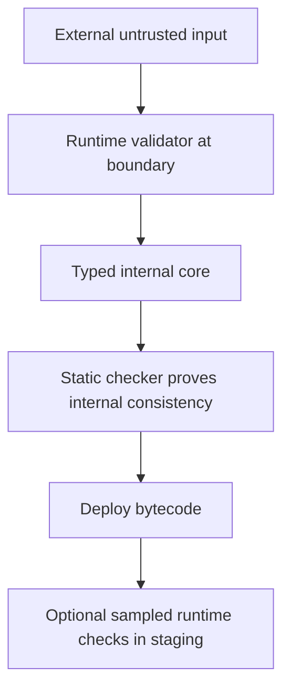
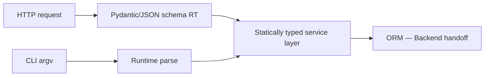
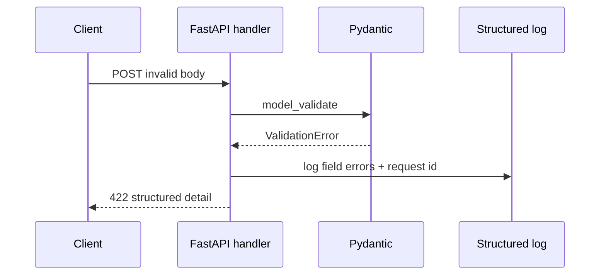

# Runtime Checking vs Static Checking

## Overview

**Static checking** (mypy, Pyright) analyzes source before execution and rejects ill-typed programs at CI time. **Runtime checking** validates values as the program runs—via explicit `isinstance`, validation libraries (Pydantic, attrs validators), or decorator-driven checkers (`beartype`, `typeguard`).

CPython 3.14+ does not enforce function annotations automatically. Production systems combine both layers: static proofs for maintainability, runtime guards at **trust boundaries** (HTTP, CLI args, plugin loading, pickle substitutes). Confusing the two layers causes false confidence or duplicated validation logic.

## Learning Objectives

- Map guarantees of static vs runtime layers on CPython
- Place runtime validators at IO and plugin boundaries without hot-path overhead
- Compare `beartype`, `typeguard`, and Pydantic validation models
- Explain why static unsoundness still allows runtime failures
- Design failure modes: fail-fast vs sanitize vs metric-and-continue

## Prerequisites

- [[03-Python/06-Typing/Gradual Typing Philosophy and Trade-offs|Gradual Typing Philosophy and Trade-offs]]
- [[03-Python/06-Typing/Protocols TypedDict Literal and Narrowing|Protocols TypedDict Literal and Narrowing]]
- [[03-Python/02-Execution-Namespaces-and-Functions/Exceptions and Control Flow|Exceptions and Control Flow]]

## Difficulty

`intermediate`

## Estimated Time

- Reading: 2–3 hours
- Exercises: 3 hours
- Mini project: 5 hours

## History

Early Python relied on exceptions at misuse sites. PEP 484 separated static hints from runtime. Django forms and REST frameworks validated at runtime first. `beartype` (2019+) popularized low-overhead randomized runtime checking aligned with PEP 484 types. Pydantic v2 integrated Rust-core validation widely in FastAPI ecosystems—validation belongs to application layer, not VM.

## Problem It Solves

Static-only code still fails when:

- Data arrives from network, env vars, or legacy callers bypassing typed paths
- Dynamic `getattr`, `eval`, or plugin imports defeat analysis
- Checkers are skipped in CI or `# type: ignore` hides bugs
- Serialization round-trips produce wrong shapes (`None` vs missing key)

Runtime checking converts **type errors into controlled exceptions** at boundaries with actionable messages.

## Internal Implementation

### Two-layer defense model



Static layer never sees dynamic JSON; runtime layer must not validate every inner loop iteration.

### Cost profile

| Approach | When it runs | Typical cost | Coverage |
| --- | --- | --- | --- |
| mypy/Pyright | CI / IDE | Zero runtime | All typed paths |
| `isinstance` guards | Hot path if misplaced | Low per call | Explicit branches |
| `@beartype` | Each call (configurable) | Low–medium O(1) sample | Function entry |
| Pydantic model | Parse time | Medium–high | Nested schemas |
| `typing.cast` | Never validates | Zero | None—trust developer |

### beartype O(1) sampling (conceptual)

`beartype` uses generated checks and periodic sampling in some modes to avoid validating every argument on every call—still not free, but suitable for many service handlers.

## Mermaid Diagrams

### Trust boundary placement



### Failure handling sequence



## Examples

### Minimal Example

Static catch vs runtime catch:

```python
def add(a: int, b: int) -> int:
    return a + b

add("1", "2")  # static error; runtime returns "12" (str concatenation) — actually "1"+"2" = "12"
```

With runtime guard:

```python
from beartype import beartype

@beartype
def add(a: int, b: int) -> int:
    return a + b

add("1", "2")  # BeartypeCallHintParamViolation at runtime
```

### Production-Shaped Example

Boundary validation + typed core:

```python
from __future__ import annotations

from dataclasses import dataclass
from typing import Any

# Runtime layer — trust boundary
def load_config(raw: dict[str, Any]) -> "AppConfig":
    try:
        port = int(raw["port"])
        host = str(raw["host"])
    except (KeyError, TypeError, ValueError) as exc:
        raise ConfigError("invalid config document") from exc
    if not 1 <= port <= 65535:
        raise ConfigError("port out of range")
    return AppConfig(host=host, port=port)


@dataclass(frozen=True, slots=True)
class AppConfig:
    host: str
    port: int


class ConfigError(Exception):
    pass


def run_server(cfg: AppConfig) -> None:
    """Statically typed; assumes cfg already valid."""
    ...
```

**Handoff**: secret management, HSM-backed config, and mTLS are [[18-Security/README|Security]] platform topics—this note covers **Python validation placement**.

See [[03-Python/code/README|Python code labs]] for static/runtime comparison exercises.

## Trade-offs

| Dimension | Upside | Downside | When it matters |
| --- | --- | --- | --- |
| Static only | Zero runtime cost | Misses external data | Internal refactors |
| Runtime everywhere | Strong guarantees | Latency, duplication | Misguided hot loops |
| Pydantic | Rich errors, coercion policy | Dependency weight | HTTP services |
| beartype | PEP 484 aligned, fast | Not a schema language | Libraries |
| cast/ignore | Unblocks migration | Silent lies | Tech debt |

### When to Use

- Runtime validation on every external input (HTTP, webhooks, env, files)
- Static typing on internal modules with strict CI
- Sampled runtime checks in staging for `# type: ignore` zones

### When Not to Use

- Do not `@beartype` inner numeric loops processing millions of rows
- Do not assume mypy success implies production data is valid
- Avoid duplicate contradictory validation (Pydantic + manual checks diverging)

## Exercises

1. Build the same endpoint with and without Pydantic; compare error payloads and latency.
2. Write a function using `cast()` that passes mypy but fails in production—demonstrate the hazard.
3. Place `isinstance` narrowing in a pipeline; measure overhead with `timeit`.
4. Configure beartype in `bear_conf` for import-time checking in tests only.
5. Draft a team diagram showing trust boundaries for your current project.

## Mini Project

**Boundary Validation Framework**

Implement a tiny `@validated` decorator using `inspect.signature` + `isinstance` checks (no third-party deps) and benchmark vs beartype on 1M calls.

## Portfolio Project

Wire runtime validation into [[03-Python/projects/Python Runtime Toolkit/README|Python Runtime Toolkit]] plugin loader with metrics for validation failures.

## Interview Questions

1. Does CPython enforce type hints at call time in 3.14?
2. Where should runtime type checking live in a layered architecture?
3. Compare Pydantic validation to `@beartype`—overlap and differences?
4. Why is `typing.cast` dangerous in production code paths?
5. How do static checkers handle `Any` from JSON parsing?

### Stretch / Staff-Level

1. Design a policy for when coercion (str `"42"` → int) is acceptable at boundaries.
2. Argue performance impact of universal runtime checking in a 50k RPS API.

## Common Mistakes

- Validating twice with inconsistent rules (schema drift)
- Using `# type: ignore` on boundary functions instead of fixing types
- Treating `isinstance(x, Protocol)` as behavioral proof
- Logging raw invalid payloads containing secrets (see [[18-Security/README|Security]])

## Best Practices

- Validate once at boundary; pass immutable typed objects inward
- Keep static and runtime schemas generated from one source when possible (OpenAPI → types)
- Fail with structured errors suitable for clients and operators
- Monitor validation failure rates as product signals

## Summary

Static checkers prove properties about code that never runs ill-typed paths internally; runtime checkers prove properties about values that actually arrive at runtime. CPython executes neither layer by default—you must deploy both deliberately. Type annotations are the shared language; mypy/Pyright enforce them pre-deploy; validators enforce them at trust boundaries. Do not duplicate work in the hot path.

## Further Reading

- [[03-Python/06-Typing/Python Typing Tools and CI Gates|Python Typing Tools and CI Gates]]
- [[03-Python/09-Production-Python/Error Design Exception Safety and Failure Modes|Error Design Exception Safety and Failure Modes]]
- beartype and typeguard documentation

## Related Notes

- [[03-Python/06-Typing/Typed Library API Design|Typed Library API Design]]
- [[03-Python/09-Production-Python/Secure Python Practices|Secure Python Practices]]
- [[03-Python/README|Python Track]]

## Progress Checklist

- [ ] Explained from first principles
- [ ] Drew at least one Mermaid diagram
- [ ] Implemented a minimal version
- [ ] Documented trade-offs and non-goals
- [ ] Completed exercises
- [ ] Practiced interview questions aloud
- [ ] Linked prerequisites and dependents
