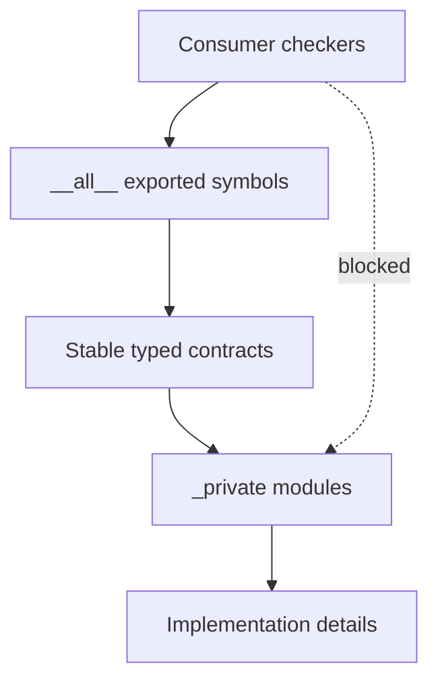
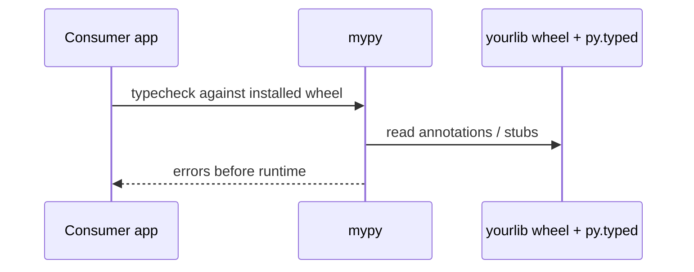
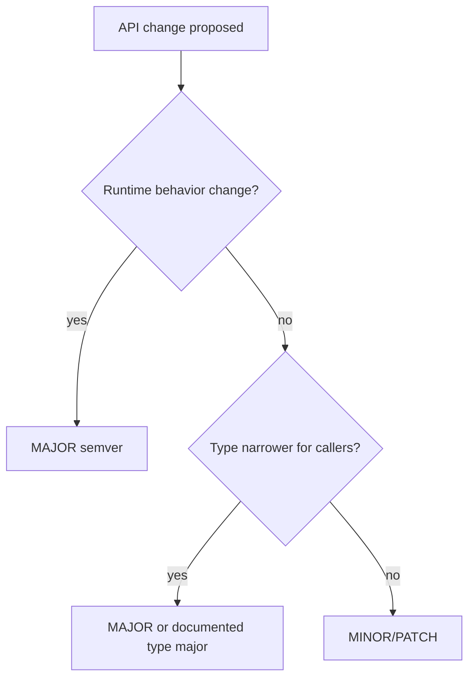

# Typed Library API Design

## Overview

Publishing a **typed Python library** means consumers' checkers can prove correct usage of your public API without reading source. This requires intentional surface design: stable type aliases, explicit `__all__`, Protocol-based extension points, overloads for ergonomic variants, semver policy for type-breaking changes, and PEP 561 **`py.typed`** marker in wheels.

Typed API design sits at the intersection of language typing and packaging—implementation lives in [[03-Python/08-Modules-Packaging-and-Environments|Modules and Packaging]]; HTTP/REST product APIs belong in [[07-Backend/README|Backend]].

## Learning Objectives

- Design public generic APIs that age well across Python 3.10–3.14+
- Ship inline types vs `.pyi` stubs vs `typing_extensions` backports
- Use overloads, Literal, and TypedDict for ergonomic client code
- Document type semver and deprecation of typed symbols
- Avoid leaking private implementation types through return inference

## Prerequisites

- [[03-Python/06-Typing/Protocols TypedDict Literal and Narrowing|Protocols TypedDict Literal and Narrowing]]
- [[03-Python/06-Typing/Python Typing Tools and CI Gates|Python Typing Tools and CI Gates]]
- [[03-Python/08-Modules-Packaging-and-Environments/pyproject Build Backends and Wheels|pyproject Build Backends and Wheels]]
- [[03-Python/03-Classes-Descriptors-and-Metaprogramming/Dataclasses and Data-Oriented Classes|Dataclasses and Data-Oriented Classes]]

## Difficulty

`advanced`

## Estimated Time

- Reading: 3 hours
- Exercises: 4 hours
- Mini project: 8 hours

## History

Early PyPI packages were untyped; consumers used `Any`. typeshed covered stdlib and popular libs. PEP 561 (2017) let packages ship annotations. Major libraries (httpx, attrs, pydantic) raised expectations that **typed public APIs** are table stakes for adoption. PEP 695 and 649 shifted best practices for generic syntax and annotation evaluation in 3.12–3.14.

## Problem It Solves

Poorly typed libraries export:

- Functions returning `Any` from untyped helpers
- Concrete internal classes instead of Protocols at extension points
- Breaking changes invisible to semver (narrowing parameter types)
- Missing `py.typed`, forcing downstream `# type: ignore`

Consumers cannot refactor safely; library reputation suffers.

## Internal Implementation

### Public surface layering



Mark private modules with leading underscore and exclude from type coverage reports for consumers.

### Distribution modes (PEP 561)

| Mode | Mechanism | Use when |
| --- | --- | --- |
| Inline | `.py` with annotations + `py.typed` | Default for pure Python |
| Stubs | `package-stubs` or `.pyi` | C extensions, hide internals |
| Partial | `py.typed` + incomplete | Transitional—document gaps |
| Proprietary | No marker | Internal only |

### Overloads for ergonomic APIs

```python
from typing import overload


@overload
def connect(url: str) -> SyncClient: ...
@overload
def connect(url: str, *, async_: Literal[True]) -> AsyncClient: ...
def connect(url: str, *, async_: bool = False) -> SyncClient | AsyncClient:
    ...
```

Checkers pick overload arms; runtime executes single implementation.

## Mermaid Diagrams

### Consumer checker flow



### Type semver decision



## Examples

### Minimal Example

Package layout:

```
mylib/
  py.typed          # empty marker file
  __init__.py       # exports only
  _client.py        # private
  types.py          # public aliases
```

```python
# mylib/__init__.py
from mylib.types import JsonValue, Result
from mylib._client import Client

__all__ = ["Client", "JsonValue", "Result"]

# mylib/types.py
from typing import TypeAlias

JsonValue: TypeAlias = str | int | float | bool | None | list["JsonValue"] | dict[str, "JsonValue"]
Result[T]: TypeAlias = T  # simplify — real lib uses generic alias patterns
```

### Production-Shaped Example

Extension point via Protocol + typed factory:

```python
from __future__ import annotations

from collections.abc import Iterator
from typing import Protocol, TypeAlias

MetricTags: TypeAlias = dict[str, str]


class Exporter(Protocol):
    def export(self, name: str, value: float, tags: MetricTags) -> None: ...


class NoopExporter:
    def export(self, name: str, value: float, tags: MetricTags) -> None:
        return None


def iter_batches[T](items: list[T], size: int) -> Iterator[list[T]]:
    if size < 1:
        raise ValueError("size must be >= 1")
    for i in range(0, len(items), size):
        yield items[i : i + size]
```

Ship `typing_extensions` only when supporting `<3.11` syntax features—on 3.14+, prefer stdlib.

See [[03-Python/code/README|Python code labs]] for typed package scaffolding.

## Trade-offs

| Dimension | Upside | Downside | When it matters |
| --- | --- | --- | --- |
| Protocol exports | Flexible for users | Harder to document behavior | Plugin libs |
| Concrete classes | Clear runtime types | Locks implementation | Simple SDKs |
| `.pyi` stubs | Hide C API | Dual maintenance | C extensions |
| Generics on public API | Precise usage | Breaking when tightened | Collections libs |
| `TypeAlias` | Stable names | Indirection | Large APIs |

### When to Use

- Any PyPI library expecting typed consumers
- Internal platforms imported by multiple services
- Framework plugin registries

### When Not to Use

- Private scripts—typing tax may exceed benefit
- Ultra-dynamic DSLs without stabilization plan

## Exercises

1. Audit a popular library's `py.typed` and stub coverage; list three consumer pain points.
2. Refactor a function returning internal `_Impl` class to Protocol + factory.
3. Write overloads for `parse(data: str) -> Model` and `parse(data: bytes) -> Model`.
4. Draft CHANGELOG policy for type-only breaking changes.
5. Create minimal wheel with hatchling including `py.typed`; inspect with `unzip -l`.

## Mini Project

**Typed Mini-SDK**

Publish (TestPyPI) a package `boundedqueue` with generic `Queue[T]`, Protocol `Serializer[T]`, strict mypy, and consumer example repo proving DX.

## Portfolio Project

Deliver [[03-Python/projects/Typed Plugin Registry/README|Typed Plugin Registry]] as typed reference architecture with documented type semver.

## Interview Questions

1. What does the `py.typed` marker signify?
2. When ship `.pyi` stubs instead of inline annotations?
3. How can a PATCH release break typed callers without runtime breakage?
4. Protocol vs ABC for public extension points?
5. How do you re-export types without creating import cycles?

### Stretch / Staff-Level

1. Design typing strategy for a C-extension heavy library with stable ABI and typed Python surface.
2. Plan deprecation of a public TypedDict field without breaking closed schemas.

## Common Mistakes

- Exporting `_InternalClient` in `__all__`
- Returning `dict[str, Any]` from public parsers
- Tightening return types in MINOR releases without migration notes
- Forgetting to include `py.typed` in wheel via hatchling `force-include`

## Best Practices

- Curate `__all__`; treat it as semver surface
- Use `TypeAlias` for public names users should import
- Run `twine check` and consumer mypy against released wheel in CI
- Document extension Protocols with behavioral contracts, not just signatures
- Support `typing_extensions` on older Pythons when using new syntax via backports

## Summary

Typed library API design is product design for static analysis consumers: export stable names, use Protocols at extension points, ship PEP 561 metadata, and govern type-breaking changes explicitly. CPython runtime remains dynamic—your types are promises to checkers. Packaging delivers those promises; Backend tracks deliver HTTP—not the same problem.

## Further Reading

- PEP 561 — Distributing Type Information
- Typing documentation — Generic aliases and overloads
- [[03-Python/09-Production-Python/API Design Defensive Programming and Compatibility|API Design Defensive Programming and Compatibility]]

## Related Notes

- [[03-Python/06-Typing/Generics TypeVars ParamSpecs and TypeVarTuples|Generics TypeVars ParamSpecs and TypeVarTuples]]
- [[03-Python/08-Modules-Packaging-and-Environments/Entry Points Plugins and Console Scripts|Entry Points Plugins and Console Scripts]]
- [[03-Python/README|Python Track]]

## Progress Checklist

- [ ] Explained from first principles
- [ ] Drew at least one Mermaid diagram
- [ ] Implemented a minimal version
- [ ] Documented trade-offs and non-goals
- [ ] Completed exercises
- [ ] Practiced interview questions aloud
- [ ] Linked prerequisites and dependents
