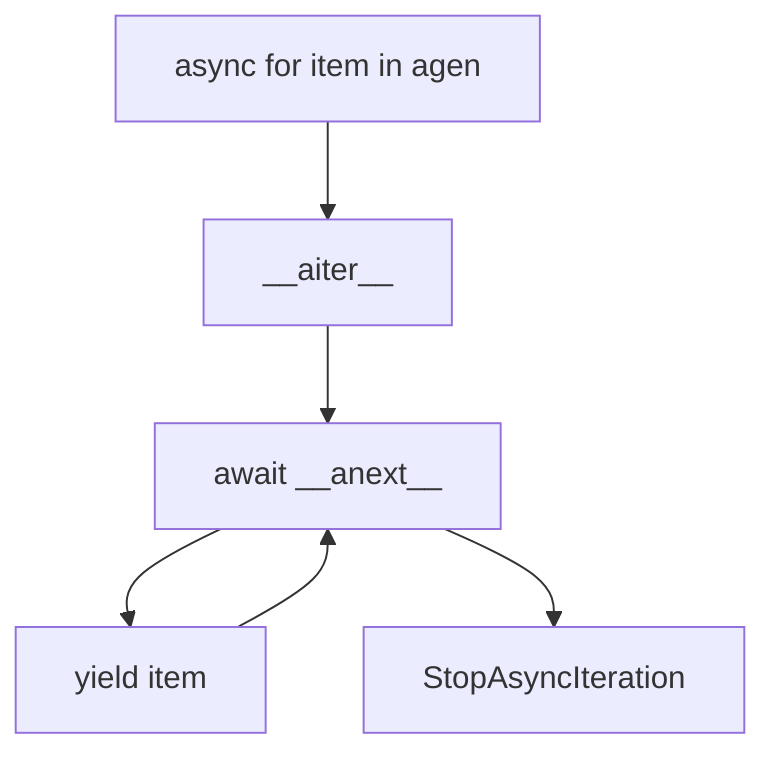
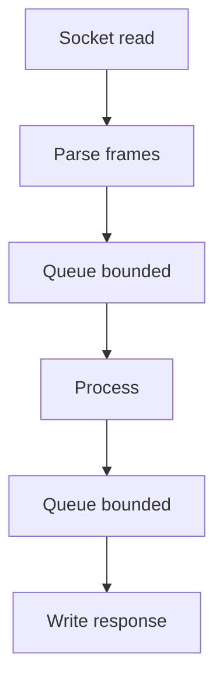
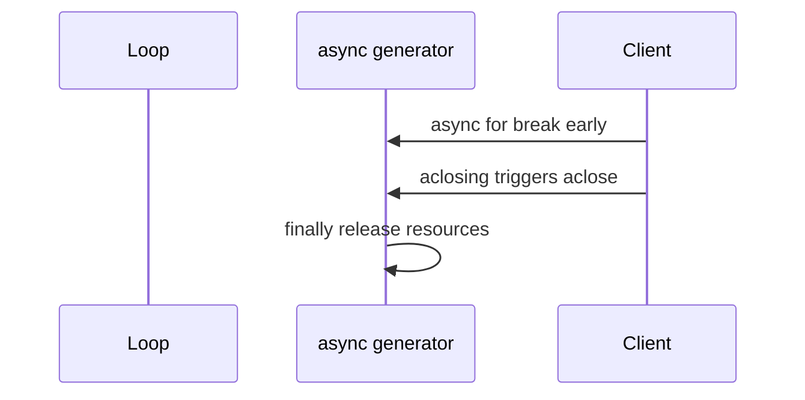

# Async Iteration Streams and Backpressure

## Overview

**Async iteration** (`async for`) consumes objects implementing `__aiter__`/`__anext__`—including **async generators** (`async def` with `yield`). **`asyncio.StreamReader`/`StreamWriter`** expose buffered socket IO. **Backpressure** ensures producers do not overwhelm consumers or memory when production outpaces consumption.

Without backpressure, services buffer unbounded queues, OOM, and tail latency explode. Kafka partition lag and CDN buffering are [[07-Backend/07-Caching-Jobs-and-Messaging/Message Queue Client Patterns|Message Queue Client Patterns]]/platform topics; this note owns **Python async iteration protocols and asyncio stream flow control**.

## Learning Objectives

- Implement async iterators and async generators with proper cleanup
- Use `asyncio.Queue` with bounded `maxsize` for backpressure
- Apply `StreamReader` high-water marks and `drain()` on writers
- Compose pipelines with structured concurrency
- Handle `async for` cancellation and `aclosing` (3.10+)

## Prerequisites

- [[03-Python/07-Async-Concurrency-and-Free-Threading/Tasks Futures and Awaitables|Tasks Futures and Awaitables]]
- [[03-Python/04-Iteration-Exceptions-and-Context/Iterator Protocol|Iterator Protocol]]
- [[03-Python/04-Iteration-Exceptions-and-Context/Generators and Generator Internals|Generators and Generator Internals]]

## Difficulty

`advanced`

## Estimated Time

- Reading: 3 hours
- Exercises: 4 hours
- Mini project: 6 hours

## History

Async generators (PEP 525, 3.6) extended iteration to coroutines. `async for` formalized the protocol. asyncio streams added flow control via `drain()`. Libraries like `asyncpg` cursor iteration and HTTP chunked encoding rely on these primitives. Python 3.10+ `aclosing` ensures async generator cleanup on break.

## Problem It Solves

Unbounded `create_task` per incoming message without consumer limit exhausts RAM. Writers pushing faster than readers fill kernel buffers and application queues. Async iteration provides **pull-based** consumption; bounded queues and `drain()` implement **explicit backpressure**.

## Internal Implementation

### Async iteration protocol



Async generators finalize with `aclose()` on cancellation or loop shutdown.

### Backpressure with bounded queue


### StreamWriter flow control

`write()` buffers; `await drain()` waits until buffer below low-water mark—couples producer to consumer readiness.

## Mermaid Diagrams

### Pipeline stages



### async generator cleanup



## Examples

### Minimal Example

Async generator with cleanup:

```python
import asyncio
from contextlib import aclosing


async def count(n: int):
    try:
        for i in range(n):
            yield i
            await asyncio.sleep(0.01)
    finally:
        print("generator closed")


async def main() -> None:
    async with aclosing(count(1_000_000)) as agen:
        async for i in agen:
            if i >= 3:
                break


asyncio.run(main())
```

### Production-Shaped Example

Bounded worker pipeline:

```python
from __future__ import annotations

import asyncio


async def producer(q: asyncio.Queue[bytes | None], source: asyncio.StreamReader) -> None:
    try:
        while chunk := await source.read(65536):
            await q.put(chunk)  # blocks when queue full — backpressure
    finally:
        await q.put(None)


async def consumer(q: asyncio.Queue[bytes | None], sink: asyncio.StreamWriter) -> None:
    while True:
        chunk = await q.get()
        if chunk is None:
            break
        sink.write(chunk)
        await sink.drain()
        q.task_done()


async def pipe(reader: asyncio.StreamReader, writer: asyncio.StreamWriter) -> None:
    q: asyncio.Queue[bytes | None] = asyncio.Queue(maxsize=8)
    async with asyncio.TaskGroup() as tg:
        tg.create_task(producer(q, reader))
        tg.create_task(consumer(q, writer))
```

Tune `maxsize` from memory budget and chunk size.

See [[03-Python/code/README|Python code labs]] for stream backpressure benchmarks.

## Trade-offs

| Dimension | Upside | Downside | When it matters |
| --- | --- | --- | --- |
| Bounded queue | Memory cap | Throughput limit | Streaming ETL |
| drain() | Kernel sync | Await latency | TCP proxies |
| async generators | Elegant pull API | Cleanup complexity | Pagination |
| Unbounded queue | Peak burst absorb | OOM risk | Never in prod |
| Semaphore limit | Concurrency cap | Tuning needed | DB fan-out |

### When to Use

- Streaming protocols (TCP, WebSocket frames)
- Paginated async DB/API reads
- Pipelines with distinct producer/consumer rates

### When Not to Use

- Small payloads fitting memory—simple `await read()` suffices
- CPU-bound transforms without queue—use executor stage

## Exercises

1. Demonstrate OOM with unbounded queue vs bounded under fast producer.
2. Implement async iterator over mock socket chunks with timeout.
3. Use `StreamReader`/`StreamWriter` in echo server; require `drain()`.
4. Break out of `async for` early; verify `aclosing` runs finally block.
5. Measure throughput vs `maxsize` for pipeline with synthetic delay.

## Mini Project

**Async Log Tail -f**

Follow growing file with async read, line parser async generator, bounded downstream search workers.

## Portfolio Project

Streaming stage in [[03-Python/projects/Asyncio Scheduler From Scratch/README|Asyncio Scheduler From Scratch]] with metrics on queue depth.

## Interview Questions

1. How does `async for` differ from `for` at protocol level?
2. What is backpressure and two asyncio mechanisms implementing it?
3. Why call `await writer.drain()`?
4. What happens if async generator is not closed on break?
5. How bound concurrent DB queries without unbounded tasks?

### Stretch / Staff-Level

1. Design multi-stage pipeline with pressure propagating upstream on full queues.
2. Compare asyncio streams vs anyio byte streams abstraction.

## Common Mistakes

- Unbounded `Queue()` in production
- Forgetting `drain()` causing memory growth
- Fire-and-forget producers without consumer error linkage
- Not using TaskGroup—orphan consumer on producer failure

## Best Practices

- Always bound queues or use semaphores for fan-out
- Propagate cancellation upstream when consumer stops
- Use `aclosing` for async generators
- Monitor queue depth as leading indicator of overload
- Match chunk sizes to socket buffers and SLA

## Summary

Async iteration extends pull-based processing to coroutines; async generators and streams enable memory-efficient pipelines when paired with backpressure. Bounded `asyncio.Queue` and `StreamWriter.drain()` tie producer rate to consumer capacity—critical for stable Python IO services. Platform-level buffering and CDN strategies extend these ideas in Backend; loop-local flow control starts here.

## Further Reading

- PEP 525 — Asynchronous Generators
- [[03-Python/07-Async-Concurrency-and-Free-Threading/Cancellation Timeouts and TaskGroup|Cancellation Timeouts and TaskGroup]]
- [[03-Python/04-Iteration-Exceptions-and-Context/Generators and Generator Internals|Generators and Generator Internals]]

## Related Notes

- [[03-Python/07-Async-Concurrency-and-Free-Threading/asyncio Event Loop Internals|asyncio Event Loop Internals]]
- [[03-Python/09-Production-Python/Measuring and Optimizing Performance|Measuring and Optimizing Performance]]
- [[03-Python/README|Python Track]]

## Progress Checklist

- [ ] Explained from first principles
- [ ] Drew at least one Mermaid diagram
- [ ] Implemented a minimal version
- [ ] Documented trade-offs and non-goals
- [ ] Completed exercises
- [ ] Practiced interview questions aloud
- [ ] Linked prerequisites and dependents
