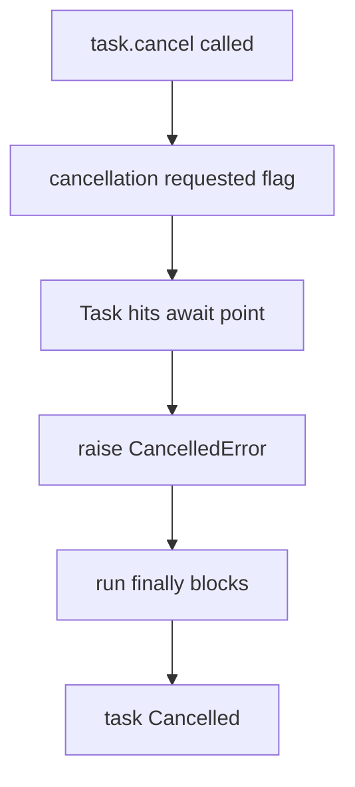
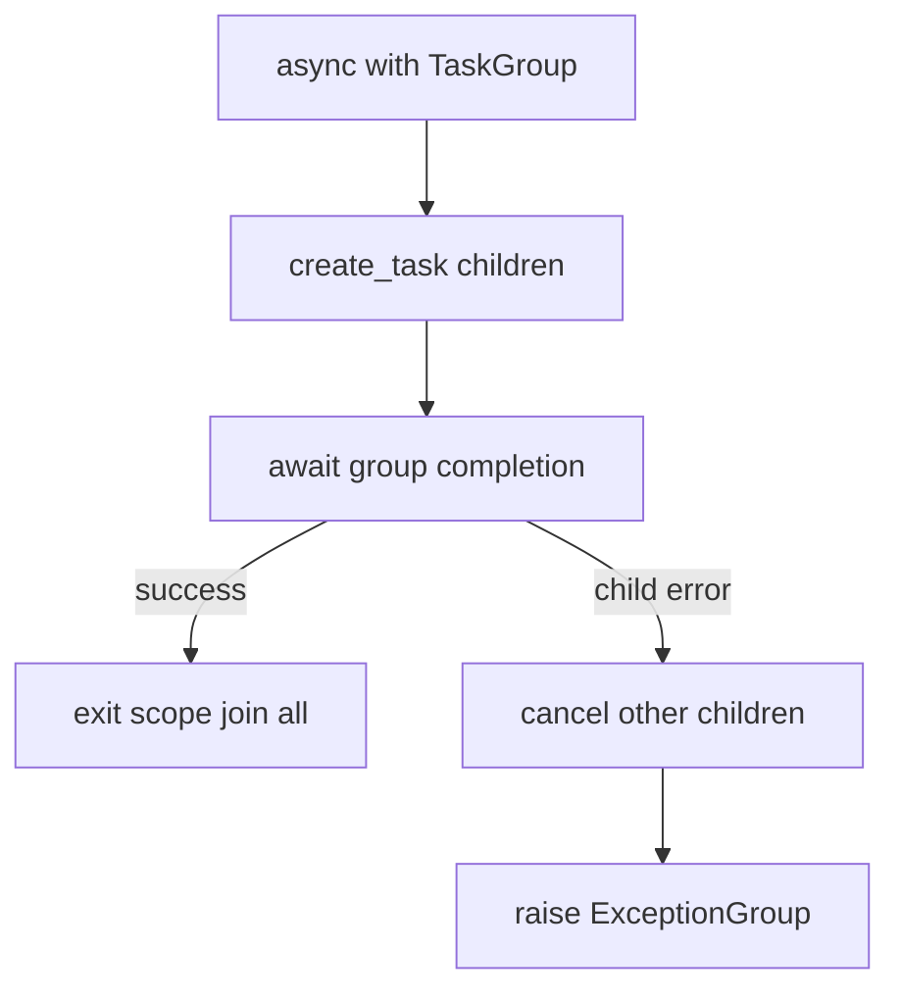
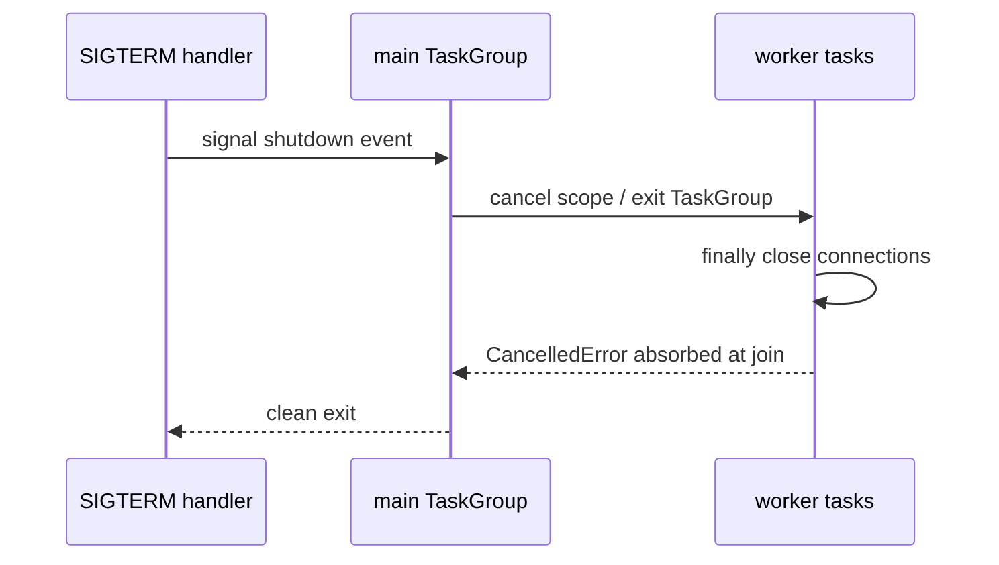
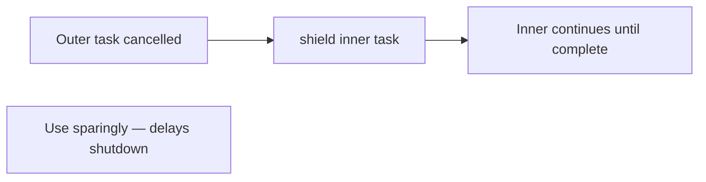

# Cancellation Timeouts and TaskGroup

## Overview

**Cancellation** in asyncio injects `CancelledError` into tasks at `await` boundaries—cooperative, not preemptive. **Timeouts** (`asyncio.timeout`, `wait_for`) bound wait duration. **`TaskGroup`** (3.11+) implements **structured concurrency**: sibling tasks cancel when one fails; scopes nest cleanly.

Production outages often trace to missing cancellation on shutdown, swallowed `CancelledError`, or `gather` without sibling cleanup. HTTP client timeout configuration spans libraries and proxies ([[07-Backend/README|Backend]]); this note owns **asyncio cancellation semantics and TaskGroup patterns on CPython 3.14+**.

## Learning Objectives

- Cancel tasks cooperatively and write cancellation-safe cleanup
- Use `asyncio.timeout` and handle `TimeoutError`
- Apply TaskGroup for fan-out/fan-in with automatic sibling cancellation
- Integrate `shield`, cancellation propagation, and ExceptionGroup handling
- Design graceful service shutdown cancelling task trees

## Prerequisites

- [[03-Python/07-Async-Concurrency-and-Free-Threading/Tasks Futures and Awaitables|Tasks Futures and Awaitables]]
- [[03-Python/04-Iteration-Exceptions-and-Context/Resource Cleanup and Cancellation Semantics|Resource Cleanup and Cancellation Semantics]]
- [[03-Python/04-Iteration-Exceptions-and-Context/Exception Hierarchy ExceptionGroup and except star|Exception Hierarchy ExceptionGroup and except star]]

## Difficulty

`advanced`

## Estimated Time

- Reading: 3 hours
- Exercises: 4 hours
- Mini project: 6 hours

## History

Early asyncio used `gather` without structured failure semantics. Cancellation evolved from `Task.cancel()` injecting `CancelledError` (BaseException subclass). Python 3.11 added TaskGroup (inspired by trio nurseries) and `asyncio.timeout` context manager replacing many `wait_for` uses. ExceptionGroup (PEP 654) aggregates sibling failures.

## Problem It Solves

Long-running services must stop work on:

- Client disconnect
- Deadline exceeded
- Partial failure in parallel batch
- Process SIGTERM

Unstructured task trees leak background work and hold sockets/DB connections—cancellation + structured scopes fix lifecycle.

## Internal Implementation

### Cancellation delivery



Code between awaits is not interruptible—CPU loops block cancellation.

### TaskGroup scope



### Timeout layers

| API | Behavior | Notes |
| --- | --- | --- |
| `asyncio.timeout(t)` | Cancels current scope on expiry | Preferred 3.11+ |
| `wait_for(coro, t)` | Cancels wrapped awaitable | Legacy patterns |
| `socket timeout` | OS-level | Complements asyncio timeout |

## Mermaid Diagrams

### Graceful shutdown sequence



### shield semantics



## Examples

### Minimal Example

TaskGroup with failure propagation:

```python
import asyncio


async def ok() -> None:
    await asyncio.sleep(0.1)


async def fail() -> None:
    await asyncio.sleep(0.05)
    raise RuntimeError("fail")


async def main() -> None:
    try:
        async with asyncio.TaskGroup() as tg:
            tg.create_task(ok())
            tg.create_task(fail())
    except* RuntimeError as eg:
        print("caught group:", eg)


asyncio.run(main())
```

### Production-Shaped Example

Request scope with timeout and cleanup:

```python
from __future__ import annotations

import asyncio
from contextlib import asynccontextmanager


@asynccontextmanager
async def request_scope(deadline_s: float):
    try:
        async with asyncio.timeout(deadline_s):
            async with asyncio.TaskGroup() as tg:
                yield tg
    except TimeoutError:
        raise SLAError("deadline exceeded") from None


class SLAError(Exception):
    pass


async def handle_request() -> None:
    async with request_scope(2.0) as tg:
        tg.create_task(fetch_auth())
        tg.create_task(fetch_profile())
        tg.create_task(write_audit())
```

Always re-raise `CancelledError` after cleanup unless converting shutdown policy.

See [[03-Python/code/README|Python code labs]] for cancellation torture tests.

## Trade-offs

| Dimension | Upside | Downside | When it matters |
| --- | --- | --- | --- |
| TaskGroup | Auto sibling cancel | 3.11+ only | New asyncio services |
| gather | Familiar | Manual cancel on error | Legacy code |
| shield | Protect critical section | Blocks shutdown | DB commit edge cases |
| timeout scope | Clear nesting | Cancels entire block | SLA enforcement |
| CancelledError as BaseException | Bypasses except Exception | Surprises newcomers | Cleanup code |

### When to Use

- TaskGroup for parallel steps sharing fate
- `asyncio.timeout` on external IO bundles
- Explicit cancellation on client disconnect events

### When Not to Use

- `shield` to hide cancellation indefinitely
- CPU-bound loops without await—cancellation never arrives

## Exercises

1. Write coroutine ignoring cancellation in loop—observe stuck shutdown.
2. Convert `gather` batch to TaskGroup with ExceptionGroup handling.
3. Nest TaskGroups; cancel outer; document inner behavior.
4. Implement SIGTERM handler setting Event consumed by main TaskGroup.
5. Compare `wait_for` vs `timeout` cancellation targets on 3.14.

## Mini Project

**Graceful Async Service Template**

HTTP-ish handler with TaskGroup per request, global shutdown, connection cleanup in `finally`.

## Portfolio Project

Cancellation tests in [[03-Python/projects/Asyncio Scheduler From Scratch/README|Asyncio Scheduler From Scratch]].

## Interview Questions

1. Is asyncio cancellation preemptive?
2. What does TaskGroup do when one child raises?
3. Why re-raise CancelledError after cleanup?
4. Difference between `timeout` and `wait_for`?
5. How handle client disconnect cancelling only that request's tasks?

### Stretch / Staff-Level

1. Design idempotent shutdown for TaskGroup with thread offload in finally.
2. Map trio nursery semantics to asyncio TaskGroup differences.

## Common Mistakes

- `except Exception` swallowing CancelledError
- Missing await on TaskGroup scope exit
- Using cancel without closing resources in `finally`
- shield around entire request preventing deploy drain

## Best Practices

- Scope tasks per request/client with TaskGroup
- Use timeouts on all external awaits
- Log cancellation reason with structured fields
- Test shutdown paths in CI
- Document which operations are cancellation-safe

## Summary

asyncio cancellation is cooperative, delivered at await points via CancelledError. Timeouts bound wait time; TaskGroup structures concurrent tasks with automatic sibling cancellation and ExceptionGroup aggregation on failure. Production services need explicit shutdown scopes and cleanup in finally blocks—Backend HTTP timeouts build on these primitives but do not replace loop-level structured concurrency.

## Further Reading

- [[03-Python/07-Async-Concurrency-and-Free-Threading/Tasks Futures and Awaitables|Tasks Futures and Awaitables]]
- [[03-Python/04-Iteration-Exceptions-and-Context/Resource Cleanup and Cancellation Semantics|Resource Cleanup and Cancellation Semantics]]
- Python docs — TaskGroup and asyncio.timeout

## Related Notes

- [[03-Python/07-Async-Concurrency-and-Free-Threading/Async Iteration Streams and Backpressure|Async Iteration Streams and Backpressure]]
- [[03-Python/09-Production-Python/Operational Readiness for CLIs and Services|Operational Readiness for CLIs and Services]]
- [[03-Python/README|Python Track]]

## Progress Checklist

- [ ] Explained from first principles
- [ ] Drew at least one Mermaid diagram
- [ ] Implemented a minimal version
- [ ] Documented trade-offs and non-goals
- [ ] Completed exercises
- [ ] Practiced interview questions aloud
- [ ] Linked prerequisites and dependents
