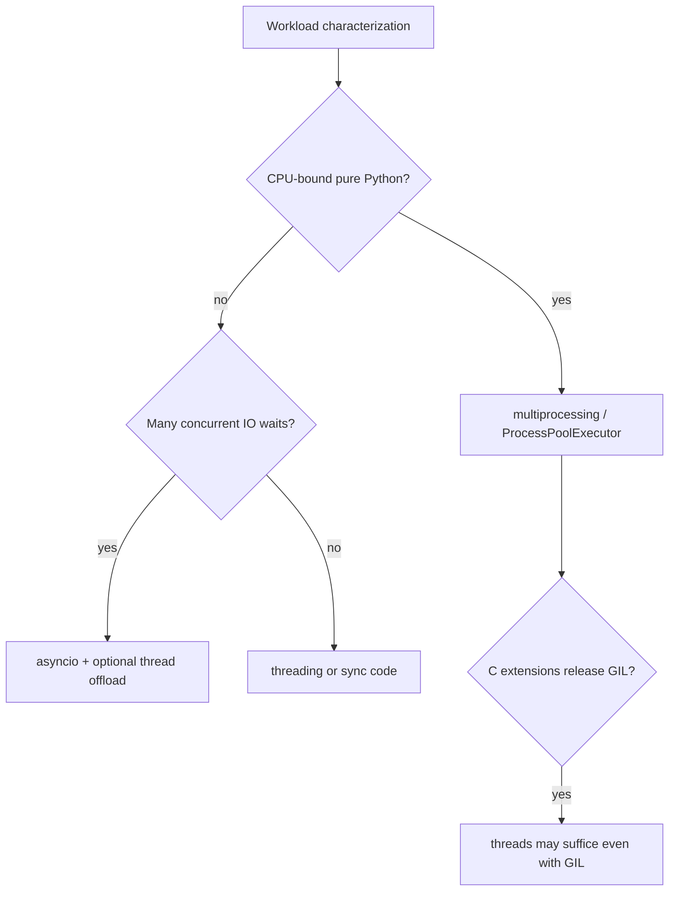
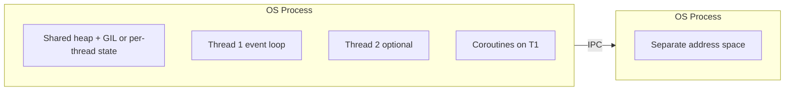
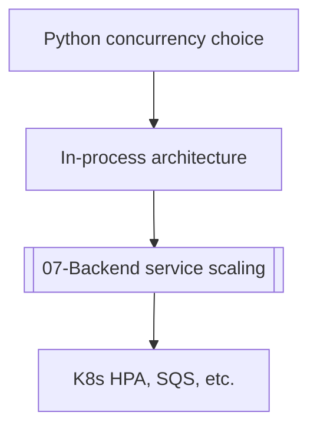

# Concurrency Models in Python

## Overview

**Concurrency** in Python is not one feature—it is a family of models sharing a process but differing in scheduling, isolation, and scalability on CPython 3.14+:

1. **Cooperative coroutines** (`asyncio`) — single-threaded event loop, await points
2. **Preemptive OS threads** (`threading`) — shared memory; GIL or free-threaded semantics
3. **Processes** (`multiprocessing`) — separate interpreters, copy-on-write or explicit IPC
4. **Thread pools / process pools** (`concurrent.futures`) — executor abstraction
5. **Subinterpreters** (3.12+ experimental) — multiple interpreters per process

Choosing a model is an engineering decision about **CPU vs IO**, **shared mutable state**, **failure isolation**, and **extension module thread safety**—not about syntax preference alone.

Service orchestration (load balancers, queues, k8s) belongs in [[07-Backend/README|Backend]] and [[16-DevOps/README|DevOps]]; this track owns **CPython concurrency semantics**.

## Learning Objectives

- Classify workloads as CPU-bound, IO-bound, or mixed
- Map workloads to asyncio, threads, processes, or hybrid patterns
- Explain GIL vs free-threaded CPython impact on model choice
- Identify shared-state hazards and isolation boundaries
- Design hybrid architectures (async + thread pool offload)

## Prerequisites

- [[01-Computer-Science/05-Concurrency-Fundamentals/Processes Threads and Green Threads|Processes Threads and Green Threads]]
- [[03-Python/05-CPython-Runtime-and-Memory/Reference Counting and Immortal Objects|Reference Counting and Immortal Objects]]
- [[03-Python/04-Iteration-Exceptions-and-Context/Resource Cleanup and Cancellation Semantics|Resource Cleanup and Cancellation Semantics]]

## Difficulty

`intermediate`

## Estimated Time

- Reading: 3 hours
- Exercises: 4 hours
- Mini project: 6 hours

## History

Python 1.5 added threads wrapping pthreads; the GIL serialized bytecode. Python 3.4 integrated asyncio (PEP 3156). `concurrent.futures` unified pools. PEP 703 (free-threading, optional 3.13+) challenges decades of "threads don't parallelize CPU" guidance. Subinterpreters resurfaced for isolation without full processes.

## Problem It Solves

Wrong model → production incidents:

- CPU parsing in asyncio blocking the event loop
- Shared list mutation across threads without locks
- Forking after threads on Linux deadlocks
- Spawning processes for every tiny task (overhead explosion)
- Assuming free-threading fixes all extension modules instantly

A decision framework prevents category errors before code is written.

## Internal Implementation

### Model comparison matrix

| Model | Parallel CPU (default GIL) | Parallel CPU (free-threaded) | Shared memory | Best for |
| --- | --- | --- | --- | --- |
| asyncio | No | No (still one thread) | Yes (cooperative) | Many concurrent IO waits |
| threading | Limited | Better if extensions safe | Yes (race risks) | Blocking IO wrappers, legacy APIs |
| multiprocessing | Yes | Yes | No (IPC) | CPU-bound pure Python |
| futures pools | Depends on executor | Depends | Configurable | Uniform task submission API |

### Decision flow



### Hybrid pattern (production default)

```python
import asyncio
from concurrent.futures import ThreadPoolExecutor

executor = ThreadPoolExecutor(max_workers=8)

async def fetch_and_parse(url: str) -> dict[str, object]:
    loop = asyncio.get_running_loop()
    raw = await loop.run_in_executor(executor, blocking_download, url)
    return await loop.run_in_executor(executor, cpu_heavy_parse, raw)
```

Async owns scheduling; threads run blocking/CPU sections without blocking the loop.

## Mermaid Diagrams

### Process vs thread vs coroutine memory



### Service layer handoff



## Examples

### Minimal Example

Same task, three models:

```python
# Sync
def download_many(urls: list[str]) -> list[bytes]:
    return [blocking_get(u) for u in urls]

# Threads
from concurrent.futures import ThreadPoolExecutor

def download_many_threads(urls: list[str]) -> list[bytes]:
    with ThreadPoolExecutor(max_workers=16) as pool:
        return list(pool.map(blocking_get, urls))

# Async
async def download_many_async(urls: list[str]) -> list[bytes]:
    async with aiohttp.ClientSession() as session:
        tasks = [fetch(session, u) for u in urls]
        return await asyncio.gather(*tasks)
```

### Production-Shaped Example

Worker classification in a data pipeline:

```python
from __future__ import annotations

import asyncio
from enum import Enum


class WorkKind(Enum):
    IO = "io"
    CPU = "cpu"


async def dispatch(kind: WorkKind, payload: bytes) -> bytes:
    match kind:
        case WorkKind.IO:
            return await async_write_to_object_store(payload)
        case WorkKind.CPU:
            loop = asyncio.get_running_loop()
            return await loop.run_in_executor(None, compress_zstd, payload)
```

Monitor event loop lag separately from thread pool queue depth—operational metrics tie to [[03-Python/09-Production-Python/Observability Logging Tracing and Metrics|Observability]].

See [[03-Python/code/README|Python code labs]] for concurrency benchmarking harnesses.

## Trade-offs

| Dimension | Upside | Downside | When it matters |
| --- | --- | --- | --- |
| asyncio | Low memory per task | Blocking call stalls all | High fan-out IO |
| threads | Simple wrapping of sync libs | GIL, races | DB drivers without async |
| processes | True isolation | Startup + IPC cost | Sandboxing untrusted code |
| free-threading | Thread CPU parallelism | Extension compatibility | Numeric + thread mix |
| hybrid | Practical | Complexity | Real services |

### When to Use

- asyncio for network services with structured concurrency (TaskGroup)
- processes for CPU-heavy batch jobs
- threads for blocking syscalls under asyncio via executor
- free-threaded builds after auditing extension thread safety

### When Not to Use

- Do not spawn processes to avoid learning asyncio for IO-bound HTTP
- Do not share mutable globals across threads without locks
- Do not assume free-threading without testing wheels on 3.14t

## Exercises

1. Benchmark sync vs threads vs asyncio on 100 HTTP fetches—plot latency p50/p99.
2. Demonstrate data race mutating a shared list from two threads without locks.
3. Run CPU-bound function in asyncio without executor—measure event loop stall.
4. Document which model your current project uses and justify in one page.
5. Map three production incidents to wrong concurrency model choice.

## Mini Project

**Concurrency Decision Wizard**

CLI asking workload questions (IO ratio, CPU seconds, isolation needs) and recommending model with generated skeleton code.

## Portfolio Project

Implement [[03-Python/projects/Bounded Worker Orchestrator/README|Bounded Worker Orchestrator]] supporting async, thread, and process backends.

## Interview Questions

1. Difference between concurrency and parallelism in Python?
2. When does asyncio outperform threads for IO?
3. Why doesn't threading parallelize pure Python CPU work with the GIL?
4. How does free-threading change the decision matrix?
5. When must you use multiprocessing instead of threads?

### Stretch / Staff-Level

1. Design a hybrid service handling 10k websocket connections plus periodic CPU reports.
2. Explain fork safety rules after threads have started on Linux.

## Common Mistakes

- Running blocking DB calls directly in coroutines
- Using threads for CPU-bound pure Python expecting linear speedup
- Forking (`multiprocessing` start method fork) after threads initialized
- Ignoring backpressure in all models (see async streams note)

## Best Practices

- Characterize workload with metrics before choosing model
- Keep shared mutable state out of concurrent code; prefer message passing
- Use structured concurrency (TaskGroup) in asyncio
- Document start method (`spawn` vs `fork`) for multiprocessing on macOS/Windows
- Test on target CPython build (default vs `3.14t` free-threaded)

## Summary

Python offers cooperative, threaded, and process-based concurrency with different isolation and scalability profiles on CPython 3.14+. The GIL still defines default thread CPU behavior unless you opt into free-threading and compatible extensions. asyncio excels at IO fan-out; processes excel at CPU isolation; threads bridge blocking libraries. Backend infrastructure scales out; this module ensures in-process model choice matches the workload.

## Further Reading

- [[03-Python/07-Async-Concurrency-and-Free-Threading/threading and the GIL|threading and the GIL]]
- [[03-Python/07-Async-Concurrency-and-Free-Threading/Free-Threaded CPython Trade-offs|Free-Threaded CPython Trade-offs]]
- [[01-Computer-Science/05-Concurrency-Fundamentals/Asynchronous Event-Driven Models|Asynchronous Event-Driven Models]]

## Related Notes

- [[03-Python/07-Async-Concurrency-and-Free-Threading/concurrent futures|concurrent futures]]
- [[03-Python/07-Async-Concurrency-and-Free-Threading/asyncio Event Loop Internals|asyncio Event Loop Internals]]
- [[03-Python/README|Python Track]]

## Progress Checklist

- [ ] Explained from first principles
- [ ] Drew at least one Mermaid diagram
- [ ] Implemented a minimal version
- [ ] Documented trade-offs and non-goals
- [ ] Completed exercises
- [ ] Practiced interview questions aloud
- [ ] Linked prerequisites and dependents
