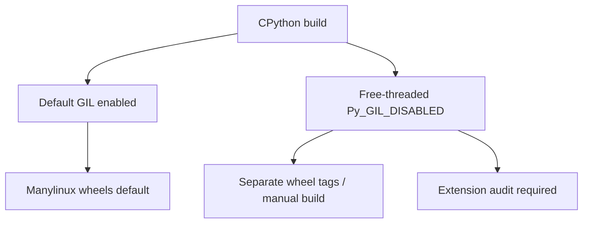
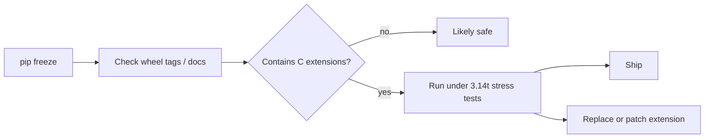
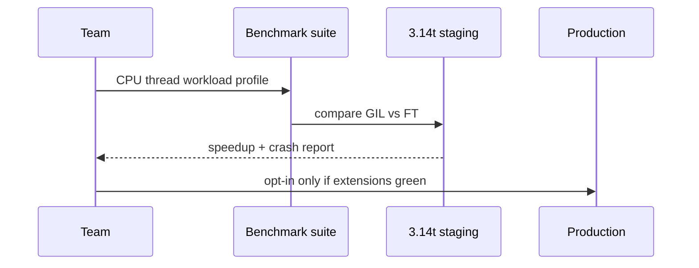

# Free-Threaded CPython Trade-offs

## Overview

**Free-threaded CPython** (PEP 703, optional builds often labeled `3.14t` or `--disable-gil`) removes the Global Interpreter Lock so multiple OS threads can execute Python bytecode concurrently in one process. This is not a free performance win—it requires **atomic reference counting**, biased locking, immortal object changes, and—critically—**thread-safe C extensions**.

On CPython 3.14+, free-threading is an opt-in build/deployment choice. Default wheels on PyPI may remain GIL-enabled for years. This note covers runtime semantics, compatibility auditing, and when free-threading beats asyncio/process models—without duplicating container orchestration in [[16-DevOps/README|DevOps]].

## Learning Objectives

- Explain PEP 703 changes to object layout and refcounting
- Audit a dependency tree for free-threading compatibility (`Py_GIL_DISABLED`)
- Predict performance wins/losses vs multiprocessing and asyncio
- Configure builds, wheels, and test matrices for dual GIL/free-threaded support
- Identify extension modules that remain unsafe without updates

## Prerequisites

- [[03-Python/07-Async-Concurrency-and-Free-Threading/threading and the GIL|threading and the GIL]]
- [[03-Python/05-CPython-Runtime-and-Memory/Reference Counting and Immortal Objects|Reference Counting and Immortal Objects]]
- [[03-Python/05-CPython-Runtime-and-Memory/C API Extension Boundary and Stable ABI|C API Extension Boundary and Stable ABI]]

## Difficulty

`advanced`

## Estimated Time

- Reading: 3 hours
- Exercises: 4 hours
- Mini project: 8 hours

## History

Multi-core CPUs exposed GIL limits for CPU-bound Python threads. PEP 703 (accepted 2024) made free-threading an official optional mode after community prototypes (`nogil`). CPython 3.13 experimental builds led to 3.14 production opt-in. Ecosystem migration parallels Python 2→3 but narrower: C extensions must declare thread safety.

## Problem It Solves

CPU-bound **pure Python** thread pools wasted cores for decades. Some workloads (ML preprocessing threads + Python orchestration, multi-threaded servers with CPU snippets) want **shared memory parallelism** without process serialization overhead. Free-threading targets that gap when extensions cooperate.

## Internal Implementation

### Runtime modes



Detect at runtime:

```python
import sys

if hasattr(sys, "_is_gil_enabled"):
    print("GIL enabled:", sys._is_gil_enabled())
```

### Object model changes (conceptual)

- **Migrated refcounts** to atomic operations on hot paths
- **Immortal objects** expanded to reduce atomic churn on singletons
- **Critical sections** protect some structures previously guarded by GIL
- Extensions using thread-unsafe statics without locks → data races

### Performance reality

| Workload | Free-threaded threads | Processes | asyncio |
| --- | --- | --- | --- |
| CPU pure Python | Strong candidate | Good, higher IPC cost | Poor if blocking |
| CPU NumPy (releases GIL) | Similar to GIL build | Overkill | N/A |
| IO HTTP fan-out | Threads OK; asyncio often better | Heavy | Excellent |
| Mixed shared state | Threads if carefully locked | Isolation safer | Single-thread + pools |

Free-threading adds synchronization overhead—microbenchmarks may regress.

## Mermaid Diagrams

### Extension compatibility audit flow



### Deployment decision



## Examples

### Minimal Example

Thread CPU benchmark guarded by runtime check:

```python
import sys
import threading
import time


def cpu_work(n: int) -> int:
    total = 0
    for i in range(n):
        total += i * i
    return total


def bench(threads: int, n: int) -> float:
    start = time.perf_counter()
    ts = [threading.Thread(target=cpu_work, args=(n,)) for _ in range(threads)]
    for t in ts:
        t.start()
    for t in ts:
        t.join()
    return time.perf_counter() - start


if __name__ == "__main__":
    mode = "GIL" if getattr(sys, "_is_gil_enabled", lambda: True)() else "free-threaded"
    print(mode, bench(8, 2_000_000))
```

Compare speedup only on free-threaded build with compatible stack.

### Production-Shaped Example

Feature flag selecting executor backend:

```python
from __future__ import annotations

import os
import sys
from concurrent.futures import ProcessPoolExecutor, ThreadPoolExecutor


def default_executor(max_workers: int):
    if os.environ.get("USE_FREE_THREAD") == "1" and not sys._is_gil_enabled():
        return ThreadPoolExecutor(max_workers=max_workers)
    return ProcessPoolExecutor(max_workers=max_workers)
```

Document dependency audit checklist in deployment runbooks—platform rollout is [[16-DevOps/README|DevOps]]; **compatibility proof** is this track.

See [[03-Python/code/README|Python code labs]] for free-threading audit scripts.

## Trade-offs

| Dimension | Upside | Downside | When it matters |
| --- | --- | --- | --- |
| Thread CPU parallelism | Shared memory | Extension breakage | CPU thread pools |
| Single process | Lower IPC than multiprocessing | Race bugs if locks wrong | Shared caches |
| Ecosystem | Growing 3.14t wheels | Split wheel ecosystem | CI matrix cost |
| Single-thread perf | — | Atomic refcount overhead | Non-threaded apps |
| Maturity | Official supported mode | Fewer battle-tested deployments | Risk tolerance |

### When to Use

- CPU-bound pure Python parallelized with threads after benchmarks prove win
- Applications with all-green extension audit under 3.14t
- Scenarios needing shared in-memory structures across parallel workers

### When Not to Use

- Default choice without measurement
- Heavy reliance on unmaintained C extensions
- Workloads already optimal with asyncio IO or process isolation

## Exercises

1. Run `sys._is_gil_enabled()` on your installs; document results.
2. Build or install 3.14t; rerun thread CPU benchmark vs process pool.
3. Identify five PyPI packages you use with C extensions; research free-thread status.
4. Introduce intentional race in extension-free code; observe under ThreadSanitizer equivalent tests.
5. Draft dual CI matrix (GIL + free-threaded) for a sample library.

## Mini Project

**Free-Thread Compatibility Report**

Tool scanning `pip freeze`, flagging packages with `.so`/`.pyd`, outputting markdown report with links to upstream issues.

## Portfolio Project

Add free-threading section to [[03-Python/projects/Bounded Worker Orchestrator/README|Bounded Worker Orchestrator]] benchmarks.

## Interview Questions

1. What problem does PEP 703 solve?
2. How detect GIL status at runtime in 3.14+?
3. Why might free-threaded Python be slower single-threaded?
4. Compare free-threaded threads vs multiprocessing for CPU work.
5. What must C extension authors change for free-threading?

### Stretch / Staff-Level

1. Design migration plan for a NumPy/pandas service to 3.14t with rollback.
2. Explain biased reference counting and why immortal objects matter.

## Common Mistakes

- Assuming PyPI `cp314` wheels work on free-threaded without checking tags
- Removing process isolation while introducing data races
- Benchmarking on GIL build and claiming thread parallelism
- Ignoring single-thread regression on latency-sensitive paths

## Best Practices

- Benchmark GIL vs FT on representative workloads before adopting
- Maintain extension compatibility spreadsheet
- Prefer immutability and message passing even with free-threading
- Pin interpreter flavor in production containers explicitly
- Run stress tests with `PYTHON_GIL=0` environment where applicable

## Summary

Free-threaded CPython removes the GIL enabling true parallel bytecode execution in threads, at the cost of atomic refcount overhead and mandatory extension thread-safety. It complements—not replaces—asyncio and multiprocessing. Adoption on 3.14+ is opt-in and ecosystem-dependent. Prove compatibility and performance before production; leave fleet rollout mechanics to DevOps once the interpreter choice is justified.

## Further Reading

- PEP 703 — Making the Global Interpreter Lock Optional in CPython
- CPython dev docs — free-threading build instructions
- [[03-Python/07-Async-Concurrency-and-Free-Threading/Interpreters Subinterpreters and Isolation|Interpreters Subinterpreters and Isolation]]

## Related Notes

- [[03-Python/07-Async-Concurrency-and-Free-Threading/Concurrency Models in Python|Concurrency Models in Python]]
- [[03-Python/05-CPython-Runtime-and-Memory/C API Extension Boundary and Stable ABI|C API Extension Boundary and Stable ABI]]
- [[03-Python/README|Python Track]]

## Progress Checklist

- [ ] Explained from first principles
- [ ] Drew at least one Mermaid diagram
- [ ] Implemented a minimal version
- [ ] Documented trade-offs and non-goals
- [ ] Completed exercises
- [ ] Practiced interview questions aloud
- [ ] Linked prerequisites and dependents
