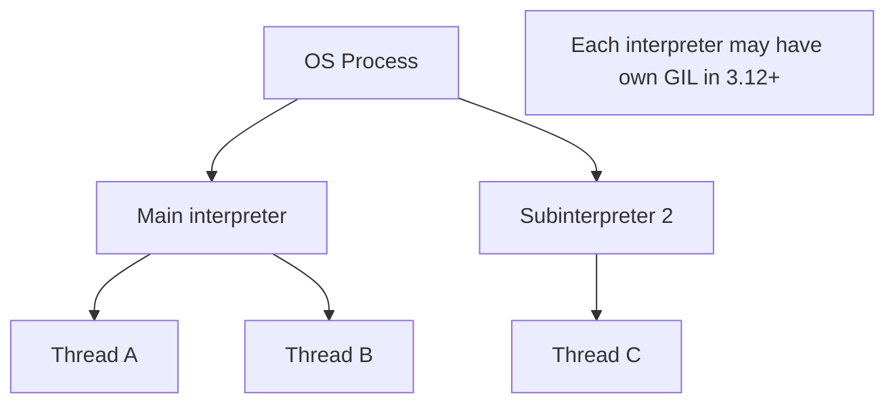
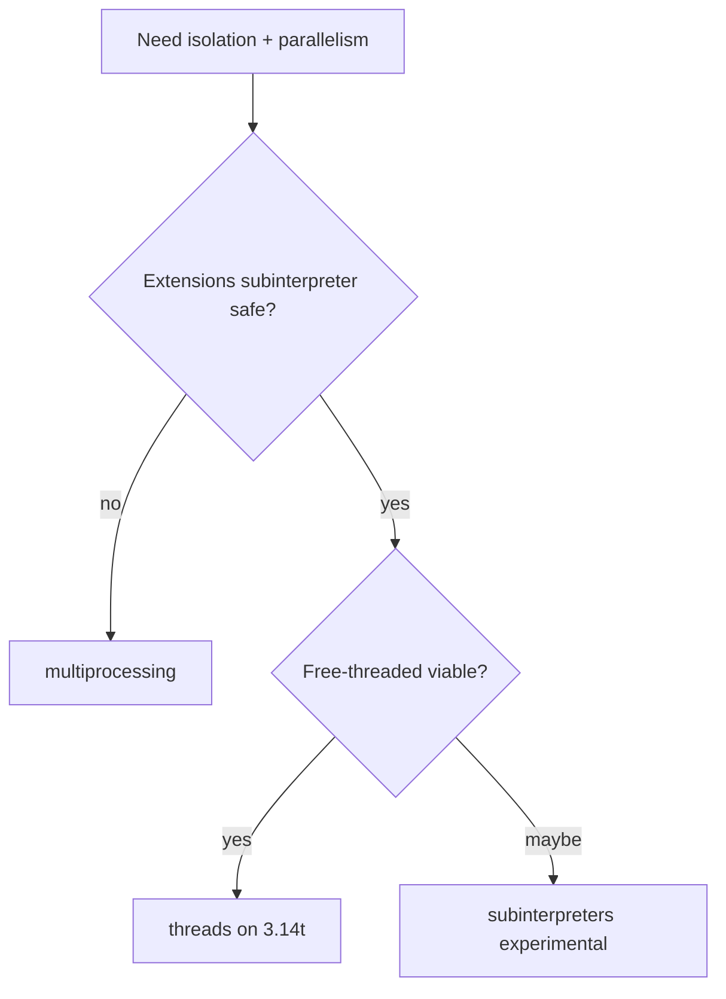
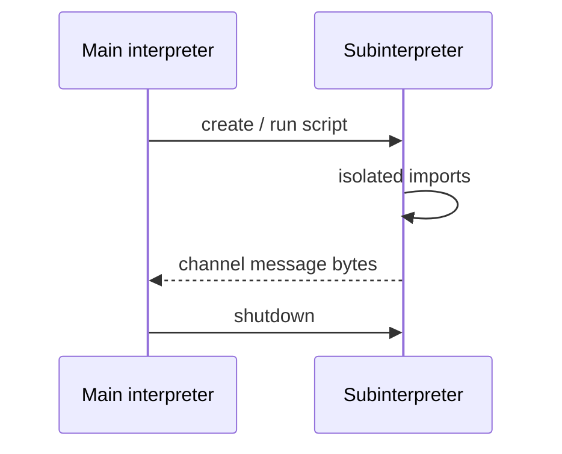

# Interpreters Subinterpreters and Isolation

## Overview

A CPython **interpreter** is a runtime instance with its own modules, builtins, and (increasingly) **isolated GIL/state**. **Subinterpreters** run multiple interpreters in **one OS process** via the `interpreters` module (3.12+ experimental API evolving toward 3.14). **PEP 684** introduced per-interpreter GIL enabling parallel bytecode in one process when extensions cooperate.

This sits between threads (shared interpreter) and multiprocessing (full process isolation). Container sandboxing and seccomp policies are [[18-Security/README|Security]]/platform—here we cover **CPython interpreter boundaries and when subinterpreters help**.

## Learning Objectives

- Distinguish OS process, interpreter, and thread layers in CPython
- Use experimental `interpreters` API concepts safely in 3.14+
- Compare subinterpreters vs multiprocessing vs free-threaded threads
- Identify shared objects that must not cross interpreter boundaries
- Assess extension module compatibility with per-interpreter GIL

## Prerequisites

- [[03-Python/07-Async-Concurrency-and-Free-Threading/multiprocessing Shared Memory and Process Pools|multiprocessing Shared Memory and Process Pools]]
- [[03-Python/05-CPython-Runtime-and-Memory/Code Objects Frame Objects and Call Stack|Code Objects Frame Objects and Call Stack]]
- [[03-Python/07-Async-Concurrency-and-Free-Threading/Free-Threaded CPython Trade-offs|Free-Threaded CPython Trade-offs]]

## Difficulty

`expert`

## Estimated Time

- Reading: 3 hours
- Exercises: 3 hours (API may evolve)
- Mini project: 8 hours

## History

Subinterpreters existed in C API for mod_wsgi and embedded Python but shared GIL until PEP 554/684 work. PEP 684 (3.12) added per-interpreter GIL. PEP 734 proposes stdlib `interpreters` module for managed subinterpreters. Ecosystem maturity lags multiprocessing—API marked experimental.

## Problem It Solves

Processes duplicate memory and pay IPC; threads share too much under GIL. Subinterpreters target:

- Plugin sandboxes with lower overhead than processes
- Parallel CPU in one container before free-threading fully matures
- Embedded systems running isolated script engines

Wrong expectations cause subtle cross-interpreter bugs.

## Internal Implementation

### Layer model



### Isolation guarantees (evolving)

| Shared by default | Isolated per interpreter |
| --- | --- |
| Process address space | Module import tables (goal) |
| Some C extensions' global statics | Bytecode execution state (target) |
| File descriptors unless dup'd | Python object graphs |

**Extension modules must opt into isolation**—many legacy modules unsafe.

### Communication

Subinterpreters cannot share arbitrary Python objects. Channels/queues (proposed/experimental) copy bytes or serialize—similar discipline to multiprocessing.

## Mermaid Diagrams

### Choice matrix



### Lifecycle



## Examples

### Minimal Example

Conceptual pattern (API names may vary by 3.14 docs—verify against installed version):

```python
# Experimental — check CPython 3.14 interpreters docs before production use
import interpreters as interp

def worker():
    import sys
    print("worker interpreter", id(sys.modules))

if __name__ == "__main__":
    sub = interp.create()
    sub.call(worker)  # illustrative; real API uses run/channel primitives
```

Always consult current stdlib docs—this area changes release-to-release.

### Production-Shaped Example

Fallback strategy:

```python
from __future__ import annotations

import os
import sys
from concurrent.futures import ProcessPoolExecutor


def run_isolated(job: bytes) -> bytes:
    mode = os.environ.get("ISOLATION_MODE", "process")
    if mode == "subinterpreter" and sys.version_info >= (3, 12):
        ...  # delegate to interpreters channel when stable
    with ProcessPoolExecutor(max_workers=1) as pool:
        return pool.submit(_process_job, job).result()


def _process_job(job: bytes) -> bytes:
    ...
```

Prefer **process isolation** for production sandboxes until subinterpreter story matures.

See [[03-Python/code/README|Python code labs]] for isolation comparison benchmarks.

## Trade-offs

| Dimension | Upside | Downside | When it matters |
| --- | --- | --- | --- |
| Subinterpreters | Lower overhead than processes | Experimental API | Plugin hosts |
| Per-interpreter GIL | Parallel CPU pockets | Extension compatibility | Embedded Python |
| Processes | Battle-tested isolation | RAM + IPC | Untrusted code |
| Free-threading | Simpler shared memory model | GIL removal fallout | CPU threads |
| Shared static C state | — | Breaks isolation promises | Security audits |

### When to Use

- Research/experimental plugin isolation on 3.14 with extension audit
- Embedded products already using subinterpreter C API

### When Not to Use

- Production untrusted code execution without hardened process/container boundary
- Assuming stdlib API stability before your target version's docs confirm

## Exercises

1. Diagram three isolation options for running user Python plugins—compare RAM and startup.
2. Read PEP 684 rationale; list objects that must not cross interpreter boundaries.
3. Attempt running pure-Python module in subinterpreter; log separate `sys.modules`.
4. Identify C extensions in your stack likely using process-global state.
5. Write ADR recommending process vs subinterpreter for internal DSL execution.

## Mini Project

**Isolation Benchmark Harness**

Same CPU task via thread pool, process pool, and subinterpreter (if available)—metrics table.

## Portfolio Project

Document isolation strategy in [[03-Python/projects/Import Hook Plugin Loader/README|Import Hook Plugin Loader]].

## Interview Questions

1. Difference between interpreter and OS process?
2. What did PEP 684 change about the GIL?
3. Why can't subinterpreters share arbitrary Python objects?
4. Compare subinterpreters to free-threaded CPython for parallelism.
5. When still choose multiprocessing?

### Stretch / Staff-Level

1. Design plugin host using process pool with seccomp vs future subinterpreters.
2. Explain mod_wsgi subinterpreter history and prior GIL limitation.

## Common Mistakes

- Treating experimental API as stable across micro versions
- Assuming isolation without auditing C extensions
- Sharing open DB connections across interpreters
- Replacing containers with subinterpreters for security boundaries

## Best Practices

- Default to process + container isolation for untrusted code
- Track PEP 734/`interpreters` module release notes per Python version
- Favor pure-Python plugin code in isolated interpreters when testing
- Combine with resource limits (ulimit/cgroups) at platform layer

## Summary

Subinterpreters offer multiple CPython interpreters per process with increasing isolation and per-interpreter GIL support—bridging threads and processes. The stdlib API is experimental on 3.12–3.14; extension compatibility determines real isolation. For production untrusted code, processes and platform sandboxing remain primary; subinterpreters are an evolving tool for embedded and plugin architectures understanding CPython internals.

## Further Reading

- PEP 684 — Per-Interpreter GIL
- PEP 734 — CPython Subinterpreters (stdlib module)
- [[03-Python/07-Async-Concurrency-and-Free-Threading/Free-Threaded CPython Trade-offs|Free-Threaded CPython Trade-offs]]

## Related Notes

- [[03-Python/07-Async-Concurrency-and-Free-Threading/Concurrency Models in Python|Concurrency Models in Python]]
- [[03-Python/05-CPython-Runtime-and-Memory/C API Extension Boundary and Stable ABI|C API Extension Boundary and Stable ABI]]
- [[03-Python/README|Python Track]]

## Progress Checklist

- [ ] Explained from first principles
- [ ] Drew at least one Mermaid diagram
- [ ] Implemented a minimal version
- [ ] Documented trade-offs and non-goals
- [ ] Completed exercises
- [ ] Practiced interview questions aloud
- [ ] Linked prerequisites and dependents
