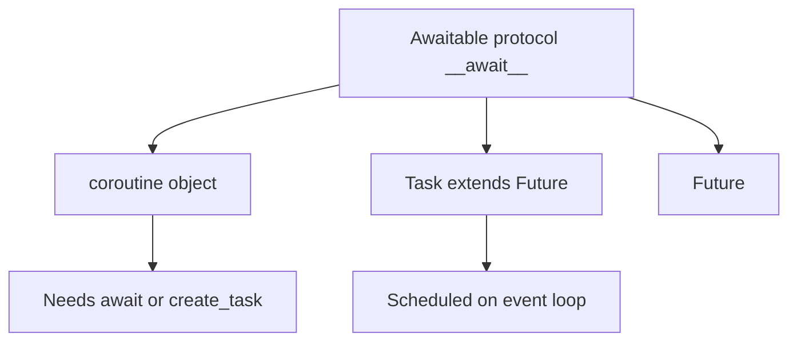
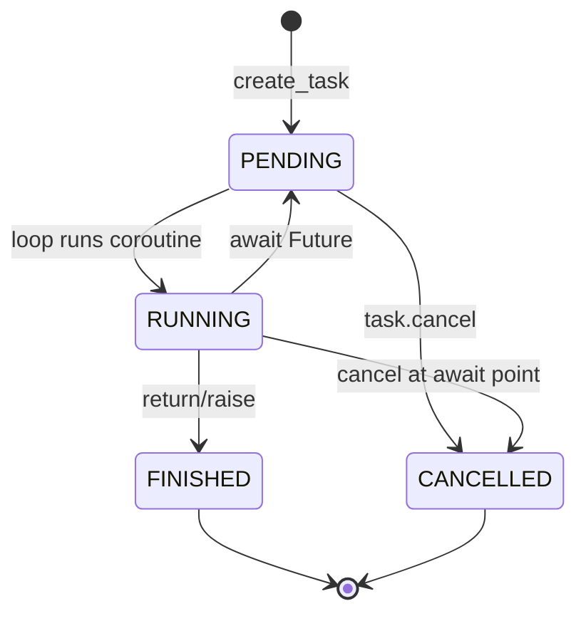
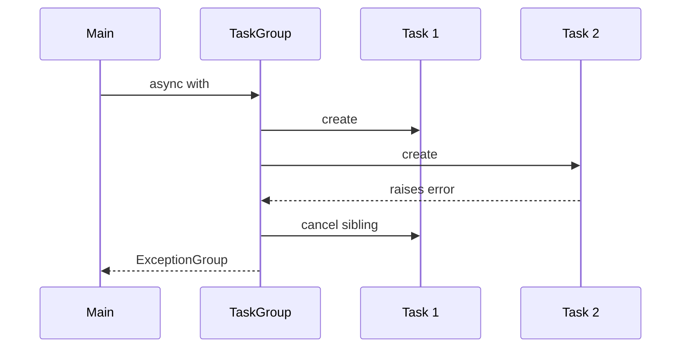
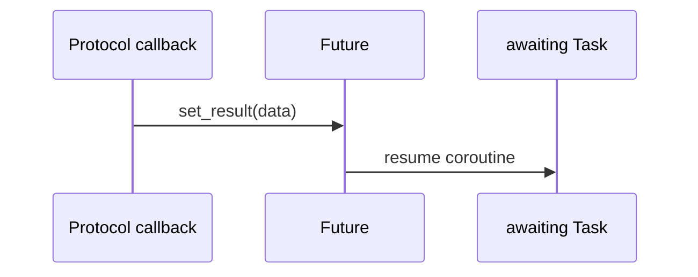

# Tasks Futures and Awaitables

## Overview

In asyncio, an **Awaitable** is anything you can `await`—coroutine objects, **`asyncio.Task`**, and **`asyncio.Future`**. **Tasks** wrap coroutines for concurrent scheduling on the event loop. **Futures** are low-level result placeholders completed by callbacks—often IO operations.

Confusing Task vs Future vs coroutine causes lost exceptions, premature GC of background tasks, and incorrect cancellation. CPython 3.14+ continues **eager task start** refinements; semantics remain: Tasks schedule immediately upon creation (unless configured otherwise).

## Learning Objectives

- Distinguish coroutine, Task, and Future lifecycles
- Use `create_task`, `gather`, and TaskGroup appropriately
- Propagate and log Task exceptions (`Task.exception`, `add_done_callback`)
- Understand Future callback thread safety (`call_soon_threadsafe`)
- Avoid GC of fire-and-forget tasks

## Prerequisites

- [[03-Python/07-Async-Concurrency-and-Free-Threading/asyncio Event Loop Internals|asyncio Event Loop Internals]]
- [[03-Python/04-Iteration-Exceptions-and-Context/Exception Hierarchy ExceptionGroup and except star|Exception Hierarchy ExceptionGroup and except star]]

## Difficulty

`advanced`

## Estimated Time

- Reading: 2–3 hours
- Exercises: 3 hours
- Mini project: 6 hours

## History

Futures existed in concurrent.futures first; asyncio adapted them for coroutine integration. `create_task` (3.7+) replaced `ensure_future` patterns. Python 3.11 TaskGroup (PEP 654 synergy) structured concurrent task scopes with automatic cancellation on failure.

## Problem It Solves

Coroutines do nothing until awaited or wrapped in Tasks—developers forget to schedule work. Raw Futures expose callback hell. Tasks provide **structured scheduling** with exception capture; mishandling yields silent failures in long-running services.

## Internal Implementation

### Type hierarchy (conceptual)



### Task state machine



Cancellation injects `CancelledError` at next `await`.

### Exception propagation

Unhandled Task exceptions log "Task exception was never retrieved" unless awaited or done callback inspects `task.exception()`.

## Mermaid Diagrams

### gather vs TaskGroup



### Future completion from IO



## Examples

### Minimal Example

```python
import asyncio


async def work(n: int) -> int:
    await asyncio.sleep(0.1)
    if n == 3:
        raise ValueError("boom")
    return n * 2


async def main() -> None:
    tasks = [asyncio.create_task(work(i), name=f"work-{i}") for i in range(5)]
    results = []
    for t in tasks:
        try:
            results.append(await t)
        except ValueError as exc:
            print(t.get_name(), exc)
    # Un awaited failed tasks may warn if not handled


asyncio.run(main())
```

Prefer TaskGroup for automatic sibling cancellation (3.11+).

### Production-Shaped Example

Background task registry preventing GC:

```python
from __future__ import annotations

import asyncio
from weakref import WeakSet


class TaskSupervisor:
    def __init__(self) -> None:
        self._tasks: WeakSet[asyncio.Task[object]] = WeakSet()

    def spawn(self, coro, *, name: str | None = None) -> asyncio.Task[object]:
        task = asyncio.create_task(coro, name=name)
        self._tasks.add(task)

        def _done(t: asyncio.Task[object]) -> None:
            self._tasks.discard(t)
            if exc := t.exception():
                ...  # log structured error

        task.add_done_callback(_done)
        return task

    async def shutdown(self) -> None:
        for t in list(self._tasks):
            t.cancel()
        await asyncio.gather(*self._tasks, return_exceptions=True)
```

HTTP server lifecycle integration is [[07-Backend/README|Backend]]—supervisor owns **Task references**.

See [[03-Python/code/README|Python code labs]] for Task/Future drills.

## Trade-offs

| Dimension | Upside | Downside | When it matters |
| --- | --- | --- | --- |
| create_task | Immediate scheduling | Must retain reference | Background jobs |
| gather | Simple join | Manual cancellation on failure | Independent tasks |
| TaskGroup | Structured concurrency | Requires 3.11+ | New services |
| Future callbacks | Low-level IO integration | Easy to leak exceptions | Protocol authors |
| return_exceptions=True | Partial success | Masks failure unless checked | Bulk operations |

### When to Use

- TaskGroup for sibling tasks with shared failure domain
- Futures when writing asyncio protocol/transport code
- Supervisor pattern for long-lived background loops

### When Not to Use

- `gather` without cancellation policy when one failure must stop all
- Fire-and-forget without done callback logging

## Exercises

1. Demonstrate GC of task without reference—observe never retrieved warning.
2. Compare `gather` vs TaskGroup when one child raises.
3. Implement Future bridged from thread using `call_soon_threadsafe`.
4. Use `asyncio.wait` with FIRST_EXCEPTION mode.
5. Read Task `eager_start` behavior on 3.14 docs; note testing implications.

## Mini Project

**Task Supervisor Library**

Spawn, track, graceful shutdown, metrics for active task count and failure rate.

## Portfolio Project

Integrate supervisor into [[03-Python/projects/Asyncio Scheduler From Scratch/README|Asyncio Scheduler From Scratch]].

## Interview Questions

1. Difference between coroutine and Task?
2. When is a Task garbage-collected mid-execution?
3. How does Task cancellation work at await points?
4. TaskGroup vs gather on failure?
5. What is `Future` in asyncio vs concurrent.futures?

### Stretch / Staff-Level

1. Design exception routing with ExceptionGroup for parallel HTTP fetches.
2. Explain why `await asyncio.sleep(0)` yields but busy loop does not cancel promptly.

## Common Mistakes

- Not awaiting or registering callback on background tasks
- Cancelling Task without handling `CancelledError` cleanup
- Using `asyncio.ensure_future` legacy patterns incorrectly
- Assuming `gather` cancels siblings on error (default: no)

## Best Practices

- Prefer TaskGroup for new asyncio code (3.11+)
- Name tasks for debugging (`create_task(..., name=...)`)
- Log unhandled task exceptions centrally
- Time-bound awaits with `asyncio.timeout` (3.11+)
- Document cancellation semantics of long-running tasks

## Summary

Awaitables unify coroutines, Tasks, and Futures under asyncio's cooperative model. Tasks schedule coroutines on the loop; Futures represent deferred results often completed by IO callbacks. Structured concurrency with TaskGroup reduces failure-mode bugs compared to raw gather. Retain task references and handle exceptions—silent task death is a common production incident. Backend HTTP frameworks build on these primitives; understanding Tasks/Futures is prerequisite to using them safely.

## Further Reading

- [[03-Python/07-Async-Concurrency-and-Free-Threading/Cancellation Timeouts and TaskGroup|Cancellation Timeouts and TaskGroup]]
- PEP 654 — Exception Groups (interaction with TaskGroup)
- Python docs — asyncio Task and Future

## Related Notes

- [[03-Python/07-Async-Concurrency-and-Free-Threading/Async Iteration Streams and Backpressure|Async Iteration Streams and Backpressure]]
- [[03-Python/04-Iteration-Exceptions-and-Context/Resource Cleanup and Cancellation Semantics|Resource Cleanup and Cancellation Semantics]]
- [[03-Python/README|Python Track]]

## Progress Checklist

- [ ] Explained from first principles
- [ ] Drew at least one Mermaid diagram
- [ ] Implemented a minimal version
- [ ] Documented trade-offs and non-goals
- [ ] Completed exercises
- [ ] Practiced interview questions aloud
- [ ] Linked prerequisites and dependents
