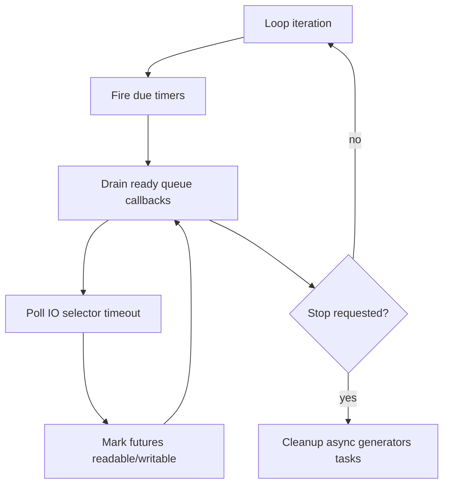
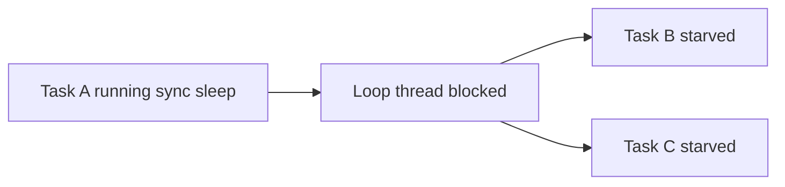
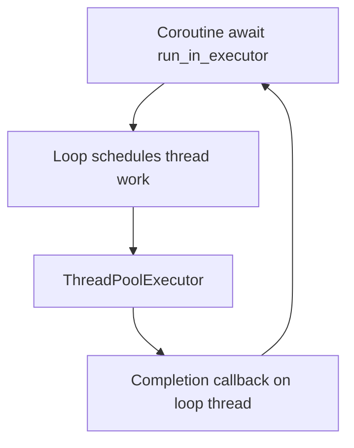

# asyncio Event Loop Internals

## Overview

**asyncio** implements **cooperative concurrency** on a single thread via an **event loop** that schedules coroutines, IO readiness callbacks, timers, and executor completions. On Unix, default loops often use **`SelectorEventLoop`** (`select`/`epoll`/`kqueue`); on Windows, **`ProactorEventLoop`** overlaps IO via IOCP.

Understanding loop internals explains latency spikes (callback starvation), why blocking calls freeze all tasks, and how `asyncio.run` sets up policy and shutdown. HTTP routing and service mesh belong in [[07-Backend/README|Backend]]; this note owns **loop scheduling and readiness mechanisms**.

## Learning Objectives

- Trace `asyncio.run` startup and shutdown phases
- Explain ready queue, scheduled callbacks, and selector key registration
- Differentiate Selector vs Proactor event loop backends
- Debug loop lag with `loop.slow_callback_duration`
- Integrate custom file descriptors and signal handling safely

## Prerequisites

- [[03-Python/07-Async-Concurrency-and-Free-Threading/Concurrency Models in Python|Concurrency Models in Python]]
- [[01-Computer-Science/05-Concurrency-Fundamentals/Asynchronous Event-Driven Models|Asynchronous Event-Driven Models]]
- [[03-Python/04-Iteration-Exceptions-and-Context/Resource Cleanup and Cancellation Semantics|Resource Cleanup and Cancellation Semantics]]

## Difficulty

`advanced`

## Estimated Time

- Reading: 3 hours
- Exercises: 4 hours
- Mini project: 8 hours

## History

asyncio evolved from Tulip (Guido, 2012), standardized in Python 3.4. The `async`/`await` syntax (3.5+) replaced `@asyncio.coroutine`. Loop policies abstract platform differences. 3.14 continues refining TaskGroup, eager task start, and performance—internals remain single-threaded cooperative.

## Problem It Solves

Thread-per-connection models exhaust memory and context-switch overhead at high connection counts. Callback spaghetti without structured tasks caused lost errors. asyncio centralizes **non-blocking IO multiplexing** plus coroutine scheduling in one thread with explicit await points.

## Internal Implementation

### Loop iteration (conceptual)



Each `_run_once` cycle balances callback fairness vs IO wait latency.

### Coroutine scheduling

Coroutines await `Future` objects. When IO completes, loop sets Future result and resumes waiting Task on next ready queue turn.

```mermaid
sequenceDiagram
    participant Task as Task coroutine
    participant Loop as Event loop
    participant Sel as Selector
    Task->>Loop: await sock_read
    Loop->>Sel: register FD read
    Sel-->>Loop: FD ready
    Loop->>Task: resume with data
```

### `asyncio.run` lifecycle

1. Creates new event loop (3.14+ policy)
2. Sets main Task running coroutine
3. Runs until complete
4. Cancels outstanding tasks on exit path
5. Shuts down async generators and default executor
6. Closes loop

Never call `asyncio.run` from running loop (nested)—use `await` or `asyncio.create_task`.

## Mermaid Diagrams

### Blocking call impact



### Executor integration



## Examples

### Minimal Example

Inspect loop thread and time:

```python
import asyncio


async def ticker() -> None:
    loop = asyncio.get_running_loop()
    print("loop:", type(loop).__name__, "thread:", threading.current_thread().name)
    for i in range(3):
        loop.call_later(i, lambda i=i: print(f"timer {i}"))
        await asyncio.sleep(0.5)


async def main() -> None:
    await ticker()

import threading
asyncio.run(main())
```

### Production-Shaped Example

Loop lag monitor:

```python
from __future__ import annotations

import asyncio
import time


async def lag_probe(interval: float = 1.0, threshold: float = 0.1) -> None:
    loop = asyncio.get_running_loop()
    expected = loop.time()
    while True:
        await asyncio.sleep(interval)
        now = loop.time()
        lag = now - expected - interval
        expected = now
        if lag > threshold:
            # emit metric — see Observability note
            print(f"event_loop_lag_seconds={lag:.3f}")
```

Pair with application metrics export—platform alerting is [[16-DevOps/README|DevOps]].

See [[03-Python/code/README|Python code labs]] including [[03-Python/projects/Asyncio Scheduler From Scratch/README|Asyncio Scheduler From Scratch]].

## Trade-offs

| Dimension | Upside | Downside | When it matters |
| --- | --- | --- | --- |
| Single-thread loop | No Python race on shared state | Blocking stalls all | IO services |
| Selector | Mature on Linux | Less ideal for massive FD sets without tuning | Web servers |
| Proactor | Windows IOCP native | Different semantics vs Unix | Cross-platform libs |
| call_soon callbacks | Low overhead | Starvation if long callbacks | CPU in callbacks bad |
| uvloop (third-party) | Faster loop | Extra dependency | High RPS |

### When to Use

- Many concurrent network clients/servers with async-native libraries
- Structured task trees with TaskGroup
- Latency-sensitive IO multiplexing on one core

### When Not to Use

- CPU-bound work without executor/offload
- Blocking DB drivers without thread pool wrapper
- Simple scripts where sync + threads suffice

## Exercises

1. Implement busy-loop callback starving other tasks—measure with lag probe.
2. Compare `asyncio.sleep(0)` vs `time.sleep(0)` inside coroutine effects.
3. Trace `create_task` scheduling order with numbered prints.
4. Register custom socket; observe selector modify on Windows vs Linux (WSL).
5. Read CPython `asyncio/base_events.py` `_run_once` outline; diagram phases.

## Mini Project

**Toy Selector Loop**

Minimal epoll/select loop running coroutines without asyncio—then map concepts to stdlib.

## Portfolio Project

[[03-Python/projects/Asyncio Scheduler From Scratch/README|Asyncio Scheduler From Scratch]] documenting parity with stdlib behaviors.

## Interview Questions

1. What does the event loop do each iteration?
2. Why does `time.sleep` block the entire asyncio application?
3. Selector vs Proactor—platform differences?
4. What does `asyncio.run` cleanup on exit?
5. How detect event loop lag in production?

### Stretch / Staff-Level

1. Explain fairness issues with `call_soon` and long synchronous callbacks.
2. Design nested loop policy for legacy sync framework integration.

## Common Mistakes

- Calling blocking IO in coroutines
- Creating global loop with deprecated `get_event_loop` patterns on 3.10+
- Fire-and-forget tasks without reference retention (GC cancelled tasks)
- Mixing threads calling `loop.call_soon_threadsafe` incorrectly

## Best Practices

- Use `asyncio.run` as main entrypoint
- Offload blocking work to executor with bounded pool
- Monitor loop lag and slow callback warnings
- Prefer async-native drivers (asyncpg, httpx async)
- Use TaskGroup for structured concurrency (3.11+)

## Summary

asyncio's event loop multiplexes IO and schedules coroutines on one thread, trading parallel CPU for efficient IO concurrency. Selector/Proactor backends integrate OS readiness notification; executors bridge blocking code. Blocking the loop thread blocks everything—internalize `_run_once` phases to debug production latency. Service architecture scales beyond one loop in Backend; loop correctness is Python runtime responsibility.

## Further Reading

- [[03-Python/07-Async-Concurrency-and-Free-Threading/Tasks Futures and Awaitables|Tasks Futures and Awaitables]]
- [[03-Python/07-Async-Concurrency-and-Free-Threading/Cancellation Timeouts and TaskGroup|Cancellation Timeouts and TaskGroup]]
- Python docs — asyncio event loop implementations

## Related Notes

- [[03-Python/07-Async-Concurrency-and-Free-Threading/concurrent futures|concurrent futures]]
- [[03-Python/09-Production-Python/Observability Logging Tracing and Metrics|Observability Logging Tracing and Metrics]]
- [[03-Python/README|Python Track]]

## Progress Checklist

- [ ] Explained from first principles
- [ ] Drew at least one Mermaid diagram
- [ ] Implemented a minimal version
- [ ] Documented trade-offs and non-goals
- [ ] Completed exercises
- [ ] Practiced interview questions aloud
- [ ] Linked prerequisites and dependents
