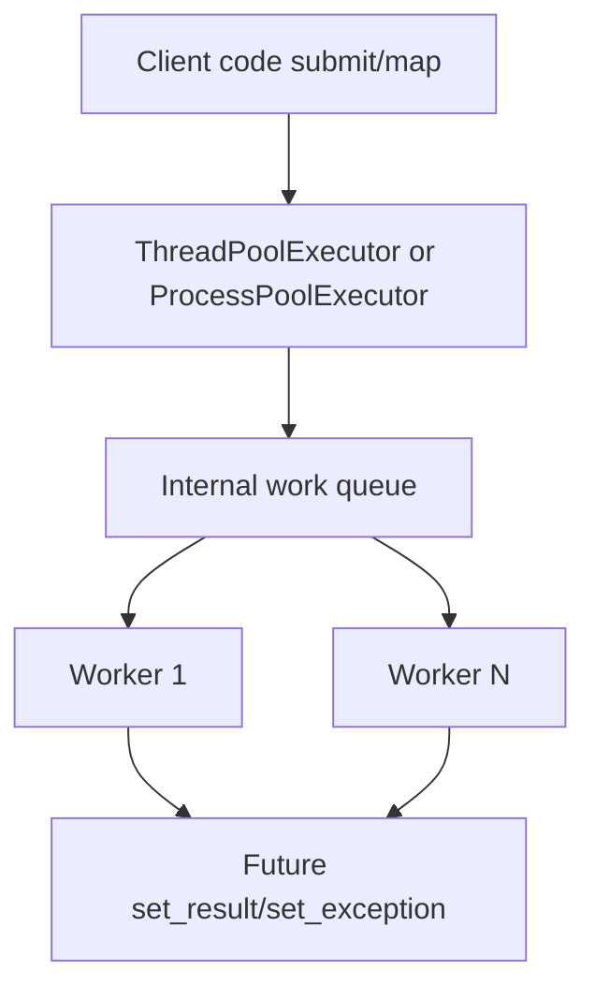
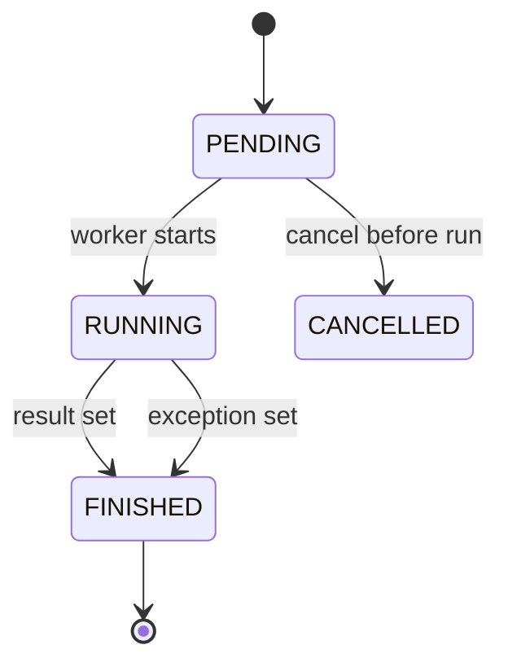
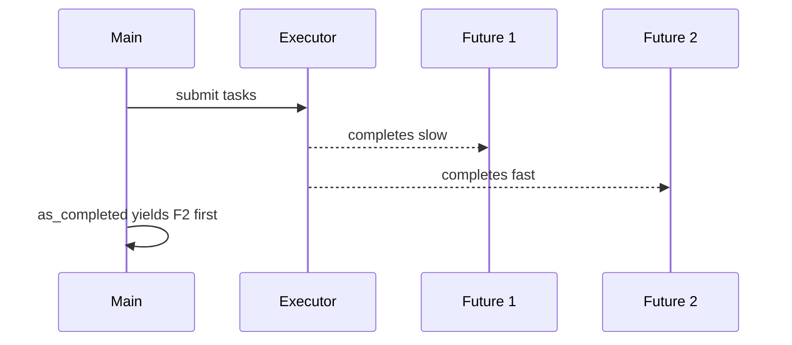
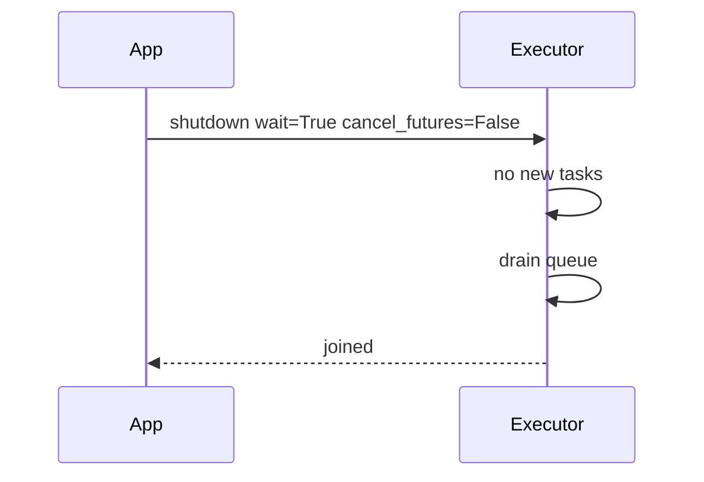

# concurrent futures

## Overview

**`concurrent.futures`** (Python 3.2+) provides a high-level **Executor** API—`ThreadPoolExecutor` and `ProcessPoolExecutor`—and the **`Future`** object representing deferred results. It unifies thread and process pools with `submit`, `map`, `as_completed`, and `wait`.

asyncio integrates via `loop.run_in_executor`, bridging sync blocking code and coroutines. This module is the pragmatic default for parallelizing blocking calls without managing raw `threading.Thread` or `multiprocessing.Process` lifecycle.

Distributed job queues (Celery, RQ, SQS workers) are [[07-Backend/07-Caching-Jobs-and-Messaging/Background Jobs and Workers|Background Jobs and Workers]] and [[07-Backend/07-Caching-Jobs-and-Messaging/Transactional Outbox and Inbox Patterns|Transactional Outbox and Inbox Patterns]]—`concurrent.futures` owns **in-process** pool semantics.

## Learning Objectives

- Use `submit`, `map`, `as_completed`, and `wait` with correct shutdown
- Choose thread vs process executor for a workload
- Bridge executors to asyncio without blocking the event loop
- Handle timeouts, cancellation limits, and `BrokenExecutor` failures
- Tune pool size and chunksize for throughput

## Prerequisites

- [[03-Python/07-Async-Concurrency-and-Free-Threading/Concurrency Models in Python|Concurrency Models in Python]]
- [[03-Python/07-Async-Concurrency-and-Free-Threading/threading and the GIL|threading and the GIL]]
- [[03-Python/07-Async-Concurrency-and-Free-Threading/multiprocessing Shared Memory and Process Pools|multiprocessing Shared Memory and Process Pools]]

## Difficulty

`intermediate`

## Estimated Time

- Reading: 2 hours
- Exercises: 3 hours
- Mini project: 5 hours

## History

Inspired by Java's Executor framework. PEP 3148 added the module; Python 3.5+ improved exception tracebacks from worker processes. asyncio's default executor uses `ThreadPoolExecutor`. Process pool improvements (`max_tasks_per_child`) live in multiprocessing backend.

## Problem It Solves

Manual thread/process management leaks resources, mishandles shutdown, and duplicates queue boilerplate. Futures provide a **composable primitive** for parallel tasks with exception propagation and timeout support—essential for asyncio interop and batch scripts.

## Internal Implementation

### Executor architecture



Thread pool workers are daemon threads by default; process pool workers are child interpreters.

### Future state machine



`Future.cancel()` cannot stop a running thread reliably—document operational limits.

### asyncio bridge

```python
loop = asyncio.get_running_loop()
result = await loop.run_in_executor(executor, blocking_fn, arg)
```

Schedules callable on pool thread; awaits Future-like wrapper without blocking loop thread.

## Mermaid Diagrams

### as_completed fan-in



### Shutdown sequence



## Examples

### Minimal Example

```python
from concurrent.futures import ThreadPoolExecutor, as_completed


def fetch(url: str) -> bytes:
    ...  # blocking


urls = ["https://a.example", "https://b.example"]
with ThreadPoolExecutor(max_workers=8) as pool:
    futures = {pool.submit(fetch, u): u for u in urls}
    for fut in as_completed(futures):
        url = futures[fut]
        try:
            data = fut.result()
        except Exception as exc:
            print(f"{url} failed: {exc}")
        else:
            print(url, len(data))
```

### Production-Shaped Example

Bounded parallelism with timeout and metrics hook:

```python
from __future__ import annotations

import time
from concurrent.futures import Future, ThreadPoolExecutor, TimeoutError, wait, FIRST_COMPLETED


def process_item(item_id: str) -> str:
    time.sleep(0.1)
    return f"done:{item_id}"


def run_batch(items: list[str], *, workers: int = 16, timeout_s: float = 5.0) -> dict[str, str]:
    results: dict[str, str] = {}
    errors: list[tuple[str, BaseException]] = []
    with ThreadPoolExecutor(max_workers=workers) as pool:
        pending: dict[Future[str], str] = {
            pool.submit(process_item, item): item for item in items
        }
        while pending:
            done, _ = wait(pending, timeout=timeout_s, return_when=FIRST_COMPLETED)
            if not done:
                for fut in pending:
                    fut.cancel()
                raise TimeoutError("batch exceeded SLA")
            for fut in done:
                item = pending.pop(fut)
                try:
                    results[item] = fut.result()
                except Exception as exc:
                    errors.append((item, exc))
    if errors:
        raise RuntimeError(f"{len(errors)} failures: {errors[:3]}")
    return results
```

Observability hooks belong in [[03-Python/09-Production-Python/Observability Logging Tracing and Metrics|Observability]]—executor owns **task lifecycle**.

See [[03-Python/code/README|Python code labs]] for executor/asyncio integration.

## Trade-offs

| Dimension | Upside | Downside | When it matters |
| --- | --- | --- | --- |
| ThreadPoolExecutor | Simple IO parallelism | GIL CPU limits | Blocking IO offload |
| ProcessPoolExecutor | CPU parallel | Pickle + spawn cost | Batch CPU |
| Future API | Uniform composition | Cancellation weak | Pipelines |
| map | Ergonomic | Waits for entire batch order | Streaming use as_completed |
| Default asyncio executor | Zero setup | Shared pool sizing opaque | Quick prototypes |

### When to Use

- Blocking IO in asyncio via `run_in_executor`
- Embarrassingly parallel scripts with picklable CPU functions (process pool)
- Fan-in patterns with `as_completed` and timeouts

### When Not to Use

- Long-lived distributed jobs—use Backend queue systems
- Tasks requiring shared mutable state without design
- Sub-millisecond tasks where queue overhead dominates

## Exercises

1. Compare `executor.map` vs manual `submit` error handling behavior.
2. Integrate ThreadPoolExecutor with asyncio gathering 50 URLs.
3. Demonstrate `BrokenProcessPool` after killing worker.
4. Tune `max_workers` vs latency for simulated blocking IO.
5. Implement graceful shutdown on SIGINT draining pending futures.

## Mini Project

**Future-Based Download Manager**

Resume support, per-host concurrency limits, `as_completed` progress UI—thread pool only.

## Portfolio Project

Executor backends in [[03-Python/projects/Bounded Worker Orchestrator/README|Bounded Worker Orchestrator]].

## Interview Questions

1. Difference between `Future.result()` and asyncio `Task`?
2. Can you cancel a running thread pool task?
3. How does `run_in_executor(None, fn)` choose a pool?
4. Thread vs process executor selection criteria?
5. What is `chunksize` in `ProcessPoolExecutor.map`?

### Stretch / Staff-Level

1. Design backpressure when producer submits faster than workers consume.
2. Compare futures module to trio/asyncio native thread offload patterns.

## Common Mistakes

- Omitting `with` shutdown—leaked threads/processes
- Calling blocking `future.result()` on asyncio loop thread
- Using process pool with unpicklable closures
- Assuming `map` preserves input order for completion time

## Best Practices

- Always use context manager or `shutdown(wait=True)`
- Set explicit `max_workers` from profiling—not default ∞ on threads
- Use `as_completed` for tail latency sensitive pipelines
- Propagate structured errors aggregating worker failures
- For asyncio services, dedicate executor or use async-native libraries

## Summary

concurrent.futures abstracts thread and process pools behind Executors and Futures, simplifying parallel task submission and asyncio integration. Thread pools overlap blocking IO; process pools parallelize CPU-bound picklable work. Cancellation is best-effort; shutdown discipline prevents resource leaks. Scale-out orchestration remains Backend territory—in-process pools are the Python runtime tool.

## Further Reading

- [[03-Python/07-Async-Concurrency-and-Free-Threading/asyncio Event Loop Internals|asyncio Event Loop Internals]]
- [[03-Python/07-Async-Concurrency-and-Free-Threading/multiprocessing Shared Memory and Process Pools|multiprocessing Shared Memory and Process Pools]]
- Python docs — concurrent.futures

## Related Notes

- [[03-Python/07-Async-Concurrency-and-Free-Threading/Cancellation Timeouts and TaskGroup|Cancellation Timeouts and TaskGroup]]
- [[03-Python/09-Production-Python/Measuring and Optimizing Performance|Measuring and Optimizing Performance]]
- [[03-Python/README|Python Track]]

## Progress Checklist

- [ ] Explained from first principles
- [ ] Drew at least one Mermaid diagram
- [ ] Implemented a minimal version
- [ ] Documented trade-offs and non-goals
- [ ] Completed exercises
- [ ] Practiced interview questions aloud
- [ ] Linked prerequisites and dependents
