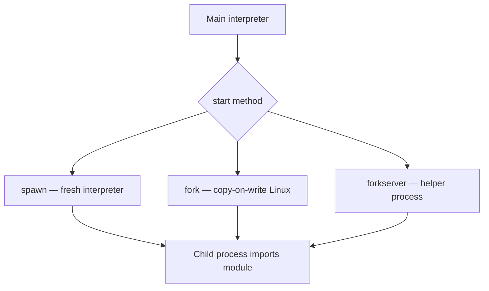
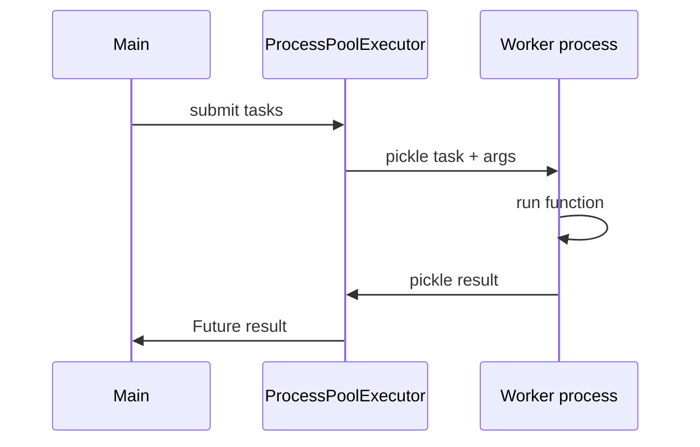
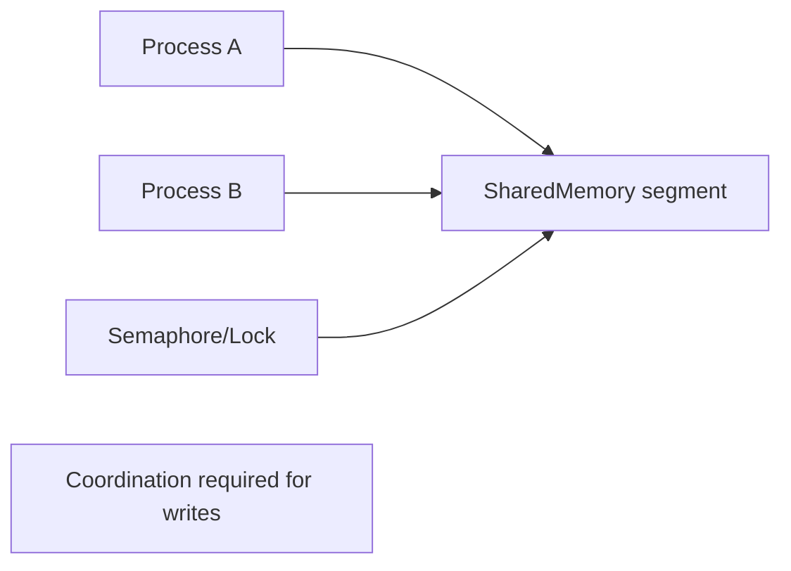
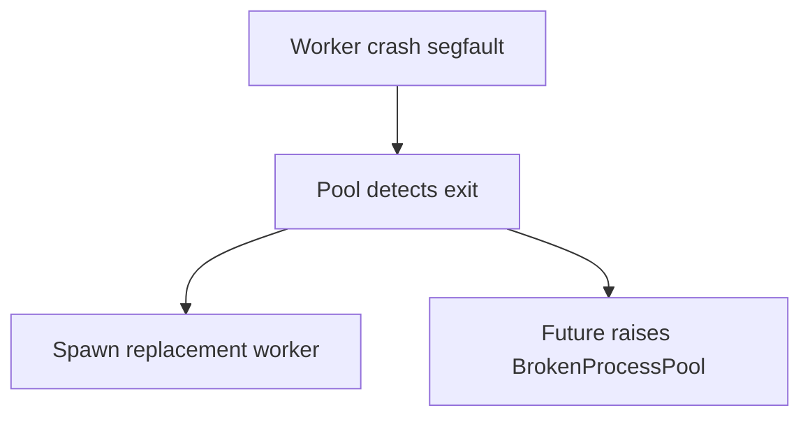

# multiprocessing Shared Memory and Process Pools

## Overview

The **`multiprocessing`** module spawns child **interpreters in separate OS processes**, bypassing the GIL for CPU-bound pure Python. Communication uses pickling over pipes, queues, or **`multiprocessing.shared_memory`** (3.8+) for zero-copy byte regions. **`ProcessPoolExecutor`** in `concurrent.futures` provides a higher-level pool API.

Process isolation improves fault containment but introduces **startup cost**, **serialization overhead**, and **platform-specific start methods** (`spawn`, `fork`, `forkserver`). Container cgroup limits and pod memory are [[16-DevOps/README|DevOps]] concerns; this note owns **CPython process semantics and IPC patterns**.

## Learning Objectives

- Choose process pools vs threads vs asyncio for CPU workloads
- Use `spawn` safely on macOS/Windows; understand fork pitfalls on Linux
- Share read-heavy data via `shared_memory` with synchronization
- Handle pickling constraints for worker targets
- Design graceful pool shutdown and worker crash recovery

## Prerequisites

- [[03-Python/07-Async-Concurrency-and-Free-Threading/Concurrency Models in Python|Concurrency Models in Python]]
- [[03-Python/07-Async-Concurrency-and-Free-Threading/threading and the GIL|threading and the GIL]]
- [[03-Python/01-Values-Types-and-Data-Model/Mutability Sharing and Copying|Mutability Sharing and Copying]]

## Difficulty

`advanced`

## Estimated Time

- Reading: 3 hours
- Exercises: 4 hours
- Mini project: 6 hours

## History

`multiprocessing` (Python 2.6, PEP 371) mirrored threading API with processes. Pickle-based IPC limited ergonomics. `shared_memory` (2019) added POSIX/Windows shared mappings for numeric/array workloads. `concurrent.futures` unified executors in 3.2.

## Problem It Solves

CPU-bound Python functions cannot scale in threads under the GIL. Forking/spawning processes gives **true parallelism** and memory isolation—critical for sandboxing untrusted code execution and utilizing all cores on batch jobs.

## Internal Implementation

### Start methods



Default on Windows/macOS: **`spawn`** (safe, slower). Linux default historically `fork`—unsafe after threads.

### IPC mechanisms

| Mechanism | Copy cost | Use case |
| --- | --- | --- |
| `Queue` | Pickle serialize | General messages |
| `Pipe` | Pickle | Parent/child duplex |
| `shared_memory` | Map once | Large arrays, ring buffers |
| `Manager` | Proxy RPC | Shared dict/list—slow |

### Process pool lifecycle



## Mermaid Diagrams

### Shared memory layout



### Failure isolation



## Examples

### Minimal Example

CPU parallel map:

```python
from concurrent.futures import ProcessPoolExecutor


def is_prime(n: int) -> bool:
    if n < 2:
        return False
    d = 2
    while d * d <= n:
        if n % d == 0:
            return False
        d += 1
    return True


if __name__ == "__main__":
    nums = range(10_000, 20_000)
    with ProcessPoolExecutor(max_workers=8) as pool:
        results = list(pool.map(is_prime, nums, chunksize=100))
    print(sum(results))
```

Guard `if __name__ == "__main__"` required on spawn platforms.

### Production-Shaped Example

Shared read-only blob + worker processes:

```python
from __future__ import annotations

import multiprocessing as mp
from multiprocessing import shared_memory


def worker(shm_name: str, size: int, out_q: mp.Queue[int]) -> None:
    shm = shared_memory.SharedMemory(name=shm_name)
    try:
        data = shm.buf[:size]
        out_q.put(hash(bytes(data)))
    finally:
        shm.close()


def run_parallel(blob: bytes, workers: int) -> list[int]:
    ctx = mp.get_context("spawn")
    shm = shared_memory.SharedMemory(create=True, size=len(blob))
    shm.buf[: len(blob)] = blob
    out: mp.Queue[int] = ctx.Queue()
    procs = [
        ctx.Process(target=worker, args=(shm.name, len(blob), out))
        for _ in range(workers)
    ]
    try:
        for p in procs:
            p.start()
        for p in procs:
            p.join()
        return [out.get() for _ in procs]
    finally:
        shm.close()
        shm.unlink()
```

For mutable shared structures prefer **`multiprocessing.Manager`** sparingly or message passing—correctness over micro-optimizations.

See [[03-Python/code/README|Python code labs]] for process pool patterns.

## Trade-offs

| Dimension | Upside | Downside | When it matters |
| --- | --- | --- | --- |
| Processes | CPU parallelism + isolation | RAM duplication (CoW helps read) | Batch ETL |
| Pickle IPC | Convenient | Slow + security risk on untrusted pickle | Internal tasks only |
| shared_memory | Fast bulk data | Manual sync | ML feature matrices |
| spawn | Safe | Import overhead each worker | macOS/Win prod |
| fork | Fast startup | Thread+fork hazards | Linux-only legacy |

### When to Use

- CPU-bound pure Python batch processing
- Sandboxed execution of untrusted code (with seccomp/containers—[[18-Security/README|Security]])
- Parallelizing independent tasks with picklable functions

### When Not to Use

- Tiny tasks where spawn overhead dominates
- Functions closing over unpicklable resources (open sockets, locks)
- Tight latency RPC—use in-process async or external workers ([[07-Backend/README|Backend]])

## Exercises

1. Demonstrate `fork` deadlock after creating a thread; switch to `spawn`.
2. Benchmark `Pool.map` vs `ProcessPoolExecutor.map` with chunksize tuning.
3. Share 100MB blob via pickle Queue vs shared_memory—compare time/memory.
4. Handle worker crash: kill -9 worker; observe `BrokenProcessPool`.
5. List objects that fail pickling in your project; refactor for worker entrypoints.

## Mini Project

**Parallel Batch Processor**

CLI reading JSONL lines, processing records in process pool, writing results with backpressure and progress metrics.

## Portfolio Project

Process backend for [[03-Python/projects/Bounded Worker Orchestrator/README|Bounded Worker Orchestrator]] with shared_memory option.

## Interview Questions

1. Why is `if __name__ == "__main__"` required for multiprocessing on Windows?
2. Compare pickle Queue vs shared_memory IPC.
3. What happens if a worker process segfaults?
4. When is `fork` unsafe after threading?
5. How does free-threading change need for multiprocessing?

### Stretch / Staff-Level

1. Design worker pool with max memory per child and recycling after N tasks.
2. Explain copy-on-write fork behavior with Python refcount writes.

## Common Mistakes

- Pickling lambdas or local functions on spawn
- Forking after threads (deadlock/hang)
- Unbounded `Pool.imap` without consumer keeping pace
- Leaving shared_memory segments unlinked after crash

## Best Practices

- Use `spawn` explicitly for cross-platform services
- Top-level picklable worker functions only
- Tune `chunksize` for amortizing IPC
- Recycle workers after heavy memory tasks (`max_tasks_per_child` in Pool)
- Never unpickle untrusted data ([[03-Python/09-Production-Python/Secure Python Practices|Secure Python Practices]])

## Summary

multiprocessing achieves CPU parallelism and isolation by spawning interpreters with IPC—pickle queues for general messages, shared_memory for bulk bytes. Process pools simplify task submission but demand pickling discipline and safe start methods. Choose processes when CPU-bound Python must use all cores and shared mutable state is controlled; defer fleet scaling to Backend/DevOps after in-process model is correct.

## Further Reading

- [[03-Python/07-Async-Concurrency-and-Free-Threading/concurrent futures|concurrent futures]]
- [[03-Python/07-Async-Concurrency-and-Free-Threading/Free-Threaded CPython Trade-offs|Free-Threaded CPython Trade-offs]]
- Python docs — multiprocessing start methods

## Related Notes

- [[03-Python/07-Async-Concurrency-and-Free-Threading/Interpreters Subinterpreters and Isolation|Interpreters Subinterpreters and Isolation]]
- [[03-Python/09-Production-Python/Measuring and Optimizing Performance|Measuring and Optimizing Performance]]
- [[03-Python/README|Python Track]]

## Progress Checklist

- [ ] Explained from first principles
- [ ] Drew at least one Mermaid diagram
- [ ] Implemented a minimal version
- [ ] Documented trade-offs and non-goals
- [ ] Completed exercises
- [ ] Practiced interview questions aloud
- [ ] Linked prerequisites and dependents
