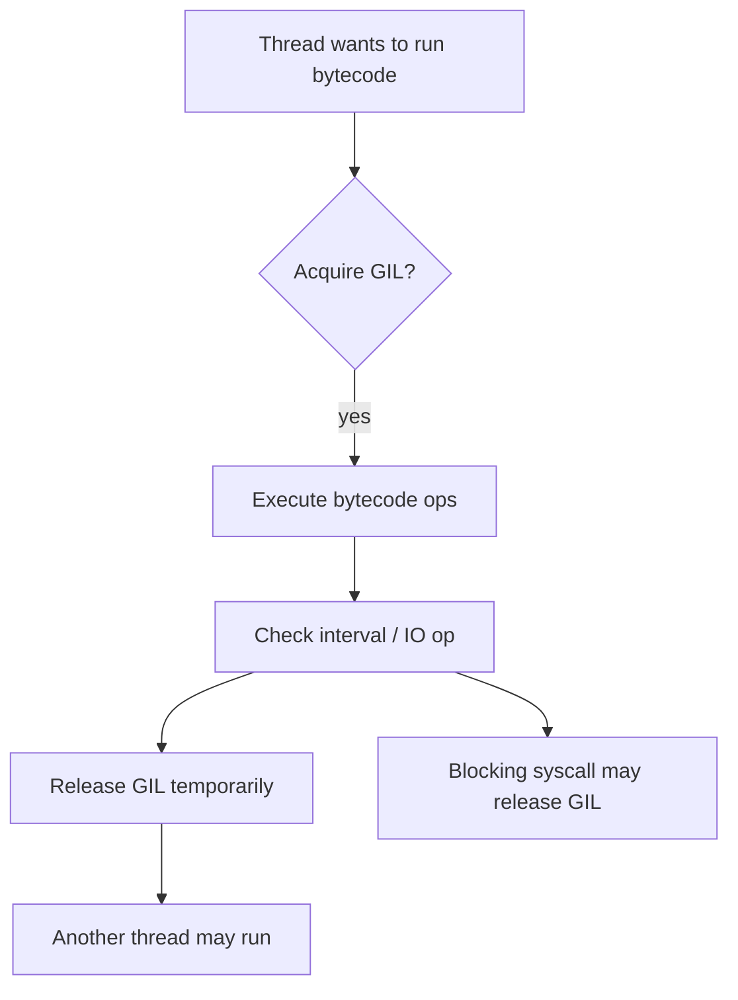
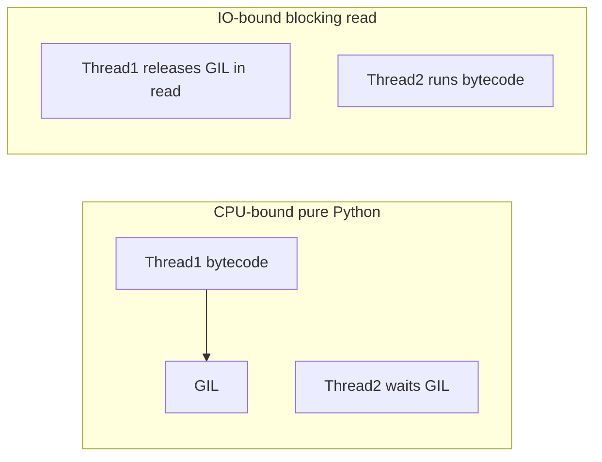
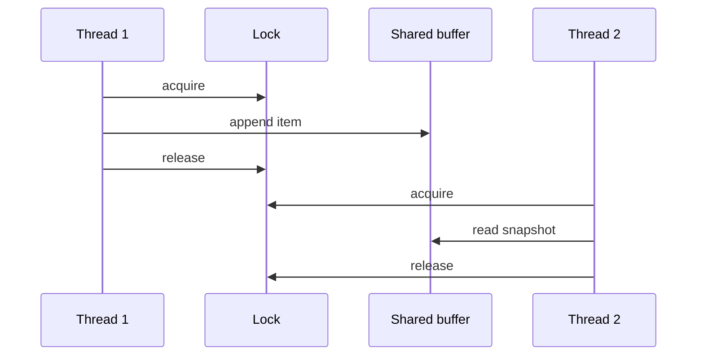

# threading and the GIL

## Overview

The **Global Interpreter Lock (GIL)** is a mutex in CPython protecting internal runtime structures—chiefly reference counting and object allocation—so only one thread executes Python bytecode at a time per interpreter. The `threading` module exposes OS threads that share address space; without the GIL (or on free-threaded builds), different rules apply.

Understanding the GIL explains why CPU-bound pure Python rarely scales with threads, why IO-bound threads still help, and why C extensions can release the GIL during heavy native work. Linux kernel scheduling and pthread behavior are [[10-Linux/README|Linux]] topics; here we focus on **CPython's interpreter lock and Python-level threading primitives**.

## Learning Objectives

- Explain why the GIL exists (refcount + single-threaded CPython history)
- Predict when threads parallelize IO vs fail on CPU-bound Python code
- Use `threading.Lock`, `RLock`, `Event`, and `Condition` correctly
- Identify C-extension code paths that release the GIL (`numpy`, `zlib`)
- Contrast default GIL CPython with PEP 703 free-threaded builds

## Prerequisites

- [[03-Python/07-Async-Concurrency-and-Free-Threading/Concurrency Models in Python|Concurrency Models in Python]]
- [[03-Python/05-CPython-Runtime-and-Memory/Reference Counting and Immortal Objects|Reference Counting and Immortal Objects]]
- [[01-Computer-Science/05-Concurrency-Fundamentals/Processes Threads and Green Threads|Processes Threads and Green Threads]]

## Difficulty

`intermediate`

## Estimated Time

- Reading: 2–3 hours
- Exercises: 3 hours
- Mini project: 5 hours

## History

Guido van Rossum described the GIL as simplifying C API integration for single-threaded programs. Multi-core machines exposed the limitation; removing the GIL was attempted (gil removal branch) and revived as PEP 703 free-threading (3.13+ optional). `threading` has been stable since early Python 2.x with improved primitives (`Lock`, local storage).

## Problem It Solves

Threads enable:

- Blocking IO overlap (socket reads while other threads run)
- Background workers in GUI/sync apps
- Wrapping legacy blocking libraries

The GIL prevents data races on CPython internals at the cost of **bytecode-level parallelism**. Developers need accurate mental models—not folklore that "threads are useless in Python."

## Internal Implementation

### GIL acquisition cycle (conceptual)



On IO, many C functions release the GIL while waiting—other threads progress.

### Refcount + GIL relationship

Reference increments/decrements are not atomic in default CPython without GIL protection. Free-threaded builds use atomic refcounts and different object layouts—see [[03-Python/07-Async-Concurrency-and-Free-Threading/Free-Threaded CPython Trade-offs|Free-Threaded CPython Trade-offs]].

### threading primitives

| Primitive | Purpose | Pitfall |
| --- | --- | --- |
| `Lock` | Mutual exclusion | Forgetting to release on exception path |
| `RLock` | Reentrant lock for nested acquire | Deadlock across unrelated RLocks |
| `Event` | Signal/wait coordination | Lost wakeups if mis-ordered |
| `Condition` | Wait for predicate | Spurious wakeups—recheck predicate |
| `local()` | Thread-local storage | Hidden mutable state |

Prefer `with lock:` context managers.

## Mermaid Diagrams

### CPU-bound vs IO-bound threading



### Safe shared structure



## Examples

### Minimal Example

Data race without lock:

```python
import threading

counter = 0

def inc() -> None:
    global counter
    for _ in range(100_000):
        counter += 1

threads = [threading.Thread(target=inc) for _ in range(8)]
for t in threads:
    t.start()
for t in threads:
    t.join()
print(counter)  # << 800000 on CPython with GIL races on += 
```

`counter += 1` is read-modify-write—not atomic at Python level despite GIL (GIL can switch between bytecodes).

Fix:

```python
lock = threading.Lock()

def inc_safe() -> None:
    global counter
    for _ in range(100_000):
        with lock:
            counter += 1
```

### Production-Shaped Example

Thread pool feeding blocking queue consumer:

```python
from __future__ import annotations

import queue
import threading
from dataclasses import dataclass


@dataclass(frozen=True)
class Job:
    job_id: str
    payload: bytes


def worker(tasks: queue.Queue[Job | None], results: queue.Queue[tuple[str, bytes]]) -> None:
    while True:
        job = tasks.get()
        try:
            if job is None:
                return
            results.put((job.job_id, process(job.payload)))
        finally:
            tasks.task_done()


def process(data: bytes) -> bytes:
    ...  # CPU or blocking IO — document which
```

Use `queue.Queue` for producer/consumer—avoid busy-wait. Service-level queue durability (SQS, Kafka) is [[07-Backend/README|Backend]].

See [[03-Python/code/README|Python code labs]] for GIL timing experiments.

## Trade-offs

| Dimension | Upside | Downside | When it matters |
| --- | --- | --- | --- |
| threading + GIL | Simple IO overlap | No CPU parallelism (pure Python) | Legacy sync libs |
| Fine-grained locks | Correctness | Deadlock/livelock risk | Shared caches |
| thread-local | Avoid locks for per-request state | Hard to test/trace | Request context |
| Removing GIL | True thread CPU | Extension ecosystem migration | 3.14t adoption |

### When to Use

- Blocking IO in sync applications
- Offloading blocking sections from asyncio via executor
- Parallel native work in extensions that release GIL

### When Not to Use

- CPU-bound pure Python scaling—prefer multiprocessing
- High-frequency shared mutations without clear locking strategy

## Exercises

1. Benchmark `threading` vs `multiprocessing` on pure Python hash loop.
2. Demonstrate GIL release during `time.sleep` and file read.
3. Implement producer/consumer with `queue.Queue` and graceful shutdown sentinels.
4. Create deadlock with two locks; fix with lock ordering.
5. Compare race on `counter += 1` vs using `threading.local` aggregation.

## Mini Project

**Thread-Safe Metrics Aggregator**

Counters per label set updated from many threads; merge with lock striping; compare correctness vs performance.

## Portfolio Project

Extend [[03-Python/projects/Bounded Worker Orchestrator/README|Bounded Worker Orchestrator]] thread backend with lock profiling.

## Interview Questions

1. What is the GIL and why does CPython have it?
2. Why can threads still help IO-bound Python programs?
3. Is `counter += 1` atomic in Python?
4. How do NumPy operations interact with the GIL?
5. What changes in free-threaded CPython regarding the GIL?

### Stretch / Staff-Level

1. Explain why removing the GIL required atomic refcounts and what broke.
2. Design lock hierarchy for a connection pool + cache + metrics system.

## Common Mistakes

- Expecting linear speedup threading CPU Python
- Using bare `threading.Thread` without join/shutdown plan
- Holding locks while calling user code (reentrancy/deadlock)
- Mixing fork and threads on Linux

## Best Practices

- Prefer higher-level executors (`concurrent.futures`) for pools
- Minimize shared mutable state; use message queues
- Always use context managers for locks
- Document whether called C extensions release GIL
- Test under load for race conditions (`pytest`-thread stress)

## Summary

The GIL serializes bytecode execution in default CPython to protect refcounted internals, shaping threading effectiveness: great for overlapping blocking waits, poor for parallel pure Python CPU. Python-level races still exist despite the GIL. Free-threaded 3.14+ builds remove this bottleneck but impose extension compatibility work. Threading primitives plus disciplined locking enable safe shared-memory patterns within one process.

## Further Reading

- PEP 703 — Making the Global Interpreter Lock Optional
- [[03-Python/07-Async-Concurrency-and-Free-Threading/Free-Threaded CPython Trade-offs|Free-Threaded CPython Trade-offs]]
- [[03-Python/05-CPython-Runtime-and-Memory/Reference Counting and Immortal Objects|Reference Counting and Immortal Objects]]

## Related Notes

- [[03-Python/07-Async-Concurrency-and-Free-Threading/concurrent futures|concurrent futures]]
- [[03-Python/07-Async-Concurrency-and-Free-Threading/multiprocessing Shared Memory and Process Pools|multiprocessing Shared Memory and Process Pools]]
- [[03-Python/README|Python Track]]

## Progress Checklist

- [ ] Explained from first principles
- [ ] Drew at least one Mermaid diagram
- [ ] Implemented a minimal version
- [ ] Documented trade-offs and non-goals
- [ ] Completed exercises
- [ ] Practiced interview questions aloud
- [ ] Linked prerequisites and dependents
