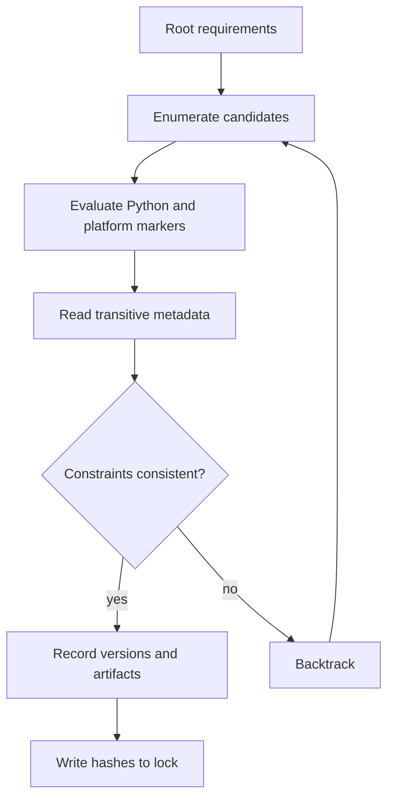
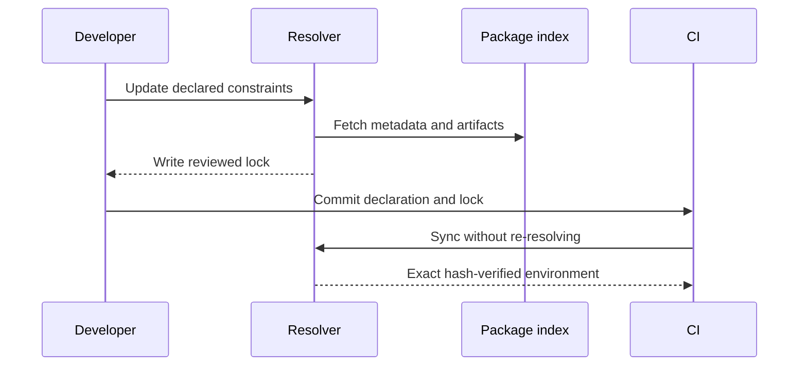

---
title: Dependency Locking and Reproducibility
aliases: [lockfiles, reproducible environments, dependency resolution]
track: 03-Python
topic: dependency-locking
difficulty: intermediate
status: active
prerequisites:
  - "[[03-Python/08-Modules-Packaging-and-Environments/pyproject Build Backends and Wheels|pyproject Build Backends and Wheels]]"
tags: [python, packaging, lockfiles, reproducibility, supply-chain]
created: 2026-07-21
updated: 2026-07-21
---

# Dependency Locking and Reproducibility

## Overview

A dependency declaration describes an acceptable set of releases; a lock records one resolver outcome.
Reproducibility means rebuilding from the same declared inputs yields an equivalent environment.
It requires pinned transitive versions, artifact hashes, interpreter constraints, platform markers, and controlled indexes.
A lockfile alone cannot freeze operating-system libraries, mutable package indexes, or nondeterministic application behavior.

## Learning Objectives

- Separate abstract requirements from concrete lock data
- Explain resolver backtracking and environment markers
- Produce hash-checked, platform-aware installations
- Design safe update and vulnerability-response workflows
- Diagnose lock drift on CPython 3.14+

## Prerequisites

- [[03-Python/08-Modules-Packaging-and-Environments/pyproject Build Backends and Wheels|pyproject Build Backends and Wheels]]
- [[03-Python/08-Modules-Packaging-and-Environments/Virtual Environments and Interpreter Isolation|Virtual Environments and Interpreter Isolation]]

## Difficulty

`intermediate`

## Estimated Time

- Reading: 3 hours
- Exercises: 4 hours
- Mini project: 6 hours

## History

Early Python projects shared hand-maintained `requirements.txt` files.
`pip freeze` captured installed versions but not intent, hashes, or resolution metadata.
Pipenv, Poetry, PDM, and uv introduced project-aware locking.
PEP 665 proposed a wheel-only lock format but was rejected; no universal lock format resulted.
PEP 751 later standardized `pylock.toml`, while tool-specific formats remain common in deployed systems.

## Problem It Solves

Given `httpx>=0.27`, two installations months apart may select different `httpcore`, `anyio`, and certificate packages.
The newer graph can be valid according to metadata yet behave differently.
A lock makes that resolution reviewable and repeatable.

It also prevents accidental upgrades during deployment and allows security scanners to inspect the full graph.
It does not prove that selected artifacts are trustworthy; integrity controls are covered in [[03-Python/08-Modules-Packaging-and-Environments/Distribution Signing and Supply-Chain Integrity|Distribution Signing and Supply-Chain Integrity]].

## Internal Implementation

A resolver treats each requirement as a constraint over candidate versions.
It intersects version specifiers, evaluates markers for the target environment, reads dependency metadata, and backtracks when a candidate makes the graph inconsistent.



Important dimensions include:

- `Requires-Python`, especially when adopting CPython 3.14
- wheel tags such as `cp314-cp314-win_amd64`
- `sys_platform`, `platform_machine`, and implementation markers
- extras, which add conditional dependency edges
- source index and direct-URL provenance
- hashes for every permitted distribution artifact

### Declaration Versus Lock

`pyproject.toml` should communicate compatibility to downstream consumers:

```toml
[project]
requires-python = ">=3.14"
dependencies = [
  "httpx>=0.28,<1",
  "structlog>=25,<26",
]

[project.optional-dependencies]
test = ["pytest>=8", "hypothesis>=6"]
```

The lock should contain exact selected versions and hashes.
Applications normally commit a lock; reusable libraries usually publish ranges because consumers must resolve a combined graph.

### Installation Lifecycle



### Verifying Runtime State

Use the interpreter that owns the environment:

```python
from importlib.metadata import PackageNotFoundError, version
from platform import python_version

REQUIRED = {"httpx": "0.28.1", "structlog": "25.4.0"}

def verify_environment() -> list[str]:
    problems = [f"unexpected Python {python_version()}"] if python_version() < "3.14" else []
    for distribution, expected in REQUIRED.items():
        try:
            actual = version(distribution)
        except PackageNotFoundError:
            problems.append(f"{distribution} is missing")
        else:
            if actual != expected:
                problems.append(f"{distribution}: expected {expected}, found {actual}")
    return problems
```

String comparison is not suitable for general version ordering; it is only used above for an exact deployment assertion.
Use `packaging.version.Version` when comparing arbitrary versions.

## CPython 3.14+ Compatibility

- Set `requires-python` so resolvers reject unsupported interpreters before installation.
- Confirm compiled dependencies publish `cp314` or stable-ABI wheels.
- A free-threaded build may need `cp314t`-compatible artifacts; ordinary CPython wheels are not automatically interchangeable.
- Regenerate locks when marker semantics, wheel availability, or supported architectures change.
- Keep separate lock targets when Linux, Windows, macOS, or free-threaded builds resolve differently.
- Do not silently fall back to local source builds in production.

## Reproducibility Levels

1. Version repeatability pins package versions.
2. Artifact repeatability pins filenames and cryptographic hashes.
3. Environment repeatability pins Python build, platform, and native libraries.
4. Build repeatability controls backend versions, source dates, locale, and toolchain.
5. Behavioral repeatability also controls data, time, randomness, and external services.

## Examples

### Hash-Checked Requirements

```text
httpx==0.28.1 \
    --hash=sha256:REVIEWED_HASH_FOR_WHEEL \
    --hash=sha256:REVIEWED_HASH_FOR_SDIST
```

The strings must be real hashes emitted by the chosen resolver; never invent or weaken them.
Install with `python -m pip install --require-hashes -r requirements.txt`.

### Production Workflow

```powershell
uv lock --upgrade-package httpx
uv sync --frozen
python -m pip check
python -m pytest
```

`--frozen` makes stale lock data a failure instead of triggering an unreviewed resolution.
Exact flags differ by tool; pin the tool version in CI.

## Trade-offs

| Dimension | Upside | Downside | When it matters |
| --- | --- | --- | --- |
| Exact pins | Predictable deployment | Delays fixes without updates | Applications |
| Hashes | Detect artifact substitution | Larger multi-platform lock | High-assurance delivery |
| One lock | Simple workflow | May hide platform divergence | Pure-Python stacks |
| Per-target locks | Accurate artifacts | More maintenance | Native extensions |
| Frequent updates | Smaller upgrade jumps | More review workload | Internet-facing systems |

### When to Use

- Deployable applications, services, CLIs, and data jobs
- CI environments where failures must be attributable
- Regulated or security-sensitive systems
- Developer environments expected to match production

### When Not to Use

- Do not force an application's exact lock onto users of a reusable library.
- Do not treat `pip freeze` from an unknown machine as a trusted lock.
- Do not use a lock as a substitute for artifact verification or runtime tests.

## Update Policy

- Schedule small, regular update batches.
- Separate direct from transitive dependency changes in review.
- inspect release notes and resolver diffs.
- Run compatibility, security, and smoke tests before merging.
- Define an emergency path for actively exploited vulnerabilities.
- Remove stale dependencies; an unused package remains attack surface.

## Common Failure Modes

- Resolving on one platform and assuming the result covers all targets
- Omitting hashes for alternate artifacts
- Allowing deployment to update the lock
- Forgetting extras when locking
- Mixing public and private indexes without explicit source policy
- Pinning a vulnerable release indefinitely for 窶徭tability窶・- Running `pip` from a different interpreter than `python`

## Exercises

1. Compare `pip freeze` with a resolver-generated lock and classify every extra field.
2. Create Linux and Windows lock targets for a package with native wheels.
3. Introduce incompatible transitive constraints and narrate resolver backtracking.
4. Add hash checking, then prove a modified wheel is rejected.
5. Upgrade one direct dependency and review every transitive change.

## Mini Project

Build a lock auditor that reads `pyproject.toml` and a chosen lock format.
Report undeclared packages, stale direct constraints, missing hashes, unsupported Python markers, and unexpected indexes.
Return stable exit codes and JSON output for CI.
Test malformed files, duplicate names, extras, and platform-specific records.

## Portfolio Project

Create a multi-platform release pipeline for a CPython 3.14 service.
Resolve per target, mirror approved wheels, verify hashes offline, create an SBOM, run tests in clean environments, and document emergency dependency updates.
Include evidence that deployment performs synchronization without resolution.

## Interview Questions

1. Why is `requirements.txt` not necessarily a lockfile?
2. How does resolver backtracking work?
3. Why can one lock differ across operating systems?
4. What does `Requires-Python` protect?
5. Why do reusable libraries usually avoid exact transitive pins?
6. What does `--require-hashes` guarantee and not guarantee?
7. How would you update a vulnerable transitive dependency safely?

### Stretch / Staff-Level

1. Design dependency governance for 500 Python services with different release cadences.
2. Explain how private-index fallback can enable dependency confusion.
3. Define measurable reproducibility guarantees for source-built native extensions.

## Best Practices

- Commit both declarations and generated locks.
- Make CI fail when lock and declaration diverge.
- Pin the resolver version as part of the build toolchain.
- Prefer wheels and explicit indexes for deployments.
- Verify on every supported interpreter and architecture.
- Keep dependency updates routine rather than exceptional.

## Summary

Requirements express allowed solutions; locks record a reviewed solution.
Production reproducibility comes from exact versions, artifact hashes, target-aware metadata, frozen installation, and disciplined updates.
CPython 3.14 adoption must account for interpreter markers and wheel availability, especially for native and free-threaded builds.

## Further Reading

- [Python Packaging User Guide: Reproducible Environments](https://packaging.python.org/)
- [PEP 440 窶・Version Identification](https://peps.python.org/pep-0440/)
- [PEP 508 窶・Dependency Specification](https://peps.python.org/pep-0508/)
- [PEP 751 窶・A File Format to List Python Dependencies](https://peps.python.org/pep-0751/)

## Related Notes

- [[03-Python/08-Modules-Packaging-and-Environments/Distribution Signing and Supply-Chain Integrity|Distribution Signing and Supply-Chain Integrity]]
- [[03-Python/09-Production-Python/Operational Readiness for CLIs and Services|Operational Readiness for CLIs and Services]]
- [[03-Python/code/README|Python code labs]]

## Progress Checklist

- [ ] Explained resolution from first principles
- [ ] Drew both dependency lifecycle diagrams
- [ ] Produced a hash-checked lock
- [ ] Tested all target platforms
- [ ] Practiced interview questions aloud
- [ ] Practiced interview questions aloud
- [ ] Linked prerequisites and dependents
