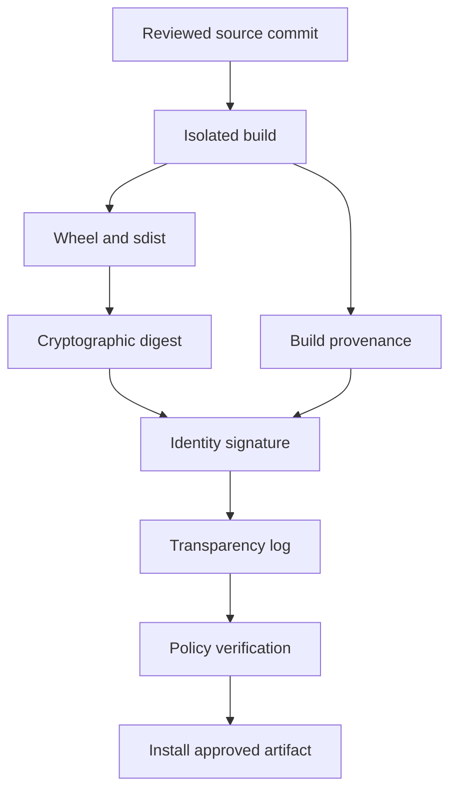
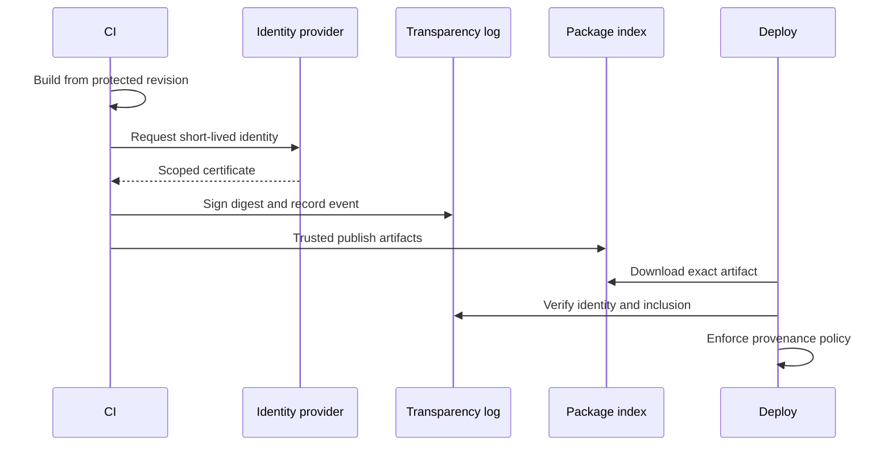

# Distribution Signing and Supply-Chain Integrity

## Overview

Supply-chain integrity asks whether a Python artifact is the intended output of an authorized build from reviewed source.
Hashes detect changed bytes but do not identify the producer.
Signatures bind bytes to a key or identity.
Provenance records how, where, and from which source revision an artifact was built.
A secure pipeline combines all three with dependency policy, isolated builds, protected publishing, and verification before execution.

## Learning Objectives

- Distinguish hashes, signatures, attestations, and trust policy
- Threat-model Python package publication
- Verify artifacts before installation
- Design identity-based signing and key rotation
- Build provenance-aware CPython 3.14 releases

## Prerequisites

- [[03-Python/08-Modules-Packaging-and-Environments/pyproject Build Backends and Wheels|pyproject Build Backends and Wheels]]
- [[03-Python/08-Modules-Packaging-and-Environments/Dependency Locking and Reproducibility|Dependency Locking and Reproducibility]]

## Difficulty

`advanced`

## Estimated Time

- Reading: 4 hours
- Exercises: 5 hours
- Mini project: 8 hours

## History

Package ecosystems initially relied heavily on TLS and repository accounts.
Detached PGP signatures were possible but key discovery, rotation, and verification were inconsistent.
The Update Framework inspired role separation and compromise recovery.
Sigstore introduced short-lived identity certificates and public transparency logs.
PyPI trusted publishing reduces long-lived API tokens by exchanging CI workload identity for scoped publication authority.

## Problem It Solves

Attackers target maintainer credentials, build runners, dependency names, release automation, and package indexes.
TLS protects one network connection; it cannot prove the build used reviewed source.
A lock hash detects substitution only if the expected hash itself came through a trusted review path.
Signing and provenance make release claims verifiable and auditable.

## Threat Model

Protect against:

- dependency confusion and typosquatting
- stolen publishing tokens
- compromised maintainer workstations
- mutable CI actions or build images
- source-to-artifact substitution
- index or mirror tampering
- rollback to known-vulnerable releases
- malicious build dependencies

No signing system makes malicious reviewed source safe.
Policy must also govern source review, build isolation, and dependency admission.

## Integrity Layers



- Digest: content identity and corruption detection
- Signature: authorization claim over content
- Certificate: binding from key to identity
- Transparency log: publicly auditable inclusion
- Attestation: signed statement about build facts
- Policy: rules deciding which claims are acceptable

### Release and Verification Sequence



## Hash Verification

Compute hashes as bytes stream through a bounded buffer:

```python
from __future__ import annotations

import hashlib
from pathlib import Path

def sha256_file(path: Path) -> str:
    digest = hashlib.sha256()
    with path.open("rb") as stream:
        while block := stream.read(1024 * 1024):
            digest.update(block)
    return digest.hexdigest()

def verify(path: Path, expected: str) -> None:
    actual = sha256_file(path)
    if not hashlib.compare_digest(actual, expected.lower()):
        raise ValueError(f"integrity check failed for {path.name}")
```

`compare_digest` avoids data-dependent equality behavior, although artifact hashes are not normally secret.
The expected digest must come from a trusted lock or verified attestation.
Checking a digest downloaded beside an artifact from the same compromised location provides little protection.

## Signing Models

### Long-Lived Keys

Offline keys offer explicit control and can support air-gapped verification.
They require secure generation, storage, rotation, revocation, and maintainer handoff.
CI secrets containing private keys are high-value targets.

### Keyless Identity

Keyless signing uses a short-lived key certified against an OIDC identity.
Policy verifies issuer, repository, workflow, branch or tag, artifact digest, and log inclusion.
This reduces secret management but depends on identity-provider and transparency infrastructure.

### Repository Attestations

An index may attach trusted-publisher attestations to distributions.
Consumers must verify the statement and its identity claims rather than merely observing that an attestation exists.
The accepted workflow identity should be narrow and version-controlled.

## Build Isolation

PEP 517 isolation separates declared build requirements from the caller environment.
It is not a sandbox: the backend and build dependencies execute code with runner permissions.
Use ephemeral workers, minimal credentials, pinned immutable actions, controlled network access, and read-only source where feasible.
Build wheel and sdist once, then promote the same bytes through environments.

## Provenance Contents

Useful provenance records:

- source repository and immutable revision
- CI workflow identity and revision
- builder image or environment digest
- build command and backend versions
- input dependency digests
- output artifact digests
- build timestamp and invocation identifier
- parameters such as target ABI and architecture

Avoid embedding secrets, tokens, or sensitive internal paths.
Provenance is evidence, not proof that the builder was uncompromised.

## CPython 3.14+ Compatibility

- Verify each wheel tag, including `cp314` and architecture, against the intended runtime.
- Treat free-threaded `cp314t` artifacts as separate build and policy subjects.
- Prefer stable-ABI wheels only when the extension genuinely conforms to the limited API.
- Record the exact CPython build and compiler for native artifacts.
- Rebuild attestations when artifacts change; signatures do not transfer between bytes.
- Test installation with tools that understand the repository’s current attestation format.

## Secure Publishing

Use trusted publishing with repository, workflow, environment, and project scope.
Protect release tags and deployment environments with review.
Grant the publishing job no credentials until tests and artifact verification pass.
Publish by digest where supported.
Prevent a post-build job from replacing artifacts before upload.
Separate test-index credentials from production publication.

## Consumer Verification

A consumer policy might require:

1. package name and version exactly match an approved lock
2. artifact digest matches the lock
3. signature certificate has an accepted issuer
4. subject identifies the expected repository and workflow
5. source revision is a protected release tag
6. transparency inclusion is valid
7. provenance output digest matches the downloaded wheel
8. no rollback below the minimum approved version

Fail closed for deployment.
Provide a documented, audited break-glass path rather than an undocumented bypass.

## Trade-offs

| Control | Benefit | Cost or limitation |
| --- | --- | --- |
| Hash lock | Simple byte integrity | Trust bootstrap remains |
| Long-lived signature | Offline verification | Key lifecycle burden |
| Keyless signing | No stored signing key | Identity/log dependency |
| Reproducible build | Independent comparison | Toolchain normalization cost |
| Isolated builder | Limits contamination | More infrastructure |
| Private mirror | Central policy | Availability and curation burden |

### When to Use

- Every public package release
- Internal artifacts crossing trust boundaries
- Regulated, privileged, or internet-facing deployments
- Native wheels whose build process is difficult to inspect

### When Not to Use

- Do not add unsigned checksum files and claim producer authenticity.
- Do not retain a CI signing key merely because keyless migration requires policy work.
- Do not trust any signature without validating identity and authorization.
- Do not rebuild separately in each deployment stage when promoting identical bytes is possible.

## Incident Response

Prepare for token theft, key compromise, malicious release, and builder compromise.
Revoke credentials, pause publication, preserve logs, identify affected digests, publish advisories, and rotate trust roots.
Because package files are often immutable, release a fixed version rather than replacing bytes under an existing filename.
Consumers need an emergency denylist and forced-upgrade mechanism.

## Common Mistakes

- Signing on an unprotected developer laptop
- Verifying cryptography but not signer identity
- Trusting an artifact’s adjacent checksum
- Allowing unpinned third-party CI actions in release jobs
- Giving pull-request builds publication credentials
- Publishing before recording immutable digests
- Confusing malware scanning with provenance
- Failing to plan key or identity rotation

## Exercises

1. Draw a threat model for a wheel from commit to production.
2. Tamper with one byte and demonstrate digest rejection.
3. Define keyless identity constraints for a release workflow.
4. Compare provenance for CPython 3.14 normal and free-threaded wheels.
5. Write an incident runbook for a stolen publishing credential.

## Mini Project

Build a verifier that accepts an artifact, lock record, provenance statement, and configurable identity policy.
Validate digest agreement, package filename, source revision, builder identity, and target ABI.
Emit machine-readable findings and stable exit statuses.
Use a mature cryptographic verifier rather than implementing signature primitives.

## Portfolio Project

Create a hardened release pipeline for a package with pure-Python and native wheels.
Use ephemeral builds, trusted publishing, keyless signatures, attestations, an SBOM, a transparency log, and a policy-gated internal mirror.
Demonstrate rejection of a tampered wheel, unauthorized workflow, and rollback.

## Interview Questions

1. What does a hash guarantee?
2. How does signing add to hashing?
3. What is build provenance?
4. Why is PEP 517 isolation not a sandbox?
5. What problem does trusted publishing solve?
6. How should a consumer validate keyless identity?
7. Why promote the same artifact bytes?

### Stretch / Staff-Level

1. Design trust-root rotation across thousands of offline workers.
2. Prioritize mitigations after a build-runner compromise.
3. Define an artifact admission policy for a private Python mirror.

## Best Practices

- Build once from a protected immutable revision.
- Minimize and pin the release toolchain.
- Prefer short-lived, narrowly scoped publication identity.
- Sign digests and preserve provenance.
- Verify identity, authorization, and transparency inclusion.
- Exercise compromise and rollback procedures.

## Summary

Supply-chain integrity is an end-to-end property, not a signature checkbox.
Hashes identify bytes, signatures identify authorized claims, provenance links artifacts to builds, and policy decides whether those claims are acceptable.
Strong Python delivery combines protected source, isolated ephemeral builds, trusted publishing, transparent attestations, and fail-closed consumer verification.

## Further Reading

- [Python Packaging User Guide: Package index interfaces](https://packaging.python.org/)
- [PyPI Trusted Publishers](https://docs.pypi.org/trusted-publishers/)
- [Sigstore documentation](https://docs.sigstore.dev/)
- [SLSA provenance](https://slsa.dev/)

## Related Notes

- [[03-Python/09-Production-Python/Secure Python Practices|Secure Python Practices]]
- [[03-Python/08-Modules-Packaging-and-Environments/Dependency Locking and Reproducibility|Dependency Locking and Reproducibility]]
- [[03-Python/code/README|Python code labs]]

## Progress Checklist

- [ ] Modeled package threats
- [ ] Distinguished integrity evidence
- [ ] Verified an artifact before install
- [ ] Tested unauthorized identity rejection
- [ ] Practiced interview questions aloud
