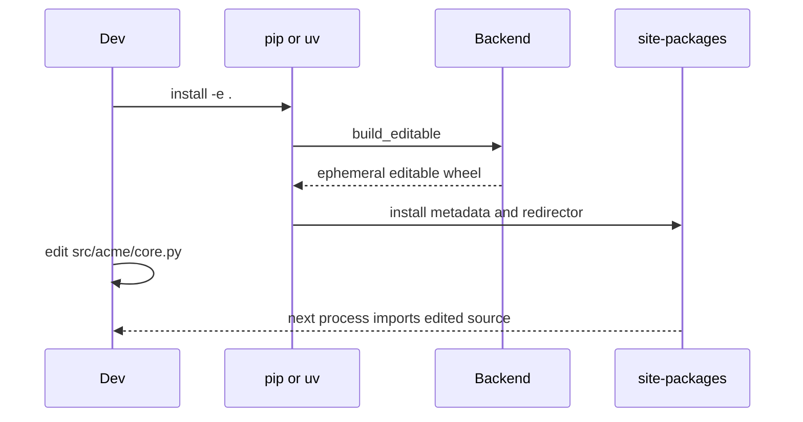
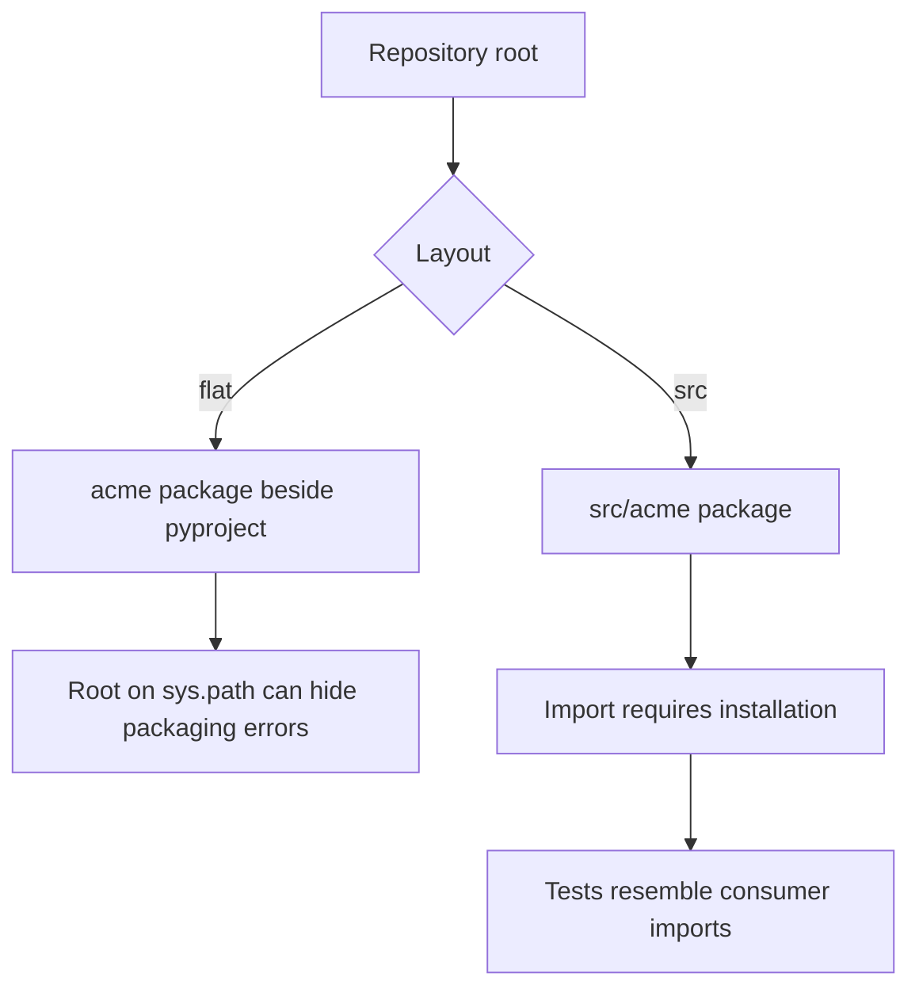

# Editable Installs and Development Layouts

## Overview

An editable install makes an environment import project code from its working tree while preserving distribution metadata.
PEP 660 lets a build backend produce a special editable wheel consumed by a frontend such as pip.
The `src/` layout places import packages below `src`, preventing the repository root from accidentally satisfying imports.
Editable installs accelerate development, but only a normal wheel proves what users will receive.

## Learning Objectives

- Explain PEP 660’s frontend/backend protocol
- Choose between flat and `src/` layouts
- Diagnose path shadowing and stale metadata
- Test both editable and built installations
- Design monorepo development environments

## Prerequisites

- [[03-Python/08-Modules-Packaging-and-Environments/Import System and Module Objects|Import System and Module Objects]]
- [[03-Python/08-Modules-Packaging-and-Environments/pyproject Build Backends and Wheels|pyproject Build Backends and Wheels]]

## Difficulty

`intermediate`

## Estimated Time

- Reading: 2 hours
- Exercises: 4 hours
- Mini project: 5 hours

## History

Setuptools historically implemented `setup.py develop` using `.egg-link` files and path manipulation.
That mechanism coupled editing behavior to one backend.
PEP 660 standardized editable build hooks while leaving implementation strategy to the backend.
Backends may emit `.pth` files, import hooks, symlinks, or generated proxy modules.

## Problem It Solves

Without an editable install, every source edit requires rebuilding and reinstalling.
Adding the repository root to `PYTHONPATH` is fast but skips metadata, dependencies, entry-point launchers, and backend package selection.
Editable installation gives a package-like environment with live source imports.

## Internal Implementation

The installer creates an isolated build environment, asks the backend for editable metadata and an editable wheel, then installs that wheel.
The resulting environment contains metadata plus a mechanism that redirects imports to source.



The editable wheel is an installation transport, not a release artifact.
Do not publish it.
Changes to Python source are usually visible to new processes immediately.
Changes to metadata, dependencies, console scripts, package data, or compiled extensions usually require reinstalling or rebuilding.

### Layout Comparison



Example:

```text
acme-widget/
├── pyproject.toml
├── README.md
├── src/
│   └── acme_widget/
│       ├── __init__.py
│       └── cli.py
└── tests/
    └── test_cli.py
```

With `src/`, running Python from the repository root does not directly expose `acme_widget`.
That inconvenience is intentional: missing package configuration fails early.

### Backend Configuration

```toml
[build-system]
requires = ["hatchling"]
build-backend = "hatchling.build"

[project]
name = "acme-widget"
version = "1.0.0"
requires-python = ">=3.14"

[tool.hatch.build.targets.wheel]
packages = ["src/acme_widget"]
```

Backend syntax differs.
Verify package discovery rather than copying configuration between setuptools, Hatchling, Flit, or maturin.

### Runtime Diagnosis

```python
from __future__ import annotations

from importlib.metadata import distribution
from pathlib import Path

def describe_install(name: str, import_file: str) -> dict[str, str]:
    dist = distribution(name)
    source = Path(import_file).resolve()
    return {
        "distribution": dist.metadata["Name"],
        "version": dist.version,
        "imported_from": str(source),
        "metadata_at": str(Path(dist._path).resolve()),
    }
```

Using private `Distribution._path` is acceptable only in a diagnostic tool and requires compatibility tests.
Application logic should stay on public `importlib.metadata` APIs.
For basic diagnosis, print `module.__file__`, `sys.path`, `sys.prefix`, and distribution version.

## CPython 3.14+ Compatibility

- Editable semantics come from packaging standards and backend versions, not CPython alone.
- Pin a backend release that declares Python 3.14 support.
- Native extensions still need compilation for CPython 3.14 and may require rebuild after edits.
- Free-threaded CPython may need separate extension artifacts and environments.
- Avoid depending on the current working directory’s implicit `sys.path[0]`.
- Test editable redirectors with subinterpreters only if the backend claims support.

## What Editable Does Not Mean

- It does not make dependency metadata update automatically.
- It does not guarantee package data mirrors a wheel.
- It does not validate sdist inclusion.
- It does not make a moved environment portable.
- It does not isolate multiple checkouts sharing one environment.
- It does not guarantee import behavior equals a regular install.

## Flat Layout Trade-offs

Flat layout is convenient for small applications and direct invocation.
It can accidentally import files that a wheel omits.
Tool configuration, scripts, or a top-level module can shadow installed packages.
If used, CI must run wheel-based tests from outside the repository root.

## src Layout Trade-offs

`src/` adds configuration and requires installation before import.
It creates a stronger boundary between repository files and importable packages.
It is especially valuable for reusable libraries, namespace packages, and projects where packaging correctness matters.
It does not eliminate the need to inspect built artifacts.

## Monorepos

Each independently released distribution should generally own a `pyproject.toml`.
Editable-install selected workspaces into one development environment only when their dependency constraints are compatible.
Beware that two editable projects can provide overlapping namespace portions.
Record which checkout provides each distribution and rebuild the environment when branches change metadata.

## Testing Strategy

Use at least two lanes:

1. Fast development tests against an editable install.
2. Release tests that build a wheel, install it in a fresh environment, and run from outside the source tree.

Add an sdist lane if source distributions are published.
Compare wheel contents with an allowlist.
Run import smoke tests and generated console scripts on every supported platform.

```powershell
python -m venv .venv
.\.venv\Scripts\python -m pip install -e ".[test]"
.\.venv\Scripts\python -m pytest
python -m build
python -m pip install --force-reinstall .\dist\acme_widget-1.0.0-py3-none-any.whl
```

In CI, use separate environments for editable and wheel lanes so redirectors cannot leak into artifact tests.

## Trade-offs

| Dimension | Editable | Regular wheel |
| --- | --- | --- |
| Edit feedback | Immediate for Python source | Rebuild required |
| Metadata fidelity | Can become stale | Captured at build |
| Package data | Backend-dependent | Exact artifact contents |
| Import isolation | Redirected to checkout | Installed files |
| Release confidence | Insufficient alone | Consumer-shaped |

### When to Use

- Active local development
- IDE navigation and debugger workflows
- Multi-package integration during coordinated changes
- Fast test loops paired with artifact tests

### When Not to Use

- Production deployment
- Final release validation
- Environments copied between machines
- Untrusted source checkouts
- Situations requiring immutable application files

## Common Mistakes

- Assuming every file under `src` enters the wheel
- Forgetting to reinstall after changing entry points
- Running artifact tests from the repository root
- Sharing one editable environment across unrelated branches
- Committing generated extension binaries
- Using `PYTHONPATH` as a packaging strategy
- Publishing an editable wheel

## Exercises

1. Build the same package with flat and `src/` layouts and create an omitted-file bug.
2. Inspect the files installed by a PEP 660 backend.
3. Change project metadata and determine which changes require reinstall.
4. Prove a wheel test fails where an editable test passes.
5. Diagnose two editable namespace-package portions.

## Mini Project

Create a `src/`-layout library with typed package data and a console script.
Provide scripts for editable setup, wheel build, wheel-content inspection, and clean-environment tests.
Deliberately omit a data file, reproduce the mismatch, and add a regression test.

## Portfolio Project

Build a three-distribution monorepo with shared namespace packages.
Support selective editable installs, independent wheel releases, dependency constraints, and a matrix that tests both source and wheel modes on CPython 3.14.
Document branch-switch and environment-rebuild rules.

## Interview Questions

1. What does PEP 660 standardize?
2. Why can an editable install differ from a wheel?
3. What problem does the `src/` layout prevent?
4. Which edits require reinstalling?
5. Why should wheel tests run outside the checkout?
6. How do editable installs interact with console scripts?
7. Would you deploy an editable installation?

### Stretch / Staff-Level

1. Design a monorepo workflow that prevents cross-checkout contamination.
2. Compare `.pth`, import-hook, and symlink editable strategies.
3. Define release gates that prove artifact fidelity.

## Best Practices

- Prefer `src/` for distributable libraries.
- Use standardized editable installs through a current backend.
- Reinstall after metadata or entry-point changes.
- Keep editable and artifact-test environments separate.
- Inspect wheel and sdist contents.
- Never deploy editable installations.

## Summary

PEP 660 editable installs combine installed metadata with source-tree imports for rapid development.
The `src/` layout exposes packaging mistakes by preventing incidental root imports.
Because redirectors and stale metadata can diverge from released artifacts, production-quality projects always test ordinary wheels in clean environments.

## Further Reading

- [PEP 660 — Editable installs](https://peps.python.org/pep-0660/)
- [PyPA discussion of src layout](https://packaging.python.org/en/latest/discussions/src-layout-vs-flat-layout/)
- [Build system interface](https://build.pypa.io/)

## Related Notes

- [[03-Python/08-Modules-Packaging-and-Environments/Packages Namespace Packages and init|Packages Namespace Packages and init]]
- [[03-Python/08-Modules-Packaging-and-Environments/Dependency Locking and Reproducibility|Dependency Locking and Reproducibility]]
- [[03-Python/code/README|Python code labs]]

## Progress Checklist

- [ ] Explained PEP 660 lifecycle
- [ ] Compared flat and src layouts
- [ ] Tested an editable install
- [ ] Tested a wheel independently
- [ ] Practiced interview questions aloud
