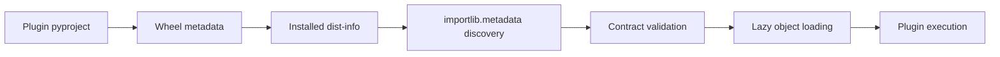
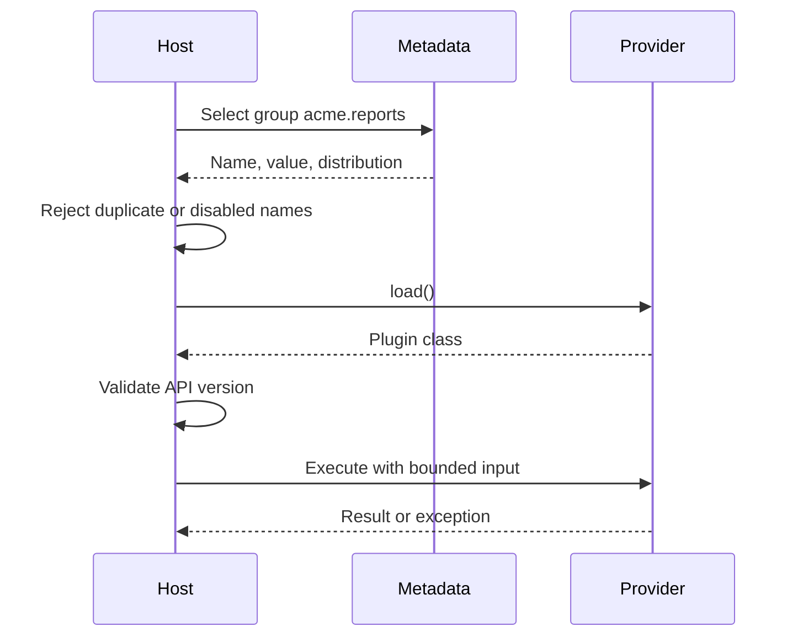

---
title: Entry Points Plugins and Console Scripts
aliases: [entry points, plugin discovery, console scripts]
track: 03-Python
topic: entry-points-plugins-console-scripts
difficulty: intermediate
status: active
prerequisites:
  - "[[03-Python/08-Modules-Packaging-and-Environments/pyproject Build Backends and Wheels|pyproject Build Backends and Wheels]]"
tags: [python, packaging, plugins, entry-points, cli]
created: 2026-07-21
updated: 2026-07-21
---

# Entry Points Plugins and Console Scripts

## Overview

An entry point is distribution metadata mapping a group and name to an importable Python object.
Installers use `console_scripts` entry points to generate executable launchers.
Applications use custom groups to discover plugins without scanning arbitrary directories or importing every installed package.
The mechanism decouples providers from hosts, but it does not create a security boundary or guarantee API compatibility.

## Learning Objectives

- Declare and inspect entry points
- Build lazy, validated plugin discovery
- Design stable plugin contracts
- Ship cross-platform console commands
- Handle duplicate, broken, and untrusted plugins

## Prerequisites

- [[03-Python/08-Modules-Packaging-and-Environments/pyproject Build Backends and Wheels|pyproject Build Backends and Wheels]]
- [[03-Python/08-Modules-Packaging-and-Environments/Import System and Module Objects|Import System and Module Objects]]

## Difficulty

`intermediate`

## Estimated Time

- Reading: 3 hours
- Exercises: 4 hours
- Mini project: 6 hours

## History

Setuptools popularized entry points as distribution metadata.
The interoperability specifications now define entry-point data independently of setuptools.
`importlib.metadata`, added to the standard library, provides runtime access without importing `pkg_resources`.
Modern `pyproject.toml` exposes scripts and custom entry-point groups declaratively.

## Problem It Solves

Hard-coded plugin imports require the host to know every provider.
Filesystem scanning depends on layout and can execute surprising modules.
Entry points let an installed distribution advertise a capability through metadata.
The host chooses when to load it and how to validate it.

## Internal Implementation

A wheel contains an `entry_points.txt` file in its `.dist-info` directory.
Installation places the distribution metadata in `site-packages`.
`importlib.metadata.entry_points()` discovers matching records.
Calling `EntryPoint.load()` imports the module and resolves the referenced attribute.



Metadata discovery is usually safer and cheaper than import.
Loading remains arbitrary code execution.
Never load an untrusted plugin inside a privileged process.

### Declaration

```toml
[project]
name = "acme-report-csv"
version = "1.2.0"
requires-python = ">=3.14"

[project.entry-points."acme.reports"]
csv = "acme_report_csv:CsvReport"

[project.scripts]
acme-report = "acme_report_csv.cli:main"
```

Names in a custom group should be unique and documented.
The value is commonly `module:attribute`; extras in entry-point values are discouraged.

### Discovery and Loading

```python
from __future__ import annotations

from dataclasses import dataclass
from importlib.metadata import EntryPoint, entry_points
from typing import Protocol, runtime_checkable

@runtime_checkable
class ReportPlugin(Protocol):
    api_version: str

    def render(self, rows: list[dict[str, object]]) -> bytes: ...

@dataclass(frozen=True)
class PluginRecord:
    name: str
    distribution: str
    entry_point: EntryPoint

def discover() -> list[PluginRecord]:
    records: list[PluginRecord] = []
    for item in entry_points(group="acme.reports"):
        distribution = item.dist.name if item.dist else "<unknown>"
        records.append(PluginRecord(item.name, distribution, item))
    return sorted(records, key=lambda record: (record.name, record.distribution))

def load(record: PluginRecord) -> type[ReportPlugin]:
    candidate = record.entry_point.load()
    if not isinstance(candidate, type):
        raise TypeError(f"{record.name} must reference a class")
    if getattr(candidate, "api_version", None) != "1":
        raise RuntimeError(f"{record.name} uses an unsupported plugin API")
    return candidate
```

Structural typing helps authors, but runtime protocol checks cannot validate every semantic requirement.
Exercise a conformance test suite against provider implementations.

### Host Lifecycle



### Console Script Semantics

An installer generates a POSIX script or Windows launcher that imports the target and calls it.
The callable should return `None` or an integer process status.
It should not perform work at import time.

```python
from __future__ import annotations

import argparse

def main(argv: list[str] | None = None) -> int:
    parser = argparse.ArgumentParser(prog="acme-report")
    parser.add_argument("--format", default="csv")
    args = parser.parse_args(argv)
    try:
        run_report(args.format)
    except LookupError as exc:
        parser.exit(2, f"configuration error: {exc}\n")
    return 0

def run_report(format_name: str) -> None:
    available = {record.name: record for record in discover()}
    if format_name not in available:
        raise LookupError(f"unknown format {format_name!r}")
    plugin_type = load(available[format_name])
    plugin_type().render([])

if __name__ == "__main__":
    raise SystemExit(main())
```

Keeping `argv` injectable makes the command easy to test.
`python -m package` remains useful as a fallback and requires `package/__main__.py`.

## CPython 3.14+ Compatibility

- Use the selection API `entry_points(group="...")`; avoid assumptions from older dict-like APIs.
- Query metadata through `importlib.metadata`, not deprecated `pkg_resources`.
- Entry-point discovery works across normal CPython builds; loaded native plugins must match the interpreter ABI.
- Free-threaded CPython requires every native plugin dependency to be compatible.
- Generated launchers belong to the environment that installed them; recreate them after moving a virtual environment.

## Contract Design

A production plugin contract should define:

- API version and supported host versions
- construction and shutdown behavior
- input ownership and mutation rules
- sync versus async calling convention
- exception taxonomy
- timeout, cancellation, and resource limits
- thread-safety and reentrancy
- configuration schema
- logging and telemetry expectations

Prefer small capabilities over exposing host internals.
Additive evolution is easier than changing method meanings.

## Duplicate and Failure Policy

Duplicate entry-point names can arise from unrelated distributions.
Do not select whichever metadata iteration returns first.
Fail deterministically, require explicit configuration, or define a documented priority policy.

Discovery errors, import errors, contract failures, and execution failures are different operational events.
Record provider distribution and version in diagnostics without leaking secrets.
Lazy loading confines a broken optional plugin to users who select it.

## Trade-offs

| Dimension | Upside | Downside | When it matters |
| --- | --- | --- | --- |
| Metadata discovery | No package scan | Installed-only view | Extensible applications |
| Lazy loading | Faster startup | Failure moves to first use | Large plugin sets |
| Protocol contract | Loose coupling | Runtime semantics remain unchecked | Third-party authors |
| In-process plugin | Simple and fast | No fault or security isolation | Trusted providers |
| Subprocess plugin | Isolation and limits | Serialization and operations cost | Untrusted providers |

### When to Use

- Independently distributed extensions
- Build, test, formatter, and framework ecosystems
- Commands installed into virtual environments
- Optional capabilities selected at runtime

### When Not to Use

- A fixed set of internal strategies is better represented by an explicit registry.
- Untrusted code needs process or container isolation.
- A single-file script does not need packaging metadata.
- Network services should use an RPC protocol rather than Python object contracts.

## Common Mistakes

- Importing plugins merely to discover them
- Executing application work in module top level
- Ignoring duplicate names
- Catching every plugin exception and continuing silently
- Treating type hints as runtime sandboxing
- Returning strings instead of integer exit statuses
- Naming a console target that is not callable
- Moving virtual environments and retaining stale launchers

## Exercises

1. Inspect all entry points in a virtual environment and group them by distribution.
2. Implement duplicate-name detection with deterministic diagnostics.
3. Write a fake plugin distribution and verify lazy loading.
4. Add API-version negotiation and conformance tests.
5. Compare a console script with `python -m` on Windows and Linux.

## Mini Project

Build a report host with JSON and CSV plugins distributed as separate wheels.
Support listing without importing, enable/disable configuration, duplicate rejection, version validation, and structured failure reports.
Add unit tests using fabricated metadata and integration tests in a fresh virtual environment.

## Portfolio Project

Create an extensible static-analysis CLI.
Run trusted plugins in process and optional untrusted plugins in subprocess workers with deadlines and message-size limits.
Publish an author SDK, contract tests, compatibility policy, and signed example distributions.

## Interview Questions

1. What is stored in an entry point?
2. Why is discovery different from loading?
3. How does a console script become executable?
4. How should a host handle duplicate plugin names?
5. Why does a `Protocol` not secure a plugin?
6. When should plugin execution move out of process?
7. How would you evolve a plugin API compatibly?

### Stretch / Staff-Level

1. Design plugin governance for third-party providers across five host releases.
2. Define failure containment for plugins handling customer data.
3. Compare entry points with import-name conventions and explicit configuration.

## Best Practices

- Reserve a globally distinctive entry-point group.
- Discover metadata first and load only selected providers.
- Validate duplicates, versions, and contracts explicitly.
- Keep console targets thin and testable.
- Publish compatibility and deprecation policies.
- Include provider identity in observability.

## Summary

Entry points are installed metadata references to Python objects.
They support portable launchers and decoupled plugin discovery, while loading still executes provider code.
Production hosts need lazy loading, deterministic conflict handling, explicit compatibility contracts, and isolation proportional to trust.

## Further Reading

- [Entry points specification](https://packaging.python.org/en/latest/specifications/entry-points/)
- [`importlib.metadata`](https://docs.python.org/3/library/importlib.metadata.html)
- [Creating command-line tools](https://packaging.python.org/en/latest/guides/creating-command-line-tools/)

## Related Notes

- [[03-Python/09-Production-Python/API Design Defensive Programming and Compatibility|API Design Defensive Programming and Compatibility]]
- [[03-Python/09-Production-Python/Operational Readiness for CLIs and Services|Operational Readiness for CLIs and Services]]
- [[03-Python/code/README|Python code labs]]

## Progress Checklist

- [ ] Explained metadata and loading separately
- [ ] Built two independently installed plugins
- [ ] Tested generated console launchers
- [ ] Documented contract trade-offs
- [ ] Practiced interview questions aloud
- [ ] Linked prerequisites and dependents
