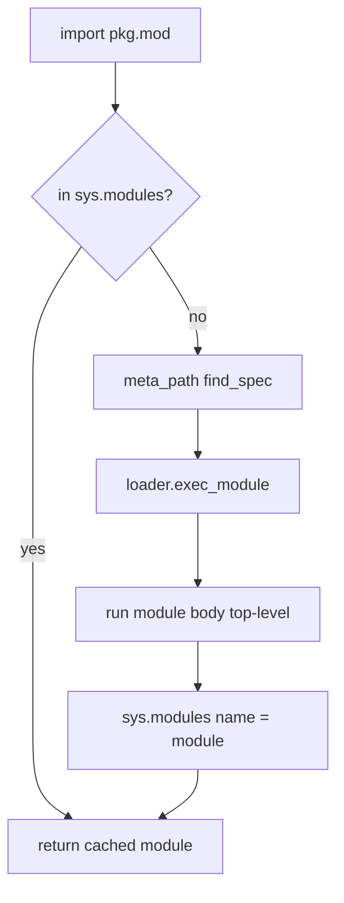
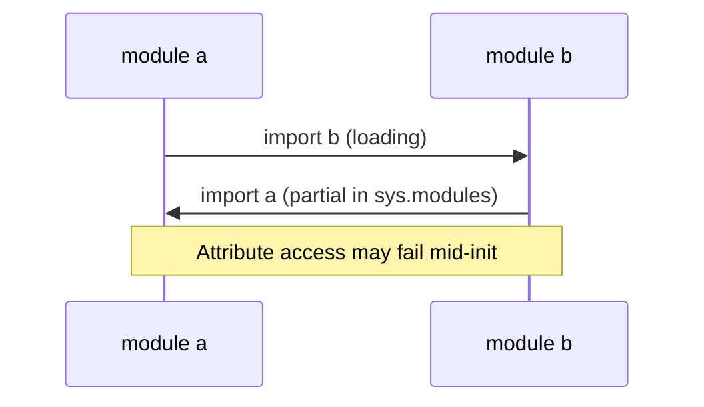

# Import System and Module Objects

## Overview

Python **imports** load code into **module objects** cached in `sys.modules`. The import system (`importlib`) resolves dotted names via **`sys.meta_path` finders** and **`sys.path_hooks`**, executes module body once, and binds names in importer namespace. Understanding imports explains circular import failures, namespace package merging, editable install shadowing, and plugin loaders.

Deployment topology (monorepo layout in CI) touches [[16-DevOps/README|DevOps]]; this note owns **CPython import semantics and module object lifecycle**.

## Learning Objectives

- Trace absolute vs relative import resolution
- Explain `sys.modules` cache and double-import idempotence
- Use `importlib.import_module` and reload pitfalls
- Insert custom meta_path finders for plugins
- Diagnose circular imports and import-time side effects

## Prerequisites

- [[03-Python/02-Execution-Namespaces-and-Functions/Lexical Structure and Compilation Units|Lexical Structure and Compilation Units]]
- [[03-Python/00-Orientation/Python Program Lifecycle|Python Program Lifecycle]]
- [[03-Python/02-Execution-Namespaces-and-Functions/Names Scopes LEGB and Closures|Names Scopes LEGB and Closures]]

## Difficulty

`intermediate`

## Estimated Time

- Reading: 3 hours
- Exercises: 4 hours
- Mini project: 6 hours

## History

Python 1 used simple `import` scanning `sys.path`. PEP 302 (2001) introduced finders/loaders; PEP 328 relative imports; PEP 420 namespace packages (3.3); importlib became canonical in 3.1+. Python 3.14 continues optimizing importlib bootstrap and frozen imports for startup.

## Problem It Solves

Import errors cause production outages:

- Shadowed modules on `sys.path` order
- Circular imports leaving half-initialized modules
- Import-time network/DB calls slowing all workers
- Dynamic plugins without secure finder discipline

## Internal Implementation

### Import algorithm (simplified)



### Module object anatomy

| Attribute | Purpose |
| --- | --- |
| `__name__` | Fully qualified name |
| `__file__` | Origin path if from file |
| `__path__` | Package search paths |
| `__package__` | Parent package for relative imports |
| `__spec__` | Importlib ModuleSpec |
| `__dict__` | Module namespace |

### Finders and loaders

`MetaPathFinder.find_spec` returns `ModuleSpec`; `Loader.exec_module` executes code object.

## Mermaid Diagrams

### Circular import deadlock pattern



Fix: refactor shared deps or lazy import inside functions.

### Plugin finder insertion


## Examples

### Minimal Example

```python
import importlib
import sys

mod = importlib.import_module("json")
print(mod.__name__, mod.__file__)
print("json" in sys.modules)

# Lazy import breaking cycle pattern
def get_heavy():
    import heavy_module
    return heavy_module
```

### Production-Shaped Example

Custom finder sketch (see full project):

```python
from __future__ import annotations

import importlib.abc
import importlib.util
import sys
from pathlib import Path


class DirectoryFinder(importlib.abc.MetaPathFinder):
    def __init__(self, root: Path) -> None:
        self.root = root

    def find_spec(self, fullname, path, target=None):
        rel = Path(*fullname.split("."))
        candidate = self.root / rel.with_suffix(".py")
        if candidate.is_file():
            return importlib.util.spec_from_file_location(fullname, candidate)
        return None


def install_plugin_path(plugins_dir: Path) -> None:
    sys.meta_path.insert(0, DirectoryFinder(plugins_dir))
```

Security review for untrusted plugin paths: [[18-Security/README|Security]]. Import mechanics: this track.

See [[03-Python/code/README|Python code labs]] and [[03-Python/projects/Import Hook Plugin Loader/README|Import Hook Plugin Loader]].

## Trade-offs

| Dimension | Upside | Downside | When it matters |
| --- | --- | --- | --- |
| sys.modules cache | Fast re-import | Stale modules on reload | Hot reload dev |
| Import-time work | Simple init | Slow/multi-worker duplication | Gunicorn workers |
| meta_path hooks | Powerful plugins | Import order fragility | Extensible apps |
| Relative imports | Package cohesion | Breaks if __package__ wrong | Large packages |
| importlib.reload | Dev convenience | Breaks invariants | Not for prod |

### When to Use

- Lazy imports inside functions for cycles and startup time
- importlib utilities for dynamic plugin loading with explicit allowlists
- `if TYPE_CHECKING` imports for typing-only deps

### When Not to Use

- Import-time side effects (network, global mutation) in library modules
- `reload` in production services

## Exercises

1. Create circular import demo; fix with lazy import and with extracted third module.
2. Print `sys.meta_path` and trace which finder loads a namespace package.
3. Implement finder loading modules from zip subdirectory.
4. Measure cold import time for heavy stack (pandas)—profile `-X importtime`.
5. Explain difference `import pkg.mod` vs `from pkg import mod` namespace binding.

## Mini Project

**Import Time Profiler Wrapper**

CLI wrapping `-X importtime` output into sorted report with cumulative ms.

## Portfolio Project

[[03-Python/projects/Import Hook Plugin Loader/README|Import Hook Plugin Loader]] with signed plugin allowlist hook point.

## Interview Questions

1. What is stored in `sys.modules`?
2. Steps from `import x.y` to executable module?
3. How do circular imports manifest?
4. Difference between finder and loader?
5. What is `__spec__` used for?

### Stretch / Staff-Level

1. Design import system for sandboxed plugins with capability tokens.
2. Compare importlib with OS `dlopen` model for extensions.

## Common Mistakes

- Mutable work at import time in `__init__.py`
- Relying on import order across modules
- Shadowing stdlib names with local files
- Using relative imports in scripts executed as `__main__`

## Best Practices

- Keep `__init__.py` thin; export public API explicitly
- Use absolute imports in packages
- Run `python -X importtime` on service cold start budget
- Document plugin finder security assumptions
- Separate `if TYPE_CHECKING` blocks for type-only imports

## Summary

Python imports resolve names through finders/loaders, execute module code once, and cache module objects in `sys.modules`. Circular imports and import-time side effects dominate production import pain. Custom meta_path hooks enable plugins but require security and ordering discipline. Packaging and path configuration extend these mechanics in sibling notes; service deploy pipelines are DevOps handoff after imports work locally.

## Further Reading

- [[03-Python/08-Modules-Packaging-and-Environments/Packages Namespace Packages and init|Packages Namespace Packages and init]]
- Python docs — Import system reference
- PEP 302 / PEP 451 import protocol evolution

## Related Notes

- [[03-Python/08-Modules-Packaging-and-Environments/Entry Points Plugins and Console Scripts|Entry Points Plugins and Console Scripts]]
- [[03-Python/08-Modules-Packaging-and-Environments/Virtual Environments and Interpreter Isolation|Virtual Environments and Interpreter Isolation]]
- [[03-Python/README|Python Track]]

## Progress Checklist

- [ ] Explained from first principles
- [ ] Drew at least one Mermaid diagram
- [ ] Implemented a minimal version
- [ ] Documented trade-offs and non-goals
- [ ] Completed exercises
- [ ] Practiced interview questions aloud
- [ ] Linked prerequisites and dependents
