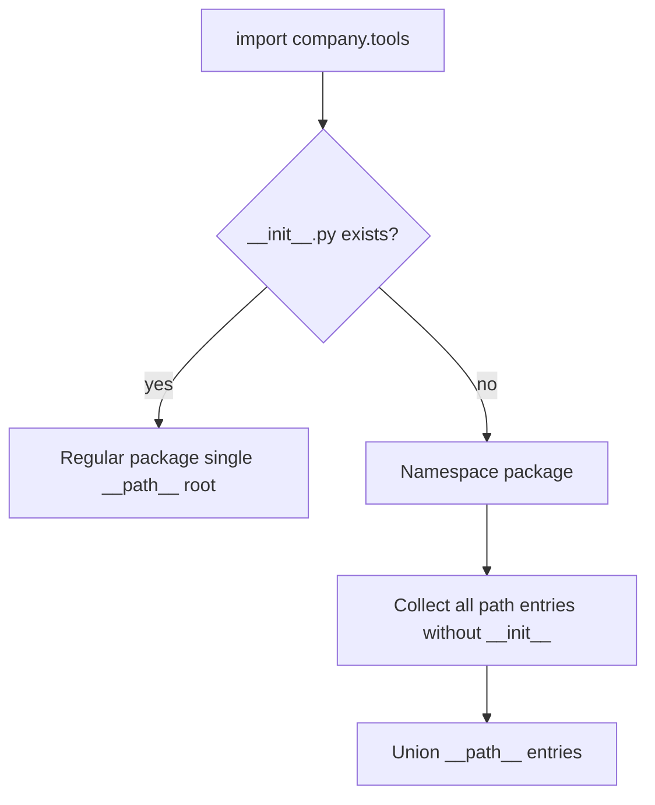
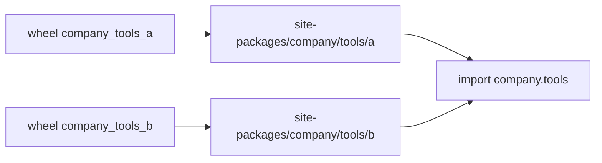
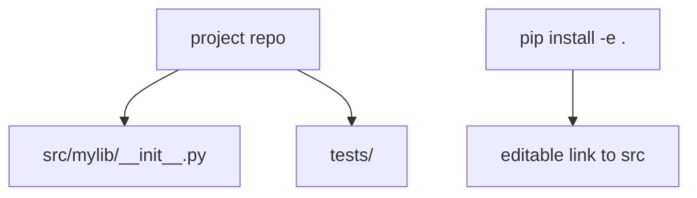

# Packages Namespace Packages and init

## Overview

A **package** is a module with `__path__` enabling submodule imports. Regular packages include `__init__.py` (explicit or implicit namespace). **Namespace packages** (PEP 420) merge multiple directories on `sys.path` under one import name **without** `__init__.py`—enabling split distributions like `google.cloud` across wheels.

Misunderstanding package types causes shadowing bugs, editable install surprises, and broken relative imports. Monorepo directory layout in CI is DevOps-adjacent; **import path semantics** belong here.

## Learning Objectives

- Distinguish regular, namespace, and implicit namespace packages
- Design `__init__.py` exports vs lazy submodules
- Merge namespace portions across path entries
- Avoid `__init__.py` anti-patterns (heavy side effects)
- Layout `src/` packages for clean imports

## Prerequisites

- [[03-Python/08-Modules-Packaging-and-Environments/Import System and Module Objects|Import System and Module Objects]]
- [[03-Python/02-Execution-Namespaces-and-Functions/Lexical Structure and Compilation Units|Lexical Structure and Compilation Units]]

## Difficulty

`intermediate`

## Estimated Time

- Reading: 2 hours
- Exercises: 3 hours
- Mini project: 5 hours

## History

Python 2 required `__init__.py` markers. PEP 420 (3.3) added implicit namespace packages for distributable split namespaces. PEP 517/621 packaging standardized declaring packages in pyproject. Namespace packages power large vendor ecosystems (zope, google) split across repos.

## Problem It Solves

Libraries need:

- Multi-repo contributions to one import root (`company.plugins.*`)
- Optional components installed separately sharing namespace
- Clean public API curation via `__init__.py` re-exports

Wrong package type breaks pip installs when two dists provide same namespace incorrectly.

## Internal Implementation

### Regular vs namespace



### `__path__` manipulation

Namespace packages compute `__path__` as iterable of directories; multiple wheels append paths.

### `__init__.py` roles

| Pattern | Use |
| --- | --- |
| Empty file | Marker only |
| `__all__` exports | Public API surface |
| Subpackage imports | Convenience `from pkg import submod` |
| `__getattr__` lazy | PEP 562 lazy attributes |

## Mermaid Diagrams

### Split namespace across dists



### src layout



## Examples

### Minimal Example

Namespace portion layout:

```
site-packages/
  company/
    tools/
      plugin_a/
        __init__.py
      plugin_b/
        __init__.py
# no company/__init__.py or company/tools/__init__.py required (PEP 420)
```

```python
import company.tools.plugin_a
import company.tools.plugin_b
```

### Production-Shaped Example

Curated package API:

```python
# mylib/__init__.py
from mylib.client import Client
from mylib.errors import MyLibError

__all__ = ["Client", "MyLibError"]

def __getattr__(name: str):
    if name == "HeavyFeature":
        from mylib.heavy import HeavyFeature
        return HeavyFeature
    raise AttributeError(name)
```

Avoid importing heavy deps at package import—speeds CLI `--help`.

See [[03-Python/code/README|Python code labs]] for namespace package experiments.

## Trade-offs

| Dimension | Upside | Downside | When it matters |
| --- | --- | --- | --- |
| Namespace packages | Split ownership | Collision if two dists claim same portion | Plugin ecosystems |
| Fat `__init__.py` | Ergonomic imports | Slow import; cycles | Public API |
| Lazy `__getattr__` | Faster startup | Complexity | CLI tools |
| Regular package | Explicit control | Requires coordination | Single team libs |
| Flat layout | Simple small scripts | Import pollution | Not for libraries |

### When to Use

- Namespace packages for independently versioned plugin families
- Thin `__init__.py` re-exporting stable API
- `src/` layout for packages

### When Not to Use

- Namespace when single cohesive library—use regular package
- Business logic in `__init__.py`

## Exercises

1. Build two namespace portions merging under one import; verify `__path__`.
2. Measure import time fat vs lazy `__init__.py`.
3. Demonstrate shadowing when regular package masks namespace portion.
4. Configure hatchling to package `src/mylib` correctly.
5. Write `__all__` policy doc for a three-level package.

## Mini Project

**Namespace Plugin Demo**

Two installable dists contributing `demo.plugins.*` modules discovered via shared namespace.

## Portfolio Project

Package layout for [[03-Python/projects/Import Hook Plugin Loader/README|Import Hook Plugin Loader]].

## Interview Questions

1. PEP 420 namespace vs regular package?
2. Purpose of `__init__.py` if namespace allowed?
3. What is `__path__` on a package?
4. Why prefer src layout?
5. How can two wheels extend same namespace?

### Stretch / Staff-Level

1. Design versioning when namespace portions conflict on file name.
2. Explain editable install namespace path behavior on Windows vs Linux.

## Common Mistakes

- Accidental namespace by omitting `__init__.py` unintentionally
- Duplicate module names across namespace portions
- Import cycles via `__init__` re-exporting everything
- Testing from repo root without install (imports wrong tree)

## Best Practices

- Explicitly choose regular vs namespace in packaging docs
- Keep `__init__.py` minimal; defer heavy imports
- Use `__all__` for public surface
- Install package editable during dev (`pip install -e .`)
- Namespace only with naming convention governance

## Summary

Packages extend modules with searchable subpaths; namespace packages merge multiple on-disk trees under one name without central `__init__.py`. Regular packages use `__init__.py` for API curation—keep it thin. Layout and PEP 420 choices affect installability and plugin extensibility. Wheel building and path isolation continue in packaging environment notes.

## Further Reading

- PEP 420 — Implicit Namespace Packages
- [[03-Python/08-Modules-Packaging-and-Environments/pyproject Build Backends and Wheels|pyproject Build Backends and Wheels]]
- [[03-Python/08-Modules-Packaging-and-Environments/Editable Installs and Development Layouts|Editable Installs and Development Layouts]]

## Related Notes

- [[03-Python/08-Modules-Packaging-and-Environments/Entry Points Plugins and Console Scripts|Entry Points Plugins and Console Scripts]]
- [[03-Python/README|Python Track]]

## Progress Checklist

- [ ] Explained from first principles
- [ ] Drew at least one Mermaid diagram
- [ ] Implemented a minimal version
- [ ] Documented trade-offs and non-goals
- [ ] Completed exercises
- [ ] Practiced interview questions aloud
- [ ] Linked prerequisites and dependents
