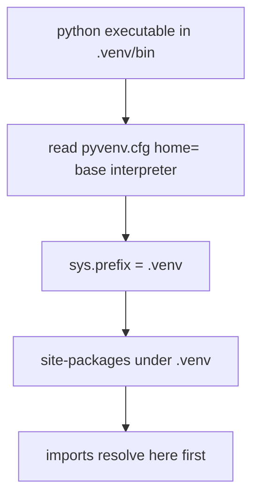
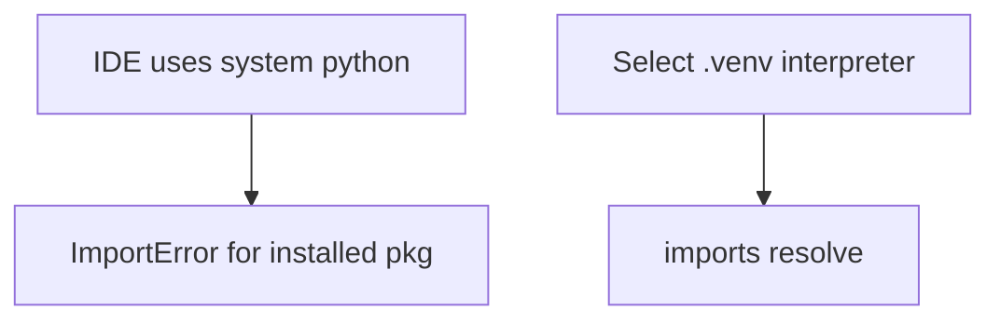

# Virtual Environments and Interpreter Isolation

## Overview

A **virtual environment** is an isolated Python prefix with its own `sys.prefix`, `site-packages`, and `pyvenv.cfg` linking to the base interpreter. **`python -m venv`** (stdlib) creates environments; tools like **uv** and **pipx** optimize creation and install speed on CPython 3.14+.

venvs isolate dependency sets per project—preventing global site-packages pollution. Container images and CI caches are [[16-DevOps/README|DevOps]]; this note owns **interpreter prefix mechanics and local isolation**.

## Learning Objectives

- Create, activate, and reproduce venvs with stdlib and modern tools
- Explain `pyvenv.cfg`, `sys.prefix`, and `site-packages` resolution
- Choose venv vs pipx vs conda for workflows
- Avoid mixing system packages and venv unintentionally
- Configure IDEs and CI to use correct interpreter

## Prerequisites

- [[03-Python/08-Modules-Packaging-and-Environments/Import System and Module Objects|Import System and Module Objects]]
- [[03-Python/00-Orientation/Python Program Lifecycle|Python Program Lifecycle]]

## Difficulty

`beginner`

## Estimated Time

- Reading: 1–2 hours
- Exercises: 2 hours
- Mini project: 3 hours

## History

`virtualenv` (2007) predated stdlib `venv` (3.3). PEP 405 standardized venvs. Modern tooling (uv 2024+) reimplements fast env creation and lockfile installs. Free-threaded CPython builds require matching base interpreter when creating venv.

## Problem It Solves

Global `pip install` causes:

- Project A needs Django 4, Project B needs Django 3
- Irreproducible "works on my machine" imports
- System Python breakage on Linux distros protecting `externally-managed-environment` (PEP 668)

venvs give each project an independent install target.

## Internal Implementation

### Prefix resolution



### Activation (shell)

Activation adjusts `PATH` and `VIRTUAL_ENV`—convenience only; running `.venv/bin/python` works without activation in CI.

### PEP 668 externally managed

System Python on many Linux distros blocks global pip installs—forces venv or distro packages.

## Mermaid Diagrams

### Project workflow

```mermaid
flowchart LR
    Clone[git clone] --> Venv[python -m venv .venv]
    Venv --> Install[pip install -e .[dev]]
    Install --> Run[pytest / mypy / app]
```

### Isolation failure mode



## Examples

### Minimal Example

```bash
python3.14 -m venv .venv
# Windows: .venv\Scripts\activate
# Unix: source .venv/bin/activate
python -m pip install -U pip
python -m pip install -e ".[dev]"
```

Verify:

```python
import sys
print(sys.prefix)
print(sys.path[:3])
```

### Production-Shaped Example

Docker multi-stage still uses venv pattern internally:

```dockerfile
# DevOps owns image — pattern shown for Python isolation layer
FROM python:3.14-slim AS build
WORKDIR /app
RUN python -m venv /opt/venv
ENV PATH="/opt/venv/bin:$PATH"
COPY pyproject.toml .
RUN pip install .
COPY src ./src
```

Free-threaded builds: use matching `python3.14t` base for venv.

See [[03-Python/code/README|Python code labs]] for venv troubleshooting checklist.

## Trade-offs

| Dimension | Upside | Downside | When it matters |
| --- | --- | --- | --- |
| venv per project | Reproducible deps | Disk per env | All application dev |
| uv speed | Fast CI | Extra tool | Large teams |
| conda | Binary stacks | Not pure PyPI | Scientific stacks |
| pipx | Isolated CLIs | Not for libraries | Tools like ruff |
| system python | None for dev | Breaks isolation | Avoid for installs |

### When to Use

- Every Python application/library project locally and CI
- pipx for global CLI tools (ruff, uv, tox)

### When Not to Use

- Do not `pip install` into system Python on PEP 668 distros
- Do not commit `.venv` to git—commit lockfiles instead

## Exercises

1. Create two venvs installing different requests versions; demonstrate isolation.
2. Read `pyvenv.cfg`; identify base interpreter path.
3. Trigger PEP 668 error on managed system python; fix with venv.
4. Configure VS Code/Cursor interpreter to `.venv`.
5. Compare `venv` vs `virtualenv --copies` on Windows symlink issues.

## Mini Project

**Dev Environment Bootstrap Script**

Cross-platform script creating venv, installing locked deps, verifying imports.

## Portfolio Project

Document dev setup in [[03-Python/projects/Python Runtime Toolkit/README|Python Runtime Toolkit]].

## Interview Questions

1. What changes when you activate a venv?
2. Difference between `sys.prefix` and `sys.base_prefix`?
3. What is PEP 668?
4. venv vs Docker—isolation comparison?
5. Why not commit virtualenv to git?

### Stretch / Staff-Level

1. Design CI matrix with venv cache keyed on lockfile hash.
2. Explain how uv shares wheel cache across venvs safely.

## Common Mistakes

- Running `python` pointing to system while thinking venv active
- Mixing conda and pip in same env blindly
- Copying venv between machines with hardcoded paths
- Wrong architecture venv on Apple Silicon Rosetta mixups

## Best Practices

- One venv per repo root (or documented subprojects)
- Pin deps via lockfiles (see Dependency Locking note)
- Use `python -m pip` not bare `pip`
- Document required Python version including free-threaded variant if used
- `.gitignore` `.venv/`

## Summary

Virtual environments isolate installed packages per project by switching `sys.prefix` and site-packages while reusing the base interpreter binary. They are the default unit of Python dependency isolation on developer machines and inside containers. Platform orchestration deploys artifacts built from these envs—DevOps handoff after reproducible local/CI env is proven.

## Further Reading

- PEP 405 — Python Virtual Environments
- PEP 668 — Marking Python base environments as externally managed
- [[03-Python/08-Modules-Packaging-and-Environments/Dependency Locking and Reproducibility|Dependency Locking and Reproducibility]]

## Related Notes

- [[03-Python/08-Modules-Packaging-and-Environments/pyproject Build Backends and Wheels|pyproject Build Backends and Wheels]]
- [[03-Python/README|Python Track]]

## Progress Checklist

- [ ] Explained from first principles
- [ ] Drew at least one Mermaid diagram
- [ ] Implemented a minimal version
- [ ] Documented trade-offs and non-goals
- [ ] Completed exercises
- [ ] Practiced interview questions aloud
- [ ] Linked prerequisites and dependents
