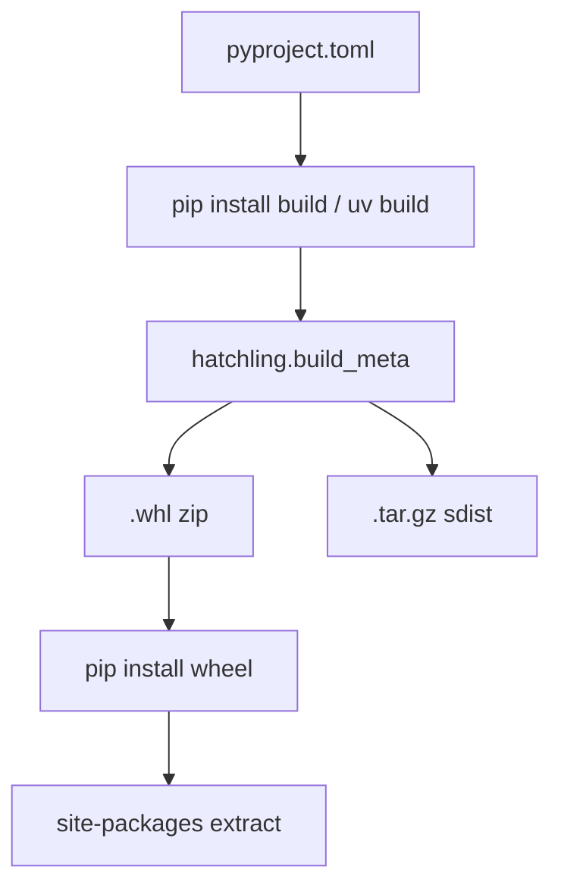
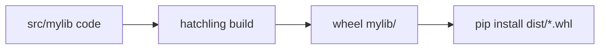
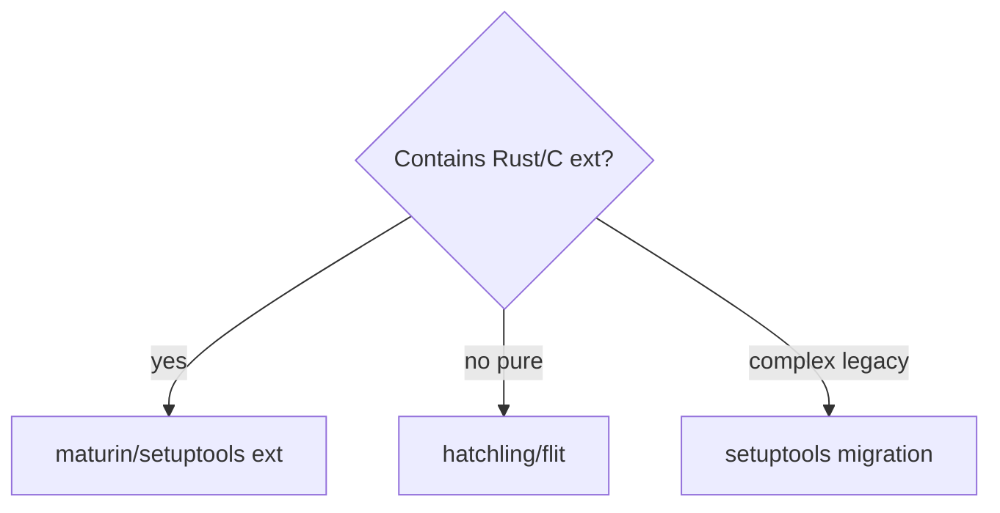

# pyproject Build Backends and Wheels

## Overview

**PEP 621** standardized project metadata in **`pyproject.toml`**. **PEP 517/518** introduced **build backends** (`hatchling`, `setuptools`, `flit`, `maturin`) producing **sdists** and **wheels** (`.whl`)—zip archives with standardized layout installed by pip. Wheels are the primary deployment artifact on PyPI for pure Python and many extension modules.

Build pipeline integration (GitHub Actions publish) is [[16-DevOps/README|DevOps]]; this note owns **pyproject structure, backend selection, and wheel contents on CPython 3.14+**.

## Learning Objectives

- Author PEP 621 `[project]` metadata and optional dependencies
- Configure hatchling/setuptools package discovery for src layout
- Build wheel and sdist; inspect RECORD and METADATA
- Choose backend for pure Python vs Rust/C extension projects
- Include `py.typed`, data files, and correct license metadata

## Prerequisites

- [[03-Python/08-Modules-Packaging-and-Environments/Packages Namespace Packages and init|Packages Namespace Packages and init]]
- [[03-Python/08-Modules-Packaging-and-Environments/Virtual Environments and Interpreter Isolation|Virtual Environments and Interpreter Isolation]]
- [[03-Python/06-Typing/Typed Library API Design|Typed Library API Design]]

## Difficulty

`intermediate`

## Estimated Time

- Reading: 3 hours
- Exercises: 4 hours
- Mini project: 6 hours

## History

`setup.py` imperative packaging caused untestable builds. PEP 518 (2016) isolated builds in venv. PEP 621 (2021) moved metadata to TOML. Hatch (hatchling) and uv build frontends modernized DX. cp314/cp314t wheel tags emerge with free-threaded builds.

## Problem It Solves

Bad packaging causes:

- Missing packages in wheel (`MODULE_NOT_FOUND` in prod)
- Wrong dependency pins breaking installs
- Licensing metadata omissions blocking enterprise adoption
- Slow sdist builds running arbitrary `setup.py` code

Declarative pyproject + reproducible wheels fix supply to pip.

## Internal Implementation

### Build flow



### Wheel anatomy

```
mypackage-1.0.0.dist-info/METADATA
mypackage-1.0.0.dist-info/RECORD
mypackage-1.0.0.dist-info/WHEEL
mypackage/__init__.py
mypackage/py.typed
```

Tag `cp314-cp314-manylinux_2_17_x86_64.whl` encodes ABI/platform.

### pyproject skeleton

```toml
[build-system]
requires = ["hatchling>=1.25"]
build-backend = "hatchling.build"

[project]
name = "mylib"
version = "1.0.0"
requires-python = ">=3.10"
dependencies = ["httpx>=0.27"]
readme = "README.md"
license = "MIT"
license-files = ["LICENSE"]

[project.optional-dependencies]
dev = ["pytest>=8", "mypy>=1.10"]

[tool.hatch.build.targets.wheel]
packages = ["src/mylib"]
```

## Mermaid Diagrams

### src layout packaging



### Backend selection



## Examples

### Minimal Example

```bash
python -m pip install build
python -m build
unzip -l dist/mylib-*.whl | head
```

### Production-Shaped Example

Include typed marker and force-include:

```toml
[tool.hatch.build.targets.wheel.force-include]
"src/mylib/py.typed" = "mylib/py.typed"

[project.scripts]
mycli = "mylib.cli:main"
```

Extension module builds need ABI tags matching deployment interpreters—including `cp314t` audit.

See [[03-Python/code/README|Python code labs]] for packaging templates.

## Trade-offs

| Dimension | Upside | Downside | When it matters |
| --- | --- | --- | --- |
| hatchling | Fast declarative | Less flexible than setuptools hacks | New libraries |
| sdist | Source universal | Builds slower on install | Fallback |
| wheel | Fast install | Platform-specific variants | Production deploy |
| lock vs ranges in metadata | Flexible semver | Nondeterministic unless locked | Apps vs libraries |
| maturin | Rust extensions easy | Extra toolchain | Performance libs |

### When to Use

- Always pyproject.toml for new projects (no setup.py-only)
- Wheels for deployment; sdist as upstream fallback
- hatchling for pure Python; maturin for Rust extensions

### When Not to Use

- setup.py exec code for one-off hacks—migrate
- Vendoring wheels manually without RECORD verification

## Exercises

1. Build wheel; explain each file in `.dist-info`.
2. Misconfigure packages; observe import failure after install; fix hatch paths.
3. Add optional `[dev]` extras; install with `pip install -e ".[dev]"`.
4. Compare wheel size with/without bundled data assets.
5. Generate wheel on 3.14; inspect tag; research cp314t implications.

## Mini Project

**Publish Typed Package to TestPyPI**

Full pipeline: build, twine check, upload, fresh venv install, import smoke test.

## Portfolio Project

Package [[03-Python/projects/Python Runtime Toolkit/README|Python Runtime Toolkit]] submodules as installable extras.

## Interview Questions

1. Difference between wheel and sdist?
2. What does `[build-system]` specify?
3. Why src layout?
4. What is `RECORD` in wheel metadata?
5. How declare typed package for PEP 561?

### Stretch / Staff-Level

1. Design manylinux wheel CI with cibuildwheel for extension module.
2. Compare hatchling vs setuptools package discovery edge cases for namespace packages.

## Common Mistakes

- Forgetting `packages` config → empty wheel
- Version in multiple places—use dynamic versioning deliberately or single source
- Missing `requires-python` causing unsupported syntax on old runtimes
- Omitting `py.typed` while advertising typed API

## Best Practices

- Single version source (VCS tag or `[project.version]`)
- Build in clean env (`python -m build`)
- Run `twine check` before upload
- Test install from wheel in fresh venv CI job
- Document build backend in CONTRIBUTING

## Summary

pyproject.toml centralizes metadata; PEP 517 backends produce wheels—the standard install artifact. hatchling fits most pure Python libraries on CPython 3.14+; extension builds need ABI-aware tooling. Correct package discovery and `py.typed` inclusion prevent production import failures. CI publish pipelines are DevOps; artifact correctness is defined here.

## Further Reading

- PEP 621 — Storing project metadata in pyproject.toml
- PEP 427 — Wheel format
- [[03-Python/08-Modules-Packaging-and-Environments/Dependency Locking and Reproducibility|Dependency Locking and Reproducibility]]

## Related Notes

- [[03-Python/08-Modules-Packaging-and-Environments/Entry Points Plugins and Console Scripts|Entry Points Plugins and Console Scripts]]
- [[03-Python/08-Modules-Packaging-and-Environments/Distribution Signing and Supply-Chain Integrity|Distribution Signing and Supply-Chain Integrity]]
- [[03-Python/README|Python Track]]

## Progress Checklist

- [ ] Explained from first principles
- [ ] Drew at least one Mermaid diagram
- [ ] Implemented a minimal version
- [ ] Documented trade-offs and non-goals
- [ ] Completed exercises
- [ ] Practiced interview questions aloud
- [ ] Linked prerequisites and dependents
