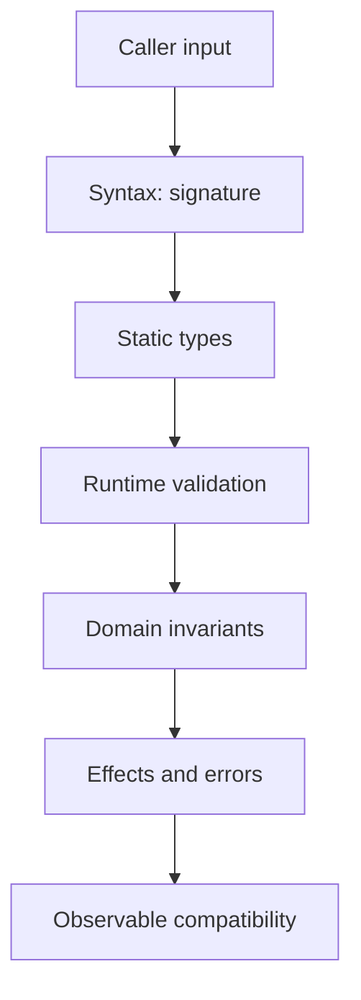
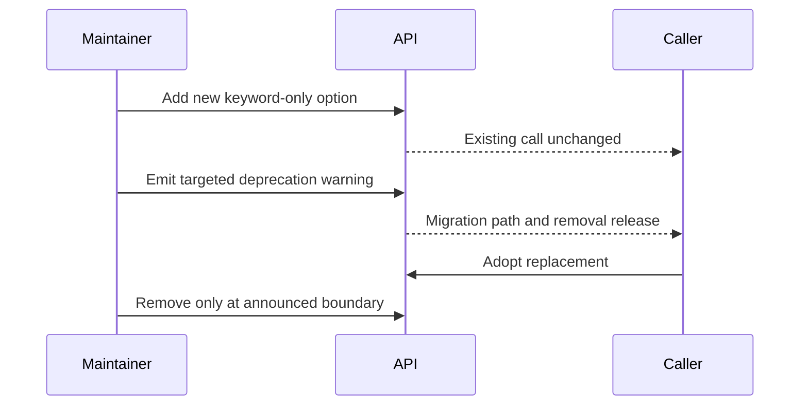

# API Design Defensive Programming and Compatibility

## Overview

An API is a contract between independently changing code.
Good Python APIs make valid use obvious, invalid states difficult, failures actionable, and evolution predictable.
Defensive programming validates at trust boundaries and preserves invariants without scattering redundant checks through trusted internals.
Compatibility includes runtime behavior, types, import paths, exceptions, side effects, timing, serialization, and operational expectations.

## Learning Objectives

- Design small coherent public surfaces
- Express contracts through types and runtime checks
- Evolve signatures and behavior compatibly
- Plan deprecations with measurable adoption
- Defend invariants at appropriate boundaries

## Prerequisites

- Functions, protocols, dataclasses, and exceptions
- Packaging and semantic versions
- [[03-Python/09-Production-Python/Error Design Exception Safety and Failure Modes|Error Design Exception Safety and Failure Modes]]

## Difficulty

`advanced`

## Estimated Time

- Reading: 4 hours
- Exercises: 5 hours
- Mini project: 7 hours

## History

Python APIs began largely through documentation and convention.
Keyword-only parameters, annotations, `typing`, protocols, and dataclasses expanded contract expression.
Semantic versioning and deprecation policy help ecosystems coordinate change, but no version label substitutes for identifying observed behavior.

## Problem It Solves

Callers depend on more than documented return values.
They may import a symbol from a path, catch a subclass, pass custom duck-typed objects, or rely on ordering.
Unplanned changes convert maintainability improvements into downstream incidents.
An explicit contract defines which assumptions are supported.

## Contract Layers



Type hints improve tooling but are not automatically enforced at runtime.
Runtime checks protect trust boundaries.
Internal functions may rely on already-established invariants to avoid noise and duplicate cost.

## Public Surface

Define exports intentionally:

```python
__all__ = ["Client", "ClientError", "RetryPolicy"]
```

`__all__` communicates wildcard exports but does not make other names private.
Stable import paths should be documented and tested.
Use implementation modules behind a small facade when internal organization may change.

## Signature Design

```python
from __future__ import annotations

from dataclasses import dataclass
from datetime import timedelta
from typing import Protocol

class Transport(Protocol):
    def send(self, request: bytes, *, timeout: float) -> bytes: ...

@dataclass(frozen=True)
class RetryPolicy:
    attempts: int = 3
    base_delay: timedelta = timedelta(milliseconds=100)

class Client:
    def __init__(
        self,
        transport: Transport,
        *,
        retry: RetryPolicy | None = None,
    ) -> None:
        self._transport = transport
        self._retry = retry or RetryPolicy()
```

Keyword-only options permit readable calls and safer extension.
Avoid boolean flags whose meaning is unclear at call sites.
Use value objects for related policy.
Do not use mutable objects as default values.

## Validation

```python
def page(*, limit: int = 100, cursor: str | None = None) -> tuple[int, str | None]:
    if isinstance(limit, bool) or not isinstance(limit, int):
        raise TypeError("limit must be an integer")
    if not 1 <= limit <= 1_000:
        raise ValueError("limit must be between 1 and 1000")
    if cursor is not None and not cursor:
        raise ValueError("cursor cannot be empty")
    return limit, cursor
```

`bool` is a subclass of `int`; reject it when semantically invalid.
Use `TypeError` for unsupported kinds and `ValueError` for invalid values of an accepted kind.
Validate before side effects.

## Return Values

Prefer one stable return shape.
Changing from list to generator changes eagerness, exceptions, repeatability, and resource lifetime.
Changing order can break callers even when the element set is identical.
Use immutable records for values that should not be mutated.
Avoid returning internal mutable containers.

## Exception Contract

Document exceptions callers should handle.
Expose package-owned categories and preserve causes internally.
Do not promise every implementation exception.
Adding a newly raised documented exception can still be breaking if old behavior returned a fallback.

## Compatibility Dimensions

- Source: existing call syntax remains valid
- Binary: native extension ABI remains usable
- Behavioral: results and effects remain within contract
- Type: static callers still type-check
- Data: persisted and serialized forms remain readable
- Operational: resource usage and timing stay within expectations



## Deprecation

```python
import warnings

def fetch(*, timeout: float | None = None, deadline: float | None = None) -> bytes:
    if timeout is not None:
        warnings.warn(
            "timeout= is deprecated; use deadline=",
            DeprecationWarning,
            stacklevel=2,
        )
        if deadline is not None:
            raise TypeError("pass only deadline")
        deadline = timeout
    return _fetch(deadline=deadline)
```

`stacklevel=2` points users at their call site.
Library deprecations generally use `DeprecationWarning`; application-facing commands may choose a visible warning.
Document introduction, replacement, and earliest removal release.

## Semantic Versioning

SemVer labels intent:

- major: incompatible public change
- minor: backward-compatible capability
- patch: backward-compatible fix

Reality is nuanced.
Bug fixes can break users relying on bugs.
Performance regressions can be operationally incompatible.
Pre-1.0 policy must still be explicit.

## Typing Compatibility

Parameters are contravariant and returns covariant in substitutable callable design.
Narrowing accepted input is breaking.
Widening a return type can be breaking because callers must handle more possibilities.
Adding a required protocol member breaks existing structural implementations.
Run type-level compatibility tests with representative caller snippets.

## CPython 3.14+ Compatibility

- Set and test `Requires-Python` explicitly.
- Do not expose unstable CPython internals as public API without a compatibility layer.
- Native packages should prefer the limited API only when its constraints are acceptable.
- Free-threaded support makes thread-safety part of the contract.
- Document whether objects are safe for concurrent calls.
- Test warning behavior and annotations on every supported interpreter.

## Defensive Copying

Copying input can preserve ownership but costs memory and may lose custom semantics.
Immutable inputs and read-only protocols are preferable when possible.
If retaining caller-provided mutable data, document ownership and mutation.
For large buffers, define whether zero-copy views remain valid after return.

## Concurrency Contract

State whether:

- instances are thread-safe
- methods may run concurrently
- callbacks can be reentrant
- cancellation is supported
- resources require explicit close
- fork or subinterpreter use is valid

“Works under the GIL” is not a concurrency contract.
Synchronize invariants explicitly.

## Trade-offs

| Choice | Benefit | Cost |
| --- | --- | --- |
| Small facade | Easier compatibility | More indirection |
| Strict validation | Early clear failure | Rejects accidental duck types |
| Flexible protocol | Extensible | Harder runtime guarantees |
| Immutable values | Safe ownership | Allocation cost |
| Long deprecation | Low migration risk | Maintenance burden |
| Major break | Cleaner design | Ecosystem coordination |

### When to Use

- Stable public libraries
- Internal services with independent release cycles
- Plugin and extension contracts
- Serialized data and command interfaces

### When Not to Use

- Do not preserve every accidental private behavior forever.
- Do not add abstraction before two real implementations or evolution needs exist.
- Do not validate trusted inner-loop values repeatedly without evidence.
- Do not use a major version bump to avoid migration tooling.

## Compatibility Testing

Test:

- documented imports
- signature binding
- representative old caller code
- exception categories and attributes
- serialization fixtures from old releases
- type-checker samples
- resource and timing budgets
- deprecation warning call sites

Compare API snapshots as a signal, then review semantics manually.

## Common Mistakes

- Mutable defaults
- Positional booleans
- Leaking vendor exception classes
- Returning internal mutable state
- Renaming modules without compatibility imports
- Adding required protocol methods casually
- Deprecating without a replacement
- Claiming thread safety based on the GIL

## Exercises

1. Redesign a five-boolean function using policy objects.
2. Create compatibility tests for imports, calls, and exceptions.
3. Add a keyword migration with accurate warning location.
4. Identify hidden breaks in list-to-generator conversion.
5. Review a protocol extension for typing compatibility.

## Mini Project

Build a versioned storage client.
Provide sync operations, immutable configuration, package-owned exceptions, injected transport, deprecation support, and a compatibility suite with old caller fixtures.
Document ownership, retries, and thread safety.

## Portfolio Project

Create an API-evolution laboratory.
Publish three versions of a plugin SDK, automated runtime/type compatibility tests, codemods, warning telemetry, migration docs, and a release policy.
Demonstrate a safe major transition.

## Interview Questions

1. What makes an API Pythonic and stable?
2. Why prefer keyword-only options?
3. Are type hints runtime validation?
4. How can a return-type change break callers?
5. What belongs in a deprecation policy?
6. Why is fixing a bug sometimes breaking?
7. How does free threading affect API contracts?

### Stretch / Staff-Level

1. Evolve an SDK used by thousands of unknown clients.
2. Define compatibility across runtime, typing, and serialized data.
3. Decide when to preserve versus intentionally break accidental behavior.

## Best Practices

- Minimize and name the public surface.
- Validate once at meaningful boundaries.
- Make ownership, effects, failures, and concurrency explicit.
- Add options through keyword-only parameters.
- Deprecate with replacement, tooling, and schedule.
- Test representative callers, not only implementation units.

## Summary

Python API quality is the quality of its contract and evolution path.
Small public surfaces, explicit ownership, coherent exceptions, boundary validation, and compatibility tests let implementations change safely.
CPython 3.14 and free threading make runtime, ABI, and synchronization promises important parts of that contract.

## Further Reading

- [Python API and ABI stability](https://docs.python.org/3/c-api/stable.html)
- [Semantic Versioning](https://semver.org/)
- [`warnings`](https://docs.python.org/3/library/warnings.html)

## Related Notes

- [[03-Python/08-Modules-Packaging-and-Environments/Entry Points Plugins and Console Scripts|Entry Points Plugins and Console Scripts]]
- [[03-Python/09-Production-Python/Error Design Exception Safety and Failure Modes|Error Design Exception Safety and Failure Modes]]
- [[03-Python/code/README|Python code labs]]

## Progress Checklist

- [ ] Defined a public contract
- [ ] Tested compatibility dimensions
- [ ] Implemented a deprecation
- [ ] Documented concurrency guarantees
- [ ] Practiced interview questions aloud
