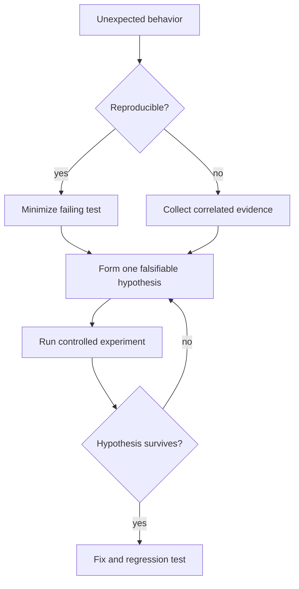
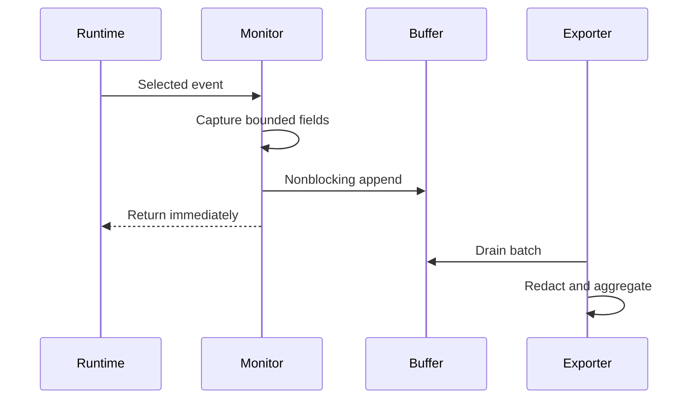

# Debugging pdb monitoring and Remote Attach

## Overview

Debugging converts an observation into a reproducible causal explanation.
Python offers post-mortem tracebacks, `breakpoint()`, `pdb`, low-overhead `sys.monitoring` events, stack dumping, and CPython 3.14 remote debugging capabilities.
Production use requires strict authorization because debugger access can inspect secrets, mutate state, and execute code.

## Learning Objectives

- Run interactive and post-mortem `pdb`
- Design low-overhead monitoring callbacks
- Capture stacks from hung processes
- Attach remotely with explicit security controls
- Debug concurrent and free-threaded CPython

## Prerequisites

- Frames, tracebacks, and code objects
- Threads and asyncio tasks
- [[03-Python/09-Production-Python/Observability Logging Tracing and Metrics|Observability Logging Tracing and Metrics]]

## Difficulty

`advanced`

## Estimated Time

- Reading: 3 hours
- Exercises: 5 hours
- Mini project: 7 hours

## History

`pdb` builds on interpreter tracing and exposes source stepping, breakpoints, stack navigation, and expression evaluation.
PEP 669 added `sys.monitoring` so tools can subscribe to selected interpreter events with less overhead than traditional tracing.
CPython 3.14 expands remote debugging and external process inspection, making operational security more important.

## Problem It Solves

Logs show selected facts; a debugger exposes live execution state.
Profilers aggregate where time is spent; debugging asks why this invocation reached an invalid state.
Monitoring bridges the gap by collecting targeted runtime events continuously without stopping the process.

## Evidence Ladder

Start with the least invasive evidence:

1. request IDs, errors, logs, traces, and metrics
2. deterministic local reproduction
3. stack dumps and task inspection
4. targeted monitoring or profiling
5. staging debugger
6. approved production attach



## pdb

Run a program:

```powershell
python -m pdb app.py
```

Break in code:

```python
def calculate_total(items: list[int]) -> int:
    if any(item < 0 for item in items):
        breakpoint()
    return sum(items)
```

`breakpoint()` calls `sys.breakpointhook` and can be configured through `PYTHONBREAKPOINT`.
Do not leave reachable breakpoints in unattended services.

Useful commands:

- `where`: print stack
- `up` and `down`: select frames
- `list`: show source
- `p expression`: evaluate
- `pp expression`: pretty-print
- `next`: step over
- `step`: step into
- `return`: continue to function return
- `continue`: resume
- `break file.py:line`: set breakpoint
- `condition number expression`: conditional stop

Expression evaluation can mutate state.
Treat every debugger command as an operational change.

## Post-Mortem Debugging

```python
import pdb
import sys

def main() -> None:
    raise RuntimeError("example failure")

try:
    main()
except Exception:
    _, value, traceback = sys.exc_info()
    print(f"failure: {value}")
    if traceback is not None:
        pdb.post_mortem(traceback)
```

Use this in controlled development.
For CI, preserve traceback, inputs with secrets removed, random seed, and environment metadata as artifacts.

## Stack Capture

`faulthandler` can dump Python stacks even when ordinary logging is blocked:

```python
import faulthandler
import signal
import sys

faulthandler.enable(file=sys.stderr, all_threads=True)
if hasattr(signal, "SIGUSR1"):
    faulthandler.register(signal.SIGUSR1, file=sys.stderr, all_threads=True)
```

Windows has different signal capabilities.
Provide an authenticated diagnostic endpoint or administrator-controlled console action instead.
Stack dumps may include sensitive object representations indirectly through source context; protect diagnostic output.

## sys.monitoring

`sys.monitoring` assigns tool IDs and event masks.
Enable only required events and code locations:

```python
from __future__ import annotations

import sys
from types import CodeType

TOOL_ID = sys.monitoring.PROFILER_ID

def on_raise(code: CodeType, offset: int, exception: BaseException) -> None:
    print(f"raised {type(exception).__name__} in {code.co_name}@{offset}")

def start_exception_monitor() -> None:
    sys.monitoring.use_tool_id(TOOL_ID, "acme-debug")
    sys.monitoring.register_callback(
        TOOL_ID,
        sys.monitoring.events.RAISE,
        on_raise,
    )
    sys.monitoring.set_events(TOOL_ID, sys.monitoring.events.RAISE)

def stop_exception_monitor() -> None:
    sys.monitoring.set_events(TOOL_ID, 0)
    sys.monitoring.free_tool_id(TOOL_ID)
```

Callback signatures depend on event type.
Callbacks run in the observed process: keep them fast, nonblocking, reentrancy-safe, and exception-safe.
Sampling or aggregation is usually better than emitting one log per event.



## Remote Attach

Remote attach can pause threads, inspect frames, and run code.
Requirements:

- disabled by default
- authenticated and authorized activation
- local or mutually authenticated transport
- short-lived access
- audit trail and incident ticket
- operator identity and two-person approval for sensitive systems
- explicit timeout and automatic teardown
- data-classification-aware redaction

Never expose a debugger port publicly.
Prefer attaching to a replica or isolated canary.
Assume debugger access equals process owner privileges.

## CPython 3.14+ Compatibility

- CPython 3.14 supports richer remote debugging interfaces; verify exact CLI/API behavior against the deployed patch release.
- External inspection may be disabled by build options, operating-system policy, container settings, or permissions.
- `sys.monitoring` is CPython-aware but public API details must be tested across supported versions.
- Free-threaded builds can execute callbacks concurrently; protect shared monitor state.
- Thread stacks are snapshots and may change immediately after capture.
- Native frames require platform debuggers such as WinDbg or gdb/lldb with CPython support.

## Async Debugging

Inspect all tasks rather than only the current stack:

```python
import asyncio

def task_snapshot() -> list[dict[str, object]]:
    result = []
    for task in asyncio.all_tasks():
        result.append({
            "name": task.get_name(),
            "done": task.done(),
            "cancelled": task.cancelled(),
            "stack": [f"{f.f_code.co_filename}:{f.f_lineno}" for f in task.get_stack()],
        })
    return result
```

Call this from the event-loop thread.
Bound output and redact task names if they contain tenant data.
Enable asyncio debug mode in test or staging when diagnosing slow callbacks and leaked tasks; it adds overhead.

## Native and Deadlock Diagnosis

Python stacks may show a thread waiting in extension code but not the native cause.
Capture native stacks, lock ownership evidence, CPU profile, and system calls.
For deadlocks, preserve all thread stacks at one moment.
On free-threaded builds, reason about Python-level locks explicitly; the historical GIL is not a data-race guarantee.

## Trade-offs

| Technique | Evidence | Risk or cost |
| --- | --- | --- |
| Traceback | Failure path | Only after exception |
| Stack dump | Hang snapshot | No variable inspection |
| pdb | Full frame control | Stops and mutates process |
| sys.monitoring | Continuous events | Callback overhead |
| Remote attach | Live production state | Critical security risk |
| Native debugger | C and OS frames | Specialized operation |

### When to Use

- `pdb` for controlled local reproductions
- post-mortem debugging for deterministic failures
- monitoring for rare runtime events
- stack dumps for hangs
- remote attach only when safer evidence is insufficient

### When Not to Use

- Do not attach interactively during a broad outage if restart or failover is safer.
- Do not inspect production merely for convenience.
- Do not log every interpreter event.
- Do not evaluate expressions on state you cannot afford to mutate.

## Common Mistakes

- Changing multiple variables before testing a hypothesis
- Ignoring environment and dependency versions
- Logging secrets from frame locals
- Leaving monitoring enabled globally
- Blocking inside callbacks
- Debugging only one thread in a deadlock
- Exposing an unauthenticated debug port
- Fixing symptoms without a regression test

## Exercises

1. Use post-mortem `pdb` to diagnose a nested exception.
2. Capture all thread stacks during an intentional deadlock.
3. Monitor only exception raises and measure overhead.
4. Inspect asyncio tasks during a simulated hang.
5. Write a production remote-attach approval checklist.

## Mini Project

Build a diagnostic bundle command.
Capture bounded thread and task stacks, interpreter and package versions, selected metrics, configuration with secrets redacted, and recent structured errors.
Sign the bundle manifest and test concurrent capture.

## Portfolio Project

Create a safe debugging control plane for a replicated service.
Support short-lived operator authorization, canary selection, stack capture, targeted monitoring, encrypted artifacts, full audit, and automatic teardown.
Demonstrate CPython 3.14 normal and free-threaded behavior.

## Interview Questions

1. What is the difference between tracing and monitoring?
2. Why is debugger access equivalent to code execution?
3. How do you debug a hung process?
4. What should a monitoring callback avoid?
5. How would you inspect asyncio tasks?
6. When are Python stacks insufficient?
7. How does free threading change debugger assumptions?

### Stretch / Staff-Level

1. Design production attach governance for regulated customer data.
2. Diagnose a once-weekly deadlock without continuously tracing every event.
3. Quantify acceptable observability effect for a latency-critical service.

## Best Practices

- Form hypotheses from preserved evidence.
- Start with the least invasive technique.
- Capture all relevant concurrent stacks.
- Bound and redact diagnostic data.
- Keep monitoring callbacks minimal.
- Treat remote debugging as privileged production access.
- Always add a regression test.

## Summary

Python debugging ranges from deterministic `pdb` sessions to low-overhead runtime monitoring and privileged remote attach.
Choose the least invasive source of evidence, preserve concurrent context, and measure observer overhead.
CPython 3.14’s stronger inspection capabilities improve diagnosis while making authorization, auditing, and free-threaded safety non-negotiable.

## Further Reading

- [`pdb`](https://docs.python.org/3/library/pdb.html)
- [`sys.monitoring`](https://docs.python.org/3/library/sys.monitoring.html)
- [`faulthandler`](https://docs.python.org/3/library/faulthandler.html)
- [Python remote debugging documentation](https://docs.python.org/3/howto/remote_debugging.html)

## Related Notes

- [[03-Python/09-Production-Python/Measuring and Optimizing Performance|Measuring and Optimizing Performance]]
- [[03-Python/09-Production-Python/Observability Logging Tracing and Metrics|Observability Logging Tracing and Metrics]]
- [[03-Python/code/README|Python code labs]]

## Progress Checklist

- [ ] Practiced post-mortem debugging
- [ ] Captured concurrent stacks
- [ ] Measured monitoring overhead
- [ ] Threat-modeled remote attach
- [ ] Practiced interview questions aloud
