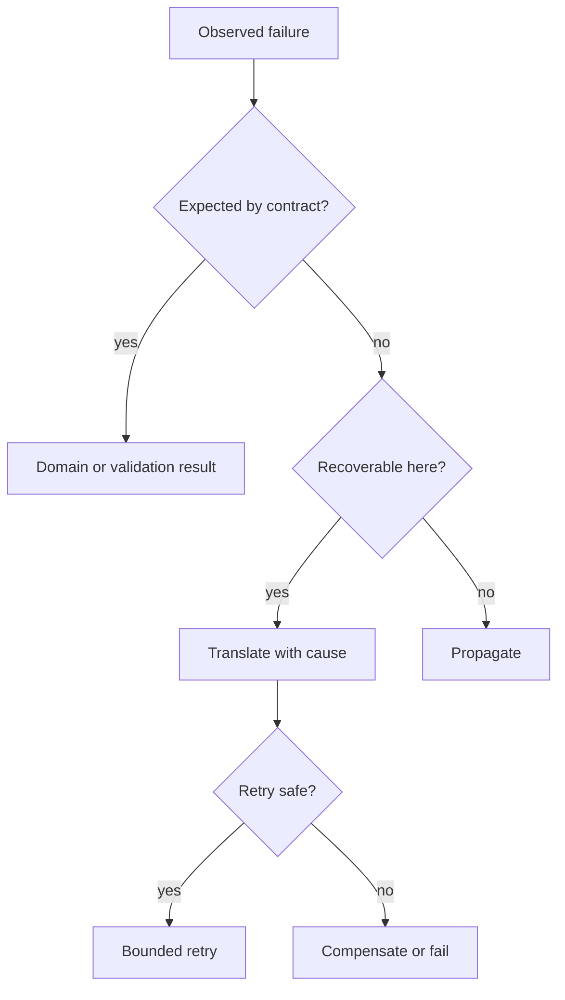
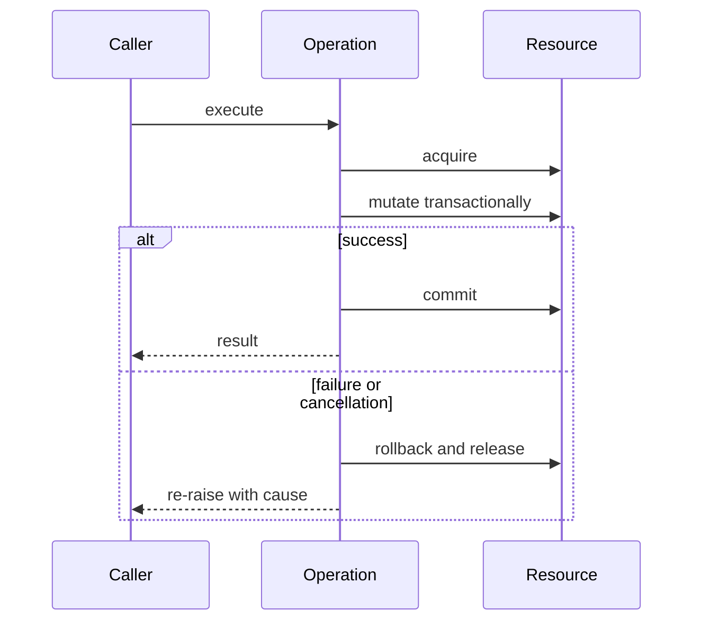

# Error Design Exception Safety and Failure Modes

## Overview

An exception is a nonlocal control transfer carrying failure context.
Production error design decides which failures are represented, where they are translated, what state remains valid, and which actions are safe to retry.
Good code preserves invariants before reporting failure.
It distinguishes expected domain rejection from defects, resource exhaustion, cancellation, and process-level corruption.

## Learning Objectives

- Design stable exception taxonomies
- Apply basic, strong, and no-fail guarantees
- Preserve traceback and causal context
- Model retries and idempotency
- Test partial-failure behavior

## Prerequisites

- Python context managers
- Transactions and invariants
- [[03-Python/07-Async-Concurrency-and-Free-Threading/Cancellation Timeouts and TaskGroup|Cancellation Timeouts and TaskGroup]]

## Difficulty

`advanced`

## Estimated Time

- Reading: 4 hours
- Exercises: 5 hours
- Mini project: 7 hours

## History

Python adopted class-based exceptions early and later added explicit chaining with `raise ... from`.
PEP 654 introduced `ExceptionGroup` and `except*` for concurrent failures.
Modern production systems combine language exceptions with protocol error responses, structured logs, traces, and retry policy.

## Problem It Solves

Failures cross abstraction boundaries.
A database driver exposes implementation-specific exceptions, while a service needs domain-stable outcomes.
If code mutates state before every fallible step succeeds, callers see an error while data remains partially changed.
If broad handlers suppress cancellation or defects, systems become silently incorrect.

## Failure Taxonomy

- Domain failure: valid request rejected by business rules
- Input failure: malformed or unsupported caller data
- Dependency failure: timeout, unavailable service, protocol violation
- Resource failure: memory, disk, file descriptors, quotas
- Concurrency failure: cancellation, deadlock, conflict
- Programmer defect: violated internal invariant
- Process failure: signals, abrupt termination, interpreter crash



## Exception Taxonomy

Expose a small package-owned hierarchy:

```python
from __future__ import annotations

class AcmeError(Exception):
    """Base class for documented operational failures."""

class InvalidRequest(AcmeError):
    pass

class Conflict(AcmeError):
    pass

class DependencyUnavailable(AcmeError):
    def __init__(self, service: str, *, retryable: bool) -> None:
        self.service = service
        self.retryable = retryable
        super().__init__(f"{service} is unavailable")
```

Do not make callers parse messages.
Store stable machine-readable attributes.
Avoid one exception subclass per sentence; categories should drive caller behavior.

## Translation Boundaries

Translate errors where one abstraction becomes another:

```python
def load_customer(repository: "CustomerRepository", customer_id: str) -> "Customer":
    try:
        customer = repository.get(customer_id)
    except TimeoutError as exc:
        raise DependencyUnavailable("customer-store", retryable=True) from exc
    if customer is None:
        raise InvalidRequest(f"unknown customer {customer_id!r}")
    return customer
```

`from exc` preserves causality.
Use `from None` only when hiding irrelevant implementation detail is intentional and diagnostics remain available elsewhere.
Bare `raise` inside a handler preserves the original traceback.

## Exception Safety Guarantees

1. No guarantee: invariants may be broken.
2. Basic guarantee: invariants hold, but state may change.
3. Strong guarantee: operation either succeeds or observable state is unchanged.
4. No-fail guarantee: operation promises not to report failure.

Python cannot defend against every abrupt process termination.
Guarantees must state their boundary: in-memory object, database transaction, filesystem, or distributed workflow.

### Strong In-Memory Update

```python
from dataclasses import dataclass, replace
from decimal import Decimal

@dataclass(frozen=True)
class Account:
    balance: Decimal

def debit(account: Account, amount: Decimal) -> Account:
    if amount <= 0:
        raise InvalidRequest("amount must be positive")
    if amount > account.balance:
        raise Conflict("insufficient funds")
    return replace(account, balance=account.balance - amount)
```

The original immutable value remains valid if validation fails.
For mutable structures, prepare a replacement first and commit it with one controlled assignment.

### Resource Cleanup

```python
from contextlib import contextmanager
from collections.abc import Iterator

@contextmanager
def managed_transaction(connection: "Connection") -> Iterator["Connection"]:
    transaction = connection.begin()
    try:
        yield connection
    except BaseException:
        transaction.rollback()
        raise
    else:
        transaction.commit()
```

Cleanup often must run for cancellation and shutdown exceptions too.
Catch `BaseException` only for cleanup followed by immediate re-raise; business handlers should normally catch `Exception` or narrower classes.



## ExceptionGroup

Concurrent operations can fail independently.
`ExceptionGroup` preserves all failures rather than selecting one.

```python
def report(group: ExceptionGroup) -> None:
    try:
        raise group
    except* TimeoutError as timeouts:
        for error in timeouts.exceptions:
            print(f"timeout: {error}")
    except* ValueError as invalid:
        for error in invalid.exceptions:
            print(f"invalid: {error}")
```

Handlers split groups by type.
Do not flatten away task identity; attach operation context when creating tasks.

## Retry Safety

Retry only when:

- failure is plausibly transient
- operation is idempotent or carries an idempotency key
- deadline permits another attempt
- backoff is bounded and jittered
- the dependency has not explicitly rejected retry

A timeout means the outcome may be unknown.
The server could have committed after the client stopped waiting.
Blindly retrying a payment can duplicate it.

## CPython 3.14+ Compatibility

- Preserve `ExceptionGroup` structure for task and executor failures.
- Check cancellation behavior of asyncio APIs; do not suppress `CancelledError`.
- Free-threaded execution can expose races hidden by the GIL; state rollback must be synchronized.
- Never rely on exception object finalization timing for resource release.
- Use context managers and explicit shutdown regardless of interpreter build.

## Trade-offs

| Choice | Benefit | Cost |
| --- | --- | --- |
| Narrow taxonomy | Stable caller contract | Less granular typing |
| Rich attributes | Automation-friendly | Compatibility responsibility |
| Translation | Hides vendor details | Can lose evidence if careless |
| Strong guarantee | Simple caller reasoning | Copies or transactions cost |
| Compensation | Works across services | Not equivalent to rollback |

### When to Use Exceptions

- Exceptional failure interrupts the normal result path
- Multiple stack frames cannot usefully handle the failure
- Existing Python protocol expects an exception

### When Not to Use Exceptions

- Routine branching may be clearer as a result value
- Streaming parsers may need many recoverable diagnostics
- Process corruption requires termination, not recovery
- Cross-process errors need a serialized protocol schema

## Failure Injection

Test failures after each side effect.
Inject timeouts, short writes, duplicate responses, cancellation, commit ambiguity, and cleanup failure.
Assert state invariants and observable diagnostics.
Chaos experiments should have bounded blast radius and explicit rollback.

## Common Mistakes

- `except Exception: pass`
- Catching too far from the failing operation
- Logging and re-raising at every layer
- Replacing exceptions without `from`
- Retrying validation failures
- Mutating before validation completes
- Returning from `finally`, which can suppress failure
- Assuming timeout means no side effect happened

## Exercises

1. Refactor a mutable transfer to provide the strong guarantee.
2. Design a public exception hierarchy with stable attributes.
3. Preserve causes while translating three vendor exceptions.
4. Test cancellation during acquisition and commit.
5. Model an ambiguous payment timeout and idempotent retry.

## Mini Project

Build a transactional file importer.
Parse to a temporary representation, validate all records, write to a temporary file, `fsync`, then atomically replace the destination.
Inject failure at every phase and prove either old or new state remains readable.

## Portfolio Project

Create a fault-tolerant job orchestrator.
Include typed failures, `ExceptionGroup`, deadlines, idempotency keys, retry budgets, compensation, structured diagnostics, and a failure-injection test suite.
Document guarantees for process crashes and dependency ambiguity.

## Interview Questions

1. What is exception safety?
2. Distinguish basic and strong guarantees.
3. Why use `raise X from exc`?
4. When is catching `BaseException` justified?
5. Why is a timeout outcome ambiguous?
6. How does `ExceptionGroup` preserve information?
7. What makes a retry safe?

### Stretch / Staff-Level

1. Define failure contracts across a distributed transaction.
2. Design an error taxonomy that can evolve without breaking clients.
3. Explain which invariants survive abrupt process termination.

## Best Practices

- Preserve invariants before reporting failure.
- Catch only errors you can handle or translate.
- Keep messages human-readable and attributes machine-readable.
- Clean up with context managers and `finally`.
- Bound retries by attempts, time, and idempotency.
- Test failure paths as first-class behavior.

## Summary

Production exception design is state design under failure.
Stable taxonomies communicate caller action, chaining preserves evidence, and exception-safety guarantees define what remains true.
Retries require idempotency and ambiguous-outcome analysis; cleanup and cancellation must preserve invariants across normal and free-threaded CPython 3.14.

## Further Reading

- [Python exceptions](https://docs.python.org/3/library/exceptions.html)
- [PEP 3134 — Exception chaining](https://peps.python.org/pep-3134/)
- [PEP 654 — Exception groups](https://peps.python.org/pep-0654/)

## Related Notes

- [[03-Python/09-Production-Python/API Design Defensive Programming and Compatibility|API Design Defensive Programming and Compatibility]]
- [[03-Python/09-Production-Python/Observability Logging Tracing and Metrics|Observability Logging Tracing and Metrics]]
- [[03-Python/code/README|Python code labs]]

## Progress Checklist

- [ ] Defined a failure taxonomy
- [ ] Implemented strong exception safety
- [ ] Tested cancellation and partial failure
- [ ] Documented retry semantics
- [ ] Practiced interview questions aloud
