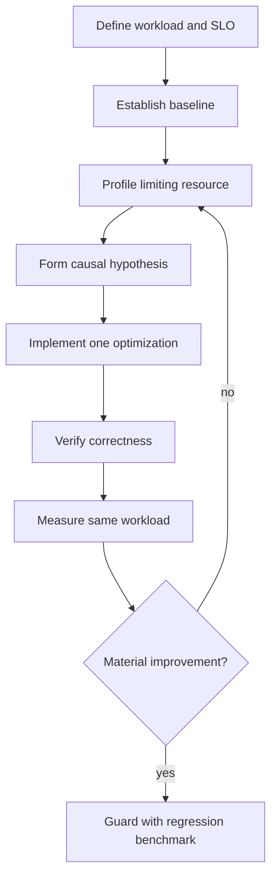
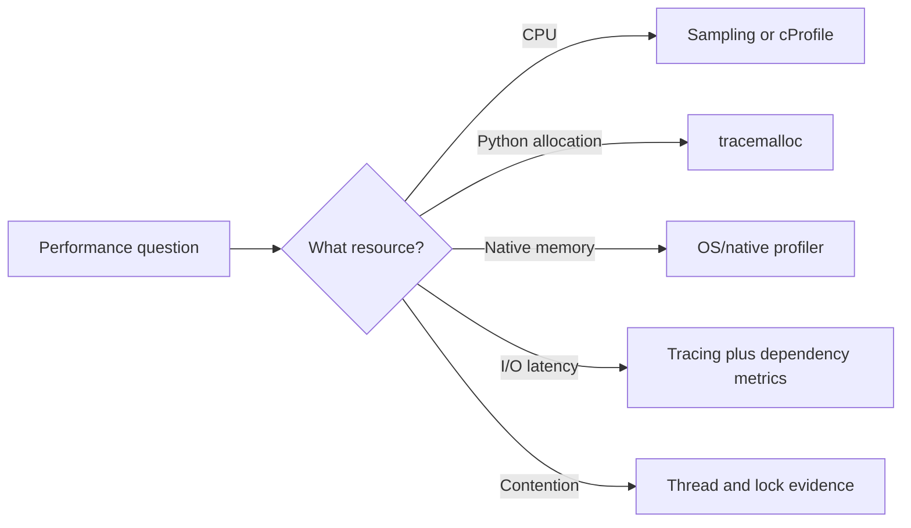

# Measuring and Optimizing Performance

## Overview

Performance engineering is the disciplined reduction of resource cost while preserving correctness.
Measure a representative workload, identify the limiting resource, change one cause, and validate both speed and behavior.
CPython optimization spans algorithms, allocation, interpreter overhead, I/O concurrency, native code, and deployment topology.
Microbenchmarks without production context are evidence about a tiny experiment, not a system conclusion.

## Learning Objectives

- Define latency, throughput, and resource objectives
- Benchmark with statistical discipline
- Use CPU, allocation, and sampling profilers
- Select algorithmic, runtime, or architectural optimizations
- Evaluate CPython 3.14 free-threaded trade-offs

## Prerequisites

- Complexity analysis
- CPython objects and garbage collection
- Concurrency models

## Difficulty

`advanced`

## Estimated Time

- Reading: 4 hours
- Exercises: 6 hours
- Mini project: 8 hours

## History

Python performance work historically relied on `timeit`, `cProfile`, and platform profilers.
Sampling profilers reduced observer overhead and added native-stack visibility.
CPython introduced adaptive specialization, improved frame execution, subinterpreters, and optional free threading.
These changes make version-specific measurement essential.

## Problem It Solves

Users experience tail latency, queueing, timeout, and cost.
Guessing often optimizes visible syntax while missing database round trips, serialization, allocations, lock contention, or a worse algorithm.
A measurement loop links changes to service objectives.

## Optimization Loop



## Metrics

- Latency: elapsed time per operation
- Throughput: completed operations per time
- CPU time: processor consumed
- Allocation rate: bytes or objects allocated
- Resident memory: process footprint
- I/O wait: blocked time on external resources
- Queue depth: demand waiting for capacity
- Tail percentiles: p95, p99, and maximum

Means hide multimodal and tail behavior.
Always record workload shape, machine, Python build, dependencies, and warmup.

## Microbenchmarking

```python
from __future__ import annotations

from timeit import repeat

def normalize(values: list[str]) -> list[str]:
    return [value.strip().casefold() for value in values]

samples = repeat(
    "normalize(data)",
    setup="from __main__ import normalize; data = [' A ', 'B '] * 10_000",
    number=100,
    repeat=7,
)
print(min(samples))
```

`timeit` reduces timer boilerplate but does not make an experiment representative.
Use `pyperf` for process isolation, calibration, metadata, and comparison.
Do not benchmark code eliminated by caching unless cache behavior is the subject.

## Profiling Choices

Deterministic profilers observe call events and provide exact Python call counts but add overhead.
Sampling profilers periodically inspect stacks, reducing perturbation and often showing native frames.
Line profilers localize cost inside selected functions.
Allocation profilers such as `tracemalloc` explain Python memory growth.
OS profilers reveal system calls, page faults, and native execution.



## cProfile

```powershell
python -m cProfile -o profile.pstats -m acme_bench
python -m pstats profile.pstats
```

Sort by cumulative time to find expensive call trees and internal time to find expensive bodies.
Profile representative duration; short runs amplify startup.

## tracemalloc

```python
import tracemalloc

tracemalloc.start(25)
before = tracemalloc.take_snapshot()
run_workload()
after = tracemalloc.take_snapshot()

for statistic in after.compare_to(before, "lineno")[:10]:
    print(statistic)
```

Snapshots track Python allocations, not all native allocations.
Warm caches before the baseline when steady-state growth is the question.
Retained memory and peak memory are different.

## Algorithmic Optimization

Changing `O(n²)` to `O(n log n)` usually dominates syntax-level tuning.

```python
def duplicate_ids_quadratic(ids: list[str]) -> set[str]:
    return {value for index, value in enumerate(ids) if value in ids[:index]}

def duplicate_ids_linear(ids: list[str]) -> set[str]:
    seen: set[str] = set()
    duplicates: set[str] = set()
    for value in ids:
        if value in seen:
            duplicates.add(value)
        else:
            seen.add(value)
    return duplicates
```

The second version trades memory for expected linear time.
Benchmark at realistic cardinalities and adversarial distributions.

## Allocation and Data Layout

- Stream rather than materialize when consumers can process incrementally.
- Use generators when one-pass semantics are acceptable.
- Avoid repeated parsing and conversion.
- Batch I/O to amortize calls.
- Select compact representations after measuring.
- Reuse immutable shared values safely.

`__slots__` can reduce per-instance memory but affects inheritance, weak references, and flexibility.
Dataclasses improve clarity, not automatically performance.

## I/O and Concurrency

For independent I/O, concurrency reduces wall time while usually increasing system complexity.
Use asyncio for many cooperative sockets, threads for blocking APIs, and processes or native code for CPU work.
Free-threaded CPython can parallelize suitable Python threads, but synchronization and single-thread overhead may change.
Measure throughput and tail latency under contention.

## CPython 3.14+ Compatibility

- Compare results only across explicitly recorded interpreter builds.
- Adaptive specialization needs warmup; cold and steady-state performance differ.
- The optional JIT, where available and enabled, changes warmup and profile interpretation.
- Free-threaded builds remove the GIL constraint but add synchronization costs and extension requirements.
- Native extensions may fall back to a compatibility lock.
- Use `sys._is_gil_enabled()` only when available and guarded; do not build correctness around performance mode.

```python
import sys

def runtime_mode() -> str:
    check = getattr(sys, "_is_gil_enabled", None)
    if check is None:
        return "unknown"
    return "gil" if check() else "free-threaded"
```

Private or provisional runtime APIs require containment and compatibility tests.

## Database and Network Performance

Most service latency often lies outside Python.
Measure query count, plans, payload bytes, connection wait, retries, and downstream time.
Eliminate N+1 calls before optimizing loops.
Use deadlines and backpressure so additional concurrency does not overload dependencies.

## Caching

A cache trades freshness, memory, and invalidation complexity for avoided work.
Define key canonicalization, lifetime, size bound, eviction, stampede control, and failure behavior.
Measure hit ratio and saved cost.
Never cache authorization decisions beyond their valid security context.

## Trade-offs

| Optimization | Benefit | Cost |
| --- | --- | --- |
| Better algorithm | Scales fundamentally | May use memory |
| Batching | Amortizes overhead | Adds latency and buffering |
| Cache | Avoids repeated work | Staleness and invalidation |
| Native extension | High CPU speed | ABI and build complexity |
| Concurrency | Hides waits/parallelizes | Contention and failure modes |
| Compact objects | Lower memory | Reduced flexibility |

### When to Optimize

- A measured bottleneck threatens an SLO or cost objective
- Workload is representative and repeatable
- Correctness tests can guard behavior
- Benefit justifies ongoing complexity

### When Not to Optimize

- Before establishing a baseline
- When the code is not on a critical path
- When a dependency dominates elapsed time
- When a microbenchmark gain worsens tail latency or readability without value

## Regression Testing

Store benchmark distributions and metadata, not one magic number.
Use thresholds wide enough for expected noise and dedicated runners for sensitive gates.
Track CPU, memory, and latency separately.
Investigate regressions before automatically accepting a new baseline.

## Common Mistakes

- Timing one run
- Profiling only synthetic data
- Comparing different machines without metadata
- Confusing CPU time with wall time
- Ignoring warmup and caches
- Optimizing average while p99 worsens
- Adding concurrency without backpressure
- Measuring debug builds against optimized builds

## Exercises

1. Benchmark the duplicate-ID implementations across sizes.
2. Use `cProfile` and a sampler on the same workload.
3. Find an allocation regression with `tracemalloc`.
4. Measure cold and warmed CPython 3.14 execution.
5. Compare GIL and free-threaded throughput for a synchronized worker.

## Mini Project

Optimize a CSV aggregation pipeline.
Define throughput and memory budgets, profile a baseline, stream input, reduce conversions, batch output, and publish before/after evidence.
Include property tests proving semantic equivalence.

## Portfolio Project

Build a performance laboratory for a Python API.
Generate representative load, correlate traces with CPU and allocation profiles, compare interpreter modes, enforce regression budgets, and document capacity limits and backpressure.

## Interview Questions

1. Why is profiling better than guessing?
2. Sampling versus deterministic profiling?
3. Why does warmup matter in modern CPython?
4. How do latency and throughput differ?
5. When does concurrency improve performance?
6. What does `tracemalloc` miss?
7. How would you validate a cache optimization?

### Stretch / Staff-Level

1. Design statistically reliable performance gates in noisy cloud CI.
2. Plan migration of a CPU service to free-threaded CPython.
3. Decide whether to rewrite a hotspot in Rust, C, or Python.

## Best Practices

- Define performance in user and cost terms.
- Preserve a representative baseline.
- Profile the constrained resource.
- Prefer algorithm and I/O improvements first.
- Change one variable at a time.
- Verify semantics and operational behavior.

## Summary

Optimization is an empirical loop: objective, baseline, profile, hypothesis, change, verification, and remeasurement.
Algorithms and external calls usually dominate clever syntax.
CPython 3.14 adds runtime modes that can materially change warmup, contention, and extension behavior, so every conclusion must name the measured build and workload.

## Further Reading

- [`timeit`](https://docs.python.org/3/library/timeit.html)
- [`profile` and `cProfile`](https://docs.python.org/3/library/profile.html)
- [`tracemalloc`](https://docs.python.org/3/library/tracemalloc.html)
- [pyperf](https://pyperf.readthedocs.io/)

## Related Notes

- [[03-Python/07-Async-Concurrency-and-Free-Threading/Free-Threaded CPython Trade-offs|Free-Threaded CPython Trade-offs]]
- [[03-Python/09-Production-Python/Observability Logging Tracing and Metrics|Observability Logging Tracing and Metrics]]
- [[03-Python/code/README|Python code labs]]

## Progress Checklist

- [ ] Defined measurable objectives
- [ ] Profiled CPU and memory
- [ ] Verified optimization correctness
- [ ] Compared CPython runtime modes
- [ ] Practiced interview questions aloud
