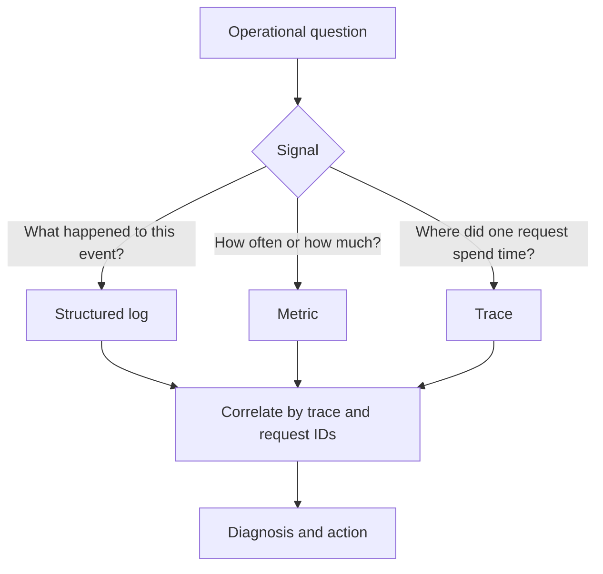
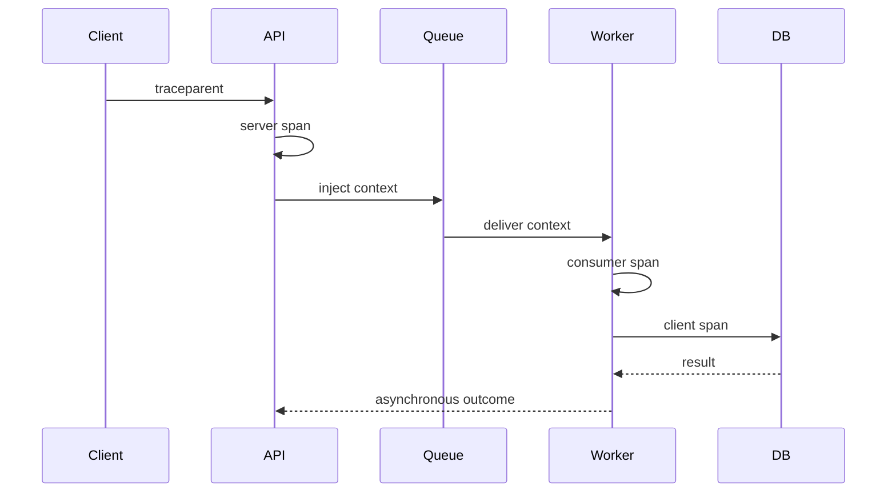
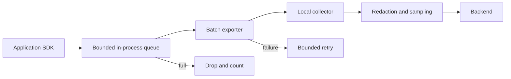

# Observability Logging Tracing and Metrics

## Overview

Observability is the ability to infer internal system state from emitted evidence.
Logs describe discrete events, metrics aggregate numeric behavior, and traces connect work across boundaries.
Production telemetry must be structured, correlated, bounded, privacy-aware, and useful for decisions.
Emitting more data without a question or retention policy creates cost and noise rather than understanding.

## Learning Objectives

- Choose logs, metrics, or traces for a question
- Implement structured correlated logging
- Design low-cardinality metrics
- Propagate trace context across async boundaries
- Operate telemetry safely on CPython 3.14+

## Prerequisites

- Exceptions and context variables
- HTTP and distributed systems
- [[03-Python/09-Production-Python/Operational Readiness for CLIs and Services|Operational Readiness for CLIs and Services]]

## Difficulty

`advanced`

## Estimated Time

- Reading: 4 hours
- Exercises: 5 hours
- Mini project: 8 hours

## History

Text logs began as operator narratives.
Central aggregation encouraged structured events and indexing.
Metrics systems made service-wide trends and alerting efficient.
Distributed tracing connected one request across services.
OpenTelemetry standardized APIs, SDKs, context, and export protocols across vendors.

## Problem It Solves

Distributed failures do not fit in one stack trace.
An operator needs to know impact, affected dimensions, dependency contribution, and causal sequence.
Telemetry supplies evidence when direct debugging is unsafe or the failure has already ended.

## Signals



Use metrics for alerting, traces for request topology and latency decomposition, and logs for detailed event context.
Exemplars can link a metric observation to a representative trace.

## Structured Logging

Use module loggers and parameterized messages:

```python
from __future__ import annotations

import logging
from contextvars import ContextVar

logger = logging.getLogger(__name__)
request_id: ContextVar[str] = ContextVar("request_id", default="-")

class ContextFilter(logging.Filter):
    def filter(self, record: logging.LogRecord) -> bool:
        record.request_id = request_id.get()
        return True

def process_order(order_id: str) -> None:
    logger.info(
        "order processing started",
        extra={"event": "order.started", "order_id": order_id},
    )
```

`ContextVar` propagates through asyncio task context.
Thread pools and process pools may need explicit propagation.
Do not attach mutable global dictionaries to every record.

JSON formatters should produce stable fields:

- timestamp in UTC
- severity
- event name
- service and version
- trace, span, and request IDs
- operation outcome
- bounded domain identifiers
- exception type and stack where appropriate

Messages are for humans; event names and fields support automation.

## Exception Logging

Log an exception once at the boundary that owns the operation outcome:

```python
def handle_job(job_id: str) -> None:
    try:
        run_job(job_id)
    except KnownRejection as exc:
        logger.warning(
            "job rejected",
            extra={"event": "job.rejected", "job_id": job_id, "reason": exc.code},
        )
    except Exception:
        logger.exception(
            "job failed",
            extra={"event": "job.failed", "job_id": job_id},
        )
        raise
```

Repeated logging at every layer multiplies one failure and obscures ownership.
Expected client errors generally do not need stack traces.

## Metrics

Common metric types:

- Counter: monotonic event count
- Gauge: current value that rises and falls
- Histogram: distribution of observations
- Up/down counter: concurrent work or allocated resources

```python
from prometheus_client import Counter, Histogram

REQUESTS = Counter(
    "acme_requests_total",
    "Completed requests",
    ["method", "route", "outcome"],
)
LATENCY = Histogram(
    "acme_request_duration_seconds",
    "Request duration",
    ["method", "route"],
)
```

Use route templates such as `/orders/{id}`, never raw URLs or user IDs.
Every unique label combination creates a time series.
Unbounded cardinality can exhaust the monitoring system.

## RED and USE

For request-driven services, monitor Rate, Errors, and Duration.
For resources, monitor Utilization, Saturation, and Errors.
Also measure queue depth, dropped work, retry volume, dependency budgets, and freshness where domain-relevant.
Metrics should map to service-level indicators and operator actions.

## Tracing

A trace contains spans representing timed operations.
Each span has parentage, attributes, events, status, and resource identity.



Use standard context propagation.
Validate incoming headers and start a new trace when context is invalid or prohibited by trust policy.
Asynchronous messaging may use span links when strict parent-child relationships misrepresent causality.

## OpenTelemetry Shape

```python
from opentelemetry import trace

tracer = trace.get_tracer(__name__)

def reserve_inventory(sku: str, quantity: int) -> None:
    with tracer.start_as_current_span("inventory.reserve") as span:
        span.set_attribute("inventory.sku_class", classify_sku(sku))
        span.set_attribute("inventory.quantity", quantity)
        perform_reservation(sku, quantity)
```

Do not record raw customer identifiers merely because the API permits attributes.
Instrumentation libraries should remain vendor-neutral; exporters select the backend.

## Sampling

Head sampling decides near trace start and controls cost predictably.
Tail sampling decides after observing outcomes and can retain errors or slow traces.
Tail sampling needs buffering and a collector.
Sampling traces does not justify sampling away all error metrics.
Record sampling policy and account for it during analysis.

## Telemetry Pipeline



Telemetry must not block core work indefinitely.
Use bounded buffers, timeouts, batching, drop counters, and graceful flush with a deadline.
An exporter failure must not recursively produce unbounded telemetry.

## CPython 3.14+ Compatibility

- `ContextVar` remains the correct logical-context mechanism; verify explicit propagation to executors.
- Free-threaded builds require thread-safe handlers, exporters, and custom processors.
- Avoid relying on logging’s internal lock for application state safety.
- Use monotonic clocks for durations and wall clocks for event timestamps.
- `sys.monitoring` can support instrumentation but callbacks must remain minimal.
- Confirm native telemetry dependencies publish compatible 3.14 and free-threaded wheels.

## Privacy and Security

Classify telemetry fields before emission.
Never log passwords, bearer tokens, cookies, private keys, full payment data, or secret environment variables.
Hashing low-entropy identifiers may still be reversible.
Apply allowlist-based fields, redaction at source and collector, access control, encryption, retention limits, and deletion policy.
Trace baggage propagates broadly; keep it tiny and non-sensitive.

## Alert Design

Alert on user impact or imminent exhaustion, not every exception.
Use sustained windows and multi-window burn-rate alerts for SLOs.
Every alert needs ownership, severity, runbook, dashboard links, and a clear action.
Measure false positives and unattended alerts.

## Trade-offs

| Signal | Strength | Limitation |
| --- | --- | --- |
| Logs | Rich event detail | Expensive search and storage |
| Metrics | Cheap aggregation | Limited dimensions |
| Traces | End-to-end causality | Sampling and instrumentation cost |
| Continuous profile | Runtime hotspots | Less domain context |
| High cardinality | Precise slicing | Explosive cost |

### When to Use

- Instrument boundaries, queues, retries, and critical domain transitions.
- Emit metrics for SLOs and capacity.
- Trace distributed or asynchronous workflows.
- Log decisions and exceptional outcomes.

### When Not to Use

- Do not log every successful loop iteration.
- Do not use logs as a durable audit ledger without integrity controls.
- Do not add user IDs as metric labels.
- Do not block requests waiting for telemetry export.

## Common Mistakes

- Free-form messages with no stable event name
- Duplicate exception logs
- Raw URL metric labels
- Missing service version
- Span success despite an exception
- Broken queue context propagation
- Unlimited telemetry queues
- Alerting on causes without user impact

## Exercises

1. Convert text logs to structured allowlisted events.
2. Calculate time-series cardinality for a proposed metric.
3. Propagate trace context through an asyncio queue.
4. Simulate exporter outage and prove bounded behavior.
5. Design RED metrics and an SLO alert for one API.

## Mini Project

Instrument a worker service.
Add structured logs, RED metrics, queue metrics, producer/consumer spans, exemplars, redaction tests, bounded export, and dashboards.
Inject dependency latency and verify diagnosis from signals alone.

## Portfolio Project

Build an OpenTelemetry reference platform for Python services.
Include collector policy, tail sampling, tenancy isolation, SLO burn alerts, schema governance, cost budgets, privacy controls, and CPython 3.14 free-threaded load tests.

## Interview Questions

1. Logs versus metrics versus traces?
2. Why is metric cardinality dangerous?
3. What does context propagation carry?
4. Head versus tail sampling?
5. Why log an exception once?
6. How should exporter failure behave?
7. What changes under free-threaded CPython?

### Stretch / Staff-Level

1. Design telemetry governance for hundreds of teams.
2. Reduce observability spend without harming incident response.
3. Define cross-tenant privacy controls for traces.

## Best Practices

- Begin with operational questions and SLOs.
- Standardize stable field and metric schemas.
- Correlate signals with trace and request context.
- Bound cardinality, buffers, retries, and retention.
- Redact before data leaves the process.
- Test telemetry failure behavior.

## Summary

Observability turns bounded runtime evidence into operational understanding.
Logs explain events, metrics quantify system behavior, and traces connect distributed work.
Production Python instrumentation must preserve context across concurrency, control cardinality and privacy, and fail safely when its own pipeline is unavailable.

## Further Reading

- [`logging`](https://docs.python.org/3/library/logging.html)
- [OpenTelemetry Python](https://opentelemetry.io/docs/languages/python/)
- [Prometheus metric practices](https://prometheus.io/docs/practices/naming/)

## Related Notes

- [[03-Python/09-Production-Python/Debugging pdb monitoring and Remote Attach|Debugging pdb monitoring and Remote Attach]]
- [[03-Python/09-Production-Python/Operational Readiness for CLIs and Services|Operational Readiness for CLIs and Services]]
- [[03-Python/code/README|Python code labs]]

## Progress Checklist

- [ ] Correlated all three signals
- [ ] Bounded metric cardinality
- [ ] Tested exporter failure
- [ ] Audited sensitive fields
- [ ] Practiced interview questions aloud
