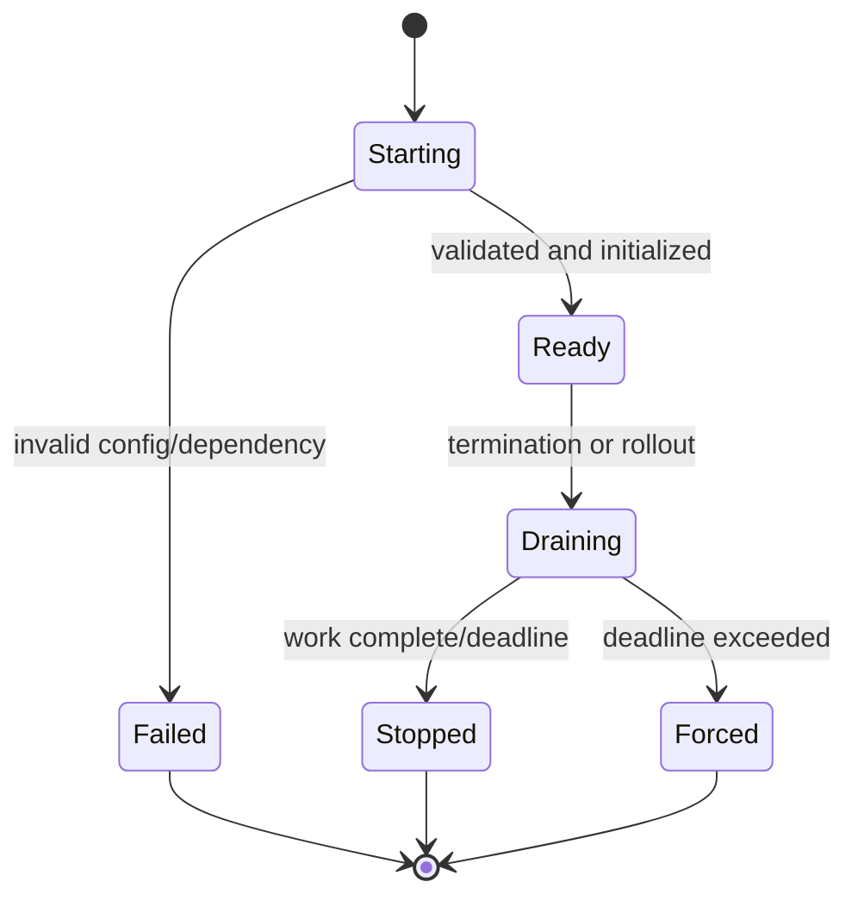
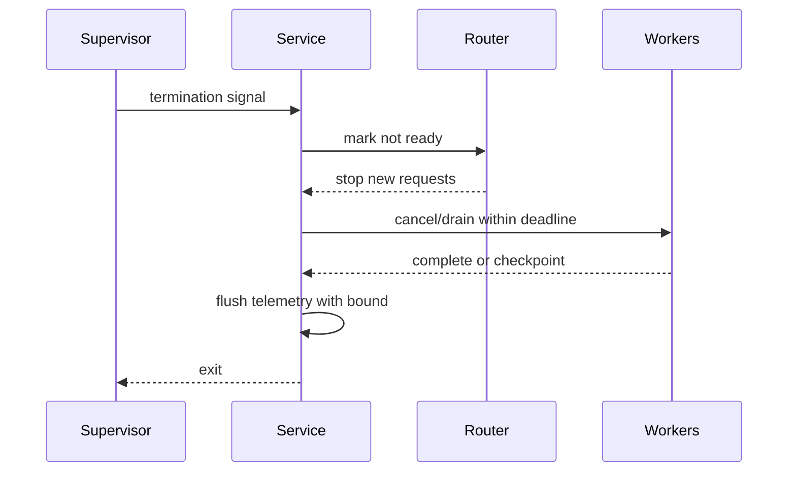

# Operational Readiness for CLIs and Services

## Overview

Operational readiness is evidence that software can be deployed, observed, controlled, recovered, and retired safely.
A correct Python program is not production-ready until it has deterministic configuration, bounded resource behavior, lifecycle handling, useful telemetry, secure delivery, rollback, and owned runbooks.
CLIs and long-running services share these foundations but differ in interaction, shutdown, and compatibility contracts.

## Learning Objectives

- Design startup, readiness, and graceful shutdown
- Define CLI exit, stream, and signal contracts
- Bound queues, retries, memory, and dependencies
- Plan deployment, rollback, backup, and incidents
- Validate CPython 3.14 operational compatibility

## Prerequisites

- Packaging, testing, security, and observability
- Signals, processes, and networking
- [[03-Python/09-Production-Python/Error Design Exception Safety and Failure Modes|Error Design Exception Safety and Failure Modes]]

## Difficulty

`advanced`

## Estimated Time

- Reading: 5 hours
- Exercises: 6 hours
- Mini project: 9 hours

## History

Early deployment often meant copying scripts to servers.
Virtual environments, wheels, immutable images, process supervisors, orchestration, and SRE practices made lifecycle and health contracts explicit.
Cloud platforms increased automation but did not remove the need to understand startup, overload, rollback, and data recovery.

## Problem It Solves

Most severe failures occur around transitions and limits:

- deployment starts with incompatible configuration
- readiness is reported before migrations or dependencies are usable
- shutdown drops accepted work
- retries amplify an outage
- a queue grows until memory is exhausted
- rollback cannot read newly written data
- operators lack evidence or authority to recover

Readiness makes these behaviors designed and tested rather than accidental.

## Lifecycle



Liveness answers whether the process should be restarted.
Readiness answers whether it should receive new work.
Startup probes protect slow initialization.
Do not make liveness depend on every downstream service or a shared outage can cause restart storms.

## Configuration

Configuration should be:

- parsed once into a typed immutable object
- validated before accepting work
- sourced by documented precedence
- free of secrets in diagnostics
- versioned where format compatibility matters
- observable through a safe effective-config summary

```python
from __future__ import annotations

from dataclasses import dataclass
import os

@dataclass(frozen=True)
class Settings:
    port: int
    shutdown_seconds: float
    max_in_flight: int

def load_settings(env: dict[str, str] | None = None) -> Settings:
    source = os.environ if env is None else env
    settings = Settings(
        port=int(source.get("PORT", "8080")),
        shutdown_seconds=float(source.get("SHUTDOWN_SECONDS", "20")),
        max_in_flight=int(source.get("MAX_IN_FLIGHT", "100")),
    )
    if not 1 <= settings.port <= 65535:
        raise ValueError("PORT must be between 1 and 65535")
    if settings.shutdown_seconds <= 0:
        raise ValueError("SHUTDOWN_SECONDS must be positive")
    if settings.max_in_flight < 1:
        raise ValueError("MAX_IN_FLIGHT must be positive")
    return settings
```

Parsing can fail; fail fast before partial startup.

## Graceful Shutdown



Signal handlers should perform minimal safe notification.
Move cleanup into normal control flow.
Stop admission before draining.
Use one overall shutdown deadline, then force termination predictably.
Jobs that cannot finish should be returned to a durable queue or checkpointed idempotently.

## Async Service Skeleton

```python
import asyncio
import signal

async def serve() -> None:
    stopping = asyncio.Event()
    loop = asyncio.get_running_loop()
    for name in ("SIGINT", "SIGTERM"):
        sig = getattr(signal, name, None)
        if sig is not None:
            try:
                loop.add_signal_handler(sig, stopping.set)
            except NotImplementedError:
                pass

    server = await start_server()
    try:
        await stopping.wait()
        server.stop_admission()
        async with asyncio.timeout(20):
            await server.drain()
    finally:
        await server.close()

def main() -> int:
    try:
        asyncio.run(serve())
    except KeyboardInterrupt:
        return 130
    return 0
```

Windows event-loop signal support differs; supervisors may deliver console control events or invoke service APIs.
Test on the target OS rather than assuming POSIX behavior.

## CLI Contract

A production CLI defines:

- command and option compatibility
- stdin/stdout/stderr use
- output formats and schema versions
- exit status meanings
- noninteractive behavior
- encoding and locale policy
- signal and broken-pipe handling
- timeout and retry controls
- secret-safe diagnostics

Use stdout for requested machine or human output and stderr for diagnostics.
Exit zero only for successful contract completion.
Reserve stable nonzero statuses for documented automation decisions.

```python
import argparse

def cli(argv: list[str] | None = None) -> int:
    parser = argparse.ArgumentParser(prog="acme-check")
    parser.add_argument("--format", choices=("text", "json"), default="text")
    args = parser.parse_args(argv)
    try:
        result = run_check()
    except ConfigurationError as exc:
        parser.exit(2, f"configuration error: {exc}\n")
    except DependencyError as exc:
        print(f"dependency unavailable: {exc}", file=sys.stderr)
        return 75
    write_result(result, args.format)
    return 0
```

## Capacity and Backpressure

Every queue must have a bound and full policy.
Every outbound call needs a deadline.
Concurrency should be limited by measured dependency and resource capacity.
Retries consume capacity and belong inside the same budget.
Reject, shed, or degrade before resource exhaustion.

Apply Little’s Law as a planning model:

`concurrency ≈ throughput × latency`

If dependency latency doubles at fixed arrival rate, in-flight work doubles unless admission changes.

## Dependency Resilience

- explicit connect and operation deadlines
- bounded retries with jitter
- circuit breaking where it prevents futile load
- connection-pool limits
- bulkheads between critical workloads
- idempotency keys for retried effects
- fallback only when semantically safe

Fallbacks can hide stale or incorrect data.
Measure their activation and define expiration.

## Deployment

Build one verified immutable artifact and promote it.
Use canary, rolling, or blue-green strategies according to risk and state.
Make schema changes expand-and-contract:

1. deploy readers compatible with old and new schema
2. add new schema
3. migrate data safely
4. switch writers
5. remove old schema only after rollback window

Code rollback does not undo data changes.

## Health and Diagnostics

Readiness should verify local initialization and essential ability to serve, not perform expensive deep checks every probe.
Expose build version, commit, interpreter mode, uptime, and safe dependency summaries.
Protect diagnostic endpoints and bound their work.
Do not include credentials or raw environment.

## CPython 3.14+ Compatibility

- Pin an exact interpreter build in deployable artifacts.
- Validate normal versus free-threaded behavior and native wheels.
- Set explicit thread and process counts; defaults may change or interact with CPU quotas.
- Test signal, console control, and subprocess semantics on every target OS.
- Monitor garbage collection, memory, and tail latency after interpreter upgrades.
- Use compatibility canaries before fleet-wide adoption.

## Resource Management

Set budgets for:

- CPU and resident memory
- open files and sockets
- threads, processes, and tasks
- request body and response size
- queue depth and batch size
- temporary disk
- telemetry buffers
- cache size

Limits need observable saturation signals and tested failure behavior.

## Data Safety

Backups are not complete until restore is tested.
Define recovery point and recovery time objectives.
Encrypt backups, limit restore authority, and test version compatibility.
For stateful jobs, checkpoint only after durable side effects and use idempotent replay.

## Runbooks and Ownership

Every alert needs an owner and executable runbook.
A useful runbook includes impact, prerequisites, diagnostics, safe mitigations, rollback, escalation, and verification.
Commands should be copy-safe but require operators to inspect target and scope.
Review runbooks after incidents and architecture changes.

## Trade-offs

| Choice | Benefit | Cost |
| --- | --- | --- |
| Fail-fast startup | Avoids partial service | Reduced degraded availability |
| Graceful drain | Preserves work | Longer rollout |
| Bounded queue | Prevents collapse | Explicit rejection |
| Canary | Limits blast radius | Deployment complexity |
| Immutable artifact | Reproducible rollback | Build discipline |
| Rich diagnostics | Faster recovery | Security and maintenance |

### When to Use

- Apply readiness gates to every deployed CLI and service.
- Increase controls with data criticality and blast radius.
- Automate repeated operational verification.

### When Not to Use

- Do not add orchestration complexity to a local one-off script.
- Do not claim readiness from a checklist without exercising failures.
- Do not use process restart as the only dependency recovery strategy.
- Do not make health probes perform customer work.

## Readiness Review

Evidence should include:

- owner and service tier
- architecture and dependency map
- threat model
- SLOs and capacity test
- deployment and rollback demonstration
- shutdown and overload test
- dashboards, alerts, and runbooks
- backup restore evidence
- dependency and artifact provenance
- known risks with accountable acceptance

## Common Mistakes

- Reporting ready before initialization
- Liveness coupled to an optional dependency
- Unbounded queues and caches
- Independent timeout values exceeding caller deadline
- Retrying non-idempotent work
- Logging secrets at startup
- Assuming rollback repairs schema
- Never testing restore or shutdown

## Exercises

1. Define stable exit statuses for a backup CLI.
2. Test service drain under concurrent requests.
3. Calculate capacity from latency and arrival rate.
4. Design expand-and-contract migration steps.
5. Run a game day for dependency slowdown and telemetry outage.

## Mini Project

Productionize a file-processing CLI.
Add typed configuration, machine-readable output, stable statuses, atomic writes, cancellation cleanup, structured telemetry, package signing, and cross-platform CPython 3.14 tests.

## Portfolio Project

Build and operate a queued HTTP service.
Include bounded admission, idempotency, readiness, graceful drain, SLOs, canary deployment, schema migration, restore drills, security controls, runbooks, and free-threaded compatibility evidence.
Conduct and document a failure game day.

## Interview Questions

1. Readiness versus liveness?
2. What is graceful shutdown order?
3. Why must queues be bounded?
4. How should CLI output streams differ?
5. Why can code rollback fail?
6. What makes a retry operationally safe?
7. What evidence belongs in a readiness review?

### Stretch / Staff-Level

1. Design readiness standards proportional to service criticality.
2. Plan a zero-downtime CPython 3.14 migration.
3. Handle regional overload while preserving priority traffic.

## Best Practices

- Validate configuration before admission.
- Make lifecycle transitions observable.
- Bound every resource and retry.
- Promote one verified artifact.
- Test shutdown, overload, rollback, and restore.
- Assign ownership and rehearse runbooks.

## Summary

Operational readiness turns Python code into a controllable production system.
CLIs need stable streams, statuses, and automation behavior; services need explicit health, admission, backpressure, drain, and recovery.
Both require verified artifacts, bounded resources, useful telemetry, tested rollback, and evidence that CPython 3.14 behaves safely on the actual platform.

## Further Reading

- [Python command-line libraries](https://docs.python.org/3/library/argparse.html)
- [Python signal handling](https://docs.python.org/3/library/signal.html)
- [Google SRE Workbook](https://sre.google/workbook/table-of-contents/)

## Related Notes

- [[03-Python/09-Production-Python/Observability Logging Tracing and Metrics|Observability Logging Tracing and Metrics]]
- [[03-Python/09-Production-Python/Secure Python Practices|Secure Python Practices]]
- [[03-Python/code/README|Python code labs]]

## Progress Checklist

- [ ] Tested startup and shutdown
- [ ] Bounded every resource
- [ ] Demonstrated rollback and restore
- [ ] Reviewed CLI or service contracts
- [ ] Practiced interview questions aloud
