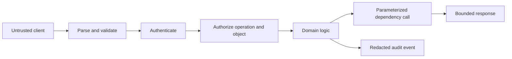
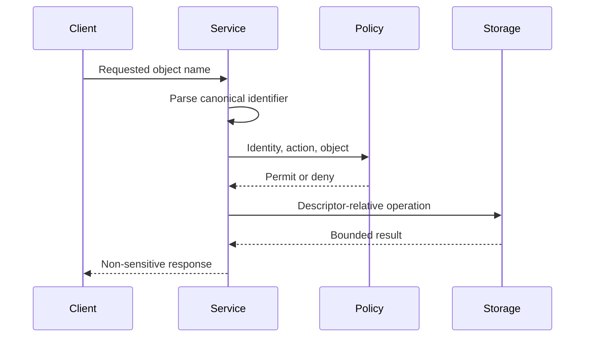

# Secure Python Practices

## Overview

Secure Python constrains how untrusted data becomes authority.
The main controls are explicit trust boundaries, allowlisted parsing, least privilege, safe subprocess and query APIs, mature cryptography, secret hygiene, dependency integrity, and observable denial.
Python’s dynamism and serialization facilities are powerful; many are unsafe when the input is not trusted.

## Learning Objectives

- Threat-model Python applications
- Prevent injection and unsafe deserialization
- Handle credentials and cryptography safely
- Enforce filesystem and network boundaries
- Design defense in depth for CPython 3.14+

## Prerequisites

- HTTP, SQL, processes, and filesystems
- Authentication and authorization fundamentals
- [[03-Python/08-Modules-Packaging-and-Environments/Distribution Signing and Supply-Chain Integrity|Distribution Signing and Supply-Chain Integrity]]

## Difficulty

`advanced`

## Estimated Time

- Reading: 5 hours
- Exercises: 6 hours
- Mini project: 9 hours

## History

Python applications inherited classic injection, path, and authentication risks.
Language-specific hazards include `pickle`, unsafe YAML constructors, dynamic imports, `eval`, and packaging attacks.
Security guidance has shifted from perimeter trust toward zero-trust identities, short-lived credentials, and verifiable software supply chains.

## Problem It Solves

Input becomes dangerous when interpreted as code, query structure, path authority, template syntax, or a privileged object graph.
Validation alone is insufficient if the system later concatenates input into an interpreter.
Secure design keeps data as data and minimizes the privilege available if one control fails.

## Threat Modeling

Identify:

- assets and sensitive operations
- trust boundaries and identities
- entry points and data flows
- attacker capabilities
- abuse cases and failure impact
- preventive, detective, and recovery controls



Authentication establishes identity.
Authorization decides whether that identity may perform this action on this object.
Every request and background action needs both where applicable.

## Injection Prevention

Never assemble SQL from values:

```python
def find_user(connection: "Connection", email: str) -> object | None:
    return connection.execute(
        "SELECT id, email FROM users WHERE email = ?",
        (email,),
    ).fetchone()
```

Placeholder syntax differs by driver.
Identifiers such as column names cannot usually be parameters; map external choices to an allowlist.

Avoid shell interpretation:

```python
from pathlib import Path
import subprocess

def inspect_archive(path: Path) -> subprocess.CompletedProcess[str]:
    return subprocess.run(
        ["tar", "--list", "--file", str(path)],
        check=True,
        capture_output=True,
        text=True,
        timeout=10,
    )
```

Argument arrays prevent shell metacharacter interpretation.
They do not make the invoked program safe from malicious filenames or archive contents.
Use `shell=False`, an absolute executable path, constrained environment, working directory, resource limits, and least privilege.

## Unsafe Evaluation and Deserialization

Do not use `eval` or `exec` on untrusted input.
`ast.literal_eval` parses only Python literals but can still consume excessive memory or recursion; bound size and depth.
`pickle` can execute arbitrary code during loading.
Only unpickle data authenticated and produced within the same trust domain, and prefer non-executable formats.

```python
import json

def parse_profile(raw: bytes) -> dict[str, object]:
    if len(raw) > 64 * 1024:
        raise ValueError("profile exceeds 64 KiB")
    value = json.loads(raw)
    if not isinstance(value, dict):
        raise ValueError("profile must be an object")
    allowed = {"display_name", "timezone"}
    if unknown := value.keys() - allowed:
        raise ValueError(f"unknown fields: {sorted(unknown)}")
    return value
```

JSON is not executable, but parsers still need size, nesting, numeric, and schema limits.

## Path Safety

```python
from pathlib import Path

def confined_path(root: Path, user_name: str) -> Path:
    root = root.resolve(strict=True)
    candidate = (root / user_name).resolve(strict=False)
    if not candidate.is_relative_to(root):
        raise ValueError("path escapes storage root")
    return candidate
```

This lexical/realpath check still has time-of-check/time-of-use races when attackers can alter symlinks.
For high-assurance operations, use descriptor-relative OS APIs, no-follow flags, private directories, and atomic creation.
Never extract archives without validating every member path and link.



## Secrets

- Keep secrets out of source, images, logs, and command arguments.
- Fetch them through workload identity or a secret manager.
- Prefer short-lived credentials.
- Scope by service, environment, and operation.
- Rotate and revoke automatically.
- Redact at the telemetry boundary.
- Never return secrets in exception text.

Environment variables are convenient but may leak through diagnostics and child processes.
Use platform-protected handles or mounted secret files with restrictive permissions where appropriate.

## Passwords and Tokens

Store passwords with a memory-hard password hash using a maintained library and per-password salts.
Do not use general-purpose SHA-256 directly.
Support parameter upgrades after successful login.
Compare secret tokens with `hmac.compare_digest`.
Store only a keyed digest of high-entropy API tokens when plaintext recovery is unnecessary.

## Cryptography

Do not design cryptographic primitives or protocols.
Use a maintained high-level library with authenticated encryption.
Encryption without integrity permits tampering.
Nonce uniqueness requirements are algorithm-specific and critical.
Separate keys by purpose and tenant where risk warrants.
Plan rotation and version ciphertext envelopes.

```python
import hmac

def valid_token(presented: bytes, expected_digest: bytes, key: bytes) -> bool:
    actual = hmac.digest(key, presented, "sha256")
    return hmac.compare_digest(actual, expected_digest)
```

Key management usually dominates cryptographic risk.

## SSRF and Network Egress

User-supplied URLs can target loopback, cloud metadata, internal DNS, or private services.
Allowlist schemes and destinations, resolve and validate all addresses, block private ranges where required, and revalidate redirects.
DNS can change between validation and connection.
Prefer an egress proxy that enforces policy at connection time.

## Resource Exhaustion

Bound:

- request and decompressed sizes
- nesting and collection counts
- regex complexity and input length
- concurrency and queue depth
- subprocess CPU, memory, and duration
- outbound response size
- retries and recursive traversal

Timeouts alone do not release capacity if abandoned work continues.
Propagate cancellation and enforce server-side limits.

## CPython 3.14+ Compatibility

- Free-threaded CPython changes race assumptions; authorization caches and nonce counters require synchronization.
- Audit hooks observe sensitive runtime events but are not a sandbox.
- Subinterpreters do not safely isolate hostile Python code.
- Use supported cryptography and native wheels for the exact 3.14 ABI.
- Keep XML, archive, and parser behavior under compatibility tests.
- Do not rely on object finalizers to erase secrets or release privileged resources.

## Supply Chain

Lock exact deployment artifacts and verify hashes.
Use controlled indexes, trusted publishing, provenance, and dependency scanning.
Review build dependencies because they execute during builds.
Remove abandoned packages and unnecessary extras.
An SBOM inventories components; it does not prove safety.

## Trade-offs

| Control | Benefit | Cost |
| --- | --- | --- |
| Strict allowlist | Small attack surface | Compatibility coordination |
| Process sandbox | Fault/privilege isolation | Operational complexity |
| Short-lived secrets | Limits theft window | Identity dependency |
| Egress proxy | Central SSRF control | Latency and availability |
| Detailed audit | Investigation evidence | Privacy and storage risk |

### When to Use

- Apply secure defaults to every production path.
- Increase isolation around untrusted code and customer-controlled files.
- Require stronger identity and audit for privileged operations.

### When Not to Use

- Do not write custom cryptography.
- Do not treat escaping as universal across SQL, shell, HTML, and URLs.
- Do not rely on a Python “sandbox” for hostile code.
- Do not expose verbose errors to untrusted clients.

## Common Mistakes

- Using `pickle` for external messages
- Concatenating SQL or shell commands
- Checking roles but not object ownership
- Trusting filename extensions
- Logging headers and environment wholesale
- Following redirects after only validating the first URL
- Extracting archive links
- Assuming the GIL prevents security races

## Exercises

1. Threat-model a file conversion API.
2. Exploit then fix SQL and subprocess injection.
3. Build tests for traversal, symlinks, and archive extraction.
4. Design an SSRF-resistant outbound fetch policy.
5. Rotate API token hashing keys without downtime.

## Mini Project

Build a secure upload processor.
Enforce authentication, object authorization, streaming size limits, content sniffing, quarantine, safe filenames, isolated conversion, malware scanning hooks, redacted audit, and retention cleanup.
Test traversal, decompression bombs, cancellation, and duplicate uploads.

## Portfolio Project

Create a multi-tenant automation runner.
Execute declarative jobs in disposable low-privilege workers with no default network, signed inputs, resource quotas, short-lived identity, encrypted artifacts, complete audit, and incident revocation.
Explain why subinterpreters are insufficient isolation.

## Interview Questions

1. Why is parameterization better than escaping?
2. What makes `pickle` unsafe?
3. How does SSRF bypass simple URL validation?
4. Authentication versus authorization?
5. Why is hashing not password hashing?
6. Why are audit hooks not a sandbox?
7. How does free threading affect security?

### Stretch / Staff-Level

1. Design trust boundaries for customer-supplied Python execution.
2. Respond to a compromised transitive build dependency.
3. Balance forensic audit value against privacy and secret exposure.

## Best Practices

- Model trust and authority explicitly.
- Parse, validate, canonicalize, then authorize.
- Keep data out of interpreters.
- Limit privilege, time, memory, network, and output.
- Use mature cryptography and managed keys.
- Verify software provenance and practice incident response.

## Summary

Secure Python is principally authority control at trust boundaries.
Keep untrusted values as bounded data, use parameterized APIs, isolate dangerous work, minimize credentials, and verify dependencies.
CPython 3.14’s concurrency modes increase the need for explicit synchronization; they do not turn interpreter features into a security sandbox.

## Further Reading

- [Python security considerations](https://docs.python.org/3/library/security_warnings.html)
- [OWASP Application Security Verification Standard](https://owasp.org/www-project-application-security-verification-standard/)
- [Python Packaging security](https://packaging.python.org/)

## Related Notes

- [[03-Python/08-Modules-Packaging-and-Environments/Distribution Signing and Supply-Chain Integrity|Distribution Signing and Supply-Chain Integrity]]
- [[03-Python/09-Production-Python/Operational Readiness for CLIs and Services|Operational Readiness for CLIs and Services]]
- [[03-Python/code/README|Python code labs]]

## Progress Checklist

- [ ] Threat-modeled a real service
- [ ] Removed injection paths
- [ ] Tested resource limits
- [ ] Documented secret lifecycle
- [ ] Practiced interview questions aloud
