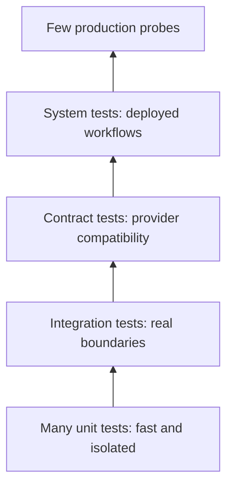
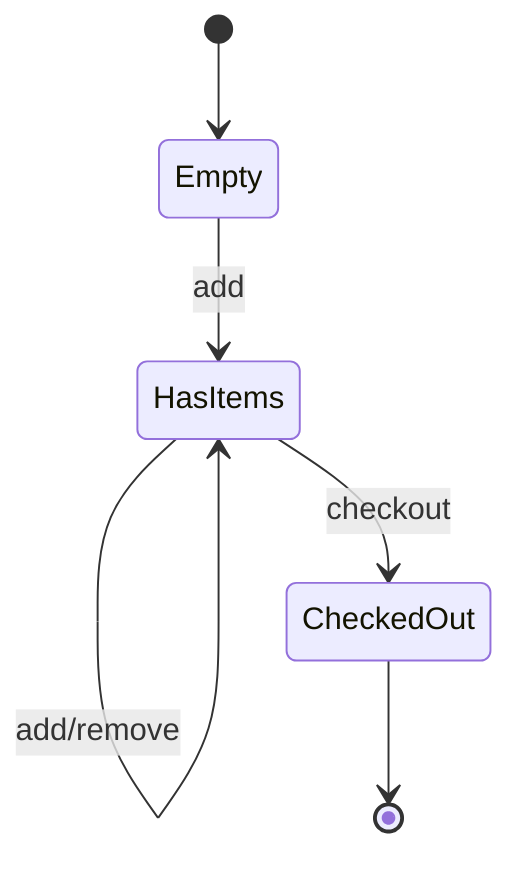
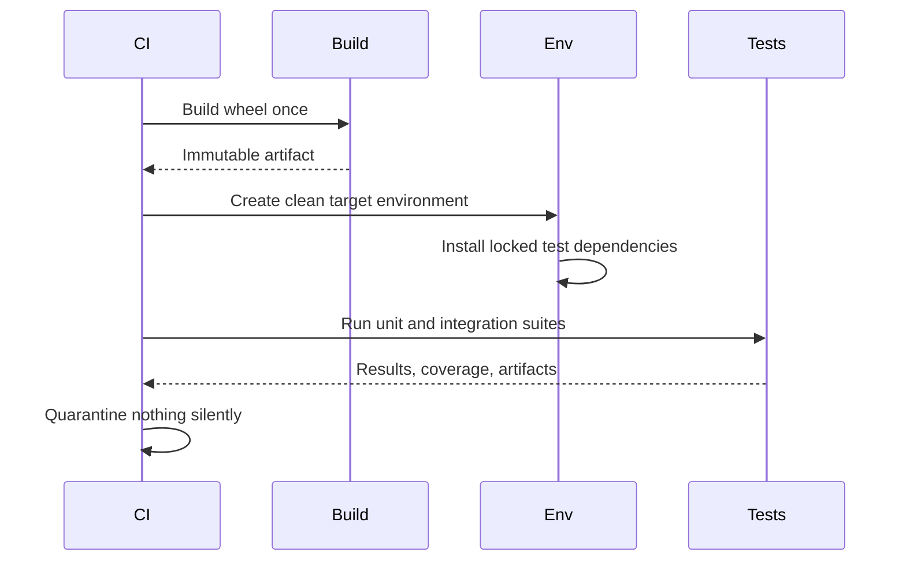

# Testing with unittest pytest and Hypothesis

## Overview

Tests are executable claims about behavior.
`unittest` provides a batteries-included xUnit framework and mocking tools.
pytest adds assertion rewriting, fixtures, parametrization, and a plugin ecosystem.
Hypothesis generates and shrinks examples from declarative strategies.
Production confidence comes from choosing boundaries and properties well, not maximizing test count or coverage alone.

## Learning Objectives

- Structure deterministic unit and integration tests
- Use fixtures without hiding dependencies
- Patch names at their lookup site
- Express invariants with property-based tests
- Build a CPython 3.14 test matrix

## Prerequisites

- Exceptions and context managers
- Type hints and protocols
- [[03-Python/08-Modules-Packaging-and-Environments/Virtual Environments and Interpreter Isolation|Virtual Environments and Interpreter Isolation]]

## Difficulty

`intermediate`

## Estimated Time

- Reading: 4 hours
- Exercises: 6 hours
- Mini project: 8 hours

## History

`unittest` follows the xUnit family and remains in the standard library.
pytest grew from py.test into a widely used runner with plain assertions and composable fixtures.
Hypothesis brought QuickCheck-style property testing and shrinking to Python.
These tools complement rather than replace static checks, reviews, observability, and production experiments.

## Problem It Solves

Software has a huge input and state space.
Examples protect known behavior; properties explore classes of behavior.
Integration tests reveal boundary mismatches.
System tests validate deployed behavior.
Each layer trades speed and diagnosis quality for realism.

## Testing Layers



The pyramid is a risk heuristic, not a quota.
A data pipeline may need more integration tests than a pure algorithm library.

## Arrange, Act, Assert

```python
from decimal import Decimal

def apply_discount(total: Decimal, percent: int) -> Decimal:
    if not 0 <= percent <= 100:
        raise ValueError("percent must be between 0 and 100")
    return total * (Decimal(100 - percent) / 100)

def test_full_discount_returns_zero() -> None:
    total = Decimal("19.99")
    result = apply_discount(total, 100)
    assert result == Decimal("0")
```

Prefer one behavioral reason for failure per test.
Multiple assertions are fine when they describe one outcome.

## unittest

```python
import unittest
from decimal import Decimal

class DiscountTests(unittest.TestCase):
    def test_invalid_percent(self) -> None:
        with self.assertRaisesRegex(ValueError, "between 0 and 100"):
            apply_discount(Decimal("10"), 101)

if __name__ == "__main__":
    unittest.main()
```

`unittest` is a strong choice for standard-library-only packages, embedded suites, and teams using xUnit conventions.
Its lifecycle hooks are explicit but inheritance-heavy fixtures can become coupled.

## pytest Fixtures

```python
from collections.abc import Iterator
from pathlib import Path
import pytest

@pytest.fixture
def config_file(tmp_path: Path) -> Iterator[Path]:
    path = tmp_path / "config.toml"
    path.write_text('region = "test"\n', encoding="utf-8")
    yield path

def test_reads_region(config_file: Path) -> None:
    assert config_file.read_text(encoding="utf-8").endswith('"test"\n')
```

Fixture arguments make dependencies visible.
Keep scope as narrow as cost permits.
Avoid autouse fixtures that silently mutate global state.

### Parametrization

```python
import pytest

@pytest.mark.parametrize(
    ("percent", "expected"),
    [(0, "20"), (25, "15.00"), (100, "0")],
)
def test_discount_examples(percent: int, expected: str) -> None:
    assert apply_discount(Decimal("20"), percent) == Decimal(expected)
```

Give complex cases descriptive IDs.
Do not compress fundamentally different behaviors into an unreadable matrix.

## Mocking

Mocks are interaction assertions.
Patch the name used by the system under test, not necessarily where the object was defined.

```python
from unittest.mock import create_autospec

class Gateway:
    def charge(self, cents: int, key: str) -> str:
        raise NotImplementedError

def checkout(gateway: Gateway, cents: int, key: str) -> str:
    if cents <= 0:
        raise ValueError("cents must be positive")
    return gateway.charge(cents, key)

def test_checkout_forwards_idempotency_key() -> None:
    gateway = create_autospec(Gateway, instance=True)
    gateway.charge.return_value = "payment-1"
    assert checkout(gateway, 500, "order-7") == "payment-1"
    gateway.charge.assert_called_once_with(500, "order-7")
```

Prefer fakes for stateful protocols.
Over-mocking reproduces implementation and can pass while integrations fail.

## Hypothesis

Property-based testing generates examples and shrinks failures to small counterexamples.

```python
from hypothesis import given, strategies as st

@given(
    total=st.decimals(
        min_value=0,
        max_value=1_000_000,
        places=2,
        allow_nan=False,
        allow_infinity=False,
    ),
    percent=st.integers(min_value=0, max_value=100),
)
def test_discount_never_increases_total(total: Decimal, percent: int) -> None:
    result = apply_discount(total, percent)
    assert Decimal(0) <= result <= total
```

Good properties include round trips, idempotence, monotonicity, conservation, equivalence to a simple model, and preservation of invariants.
Do not duplicate production logic inside the property oracle.

### Stateful Testing



Hypothesis state machines generate action sequences and compare a system to a model.
They are valuable for caches, queues, parsers, and transactional APIs.

## Determinism

Control:

- wall and monotonic clocks through injected interfaces
- randomness with explicit generators
- locale and timezone
- filesystem paths and ordering
- network dependencies
- process environment
- concurrent scheduling where possible

Do not “fix” flakes by adding sleeps or blind retries.
Find the uncontrolled input or missing synchronization.

## Async and Concurrent Tests

Use structured test support for event loops.
Assert deadlines and cancellation cleanup.
For threads, coordinate with barriers or events rather than timing.
Free-threaded CPython 3.14 can reveal races hidden by GIL-enabled runs; include both builds where supported.

## Test Lifecycle



## CPython 3.14+ Compatibility

- Run tests on the minimum and latest supported CPython versions.
- Add 3.14 before claiming support, including native dependency availability.
- Test normal and free-threaded builds for thread-sensitive software.
- Treat warnings and deprecations as migration signals.
- Avoid relying on dict or set ordering where the contract does not promise it.
- Pin testing tools in a lock while updating them regularly.

## Coverage and Mutation

Line coverage says execution reached a line, not that an assertion could detect a defect.
Branch coverage provides more signal for decisions.
Mutation testing changes operators or branches and checks whether tests fail.
Use coverage to find unexamined risk, not as a universal quality score.

## Trade-offs

| Technique | Strength | Weakness |
| --- | --- | --- |
| Example unit test | Fast, clear diagnosis | Narrow input coverage |
| Integration test | Real boundary behavior | Slower, harder setup |
| Mock | Precise interactions | Couples to implementation |
| Fake | Realistic state | Maintenance burden |
| Property test | Broad generated space | Property design is hard |
| Snapshot | Detects broad change | Encourages blind approval |

### When to Use

- Unit tests for pure decisions and edge cases
- Integration tests for databases, files, serialization, and packaging
- Contract tests for independently deployed providers
- Property tests for large structured input spaces

### When Not to Use

- Do not mock a pure value.
- Do not snapshot volatile IDs or timestamps.
- Do not use end-to-end tests for every branch.
- Do not use tests to compensate for an undefined contract.

## Common Mistakes

- Testing private implementation instead of behavior
- Shared mutable fixture state
- Patching the definition rather than lookup site
- Unbounded generated values that spend time on irrelevant cases
- Assertions inside production fakes that differ from real providers
- Ignoring warnings
- Running only from the source checkout
- Treating flaky tests as normal

## Exercises

1. Port one `unittest.TestCase` suite to pytest and compare trade-offs.
2. Replace a mock-heavy repository test with an in-memory fake.
3. Write round-trip and malformed-input properties for a serializer.
4. Use a state machine to test a bounded queue.
5. Reproduce and remove a timing-based flaky test.

## Mini Project

Build and test a configuration loader.
Support TOML, environment overrides, validation, and secret redaction.
Use unit examples, pytest fixtures, Hypothesis malformed inputs, and wheel-installed integration tests.

## Portfolio Project

Create a tested job queue with a model implementation.
Include stateful Hypothesis tests, concurrent workers, cancellation, persistence integration, fault injection, mutation testing, and CPython 3.14 normal/free-threaded CI lanes.

## Interview Questions

1. What distinguishes a unit from an integration test?
2. Why patch where a name is looked up?
3. What does shrinking do?
4. Give three useful test properties.
5. Why can high coverage still miss defects?
6. When is a fake better than a mock?
7. How would you debug a flaky test?

### Stretch / Staff-Level

1. Allocate a test portfolio for a payment service.
2. Design contract testing between independently released teams.
3. Define a migration strategy for free-threaded CPython validation.

## Best Practices

- Test behavior and invariants at the lowest realistic boundary.
- Keep fixtures explicit and isolated.
- Make time, randomness, and I/O injectable.
- Use properties alongside reviewed examples.
- Run built artifacts in clean environments.
- Treat flakes as defects.

## Summary

`unittest`, pytest, and Hypothesis cover complementary testing styles.
Examples explain known expectations, integration tests verify boundaries, and generated properties explore broad spaces with minimized counterexamples.
Production suites stay deterministic, artifact-aware, and representative of all supported CPython 3.14 runtimes.

## Further Reading

- [`unittest`](https://docs.python.org/3/library/unittest.html)
- [pytest documentation](https://docs.pytest.org/)
- [Hypothesis documentation](https://hypothesis.readthedocs.io/)

## Related Notes

- [[03-Python/09-Production-Python/Debugging pdb monitoring and Remote Attach|Debugging pdb monitoring and Remote Attach]]
- [[03-Python/09-Production-Python/Error Design Exception Safety and Failure Modes|Error Design Exception Safety and Failure Modes]]
- [[03-Python/code/README|Python code labs]]

## Progress Checklist

- [ ] Used all three testing tools
- [ ] Controlled nondeterministic inputs
- [ ] Tested a built wheel
- [ ] Designed properties from invariants
- [ ] Practiced interview questions aloud
