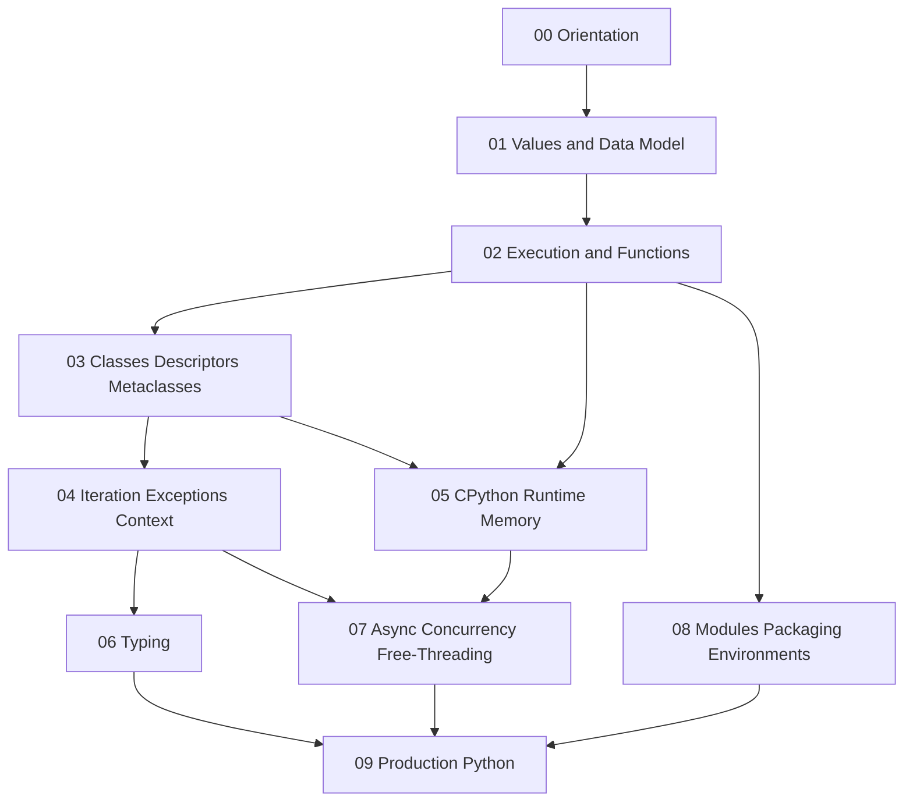

# 03 Python

A first-principles track for understanding Python language semantics, the data model, CPython internals, typing, concurrency (including free-threaded builds), packaging, and production engineering on modern **CPython 3.14+**.

## Objectives

- Distinguish the Python language, CPython, and alternate runtimes
- Predict object model, attribute lookup, descriptor, and metaclass behavior
- Read bytecode and explain the adaptive specializing interpreter
- Explain reference counting, cycle GC, and memory retention
- Design asyncio, threading, multiprocessing, and free-threaded trade-offs
- Ship typed, packaged, tested, observable Python libraries and services

## Why This Track Matters

Python is easy to start and hard to operate correctly. Production failures come from mutable sharing, descriptor surprises, import cycles, GIL/free-threading assumptions, asyncio cancellation, packaging boundaries, and silent type erasure. Framework fluency does not replace the language and runtime model.

## Compatibility Convention

| Layer | Treat as |
| --- | --- |
| Language Reference / PEPs / data model | Portable guarantees |
| CPython 3.14+ internals | Implementation detail; version-label claims |
| Free-threaded CPython | Opt-in / build-dependent; extension and ABI caveats |
| Older 3.x / PyPy / MicroPython / GraalPy | Compatibility notes, never assumed defaults |

## Scope Boundaries

| This track owns | Handoff |
| --- | --- |
| Language semantics and data model | — |
| Descriptors, metaclasses, MRO, typing | CS type-systems primer for foundations |
| CPython bytecode, adaptive interpreter, refcount/GC | [[01-Computer-Science/README\|Computer Science]] foundations |
| asyncio, threads, processes, free-threading trade-offs | [[07-Backend/README\|Backend]] for service architecture |
| Packaging, imports, venvs, wheels, lockfiles | DevOps/deploy pipelines later |
| Testing, debug, perf, security, observability of Python processes | [[18-Security/README\|Security]], [[16-DevOps/README\|DevOps]] for platforms |
| Collections as language protocols | [[04-Data-Structures/README\|Data Structures]] for DS design |
| Algorithmic problem-solving | [[05-Algorithms/README\|Algorithms]] |
| Web frameworks, ORMs, HTTP product APIs | [[07-Backend/README\|Backend]] |

## Prerequisites

- [[01-Computer-Science/00-Orientation/How Computers Run Programs|How Computers Run Programs]]
- [[01-Computer-Science/03-Memory-and-Addressing/Garbage Collection Models|Garbage Collection Models]]
- [[01-Computer-Science/05-Concurrency-Fundamentals/Asynchronous Event-Driven Models|Asynchronous Event-Driven Models]]
- [[01-Computer-Science/08-Languages-and-Computation/Compilers Interpreters and Virtual Machines|Compilers Interpreters and Virtual Machines]]

## Roadmap

## Topics

### 00 — Orientation

- [[03-Python/00-Orientation/Why Python Exists|Why Python Exists]]
- [[03-Python/00-Orientation/CPython Alternatives and Portability|CPython Alternatives and Portability]]
- [[03-Python/00-Orientation/Python Program Lifecycle|Python Program Lifecycle]]
- [[03-Python/00-Orientation/The REPL Debugger and Introspection Surface|The REPL Debugger and Introspection Surface]]

### 01 — Values Types and the Data Model

- [[03-Python/01-Values-Types-and-Data-Model/Python Object Model and PyObject|Python Object Model and PyObject]]
- [[03-Python/01-Values-Types-and-Data-Model/Built-in Types Overview|Built-in Types Overview]]
- [[03-Python/01-Values-Types-and-Data-Model/Numbers Integers Floats Decimal and Fractions|Numbers Integers Floats Decimal and Fractions]]
- [[03-Python/01-Values-Types-and-Data-Model/Strings Bytes and Unicode|Strings Bytes and Unicode]]
- [[03-Python/01-Values-Types-and-Data-Model/Truthiness Equality and Identity|Truthiness Equality and Identity]]
- [[03-Python/01-Values-Types-and-Data-Model/Mutability Sharing and Copying|Mutability Sharing and Copying]]
- [[03-Python/01-Values-Types-and-Data-Model/Sequences Mappings and Sets as Protocols|Sequences Mappings and Sets as Protocols]]
- [[03-Python/01-Values-Types-and-Data-Model/Callables and the Call Protocol|Callables and the Call Protocol]]
- [[03-Python/01-Values-Types-and-Data-Model/Special Methods and Data Model Hooks|Special Methods and Data Model Hooks]]

### 02 — Execution Namespaces and Functions

- [[03-Python/02-Execution-Namespaces-and-Functions/Lexical Structure and Compilation Units|Lexical Structure and Compilation Units]]
- [[03-Python/02-Execution-Namespaces-and-Functions/Names Scopes LEGB and Closures|Names Scopes LEGB and Closures]]
- [[03-Python/02-Execution-Namespaces-and-Functions/Functions as Objects|Functions as Objects]]
- [[03-Python/02-Execution-Namespaces-and-Functions/Argument Binding Unpacking and Keyword-Only Parameters|Argument Binding Unpacking and Keyword-Only Parameters]]
- [[03-Python/02-Execution-Namespaces-and-Functions/Decorators Internals|Decorators Internals]]
- [[03-Python/02-Execution-Namespaces-and-Functions/Comprehensions and Assignment Expressions|Comprehensions and Assignment Expressions]]
- [[03-Python/02-Execution-Namespaces-and-Functions/Exceptions and Control Flow|Exceptions and Control Flow]]
- [[03-Python/02-Execution-Namespaces-and-Functions/Recursion Stack Limits and Frame Depth|Recursion Stack Limits and Frame Depth]]

### 03 — Classes Descriptors and Metaprogramming

- [[03-Python/03-Classes-Descriptors-and-Metaprogramming/Classes Instances and Attribute Lookup|Classes Instances and Attribute Lookup]]
- [[03-Python/03-Classes-Descriptors-and-Metaprogramming/Inheritance MRO and super|Inheritance MRO and super]]
- [[03-Python/03-Classes-Descriptors-and-Metaprogramming/Slots Weakrefs and Object Layout|Slots Weakrefs and Object Layout]]
- [[03-Python/03-Classes-Descriptors-and-Metaprogramming/Properties and the Descriptor Protocol|Properties and the Descriptor Protocol]]
- [[03-Python/03-Classes-Descriptors-and-Metaprogramming/Metaclasses and Class Creation|Metaclasses and Class Creation]]
- [[03-Python/03-Classes-Descriptors-and-Metaprogramming/Dataclasses and Data-Oriented Classes|Dataclasses and Data-Oriented Classes]]
- [[03-Python/03-Classes-Descriptors-and-Metaprogramming/ABCs Protocols and Runtime Structural Subtyping|ABCs Protocols and Runtime Structural Subtyping]]
- [[03-Python/03-Classes-Descriptors-and-Metaprogramming/Enums and Singletons|Enums and Singletons]]
- [[03-Python/03-Classes-Descriptors-and-Metaprogramming/Dynamic Attributes getattr setattr and dict|Dynamic Attributes getattr setattr and dict]]

### 04 — Iteration Exceptions and Context Managers

- [[03-Python/04-Iteration-Exceptions-and-Context/Iterator Protocol|Iterator Protocol]]
- [[03-Python/04-Iteration-Exceptions-and-Context/Generators and Generator Internals|Generators and Generator Internals]]
- [[03-Python/04-Iteration-Exceptions-and-Context/yield from and Generator Delegation|yield from and Generator Delegation]]
- [[03-Python/04-Iteration-Exceptions-and-Context/Exception Hierarchy ExceptionGroup and except star|Exception Hierarchy ExceptionGroup and except star]]
- [[03-Python/04-Iteration-Exceptions-and-Context/Context Managers and contextlib|Context Managers and contextlib]]
- [[03-Python/04-Iteration-Exceptions-and-Context/Context Variables|Context Variables]]
- [[03-Python/04-Iteration-Exceptions-and-Context/Resource Cleanup and Cancellation Semantics|Resource Cleanup and Cancellation Semantics]]

### 05 — CPython Runtime Bytecode and Memory

- [[03-Python/05-CPython-Runtime-and-Memory/Parsing AST and Compilation Pipeline|Parsing AST and Compilation Pipeline]]
- [[03-Python/05-CPython-Runtime-and-Memory/Code Objects Frame Objects and Call Stack|Code Objects Frame Objects and Call Stack]]
- [[03-Python/05-CPython-Runtime-and-Memory/Bytecode and dis|Bytecode and dis]]
- [[03-Python/05-CPython-Runtime-and-Memory/Adaptive Specializing Interpreter|Adaptive Specializing Interpreter]]
- [[03-Python/05-CPython-Runtime-and-Memory/Reference Counting and Immortal Objects|Reference Counting and Immortal Objects]]
- [[03-Python/05-CPython-Runtime-and-Memory/Generational Cycle GC and gc Module|Generational Cycle GC and gc Module]]
- [[03-Python/05-CPython-Runtime-and-Memory/Memory Allocators Arenas and Tracing|Memory Allocators Arenas and Tracing]]
- [[03-Python/05-CPython-Runtime-and-Memory/C API Extension Boundary and Stable ABI|C API Extension Boundary and Stable ABI]]

### 06 — Typing

- [[03-Python/06-Typing/Gradual Typing Philosophy and Trade-offs|Gradual Typing Philosophy and Trade-offs]]
- [[03-Python/06-Typing/Annotations Deferred Evaluation and annotationlib|Annotations Deferred Evaluation and annotationlib]]
- [[03-Python/06-Typing/Generics TypeVars ParamSpecs and TypeVarTuples|Generics TypeVars ParamSpecs and TypeVarTuples]]
- [[03-Python/06-Typing/Protocols TypedDict Literal and Narrowing|Protocols TypedDict Literal and Narrowing]]
- [[03-Python/06-Typing/Runtime Checking vs Static Checking|Runtime Checking vs Static Checking]]
- [[03-Python/06-Typing/Python Typing Tools and CI Gates|Python Typing Tools and CI Gates]]
- [[03-Python/06-Typing/Typed Library API Design|Typed Library API Design]]

### 07 — Async Concurrency and Free-Threaded Python

- [[03-Python/07-Async-Concurrency-and-Free-Threading/Concurrency Models in Python|Concurrency Models in Python]]
- [[03-Python/07-Async-Concurrency-and-Free-Threading/threading and the GIL|threading and the GIL]]
- [[03-Python/07-Async-Concurrency-and-Free-Threading/Free-Threaded CPython Trade-offs|Free-Threaded CPython Trade-offs]]
- [[03-Python/07-Async-Concurrency-and-Free-Threading/multiprocessing Shared Memory and Process Pools|multiprocessing Shared Memory and Process Pools]]
- [[03-Python/07-Async-Concurrency-and-Free-Threading/concurrent futures|concurrent futures]]
- [[03-Python/07-Async-Concurrency-and-Free-Threading/asyncio Event Loop Internals|asyncio Event Loop Internals]]
- [[03-Python/07-Async-Concurrency-and-Free-Threading/Tasks Futures and Awaitables|Tasks Futures and Awaitables]]
- [[03-Python/07-Async-Concurrency-and-Free-Threading/Async Iteration Streams and Backpressure|Async Iteration Streams and Backpressure]]
- [[03-Python/07-Async-Concurrency-and-Free-Threading/Cancellation Timeouts and TaskGroup|Cancellation Timeouts and TaskGroup]]
- [[03-Python/07-Async-Concurrency-and-Free-Threading/Interpreters Subinterpreters and Isolation|Interpreters Subinterpreters and Isolation]]

### 08 — Modules Packaging and Environments

- [[03-Python/08-Modules-Packaging-and-Environments/Import System and Module Objects|Import System and Module Objects]]
- [[03-Python/08-Modules-Packaging-and-Environments/Packages Namespace Packages and init|Packages Namespace Packages and init]]
- [[03-Python/08-Modules-Packaging-and-Environments/Virtual Environments and Interpreter Isolation|Virtual Environments and Interpreter Isolation]]
- [[03-Python/08-Modules-Packaging-and-Environments/pyproject Build Backends and Wheels|pyproject Build Backends and Wheels]]
- [[03-Python/08-Modules-Packaging-and-Environments/Dependency Locking and Reproducibility|Dependency Locking and Reproducibility]]
- [[03-Python/08-Modules-Packaging-and-Environments/Entry Points Plugins and Console Scripts|Entry Points Plugins and Console Scripts]]
- [[03-Python/08-Modules-Packaging-and-Environments/Editable Installs and Development Layouts|Editable Installs and Development Layouts]]
- [[03-Python/08-Modules-Packaging-and-Environments/Distribution Signing and Supply-Chain Integrity|Distribution Signing and Supply-Chain Integrity]]

### 09 — Production Python

- [[03-Python/09-Production-Python/Error Design Exception Safety and Failure Modes|Error Design Exception Safety and Failure Modes]]
- [[03-Python/09-Production-Python/Testing with unittest pytest and Hypothesis|Testing with unittest pytest and Hypothesis]]
- [[03-Python/09-Production-Python/Debugging pdb monitoring and Remote Attach|Debugging pdb monitoring and Remote Attach]]
- [[03-Python/09-Production-Python/Measuring and Optimizing Performance|Measuring and Optimizing Performance]]
- [[03-Python/09-Production-Python/Secure Python Practices|Secure Python Practices]]
- [[03-Python/09-Production-Python/Observability Logging Tracing and Metrics|Observability Logging Tracing and Metrics]]
- [[03-Python/09-Production-Python/API Design Defensive Programming and Compatibility|API Design Defensive Programming and Compatibility]]
- [[03-Python/09-Production-Python/Operational Readiness for CLIs and Services|Operational Readiness for CLIs and Services]]

## Suggested Study Order

1. Orientation and data model before classes
2. Execution/functions before decorators and metaclasses
3. Descriptors before ORM-like or validated-field projects
4. Iteration/exceptions/context before asyncio
5. CPython runtime/memory before free-threaded or performance claims
6. Typing before production API design
7. Async/concurrency before worker orchestration
8. Packaging before distribution and supply-chain notes
9. Production module and portfolio as synthesis

## Mini Projects

- [[03-Python/projects/Descriptor Validated Fields/README|Descriptor Validated Fields]]
- [[03-Python/projects/Resource Pool and ExitStack/README|Resource Pool and ExitStack]]
- [[03-Python/projects/Asyncio Scheduler From Scratch/README|Asyncio Scheduler From Scratch]]
- [[03-Python/projects/Import Hook Plugin Loader/README|Import Hook Plugin Loader]]
- [[03-Python/projects/Bounded Worker Orchestrator/README|Bounded Worker Orchestrator]]

## Portfolio Project

- [[03-Python/projects/Python Runtime Toolkit/README|Python Runtime Toolkit]]

## Exercises

Module sets live under [[03-Python/_exercises/README|Python Exercises]].

## Interview Questions

Module sets live under [[03-Python/_interview/README|Python Interview Questions]].

## Implementation Checklist

- [x] Attribute/MRO resolver
- [x] Descriptor engine
- [x] Iterator and generator state machine
- [x] Context manager / ExitStack
- [x] ExceptionGroup router
- [x] Toy bytecode VM / tracer
- [x] Refcount + cycle GC simulator
- [x] Import graph loader
- [x] asyncio-lite scheduler
- [x] Concurrency limiter / worker pool
- [x] Typed plugin registry
- [x] Contextvar structured logging
- [x] Five mini projects + Runtime Toolkit

## Code Labs

See [[03-Python/code/README|Python code labs]].

## References

- [[00-References/Python/README|Python References]]

## Related Tracks

- [[01-Computer-Science/README|Computer Science]]
- [[02-JavaScript/README|JavaScript]]
- [[04-Data-Structures/README|Data Structures]]
- [[05-Algorithms/README|Algorithms]]
- [[07-Backend/README|Backend]]
- [[10-Linux/README|Linux]]
- [[16-DevOps/README|DevOps]]
- [[18-Security/README|Security]]
- [[19-AI/README|AI]]

## Stage Gate Checklist

- [ ] Predict attribute lookup, MRO, descriptor, and metaclass behavior
- [ ] Explain refcount vs cycle GC and when `del` does not free memory
- [ ] Read bytecode/`dis` and describe specializing interpreter limits
- [ ] Design async cancellation and thread/process/free-threaded trade-offs
- [ ] Ship a typed, packaged, tested library with lockfiles
- [ ] Mechanism labs green; at least three mini projects and portfolio docs done
- [ ] Interview sets practiced with diagrams and production failure modes
