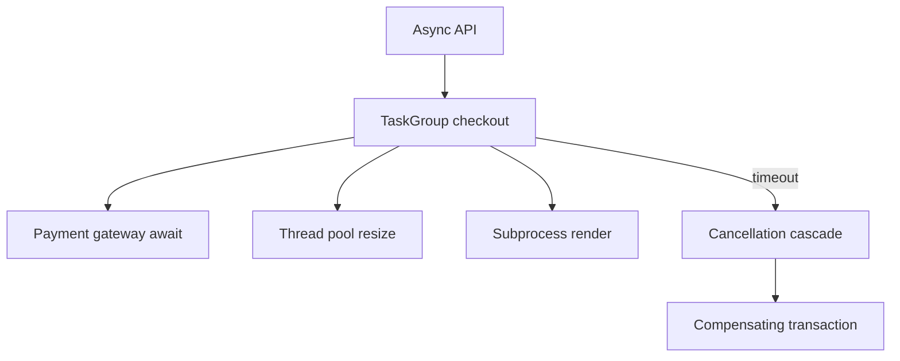

# Async Concurrency and Free-Threading Exercises

Choose asyncio, threads, processes, and free-threaded builds with explicit trade-offs for CPU, I/O, cancellation, and shared state.

## Linked Topic

- [[03-Python/07-Async-Concurrency-and-Free-Threading/Concurrency Models in Python|Concurrency Models in Python]]
- [[03-Python/07-Async-Concurrency-and-Free-Threading/threading and the GIL|threading and the GIL]]
- [[03-Python/07-Async-Concurrency-and-Free-Threading/Free-Threaded CPython Trade-offs|Free-Threaded CPython Trade-offs]]
- [[03-Python/07-Async-Concurrency-and-Free-Threading/multiprocessing Shared Memory and Process Pools|multiprocessing Shared Memory and Process Pools]]
- [[03-Python/07-Async-Concurrency-and-Free-Threading/concurrent futures|concurrent futures]]
- [[03-Python/07-Async-Concurrency-and-Free-Threading/asyncio Event Loop Internals|asyncio Event Loop Internals]]
- [[03-Python/07-Async-Concurrency-and-Free-Threading/Tasks Futures and Awaitables|Tasks Futures and Awaitables]]
- [[03-Python/07-Async-Concurrency-and-Free-Threading/Async Iteration Streams and Backpressure|Async Iteration Streams and Backpressure]]
- [[03-Python/07-Async-Concurrency-and-Free-Threading/Cancellation Timeouts and TaskGroup|Cancellation Timeouts and TaskGroup]]
- [[03-Python/07-Async-Concurrency-and-Free-Threading/Interpreters Subinterpreters and Isolation|Interpreters Subinterpreters and Isolation]]

## Warm-up

1. When does asyncio parallelism help vs hurt for CPU-bound work?
2. What failure mode appears if you call blocking `requests.get` inside a coroutine?
3. How does free-threaded CPython change assumptions about dict insertion safety?

## Core Drills

### Exercise 1 — Understand

**Prompt:**

Compare three designs for fetching 100 URLs: threaded pool, `asyncio` + async HTTP client, and multiprocessing. Draw Mermaid timelines for GIL-bound vs I/O-bound vs CPU-bound phases.

**Acceptance criteria:**

- [ ] GIL interaction stated for each model
- [ ] Cancellation and timeout semantics compared (`TaskGroup`, thread interrupt limits)
- [ ] Process isolation costs (pickling, memory) noted

### Exercise 2 — Implement

**Prompt:**

Extend [[03-Python/code/seb_python/asyncio_lite.py|asyncio_lite lab]] and [[03-Python/code/seb_python/concurrency.py|concurrency lab]]:

1. Implement bounded concurrent fetches with backpressure (max in-flight N).
2. Propagate cancellation: parent timeout cancels child tasks and awaits cleanup coroutine.
3. Add threaded stress test demonstrating need for locks on shared counter (document GIL vs free-threaded caveats).

**Acceptance criteria:**

- [ ] Backpressure prevents unbounded task creation
- [ ] Cancellation test asserts cleanup hook ran
- [ ] Includes tests or reproducible verification

### Exercise 3 — Optimize

**Prompt:**

A service uses `asyncio.gather` without return_exceptions; one failure aborts entire batch losing partial results. Refactor to structured concurrency with partial success reporting and stable p99 under load.

**Constraints:**

- Latency / memory / throughput target: sustain 500 concurrent I/O ops with ≤ N×2 task objects vs in-flight limit
- What may not change: per-item idempotency and audit log completeness

## Debugging Drill

**Broken behavior:** Under load, asyncio workers hang after deploy; event loop thread blocked in `time.sleep` inside a legacy adapter.

**Expected investigation path:**

1. Capture loop thread stack (`asyncio`-friendly debugger or `py-spy`).
2. Identify blocking call; classify as loop-blocking violation.
3. Fix with `asyncio.to_thread`, executor, or native async client.
4. Add lint/async debug mode (`-X dev` / loop slow callback logging) and regression test.

## Production Scenario

Checkout service mixes asyncio API layer, thread pool for image processing, and subprocess calls to PDF renderer. Incidents include retry storms, cancelled tasks leaving payments authorized-but-not-captured, and RSS spikes from orphaned tasks.

Define timeout budgets, cancellation semantics, compensating actions, metrics (`tasks_running`, thread pool queue depth), and when to choose processes over threads.

## Stretch

- Prototype [[03-Python/projects/Asyncio Scheduler From Scratch/README|Asyncio Scheduler From Scratch]] milestone: fair scheduling among ready handles.
- Document extension-module GIL assumptions for free-threaded deployment checklist.

## Solutions Notes

- asyncio excels at concurrent I/O waits, not CPU parallelism.
- Cancellation is cooperative; shield critical sections explicitly.
- Free-threading removes one class of GIL assumptions but adds data race responsibility.

## Related Notes

- [[03-Python/code/README|Python code labs]]
- [[03-Python/projects/Bounded Worker Orchestrator/README|Bounded Worker Orchestrator]]
- [[03-Python/_interview/Async Concurrency and Free-Threading Interview Questions|Async Concurrency and Free-Threading Interview Questions]]
- [[07-Backend/README|Backend]]
- [[Career/README|Career]]
