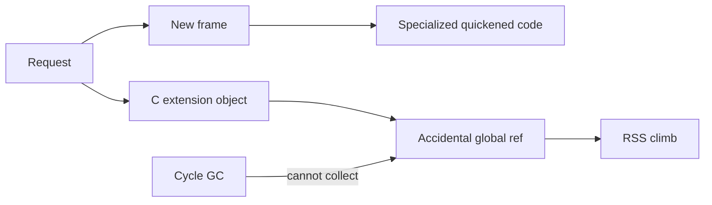

# CPython Runtime and Memory Exercises

Read bytecode, model frames and refcount/GC behavior, and explain retention before tuning performance or embedding CPython.

## Linked Topic

- [[03-Python/05-CPython-Runtime-and-Memory/Parsing AST and Compilation Pipeline|Parsing AST and Compilation Pipeline]]
- [[03-Python/05-CPython-Runtime-and-Memory/Code Objects Frame Objects and Call Stack|Code Objects Frame Objects and Call Stack]]
- [[03-Python/05-CPython-Runtime-and-Memory/Bytecode and dis|Bytecode and dis]]
- [[03-Python/05-CPython-Runtime-and-Memory/Adaptive Specializing Interpreter|Adaptive Specializing Interpreter]]
- [[03-Python/05-CPython-Runtime-and-Memory/Reference Counting and Immortal Objects|Reference Counting and Immortal Objects]]
- [[03-Python/05-CPython-Runtime-and-Memory/Generational Cycle GC and gc Module|Generational Cycle GC and gc Module]]
- [[03-Python/05-CPython-Runtime-and-Memory/Memory Allocators Arenas and Tracing|Memory Allocators Arenas and Tracing]]
- [[03-Python/05-CPython-Runtime-and-Memory/C API Extension Boundary and Stable ABI|C API Extension Boundary and Stable ABI]]

## Warm-up

1. What is stored in a code object vs a frame object?
2. Why does `del x` not always reduce process RSS immediately?
3. Name a reference cycle that survives refcounting alone.

## Core Drills

### Exercise 1 — Understand

**Prompt:**

Disassemble a short function with [[03-Python/05-CPython-Runtime-and-Memory/Bytecode and dis|Bytecode and dis]] including closure creation and exception setup (`SETUP_FINALLY`/`POP_EXCEPT` equivalents on 3.14). Annotate stack effects for one call sequence.

Draw Mermaid: source → AST → code object → frame → evaluation.

**Acceptance criteria:**

- [ ] At least six opcode roles labeled (load, call, jump, setup, return)
- [ ] Frame locals vs cells distinguished for closures
- [ ] Specializing interpreter noted as optimization layer, not semantic change

### Exercise 2 — Implement

**Prompt:**

Use and extend [[03-Python/code/seb_python/vm.py|vm lab]] and [[03-Python/code/seb_python/gc_sim.py|gc_sim lab]]:

1. Execute a tiny bytecode program (constant return, add, jump) in the toy VM.
2. Demonstrate refcount hitting zero vs a two-node cycle requiring cycle collector.
3. Add a test proving resurrection via `__del__` or weakref finalizer complicates collection (documented limitation).

**Acceptance criteria:**

- [ ] VM tests cover at least three opcodes with stack assertions
- [ ] Cycle GC test fails without collector pass, passes with it
- [ ] Includes tests or reproducible verification

### Exercise 3 — Optimize

**Prompt:**

A service retains megabytes of `__dict__` on long-lived cached objects. Profile with `tracemalloc`, identify unexpected references (closures, lru_cache, global registries), and reduce steady-state RSS.

**Constraints:**

- Latency / memory / throughput target: ≥ 30% RSS reduction at steady state without cache hit rate collapse
- What may not change: external API and cache correctness SLO

## Debugging Drill

**Broken behavior:** Memory grows unbounded over days; `gc.get_objects()` shows millions of small dicts tied to a logging context holder.

**Expected investigation path:**

1. Take snapshot; use `gc.get_referrers` / `objgraph` pattern on sample objects.
2. Identify accidental global registry or closure capturing large scope.
3. Fix with weak references, bounded buffers, or explicit eviction.
4. Add RSS alert and leak regression test using `tracemalloc` peak.

## Production Scenario

After deploy, p99 latency improves but OOM kills increase on workers. Adaptive specialization warmed caches; extension module leaked references across requests.

Define profiling playbook (bytecode vs native vs retention), when to restart workers, extension audit checklist, and safe `gc` debugging in production.

## Stretch

- Compare `dis` output before/after running a hot loop to observe specialization (version-specific notes).
- Model arena allocation vs object pools at a whiteboard level per [[03-Python/05-CPython-Runtime-and-Memory/Memory Allocators Arenas and Tracing|Memory Allocators Arenas and Tracing]].

## Solutions Notes

- Refcount frees acyclic graphs promptly; cycles need generational GC.
- Frames and code objects are cheap to create; retention usually hides in application references.
- Toy VM teaches invariants; never assume parity with CPython peephole and specialization passes.

## Related Notes

- [[03-Python/code/README|Python code labs]]
- [[03-Python/projects/Python Runtime Toolkit/README|Python Runtime Toolkit]]
- [[03-Python/_interview/CPython Runtime and Memory Interview Questions|CPython Runtime and Memory Interview Questions]]
- [[01-Computer-Science/README|Computer Science]]
- [[Career/README|Career]]
