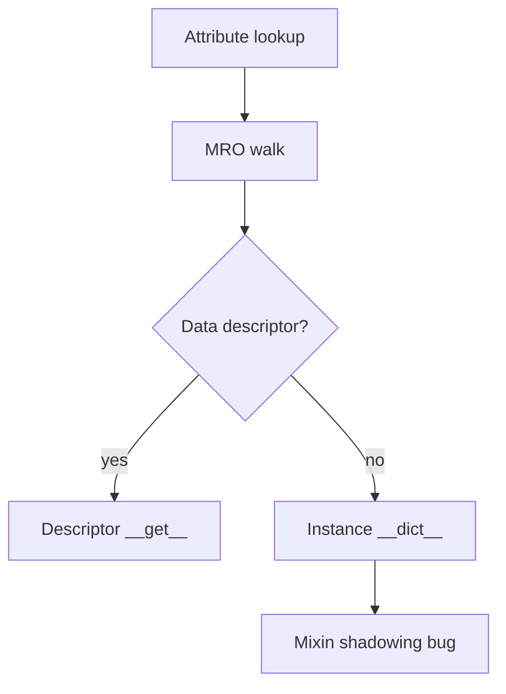

# Classes Descriptors and Metaprogramming Exercises

Predict attribute lookup, MRO, descriptor precedence, and class creation hooks before shipping ORM-like or validated-field APIs.

## Linked Topic

- [[03-Python/03-Classes-Descriptors-and-Metaprogramming/Classes Instances and Attribute Lookup|Classes Instances and Attribute Lookup]]
- [[03-Python/03-Classes-Descriptors-and-Metaprogramming/Inheritance MRO and super|Inheritance MRO and super]]
- [[03-Python/03-Classes-Descriptors-and-Metaprogramming/Slots Weakrefs and Object Layout|Slots Weakrefs and Object Layout]]
- [[03-Python/03-Classes-Descriptors-and-Metaprogramming/Properties and the Descriptor Protocol|Properties and the Descriptor Protocol]]
- [[03-Python/03-Classes-Descriptors-and-Metaprogramming/Metaclasses and Class Creation|Metaclasses and Class Creation]]
- [[03-Python/03-Classes-Descriptors-and-Metaprogramming/Dataclasses and Data-Oriented Classes|Dataclasses and Data-Oriented Classes]]
- [[03-Python/03-Classes-Descriptors-and-Metaprogramming/ABCs Protocols and Runtime Structural Subtyping|ABCs Protocols and Runtime Structural Subtyping]]
- [[03-Python/03-Classes-Descriptors-and-Metaprogramming/Enums and Singletons|Enums and Singletons]]
- [[03-Python/03-Classes-Descriptors-and-Metaprogramming/Dynamic Attributes getattr setattr and dict|Dynamic Attributes getattr setattr and dict]]

## Warm-up

1. What is the MRO of `class D(B, C): pass` given `class B(A): pass` and `class C(A): pass`?
2. Why does instance `__dict__` shadow a non-data descriptor but not a data descriptor?
3. When is `super()` two-argument form required vs zero-argument?

## Core Drills

### Exercise 1 — Understand

**Prompt:**

Using [[03-Python/03-Classes-Descriptors-and-Metaprogramming/Inheritance MRO and super|Inheritance MRO and super]] and [[03-Python/code/seb_python/mro.py|mro lab]], trace attribute lookup for:

```python
class Validator:
    def __get__(self, obj, owner): return "desc"
class Base:
    x = Validator()
class Child(Base):
    x = 42
```

Draw Mermaid flow: `type(obj).__dict__` → data descriptor → instance dict → non-data descriptor → class hierarchy.

**Acceptance criteria:**

- [ ] Data vs non-data descriptor precedence stated
- [ ] MRO order listed for cooperative `super()` chain
- [ ] `__getattr__`/`__getattribute__` invocation boundaries noted

### Exercise 2 — Implement

**Prompt:**

Extend [[03-Python/code/seb_python/descriptors.py|descriptors lab]] with a **validated field** descriptor:

1. Accept `type=` and optional `validator=` callable at class body time.
2. Store per-instance values in a private WeakKeyDictionary or slot-backed layout.
3. Raise `TypeError`/`ValueError` on invalid assignment with field name in message.

Add pytest for inheritance (subclass overrides descriptor), shadowing, and `property` interaction.

**Acceptance criteria:**

- [ ] Descriptor implements `__get__` and `__set__`
- [ ] Invalid assignments fail fast with actionable errors
- [ ] Includes tests or reproducible verification

### Exercise 3 — Optimize

**Prompt:**

Thousands of small record objects use `@dataclass` with default dict/list fields causing memory bloat. Redesign with `__slots__`, shared immutable defaults, and measured footprint before/after.

**Constraints:**

- Latency / memory / throughput target: ≥ 40% memory reduction for 1M instances in benchmark harness
- What may not change: public attribute names and equality semantics

## Debugging Drill

**Broken behavior:** Model field validation runs on read but not on bulk update via `obj.__dict__.update({...})`.

**Expected investigation path:**

1. Confirm bypass of descriptor `__set__` via direct `__dict__` mutation.
2. Reproduce with `setattr` vs dict update; identify API surface that must be guarded.
3. Fix with `__setattr__` override, dataclass hooks, or documented restriction on bulk updates.
4. Add tests for setattr, update, and pickle round-trip.

## Production Scenario

An internal ORM uses descriptors for typed columns. A migration adds a mixin with a colliding attribute name; production serves wrong column values for one subclass hierarchy.



Define naming conventions, MRO review checklist, startup validation that scans for descriptor collisions, and rollback plan for schema migrations.

## Stretch

- Implement a minimal metaclass that registers all subclasses in a registry dict.
- Compare `@dataclass` field ordering and `kw_only` defaults for API stability.

## Solutions Notes

- Data descriptors win over instance `__dict__`; properties are data descriptors.
- `super()` follows MRO of the defining class, not the runtime type of `self` alone.
- Never mutate shared mutable class attributes; use `field(default_factory=...)`.

## Related Notes

- [[03-Python/code/README|Python code labs]]
- [[03-Python/projects/Descriptor Validated Fields/README|Descriptor Validated Fields]]
- [[03-Python/_interview/Classes Descriptors and Metaprogramming Interview Questions|Classes Descriptors and Metaprogramming Interview Questions]]
- [[Career/README|Career]]
