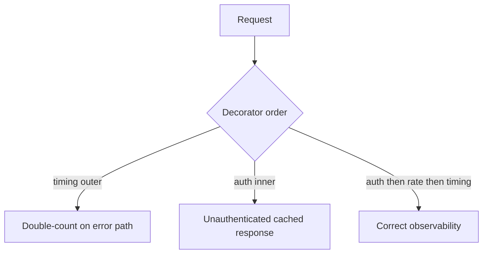

# Execution Namespaces and Functions Exercises

Master LEGB resolution, closures, argument binding, and decorator desugaring before debugging subtle state leaks and stack overflows.

## Linked Topic

- [[03-Python/02-Execution-Namespaces-and-Functions/Lexical Structure and Compilation Units|Lexical Structure and Compilation Units]]
- [[03-Python/02-Execution-Namespaces-and-Functions/Names Scopes LEGB and Closures|Names Scopes LEGB and Closures]]
- [[03-Python/02-Execution-Namespaces-and-Functions/Functions as Objects|Functions as Objects]]
- [[03-Python/02-Execution-Namespaces-and-Functions/Argument Binding Unpacking and Keyword-Only Parameters|Argument Binding Unpacking and Keyword-Only Parameters]]
- [[03-Python/02-Execution-Namespaces-and-Functions/Decorators Internals|Decorators Internals]]
- [[03-Python/02-Execution-Namespaces-and-Functions/Comprehensions and Assignment Expressions|Comprehensions and Assignment Expressions]]
- [[03-Python/02-Execution-Namespaces-and-Functions/Exceptions and Control Flow|Exceptions and Control Flow]]
- [[03-Python/02-Execution-Namespaces-and-Functions/Recursion Stack Limits and Frame Depth|Recursion Stack Limits and Frame Depth]]

## Warm-up

1. What namespace does a list comprehension create in Python 3? What about `{x: x for x in ...}`?
2. Explain late-binding closures with a loop that creates lambdas—how do you fix it?
3. Desugar `@retry(3)` applied to `def f(): ...` into nested function calls.

## Core Drills

### Exercise 1 — Understand

**Prompt:**

Predict output and explain LEGB + closure cells for:

```python
funcs = []
for i in range(3):
    funcs.append(lambda: i)
print([f() for f in funcs])

def make():
    n = 0
    def inc():
        nonlocal n
        n += 1
        return n
    return inc
```

Draw a Mermaid diagram of enclosing scopes and cell variables for `inc`.

**Acceptance criteria:**

- [ ] Late-binding loop closure explained with fix (`default arg` or factory)
- [ ] `nonlocal` vs `global` distinguished
- [ ] Cell variable lifetime tied to closure object

### Exercise 2 — Implement

**Prompt:**

Implement a parameterized decorator `timed` in [[03-Python/code/README|Python code labs]] that:

1. Preserves wrapped function `__name__` and docstring (`functools.wraps`).
2. Accepts optional `label` keyword-only parameter on the decorator factory.
3. Records elapsed wall time in a module-level list for test inspection.

Write pytest verifying decoration order, keyword-only factory args, and metadata preservation.

**Acceptance criteria:**

- [ ] Decorator factory and decorator layers correctly separated
- [ ] `functools.wraps` applied
- [ ] Includes tests or reproducible verification

### Exercise 3 — Optimize

**Prompt:**

A recursive JSON normalizer hits `RecursionError` on deeply nested payloads (depth ~2000). Replace unbounded recursion with an iterative stack-based algorithm without changing output schema.

**Constraints:**

- Latency / memory / throughput target: handle depth 10,000 within 512 MB heap on CPython 3.14
- What may not change: output ordering and error types for cyclic graphs

## Debugging Drill

**Broken behavior:** After refactor, `@app.route` handlers return 500 only under concurrent load; logs show `UnboundLocalError` for a variable that "clearly exists."

**Expected investigation path:**

1. Inspect function bytecode/`dis` for `STORE_FAST` vs `LOAD_GLOBAL` on the suspect name.
2. Identify assignment anywhere in function making the name local for the entire function.
3. Fix by distinct local name or `nonlocal`/`global` as appropriate.
4. Add regression test under threaded calls.

## Production Scenario

A metrics middleware stack applies three decorators: auth, rate limit, timing. Order changes behavior; one ordering double-counts failures; another skips auth on cached errors.



Document decorator composition rules, how to test ordering, and how to expose decorator metadata for framework introspection.

## Stretch

- Implement a minimal `partial` compatible with keyword merging rules; compare to `functools.partial`.
- Use `inspect.signature` to validate handler arity at registration time.

## Solutions Notes

- Decorators apply bottom-up; factories close over configuration at import time unless lazily resolved.
- Any assignment to a name in a function makes it local unless declared `global`/`nonlocal`.
- Prefer iterative algorithms for unbounded depth; tune `sys.setrecursionlimit` only as a last resort with ops approval.

## Related Notes

- [[03-Python/code/README|Python code labs]]
- [[03-Python/_interview/Execution Namespaces and Functions Interview Questions|Execution Namespaces and Functions Interview Questions]]
- [[Career/README|Career]]
